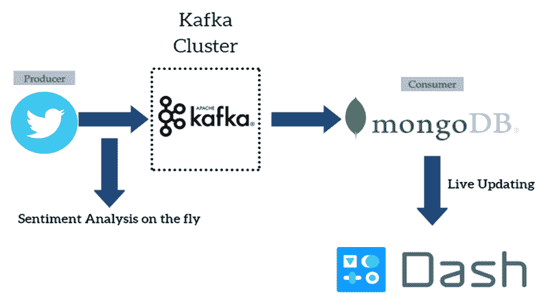
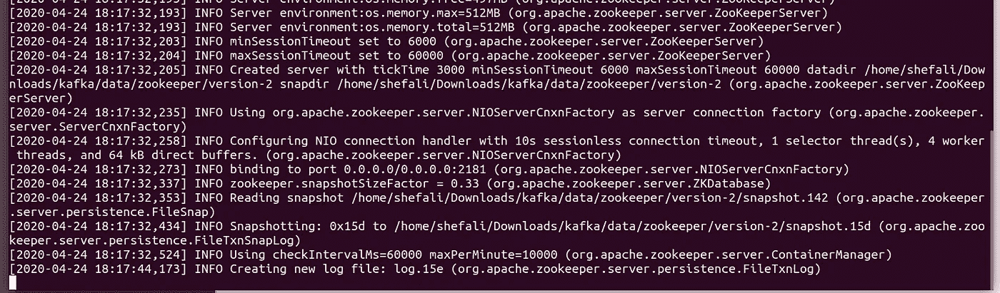
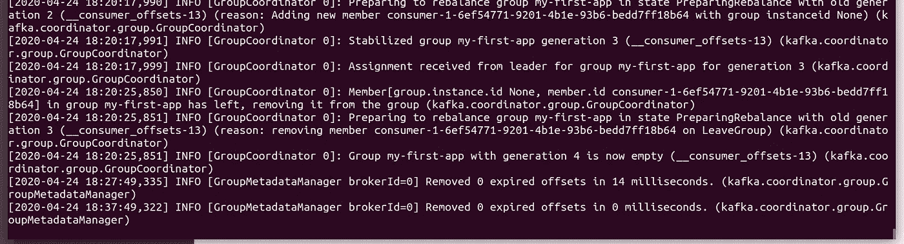
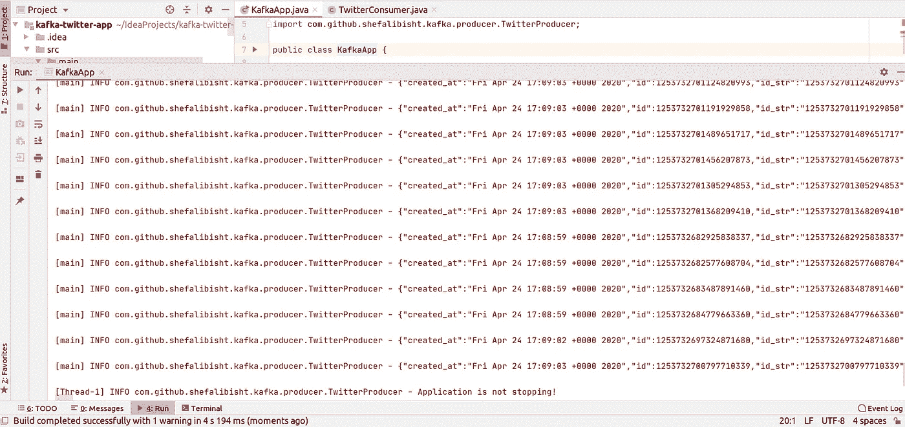
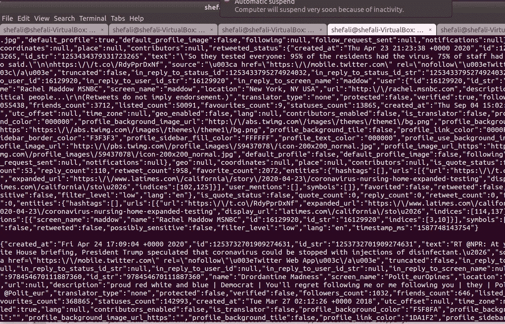

# 阿帕奇卡夫卡的 Twitter 流

> 原文：<https://medium.com/analytics-vidhya/twitter-streaming-with-apache-kafka-ea0e2f44181e?source=collection_archive---------0----------------------->

## 使用 Kafka 消息系统实时传输 twitter 数据


由 [Kon Karampelas](https://unsplash.com/@konkarampelas?utm_source=medium&utm_medium=referral) 在 [Unsplash](https://unsplash.com?utm_source=medium&utm_medium=referral) 上拍摄的照片

你有没有想过 Twitter、LinkedIn、网飞、优步和 AirBnb 的共同点是什么，让它们以高吞吐量服务于如此广泛的受众？他们发展良好的数据工程管道使他们能够每天处理数十亿的数据或信息。

> Apache Kafka 解决了从一个数据源到另一个数据源的大量数据移动问题。这是 LinkedIn 开发的[“高吞吐量分布式消息系统](https://kafka.apache.org/)”。

Kafka 旨在为处理实时数据提供一个统一的、高吞吐量、低延迟的平台。
本文假设您已经熟悉 Java、消息传递系统、Apache Kafka 及其架构，并且拥有一个 Twitter 开发人员帐户。



大数据管道

我们将用 Java 开发一个 Kafka producer 应用程序，它将从 Twitter API 数据源获取数据，并将其发布到 Kafka 主题，供消费者应用程序订阅和消费消息。
这可以通过从 Kafka topic 获取数据到 MongoDB 之类的 noSql 数据库来进一步扩展。

# **先决条件**

1.  JDK 1.8 (Java 8)
2.  卡夫卡
3.  带有 API 密钥和访问令牌的 Twitter 开发人员帐户

# **启动 Zookeeper 和 Kafka 服务器**

转到 kafka 目录，启动 zookeeper，然后从 cmd 启动 kafka 服务器。

`bin/zookeeper-server-start.sh config/zookeeper.properties
bin/kafka-server-start.sh config/server.properties`



动物园管理员在跑步



Kafka 服务器正在运行

让我们创建一个 Kafka 主题 **Twitter-Kafka** ，它有 3 个分区，复制因子为 1

```
bin/kafka-topics.sh --zookeeper localhost:2181 --create --topic Twitter-Kafka — partitions 3 --replication-factor 1
```

验证创建的主题
`bin/kafka-topics.sh --zookeeper localhost:2181 --list`

# **写作卡夫卡的制片人..**

在 pom.xml 文件中添加以下 maven 依赖项。**Kafka-客户端**库用于连接 Kafka 和 **slf4j-simple** 用于记录消息。我们将使用 twitter Hosebird 客户端核心，它是一个 Java HTTP 客户端，用于使用 twitter 的标准[流 API](https://developer.twitter.com/en/docs/tweets/filter-realtime/overview) 。

```
<dependencies>
   <dependency>
      <groupId>com.twitter</groupId>
      <artifactId>hbc-core</artifactId>
      <version>2.2.0</version>
   </dependency>
   <dependency>
      <groupId>org.apache.kafka</group Id>
      <artifactId>kafka-clients</artifactId>
      <version>2.3.0</version>
   </dependency>
   <dependency>
      <groupId>org.slf4j</groupId>
      <artifactId>slf4j-simple</artifactId>
      <version>1.7.26</version>
   </dependency>
</dependencies>
```

创建**KafkaConfig.java**文件来存储凭证。将配置存储在配置文件中总是比直接公开或硬编码要好。

```
public static final String BOOTSTRAPSERVERS  = "127.0.0.1:9092";
public static final String TOPIC = "Twitter-Kafka";
public static final String ACKS_CONFIG = "all";
public static final String MAX_IN_FLIGHT_CONN = "5";public static final String COMPRESSION_TYPE = "snappy";
public static final String RETRIES_CONFIG = Integer.toString(Integer.MAX_VALUE);
public static final String LINGER_CONFIG = "20";
public static final String BATCH_SIZE = Integer.toString(32*1024);
```

类似地，创建 TwitterConfig.java 的 T4 来存储 Twitter API 密钥 T7 和访问令牌 T9

```
public static final String CONSUMER_KEYS= "H8***42";
public static final String CONSUMER_SECRETS= "xn***dI";
public static final String SECRET = "SPz***Xg";
public static final String TOKEN = "13***1";
```

# Twitter 生产者类

创建**TwitterProducer.java**，看起来像这样

我们在这里搜索术语 ***【冠状病毒】*** 来过滤掉推文。
现在让我们编写 **createTwitterClient()** 和 **createKafkaProducer()** 分别连接 Twitter 和 Kafka。记录器将用于记录消息。

# **推特客户端**

方法 **createTwitterClient()** 将使用 Hosebird 客户端来 sccs 并返回客户端。

# Kafka 制作人设置

**createKafkaProducer()** 方法使用**KafkaConfig.java**来获取属性设置，以连接到我们的 Kafka 服务器(bootstrap-server)，序列化要发送到 Kafka 代理的键和值。已经配置了一些其他设置，如**ack _ CONFIG、BATCH_SIZE_CONFIG、ENABLE_IDEMPOTENCE_CONFIG、RETRIES_CONFIG** 等。来优化生产者。

# 收尾工作..

现在我们创建 **run()** 方法，它首先调用 **createTwitterClient()** 方法连接到 Twitter 客户端，然后 **createKafkaProducer()调用**创建并获取 KafkaProducer 实例。

我们使用`BlockingQueue<String> msgQueue`从客户端获取数据，使用`producer.send(new ProducerRecord<String, String>(KafkaConfig.TOPIC, null, msg)`向 kafka 主题发送数据。下面是 while()循环，它一直运行到客户端结束。

```
while (!client.isDone()) {
    String msg = null;
    try {
        **msg = msgQueue.poll(5, TimeUnit.SECONDS);**
    } catch (InterruptedException e) {
        // Stop client
        client.stop();
    }
    if (msg != null) {
        **producer.send(new ProducerRecord<String, String>(KafkaConfig.TOPIC, null, msg), new Callback()** {
           // Override onCompletion() method
        });
    }
}
```

下面是 run()方法的代码片段。

# 让我们开始流式传输..

最后，我们通过运行**twiterproducer()来启动 Kafka 生成器。运行()**

```
public static void main(String[] args) {
    new TwitterProducer().run();
}
```

# 输出



实时 Twitter 流

让我们验证数据是否发布到 kafka 主题。
`bin/kafka-console-consumer.sh --bootstrap-server 127.0.0.1:9092 --topic Twitter-Kafka — group my-first-app --from-beginning`

如果消费者还没有确定的偏移量来消费，那么使用`--from-beginning`将从日志中最早的消息开始，而不是从最新的消息开始。



Kafka 消费者(控制台)

在下一部分中，我们将看到如何用 Java 创建一个 Kafka Producer 类来订阅 Kafka 主题、读取 tweets 并将数据接收到 MongoDB 中。

为了你的参考，完整的代码可以在 [GitHub](https://github.com/shefalibisht00/BigData-Engineering.git) 上找到。

# 结论

我们看到了如何使用简单的 Java HTTP kafka 客户端库创建 Java Kafka 生成器。我们使用 Twitter API 实时传输用户推文，并将其发布到 Kafka 主题。