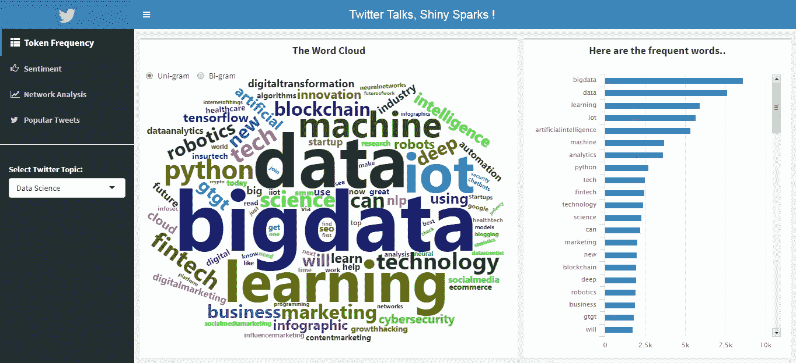
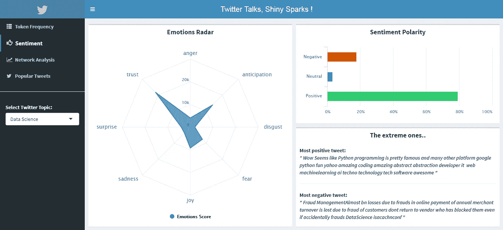
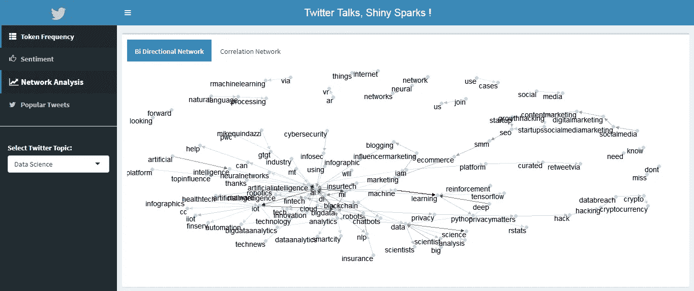
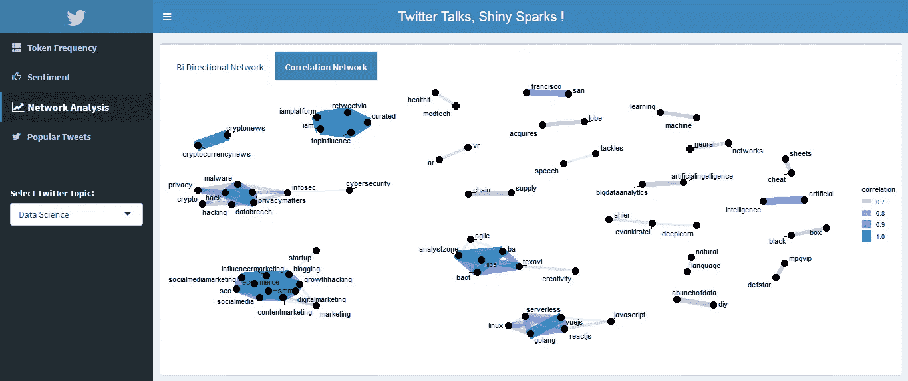
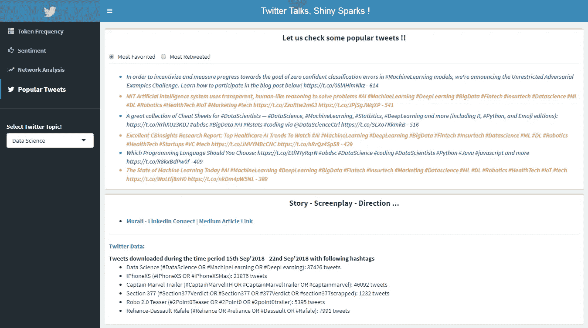

# 推特说话，闪亮的火花！

> 原文：<https://medium.com/analytics-vidhya/twitter-talks-shiny-sparks-3ee28f41dc2b?source=collection_archive---------1----------------------->

基于 NLP 的 R Shiny 应用程序，用于全面的 Twitter 媒体监听

[Benjamin Balázs](https://unsplash.com/@brenkee?utm_source=medium&utm_medium=referral) 在 [Unsplash](https://unsplash.com?utm_source=medium&utm_medium=referral) 上的“栖息在树上的鸟的剪影”

> ——“嘿，老兄，惊奇队长的预告片已经发布了。社交媒体上的热议是什么？”“穆拉利，最高法院废除了 377 条款，我很高兴！我很想知道公众是如何接受这个消息的。”

这些类型的对话激发了一个想法——如果我输入最新的标签/关键词，我会知道人们在谈论它的一切。我知道有几个付费的社交媒体收听工具，但是有了可用的开源资源，我想自己开发一个。

## 让我们检查一下 R Shiny 应用程序——

转到下面的链接，探索应用程序*(该应用程序最好在台式机/笔记本电脑上观看。请等待 3-5 秒钟，以便加载一些图表)。*回到这里，了解更多旅程和知识。本文从技术挑战、出色的实现和见解等方面重点介绍了一些具体的经验。

 [## Twitter 分析应用

### 推特对话，闪亮的火花

muralimohanakrishna . shinyapps . io](https://muralimohanakrishna.shinyapps.io/Twitter_Talks_Shiny_Sparks/) 

# 1.Twitter 数据——提取和清理

## 提取推文

`twitteR`是通过 R 下载 tweet 的常用软件包，但是我在为一个给定的标签提取超过 2000 条 tweet 时遇到了很多困难。我想提取大约 50，000 条推文，发现了这个由迈克尔·w·科尔尼[开发的名为`rtweet`的优秀包。你可以每 15 分钟提取多达 18，000 条在过去 7-10 天内存在的推文(是的，这是 Twitter 实施的最痛苦的限制)。你可以超越 18k 的限制，通过使用某些特性(如`retryOnRateLimit`和`max_id`参数)迭代提取过程来提取更多的推文。](https://mkearney.github.io/blog/2017/06/01/intro-to-rtweet/)

请注意，为了访问 Twitter API，您需要创建一个 Twitter 应用程序，并获得必要的密钥和令牌。这个[链接](https://rtweet.info/)将使用`rtweet`引导你完成这个过程。

使用 rtweet 提取 tweet 的代码

## **选择主题**

我想包含从电影、政治和体育等各种各样的主题，看看我的应用程序如何揭示每个主题的见解(我首先想到的是# Baahubali)。不幸的是，由于 7-10 天的推文限制，我不得不选择 2018 年 9 月第三周的热门话题。我试图包括不同的种类，并提出了这些:数据科学(当然应该有)，iPhone XS 发布会(虽然不是苹果粉丝)，惊奇队长预告片(大风扇！)、Robo 2.0 teaser、377 条款废止(印度最高法院废止了“违背自然规律”的性活动的犯罪行为)和 Reliance-Rafale 交易。

## **清扫邋遢的野兽**

Tweets 是一堆乱七八糟的数据，下面的代码将指导你如何处理/删除它们。几个具体的清理步骤包括——删除@(屏幕名称提及)、超链接、单一代码字符、RT(转发)、标点符号和数字。在将 tweets 转换为小写字母并删除停用词(我还根据主题包含了自定义停用词)后，我们需要将文本数据转换为文档语料库，这是进一步分析的基础。

清理推文并转换成文档的代码

# 2.令牌频率

考虑到 tweets 的数量，term-document 矩阵可能会变得很大，在 R 中执行操作时可能会遇到大小分配错误。`slam` package 来拯救，它在稀疏矩阵上平滑地执行这些操作。我很遗憾不知道`[tidytex](https://www.tidytextmining.com/preface.html)t`的威力，这是朱莉娅·西尔格和大卫·罗宾逊开发的一个漂亮的软件包，可以更优雅地处理文本。用他们自己的话来说，

> 我们发现，使用整齐的数据原则可以使许多文本挖掘任务更容易、更有效，并且与已经广泛使用的工具保持一致。将文本视为单个单词的数据框架使我们能够轻松地操作、总结和可视化文本的特征，并将自然语言处理集成到我们已经在使用的有效工作流中。

`tidytext`中的`unnest_tokens()`功能可以通过 n 元语法、句子、段落，甚至一些特定的关键词对文本进行分词。

## 标准词-云

`[wordcloud2](https://cran.r-project.org/web/packages/wordcloud2/vignettes/wordcloud.html)`为传统的文字云提供 HTML5 接口，以及一些优秀的功能，如自定义图形云和字母云。

# 3.情感分析

## 情感词汇

有三种广泛使用的基于单字的情感词典。

1.  [**NRC**](http://saifmohammad.com/WebPages/NRC-Emotion-Lexicon.htm)—NRC 情感词典是一个英语单词列表，以及它们与八种基本情绪(愤怒、恐惧、期待、信任、惊讶、悲伤、快乐和厌恶)和两种情绪(消极和积极)的关联。注释是通过众包手动完成的。
2.  [这些单词是由 Finn Arup Nielsen 在 2009-2011 年间手工标注的。](http://www2.imm.dtu.dk/pubdb/views/publication_details.php?id=6010)
3.  [**兵**](https://www.cs.uic.edu/~liub/FBS/sentiment-analysis.html) —它把词分为正反两种成分。

我用“nrc”来获得所有推文的情绪得分，用“AFINN”来识别+ve/-ve/中性推文以及极端推文

`tidytext`以数据框架的形式提供这些词汇，因此很容易获得每条推文中每个词的得分。

# 4.网络分析-词语关系和主题

想做主题建模，发现 LDA 的主题建模算法是最有名的，用`topicmodels`包实现。**基本的直觉是，每个主题都是词的混合体(有关联词概率)，每个文档都是主题的混合体(对每个主题有关联的%)。**我未能为推文找到好的主题，并了解到每个文档中所有主题的分布几乎相等(假设我用 2 个主题运行了该算法，所有文档中的主题 1 %从 45-55%不等，主题 2 也是如此)。我迭代了不同数量的主题，得到了相似的结果。这可能是因为两个原因—

1.  由于我们已经在下载特定标签的推文，推文非常集中，很少讨论超过 1-2 个话题。
2.  短文本(<140 character tweets) are very sparse and noisy. And there is a good discussion [此处](https://www.researchgate.net/post/What_is_a_good_way_to_perform_topic_modeling_on_short_text)关于短文本主题建模以及一些研究论文。我必须首先了解 LDA 算法，并尝试不同的技术建议。请告知，如果你以前工作过。

## 二元有向网络

鉴于主题建模目前是一个障碍，我使用了二元语法网络和关联网络来找出不同单词之间的关系，从而识别它们周围的主题。**二元语法网络关注连续词对的频率及其方向性。**`igraph``ggraph`用于可视化这些网络。连接两个单词的链接的宽度代表该对单词的频率。

## **关联网络**

**单词之间的相关性表示它们在文档中一起出现的频率相对于它们单独出现的频率。**正在使用的度量标准是 [phi 系数](https://en.wikipedia.org/wiki/Phi_coefficient)——单词 X 和 Y 同时出现或都不出现的可能性比一个单词不出现另一个单词的可能性大多少。`widyr`包提供了像`pairwise_count()`和`pairwise_cor()`这样的函数来分别查找词对的共现和相关。相关图是查看单词簇的最佳方式之一。

# 5.最受欢迎的

最后，我想根据收藏和转发来展示这些话题中的一些热门推文。请查看它们及其超链接，它们非常有趣。

# 6.即。皇后-R 闪亮

我提供了几个链接来开始使用 R shiny，但关键是练习和创建具有不同布局和输入输出特性的仪表板。请按照提供的顺序-

1.  **S**[**hiny dashboards**](https://rstudio.github.io/shinydashboard/index.html)——这很好地概述了如何创建基本布局和功能
2.  [**闪亮教程**](https://shiny.rstudio.com/tutorial/) —了解更多关于闪亮输入输出、面板和反应功能的信息
3.  [**high charter**](http://jkunst.com/highcharter/)—high charter 是 Highcharts javascript 库及其模块的 R 包装器。这是使用最广泛的交互式图形软件包之一

## 应用程序中闪亮的功能

1.  高图表用于条形图和辐射图
2.  `renderWordcloud2`和`wordcloud2Output`用于绘制字云
3.  标题、文本、列和框格式的自定义 CSS 样式
4.  进度条显示所有计算的进度，以及还剩多少。

# 7.来自应用程序的一些见解

1.  **数据科学** —围绕数字营销、区块链、物联网、金融科技、搜索引擎优化/SMM、电子商务等应用的常见词汇。大量的信任和期待情绪。围绕 NLP、NN、市场营销、网络安全、云和大数据、深度学习 tensorflow 和强化的词群。置顶的推文真的很有见识。
2.  **iphone xs**——关于赠品、中奖、预购、苹果活动和扫荡的词汇。巨大的期待伴随着喜悦和信任。围绕着机会-赠品，音频-声音-耳塞，重型-铝制外壳的清晰集群，我猜有些人有尺寸问题，最负面的推文说——***“你他妈的怎么能把他妈的 iPhoneXSMax 放在你他妈的口袋里”***
3.  **惊奇队长预告片**—Bi-克左右迫不及待，老太太:P，出拳老，更高更快，尼克弗瑞，卡罗尔丹弗斯。期待、喜悦和惊喜的情绪。最受欢迎的推文是——“***看，妈妈，我是超级英雄。# captain marvel***[***https://t.co/iUv0g1wlxs***](https://t.co/iUv0g1wlxs)
4.  *第 377 条——像 lgbtq 社区、同性性行为、历史性判决这样的词。很多信任和喜悦伴随着恐惧(我想更深入地挖掘这个“恐惧”的推文)。我喜欢这条最受欢迎的推文——“哦，pakka # section 377 ne etheste inka e cast-Lu..荣誉杀人-卢恩迪拉丛林同伴！#呼吸法💔…看在上帝的份上，学着做一个#以人为本的人吧！！！！——R . a . p . o*”(泰卢固语的松散翻译:印度已经废除了第 377 条，但人们仍在以种姓的名义实施荣誉谋杀。看在上帝的份上，先学会做人吧)**
5.  ***Robo 2.0 Teaser** —百万浏览量，拉吉尼坎特·阿克谢·库玛尔，teaser crosses 是经常出现的词。对这部即将上映的电影充满了信任、期待和喜悦。*
6.  ***Reliance-Rafale 交易**——法国政府、印度政府、奥朗德总统、莫迪总理之间的对话。令人震惊的 53%负面情绪。围绕中国-土耳其-欧洲的清晰集群提供了-原料，谈判价值-美元，重组-选择-利益特权，被出卖的血-士兵。围绕这项交易有很多负面消息，最受欢迎的推文说:“ ***首相和阿尼尔·安巴尼联合进行了一百次&amp；三万亿，对印度国防军的外科手术式打击。莫迪·姬友玷污了我们殉难士兵的鲜血。你真可耻。你背叛了印度的灵魂。*#阵风***

# *8.更上一层楼*

*在这个过程中，我学到了很多东西，但很少想到要提炼/添加一些元素来使它变得更好*

1.  *在 R Shiny 中集成 twitter 数据提取过程，以便用户可以输入他们感兴趣的标签。(目前大约需要 15-20 分钟。用于下载和处理数据。这是我没有集成它们的主要原因)*
2.  *n 元语法情感分析。学会在表达情绪时处理否定和讽刺*
3.  *短文本主题建模。这方面我还有很多要探索。此外，在聚类和情感中使用单词嵌入的力量*
4.  *充分利用推特摘录。整个分析只使用了文本和一些字段，如收藏夹、转发；但是我们有一堆信息媒体，像超链接、gif、图像、位置信息等等。*

*谢谢你一直读到最后。喜欢的请鼓掌，分享 app 和文章。我很想在评论区听到你的想法/反馈。*

*[**连接 LinkedIn**](https://www.linkedin.com/in/muralimohanakrishnadandu/) | **Github 链接代码如下***

* [## murali-munna/Twitter _ Talks _ Shiny _ Sparks

### 基于 NLP 的 R Shiny 应用程序，用于全面的 twitter 媒体监听

github.com](https://github.com/murali-munna/Twitter_Talks_Shiny_Sparks) 

**有兴趣了解数据科学初学者的一些技巧吗？**

 [## 数据科学初学者实用技巧。揭穿几个神话！

### 当我开始我的旅程和我现在的位置时，我通过职业经历学到了很多东西…

towardsdatascience.com](https://towardsdatascience.com/practical-tips-for-beginners-in-data-science-debunking-few-myths-30537117a4e4) 

**对使用迁移学习进行图像分类感兴趣？**

 [## 天空中的眼睛——使用迁移学习和数据增强的图像分类

### 很快。人工智能深度学习第一部分

towardsdatascience.com](https://towardsdatascience.com/fast-ai-deep-learnings-part-i-eye-in-the-sky-417e97c3e6bb)*