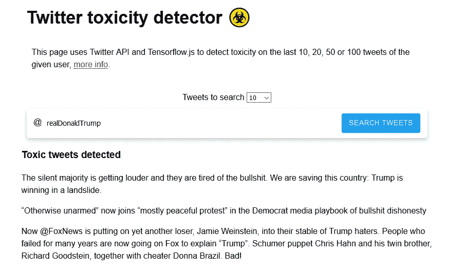
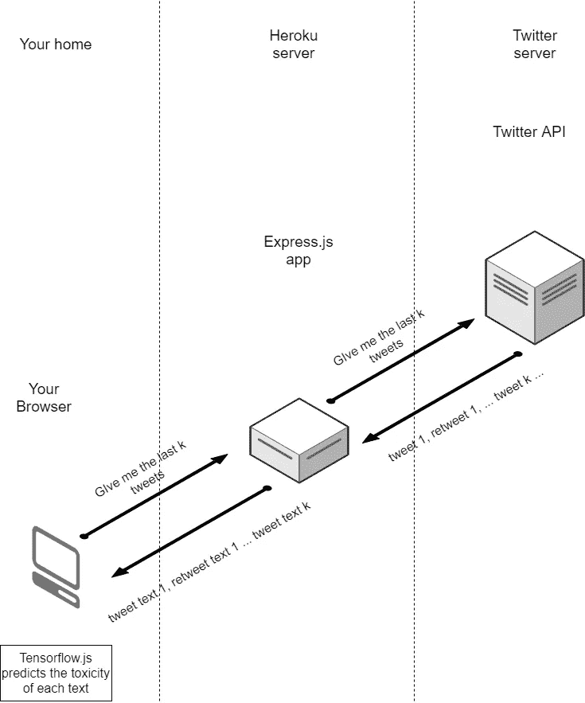
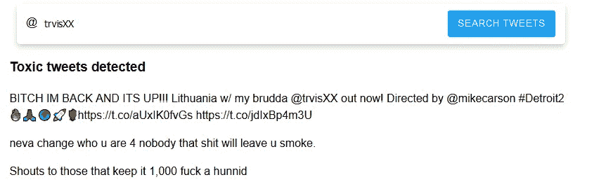
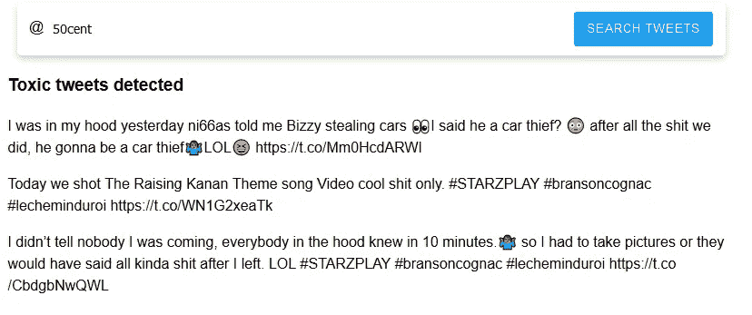

# 使用 Tensorflow.js 的 Twitter 毒性检测器

> 原文：<https://medium.com/analytics-vidhya/twitter-toxicity-detector-using-tensorflow-js-1140e5ab57ee?source=collection_archive---------5----------------------->

近年来，随着仇恨言论、骚扰和攻击性内容的增加，Twitter 上的互动变得越来越有害。在本文中，我想解释如何使用 twitter API 和 tensorflow.js 来构建一个简单的有毒 tweet 检测器

# 介绍

在这篇文章中，我想一步一步地展示如何构建一个 web 应用程序来显示来自给定用户的最后的有害推文和转发。

该应用程序将接收 2 个参数: **tweets 搜索**和**用户名。**

*   **要搜索的 Tweets:**我们希望从 twitter API 中获取要分析的 Tweets 的数量(10、20、50 或 100)。
*   **用户名:**我们将从中分析推文的 twitter 用户(@…)。

分析的推文越多，预测毒性的处理就变得越昂贵，所以我添加了一个选择器来获取 10、20、50 或 100 条推文(其中 50 至 100 条推文意味着非常高的处理成本，这也是我不建议在低性能计算机或手机浏览器上尝试的原因)。

因此，它会显示一个检测到的有毒推文和转发列表。您可以从[这里](https://mcarlomagno.github.io/TwitterToxicityDetector/)访问现场演示。

> **注意:**有时 Twitter API 在第一次尝试时不会获得所有的 tweets，因此您可能需要再次按下“搜索 TWEETS”。*🤷‍♂️*

演示截图

## Twitter API

twitter API 允许我们以编程方式访问 Twitter 内容，它可以用于读取、分析和与 tweets、直接消息、用户和其他关键 Twitter 资源进行交互。

[更多信息](https://developer.twitter.com/en/docs/twitter-api)

## Tensorflow.js

TensorFlow.js 是一个 JavaScript 库，用于在浏览器和 Node.js 中训练和实现机器学习模型。

[更多信息](https://www.tensorflow.org/js)

## 毒性分类模型

毒性模型是一个 tensorflow 机器学习模型，它可以检测文本是否包含诸如侮辱、淫秽、仇恨或明确的性语言等有毒内容。它建立在[通用句子编码器](https://github.com/tensorflow/tfjs-models/tree/master/universal-sentence-encoder)的基础上，并在包含约 200 万条毒性评论的民事评论[数据集](https://figshare.com/articles/data_json/7376747)上进行训练。

[更多信息](https://github.com/tensorflow/tfjs-models/tree/master/toxicity)

# 设置

## **推特 API**

首先要做的是创建一个 twitter 开发者账户来访问 API，按照这个[指南](https://developer.twitter.com/en/apply-for-access)的简单步骤来完成。

注册后，我们可以访问[门户](https://developer.twitter.com/en/portal/products)来查看使用统计数据，并访问端点 URL 和 API 的访问密钥。

## Tensorflow.js 和毒性分类器

为了能够在浏览器中使用 Tensorflow，我们只需使用 HTML、CSS 和 JavaScript 创建一个经典的 web 应用程序(如果你不知道如何做，请遵循[这个](https://www.w3schools.com/howto/howto_website.asp)指南)，然后我们使用 yarn、npm 或 Script 标签从 tensorflow 导入模型和工具。

在这个 [github](https://github.com/tensorflow/tfjs-models/tree/master/toxicity) 中，很好地解释了如何去做。

## **Express.js 环境**

不幸的是，Twitter 不允许应用程序直接从浏览器访问 API，因此需要构建一个服务器应用程序才能访问。

在我的例子中，我是使用 [Express.js](https://expressjs.com/) 完成的，然后我将它部署到 [heroku](https://www.heroku.com/) 。使用免费帐户，您可以创建和部署多达 5 个服务器应用程序。

如果您不知道如何做，或者如果您只是不想创建服务器应用程序，您可以克隆[我的项目](https://github.com/MCarlomagno/toxicity-classifier-server)，修改参数以访问您的 twitter API，然后部署到您的 heroku 帐户。

**如果你对服务器一无所知或者你只是不想自己构建它，你可以使用我构建的服务器的 API url 从你的 web 应用程序直接访问我的 API(我启用了**[**CORS**](https://en.wikipedia.org/wiki/Cross-origin_resource_sharing)**以保持任何人都可以访问它)。**

**网址格式:**

https://toxicity-classifier-server.herokuapp.com/twits/<username>/</username>

## **最终架构:**

一旦我们完成了所有这些步骤，我们就可以构建这个架构，并且我们可以随心所欲地使用它。在这种情况下，我们将使用它来获取给定用户最近的推文，并从浏览器中对其进行分析。

**架构流程图**(绘制这个比系统编程花的时间还长)

# **步骤**

在您的 web 项目中，采取以下步骤。

**1-** 将一个 js 文件链接到 html 模板。

**2-** 导入之前安装的 tensorflow 毒性库。

**3-** 应用程序启动时加载模型(仅使用**毒性**标签和给定的**阈值**)。

**4-** 当“搜索推文”事件被触发时，访问 API 以获取最近的推文。

**5-** 获取推文后，分析它们并预测毒性。

**6-** 显示毒性值为**真**或**空**的推文(**空**表示程序不确定它是否有毒，结果不超过阈值)。

# 示例结果

# 结论

世界上产生的数据量每年都呈指数增长，有许多开放和免费的工具可以让我们以有趣的方式利用这些数据，例如使用本文中所示的机器学习模型。

这款迷你系统的其他有趣功能包括:

*   使用 Twitter API 的其他特性。
*   使用其他张量流模型来检测文本中的模式。
*   扩展应用程序以显示更多信息。
*   使用该模型进行数据分析(例如，一段时间内的[*toxic _ tweets*/*total _ tweets*)。

我鼓励您尝试创建自己的版本，以其他方式利用这些数据。

> **Github 回购:**https://github.com/MCarlomagno/toxicity-classifier
> 
> **试玩 app:**[https://mcarlomagno.github.io/toxicity-classifier/](https://mcarlomagno.github.io/TwitterToxicityDetector/)