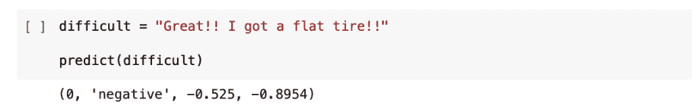
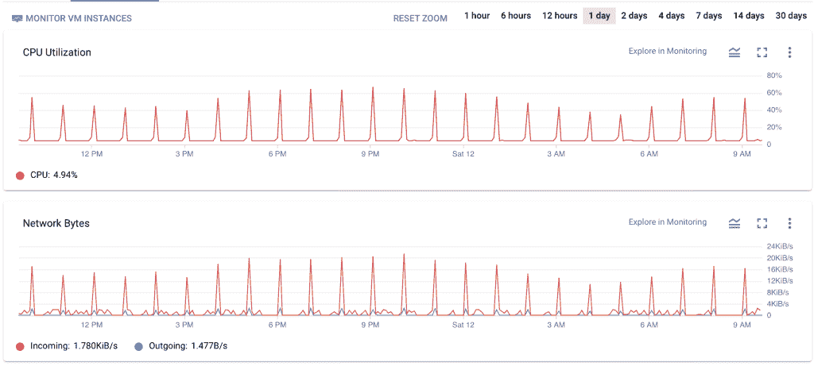

# Twitter 的 50 个热门话题情绪分析仪表板

> 原文：<https://medium.com/analytics-vidhya/twitters-50-trending-topics-sentiment-analysis-dashboard-aaea632caf18?source=collection_archive---------10----------------------->

*在谷歌云平台上训练、部署和自动化深度神经网络*……*(免费！*)


【fittedcapsandbrownies.wordpress.com 

已经有很多使用 Twitter 进行情感分析的教程了。所以在我开始之前，让我先解释一下本教程与其他教程的不同之处:

*   这将解释从构建到自动化模型的整个过程，每一步——我将尝试这样做，以便初学者会发现这很有用。
*   大多数 Twitter 项目使用类似 nltk 的情感包，或者如果他们使用神经网络，他们使用 Keras，这里我使用 Trax，它是由 Google Brain 团队积极使用和维护的
*   我将使用 161 万条推文加上它们的表情符号，使用谷歌 Colab 上的免费 GPU 来训练模型。
*   这种经过训练的模型将存在于云中，每小时自动部署一次，而且是免费的！
*   不仅仅是一个模型，然后我将使用这个模型用 Google Data Studio 构建一个交互式仪表板。


[**点击此链接查看上面的仪表盘！**](https://datastudio.google.com/reporting/0a22198e-c33c-4c51-a859-ca258ca878e9/page/5DSsB)

# 目录

1.  介绍
2.  工具和库
3.  Google Colab 和 Twitter API 上的设置
4.  获取训练数据
5.  预处理推文
6.  建立词汇和 Tweet 到张量函数
7.  构建批处理生成器
8.  构建 Trax 深度神经网络模型
9.  训练模型
10.  构建精度函数
11.  测试模型
12.  授权 Tweepy 访问 Twitter API
13.  找出美国的 50 个热门话题
14.  为每个热门话题提取最受欢迎的推文
15.  建立一个功能来预测新的推文
16.  建立一个功能，将情感添加到新的推文中
17.  注册谷歌云平台
18.  创建项目
19.  设置服务帐户
20.  设置 IAM 权限
21.  设置机密管理器
22.  在 Google 云计算引擎上设置 Linux 虚拟机实例
23.  创建存储桶
24.  在虚拟机中安装 Google 云存储库
25.  将文件上传到虚拟机
26.  将 Python 库和依赖项安装到虚拟机
27.  使用 Nano 文本编辑器创建 Python 脚本
28.  使用 Cron 作业和 TMUX 自动化脚本
29.  在 Google Data Studio 中创建仪表板
30.  结尾和后续步骤

# 1.介绍

最近我一直在玩 GCP(谷歌云平台)，我认为这可能是应用我从 [**DeepLearning 学到的最后一个专业知识的最佳时机。AI——自然语言处理，**](https://www.coursera.org/specializations/natural-language-processing) 在这里我们使用 Trax 构建了一个深度神经网络进行情感分析。这个想法是提取最受欢迎的推文，并对它们进行情感分析。

Twitter 是情感模型的绝佳平台，因为有些推文并不总是看起来那样。有很多讽刺和阴影，人们正在利用这个平台表达一些非常真实和复杂的情绪。正如你在下面看到的，通过使用 Trax 内置的深度神经网络，我们将能够成功预测甚至是困难的推文！



# 2.工具和库

[**Google Colab 笔记本**](https://colab.research.google.com/notebooks/intro.ipynb)——托管代码，训练，测试，评估模型。

[**Tweepy**](https://docs.tweepy.org/en/latest/api.html) —访问 Twitter API 和拉推的 python 包。

[**Twitter 的 API**](https://developer.twitter.com/en/docs/twitter-api/enterprise/search-api/quick-start/enterprise-30-day) —注册申请访问和键码。

[**表情符号**](https://pypi.org/project/emojis/) —将表情符号转换成文本的 python 包，反之亦然。

[**【Trax】**](https://trax-ml.readthedocs.io/en/latest/trax.html)**——构建深度神经网络。**

**[**谷歌云计算引擎**](https://cloud.google.com/compute/) —云中的一个虚拟机，托管我们的脚本**

**[**谷歌云存储**](https://cloud.google.com/storage/) —云中存储我们数据的桶**

**[**谷歌云秘密管理器**](https://cloud.google.com/secret-manager)——云中存储秘密和密钥的地方**

**[**谷歌数据工作室**](https://datastudio.google.com/navigation/reporting) —一个交互式仪表盘工作室**

# **3.Google Colab 和 Twitter API 上的设置**

**这里有一个关于如何设置你的 Colab 笔记本来访问 Twitter API… [**使用 Python 的 Twitter 数据收集教程的优秀教程。**](https://towardsdatascience.com/twitter-data-collection-tutorial-using-python-3267d7cfa93e) 它还会带你获得你的 Twitter API 代码。一旦您被批准使用 Twitter API 并收到我们的代码，您应该创建一个 json 文件来存储您的秘密代码，而不是将它们托管在云或 GitHub 中。您可以在您的文本编辑器中这样做(确保将它保存为 json 文件),应该如下所示:**

****

**在我们训练模型的时候这只是暂时的。最终我们会使用谷歌云平台的秘密管理器来存储我们的秘密。**

**这是我的 Google Colab 笔记本的链接，我将在免费的 GPU 上训练和测试我的代码……[**Google Colab 笔记本——训练和测试**](https://colab.research.google.com/drive/1-wkVF8PtwjGQxB5lM8oyNz4cfDuujri_?usp=sharing)**

**或者你可以直接去我的 GitHub Repo 找这个项目……[**GitHub Repo—Twitter 感悟**](https://github.com/sam-brady/twitter-sentiment)**

# **4.获取训练数据**

***垃圾进，垃圾出。*笔记本电脑完成所有设置和库安装后，您就可以开始导入数据了。在这里，我将组合两个不同的数据集，以获得 161 万条推文，其中一半被分类为正面，一半被分类为负面。对于神经网络来说，重要的是训练数据是平衡的。训练集的规模确保了单词语料库足够全面，可以处理模型尚未看到的新推文。由于数据集的规模相当大，我采用了 90/10 的分割，其中 90%的数据用于训练，其余 10%用于测试和评估。我摆弄了一下这些数字，发现这种分割是最好的。简单说明一下……对于负面和正面的 tweets，Sentiment140 数据的标签分别是 0 和 4，因此您应该编写一个快速映射函数，将正面数据的 4 改为 1。**

```
fmap = {4:1, 0:0}sentiment140_tweets['target'] = sentiment140_tweets['target'].map(fmap)
```

**您可以在此找到有关数据集的更多信息:**

**[**NLTK twitter 样本(#41)**](https://www.nltk.org/nltk_data/) 10，000 条推文**

**[**感知 140**](https://www.tensorflow.org/datasets/catalog/sentiment140)160 万条推文**

# **5.预处理推文**

**下一步是处理所有的推文，去除所有无关的部分。下面是一个你可以使用的功能，如果这个功能不能满足你的特殊需求，你也可以通过网络搜索找到一个不错的功能。通常我会删除停用词(或最常见的词…“a”、“the”、“and”等…)，但我发现包含停用词后，模型性能会更高。此外，我在这里使用表情包将表情转换成文本描述，并将其添加到单词的训练语料库中。比如说😁表情符号将被转换成类似“笑脸”的东西，我们将捕捉到“微笑”这个词的情感，这是非常积极的。这些单词都被标记化和词条化，只返回实际单词的词根，即“running”会变成“run”。这里有一个预处理函数:**

```
def process_tweet(tweet):      # remove old style retweet text "RT"
    new_tweet = re.sub(r'^RT[\s]+', '', tweet)

    # decode emojis to text descriptions
    new_tweet = emojis.decode(new_tweet) # remove hyperlinks
    new_tweet = re.sub('((www\.[^\s]+)|(https?://[^\s]+)|(http?://[^\s]+))', '', new_tweet)
    new_tweet = re.sub(r'http\S+', '', new_tweet) # remove hashtags
    new_tweet = re.sub(r'#', '', new_tweet)

    # remove underscores
    new_tweet = re.sub(r'_', '', new_tweet) # remove all numbers
    new_tweet = re.sub(r'[0-9]', '', new_tweet) # remove usernames
    new_tweet = re.sub('@[^\s]+', '', new_tweet)

    # remove punctuation even in the middle of a string "in.the.middle"
    new_tweet = re.sub(r'[^\w\s]',' ', new_tweet) # instantiate tokenizer class
    tokenizer = TweetTokenizer(preserve_case=False, strip_handles=True, reduce_len=True) # tokenize tweets
    tweet_tokens = tokenizer.tokenize(new_tweet) tweets_clean = [] for word in tweet_tokens: # Go through every word in your tokens list
        if (word not in string.punctuation):  # remove punctuation
            tweets_clean.append(word) # Instantiate stemming class
    stemmer = PorterStemmer()    # Create an empty list to store the stems
    tweets_stem = []     for word in tweets_clean:
        stem_word = stemmer.stem(word)  # stemming word
        tweets_stem.append(stem_word)  # append to the list

    return tweets_stem
```

**这是一个推文预处理和后处理的例子:**

****

# **6.建立词汇和 Tweet 到张量函数**

**处理完每个单词后，下一件事就是创建一个词汇词典，每个单词都有一个惟一的数字标识符。这将有可能把推文变成一个数字张量。确保在词汇表中包含用于填充张量的“__Pad__ ”,用于标记行尾的“__ __ ”,以及用于训练数据未知的单词的“__Unk__”。将词汇表保存为 json 文件以便以后在云中使用也非常重要。**

```
# started with pad, end of line and unk tokens
Vocab = {'__PAD__': 0, '__</e>__': 1, '__UNK__': 2} # Note that we build vocab using training data
for tweet in train_x: 
    processed_tweet = process_tweet(tweet)
    for word in processed_tweet:
        if word not in Vocab: 
            Vocab[word] = len(Vocab)#save to json file
json.dump(Vocab, open("Vocab.json", 'w' ))
```

**一旦完成，我们就可以将每条推文转换成一个数字张量。**

```
def tweet_to_tensor(tweet, vocab_dict, unk_token='__UNK__', verbose=False):
    '''
    Input: 
        tweet - A string containing a tweet
        vocab_dict - The words dictionary
        unk_token - The special string for unknown tokens
        verbose - Print info during runtime
    Output:
        tensor_l - A python list with

    '''      # Process the tweet into a list of words
    # where only important words are kept (stop words removed)
    word_l = process_tweet(tweet)

    if verbose:
        print("List of words from the processed tweet:")
        print(word_l)

    # Initialize the list that will contain the unique integer IDs of each word
    tensor_l = []

    # Get the unique integer ID of the __UNK__ token
    unk_ID = vocab_dict[unk_token]

    if verbose:
        print(f"The unique integer ID for the unk_token is {unk_ID}")

    # for each word in the list:
    for word in word_l:

        # Get the unique integer ID.
        # If the word doesn't exist in the vocab dictionary,
        # use the unique ID for __UNK__ instead.
        word_ID = vocab_dict.get(word, unk_ID) # Append the unique integer ID to the tensor list.
        tensor_l.append(word_ID) 

    return tensor_l
```

**结果是这样的:**

****

# **7.构建批处理生成器**

**这是一个相当大的函数，如果你有兴趣的话，我鼓励你看看我的 Colab 笔记本中的代码。基本上，这个函数的作用是创建大量的训练数据子集，以便一次输入模型卡盘。填充被添加到每个张量的末尾，使得每个组块的所有张量长度都是相同的。它还加载每个单词的权重，初始值为 1，该值将随着模型的训练而变化。**

# **8.构建 Trax 深度神经网络模型**

**Trax 的使用和构建相当简单。如果你是一个初学者，我强烈建议你用 Keras 建立一个模型，原因有两个……1)在编写模型时，它对用户更友好，更重要的是 2)与 Trax 相比，有太多太多的教程可以帮助你使用 Keras。如果你使用 Keras，你仍然可以完成本教程。也就是说，该模型是具有嵌入层、平均层、密集层和 LogSoftmax 层的分类器模型。所有这些都将与 Trax 的串行层联系在一起。**

```
def classifier(vocab_size=len(Vocab), embedding_dim=256, output_dim=2, mode='train'): # create embedding layer
    embed_layer = tl.Embedding(
        vocab_size=vocab_size, # Size of the vocabulary
        d_feature=embedding_dim)  # Embedding dimension

    # Create a mean layer, to create an "average" word embedding
    mean_layer = tl.Mean(axis=1)

    # Create a dense layer, one unit for each output
    dense_output_layer = tl.Dense(n_units = output_dim)

    # Create the log softmax layer (no parameters needed)
    log_softmax_layer = tl.LogSoftmax()

    # Use tl.Serial to combine all layers
    # and create the classifier
    # of type trax.layers.combinators.Serial
    model = tl.Serial(
      embed_layer, # embedding layer
      mean_layer, # mean layer
      dense_output_layer, # dense output layer 
      log_softmax_layer # log softmax layer
    ) # return the model of type
    return model
```

# **9.训练模型**

**现在架构已经就位，所有的 tweets 都已经转换成机器可读的形式(带填充的张量)，是时候训练模型了。我选择使用 16 条 tweets 的批处理大小，每个检查点 100 步，Adam 优化器值为 0.0001。随意摆弄这些，但对我来说，它们是最好的价值。将模型保存到您的驱动器很重要，因为您稍后需要将它上传到云。**

```
batch_size = 16
rnd.seed(42)train_task = training.TrainTask(
    labeled_data=train_generator(batch_size=batch_size, shuffle=True),
    loss_layer=tl.CrossEntropyLoss(),
    optimizer=trax.optimizers.Adam(0.0001),
    n_steps_per_checkpoint=100,
)eval_task = training.EvalTask(
    labeled_data=val_generator(batch_size=batch_size, shuffle=True),
    metrics=[tl.CrossEntropyLoss(), tl.Accuracy()],
)model = classifier()
```

**接下来，您应该创建一个函数，该函数创建一个训练循环来训练、评估和保存/更新模型。**

```
output_dir = '~/content/model_adam0001_90562_9010_/'def train_model(classifier, train_task, eval_task, n_steps, output_dir):
    '''
    Input: 
        classifier - the model you are building
        train_task - Training task
        eval_task - Evaluation task
        n_steps - the evaluation steps
        output_dir - folder to save your files
    Output:
        trainer -  trax trainer
    ''' training_loop = training.Loop(
                                classifier, # The learning model
                                train_task, # The training task
                                eval_tasks = eval_task, # The evaluation task
                                output_dir = output_dir) # The output directory training_loop.run(n_steps = n_steps) # Return the training_loop, since it has the model.
    return training_loop
```

**并调用训练循环来运行模型。确保此时你已经打开了 Google Colab 的免费 GPU 来加速这个过程，否则你可能需要几天的时间来训练。我选择 90562 作为我的 n_steps，其逻辑是:**

```
batches in epoch = training set size / batch_sizetraining_loop = train_model(model, train_task, eval_task, 90562, output_dir_expand)
```

**现在是喝杯咖啡休息一下的好时机！**

# **10.构建精度函数**

**既然模型已经被训练和保存，现在是测试模型的时候了，知道它的准确性也是很好的。我们可以先建立一个函数来确定精确度，然后建立一个函数来测试模型。这里有一个计算精度的函数。**

```
def compute_accuracy(preds, y, y_weights):
    """
    Input: 
        preds: a tensor of shape (dim_batch, output_dim) 
        y: a tensor of shape (dim_batch, output_dim) with the true labels
        y_weights: a n.ndarray with the a weight for each example
    Output: 
        accuracy: a float between 0-1 
        weighted_num_correct (np.float32): Sum of the weighted correct predictions
        sum_weights (np.float32): Sum of the weights
    """ # Create an array of booleans, 
    # True if the probability of positive sentiment is greater than
    # the probability of negative sentiment
    # else False
    is_pos =  preds[:,1] > preds[:,0] # convert the array of booleans into an array of np.int32
    is_pos_int = np.array(is_pos, dtype = np.int32)

    # compare the array of predictions (as int32) with the target (labels) of type int32
    correct = is_pos_int == y # Count the sum of the weights.
    sum_weights = np.sum(y_weights)

    # convert the array of correct predictions (boolean) into an arrayof np.float32
    correct_float = np.array(correct, dtype = np.float32)

    # Multiply each prediction with its corresponding weight.
    weighted_correct_float = correct_float * y_weights# Sum up the weighted correct predictions (of type np.float32), to go in the
    # numerator.
    weighted_num_correct = np.sum(weighted_correct_float)

    # Divide the number of weighted correct predictions by the sum of the
    # weights.
    accuracy = weighted_num_correct / sum_weights     return accuracy, weighted_num_correct, sum_weights
        total_num_pred += batch_num_pred # Calculate accuracy over all examples
    accuracy = total_num_correct / total_num_pred return accuracy
```

# **11.测试模型**

**这里有一个函数来测试我们的模型。**

```
def test_model(generator, model):
    '''
    Input: 
        generator: an iterator instance that provides batches of inputs and targets
        model: a model instance 
    Output: 
        accuracy: float corresponding to the accuracy
    '''

    accuracy = 0.
    total_num_correct = 0
    total_num_pred = 0 for batch in generator: 

        # Retrieve the inputs from the batch
        inputs = batch[0]

        # Retrieve the targets (actual labels) from the batch
        targets = batch[1]

        # Retrieve the example weight.
        example_weight = batch[2] # Make predictions using the inputs
        pred = model(inputs)

        # Calculate accuracy for the batch by comparing its predictions and targets
        batch_accuracy, batch_num_correct, batch_num_pred = compute_accuracy(preds=pred, y=targets, y_weights=example_weight)

        # Update the total number of correct predictions
        # by adding the number of correct predictions from this batch
        total_num_correct += batch_num_correct

        # Update the total number of predictions 
        # by adding the number of predictions made for the batch
        total_num_pred += batch_num_pred # Calculate accuracy over all examples
    accuracy = total_num_correct / total_num_pred return accuracy
```

**结果的准确率是……78.52%。不伟大，但也不可怕！现在考虑到推特有多难预测，有多少讽刺，有多少俚语，我对这种准确性很满意。唯一能确定的方法是在 Twitter 的实时数据上进行测试，并用我自己的双眼进行评估。**

****

# **12.授权 Tweepy 访问 Twitter API**

**在访问 Twitter 数据之前，我们首先需要使用我们之前保存在 json 文件中的变量来授权 Tweepy。如果您达到了速率限制，您将需要设置“wait_on_rate_limit = True ”,这样它将在几分钟内恢复而不会出错。最终我们将使用谷歌云平台的秘密管理器来完成这项工作，但是现在我们正在读取一个本地 json 文件。**

```
# Load Twitter API secrets from an external JSON file
secrets = json.load(open(r'XXXXXXX(the path to your json file)XXXXXXXX/secrets.json'))access_token = secrets['access_token']
access_token_secret = secrets['access_token_secret']
api_key = secrets['api_key']
api_secret = secrets['api_secret']
bearer_token = secrets['bearer_token']# authorize api handshakeauth = tweepy.OAuthHandler(api_key, api_secret)auth.set_access_token(access_token, access_token_secret)api = tweepy.API(auth,wait_on_rate_limit=True)
```

# **13.找出美国的 50 个热门话题**

**因此，Twitter 定期更新许多目的地的 50 个热门话题列表。我们将使用此功能访问专门针对美国的主题。我们需要找出美国的 woeid (A **WOEID** (地球上的标识符)是一个唯一的 32 位参考标识符，最初由 GeoPlanet 定义，现在由 Yahoo！，可以识别地球上的任何特征。)我们现在有一个美国 50 个热门话题的列表，我们可以每小时重新运行以获得最新的话题。**

```
def grab_trending_topics(country_id):   

    trending_topics = api.trends_place(country_id)                      

    topic_list = []

    for k in range(len(trending_topics[0]['trends'])):                
        topic = trending_topics[0]['trends'][k]['name']               
        topic_list.append(topic)

    return topic_list
```

# **14.为每个热门话题提取最受欢迎的推文**

**现在是时候去搜索推特了。在这里，我遍历之前创建的主题列表中的每个热门主题，并搜索包含这些主题的“热门”推文。有很多种方法可以定制这种类型的 Twitter 搜索，我很开心地使用了所有的参数。例如，你也可以搜索“最近”的推文，或者只搜索特定的纬度、经度和半径。我鼓励你阅读这些文档，并想出一些适合你的项目的东西。你很可能想要“扩展”的推文，因为它们超过了 140 个字符。**

**对于每一条推文，我都会提取与我相关的信息，但是每条推文中还有更多的信息，所以去阅读文档，确保你得到了与你相关的所有信息！此时，我还会列出所有使用过的标签和表情符号。所有这些数据都被附加到数据帧中。**

```
def grab_popular_tweets(topic_list, max_tweets):             

    columns = [ 'pulled_at', 'created_at', 'username', 'user_location', 'region', 'search_type', 
               'trending_topic', 'retweetcount', 'favorites', 'text', 'hashtags', 'emojis']         # set up columns for dataframes   

    tweets_data_grab = pd.DataFrame(columns = columns)                                  # create empty dataframe    

    for topic in topic_list:                # loop though each trending topic

                                                                                # grab tweets with Cursor
        tweets = tweepy.Cursor(api.search, q = topic,                           # search for each trending topic                                 
                         lang="en", result_type = 'popular',                    # tweets in english , type is "recent"/"popular"
                          tweet_mode = 'extended').items(max_tweets)            # longer tweets,  grab max_tweets number of tweets

        tweet_list = [tweet for tweet in tweets]                                # create list of tweets

        tweets_topic = pd.DataFrame(columns = columns)         # create dataframe to put in current top tweets for this town and trending topic

        for tweet in tweet_list:                                      # loop through each tweet that was grabbed

            username = tweet.user.screen_name                                    # store username
            user_location = tweet.user.location                                  # store location of user
            retweetcount = tweet.retweet_count                                   # store retweet count
            favorites = tweet.favorite_count                                     # store favorite count
            hashtags = [h['text'].lower() for h in tweet.entities['hashtags']]   # store hashtags    
            search_type = 'popular'                                              # store search type
            region = "USA"                                                       # trending tweets in USA
            created_at = tweet.created_at                                        # time tweet created
            pulled_at = datetime.datetime.now().strftime("%Y-%m-%d %H:%M:%S")    # time tweet was pulled

            try:                              
                text = tweet.retweeted_status.full_text    # store text if it's a retweet

            except AttributeError: 
                text = tweet.full_text                     # store text if it's a regular tweet

            emoji = list(emojis.get(text))                 # get the emojis

            curr_tweet = [pulled_at, created_at, username, user_location, region,     # store current tweet's data in a list soon to be a row
                          search_type, topic, retweetcount, favorites, text, hashtags, emoji]                             

            tweets_topic.loc[len(tweets_topic)] = curr_tweet                         # add current tweet data to dataframe for town and topic         

        tweets_topic.sort_values(by=['retweetcount', 'favorites'], inplace = True, ascending = False)     # sort the retweet values highest first

        tweets_data_grab = pd.concat([tweets_data_grab, tweets_topic], ignore_index = True, sort = False)       # concatenate top n to final dataframe

    return tweets_data_grab
```

# **15.建立一个功能来预测新的推文**

**现在，我们需要一个函数，可以获取新的推文，并使用我们的模型对其进行评估。在模型给每条推文一个正概率和一个负概率之后，这个函数将它们进行比较，看哪一个更大，然后给推文分配适当的情感标签。一些推文可能会返回一个错误(例如，如果没有文本只有一个超链接)，这个函数将捕捉这些错误，不分配任何情绪。**

```
def predict(sentence):
    inputs = np.array(tweet_to_tensor(sentence, vocab_dict=Vocab))

    # Batch size 1, add dimension for batch, to work with the model
    inputs = inputs[None, :]  

    try:

        # predict with the model
        preds_probs = model(inputs)

        # Turn probabilities into categories
        preds = int(preds_probs[0, 1] > preds_probs[0, 0])

        sentiment = "negative"
        if preds == 1:
            sentiment = 'positive'

    except:

        return  'N/A', -0.0, -0.0 return sentiment, round(float(preds_probs[0, 0]),4), round(float(preds_probs[0, 1]),4)
```

# **16.建立一个功能，将情感添加到新的推文中**

**现在我们可以找到每条 tweet 的情绪，我们也可以使用下面的函数将这些值添加到 tweet 数据的现有数据帧中，使用我们刚刚在上面创建的函数。之后，我们可以将数据帧保存到 csv 文件中！**

```
def add_sentiment(tweets_data): for i in range(len(tweets_data)):        tweets_data.loc[i, 'sentiment'], tweets_data.loc[i, 'neg_prob'], tweets_data.loc[i, 'pos_prob'] = predict(tweets_data['text'].iloc[i])        

    return tweets_data
```

**最终，我们将把所有这些函数放在一起，稍后在 python 脚本(一个. py 文件)中的云中调用它们。稍后将详细介绍。现在，我们应该在谷歌云平台上设置好一切！**

# **17.注册谷歌云平台**

**谷歌不仅通过 Colab 免费提供他们的 GPU(有一定限度)，他们还在他们的云平台上有一个完整的免费层，并在注册 90 天后提供 300 美元的信用。这将允许我们免费运行几个月的模型！…感谢谷歌！！第一步是注册一个账户。如果您想继续并启用计费，您可以现在就这样做，或者您可以等待，直到您进入一些后续步骤，世卫组织的教程将带您完成。这里有一个链接让你开始… [**谷歌云平台免费层**](https://cloud.google.com/free/)**

# **18.创建项目**

**我们需要做的第一件事是创建一个项目。这将允许我们链接所有的资源，并在一个罩下监控一切。有几种编程方式可以做到这一点，但我建议使用控制台。这里有一个谷歌有用教程的链接……[**创建和管理项目**](https://cloud.google.com/resource-manager/docs/creating-managing-projects#console)**

# **19.设置服务帐户**

**服务帐户是实例或应用程序可以用来代表您运行 API 请求的标识。当您创建新的云项目时，Google Cloud 会自动在该项目下创建一个计算引擎服务帐户和一个应用引擎服务帐户。但是为了使我们以后的生活更容易，我们将遵循最佳实践来创建一个新的服务帐户，它将拥有所有必要的权限。您可以在创建服务帐户时或在下面的下一步中设置权限。按照本教程开始… [**创建和管理服务帐户**](https://cloud.google.com/iam/docs/creating-managing-service-accounts) 。为了进一步阅读… [**为实例**](https://cloud.google.com/compute/docs/access/create-enable-service-accounts-for-instances#console_1) 创建和启用服务帐户。**

**强烈建议您为您的应用程序使用 Google Cloud 客户端库。由于我们将使用 Google 云存储和 Secrets Manager 的客户端库，我们将编写的脚本将自动链接到 API 的密钥和存储桶！Google Cloud 客户端库使用一个名为应用程序默认凭证(ADC)的库来自动查找您的服务帐户凭证。你可以在这里了解更多… [**认证为服务帐户**](https://cloud.google.com/docs/authentication/production)**

# **20.设置 IAM 权限**

**我们在创建服务帐户时有机会添加权限，但在这里，我们将导航到 IAM 权限页面并在那里进行设置。始终确保只授予项目的最低权限。这里有教程，但你也将在接下来的秘密管理器教程中完成这个过程，这里有链接… [**配置秘密管理器**](https://cloud.google.com/secret-manager/docs/configuring-secret-manager) **。**下面你可以看到我的新服务账户“twitter-test”，这是我们将要授予权限的服务账户。为了访问存储桶，我添加了**存储管理员**角色，为了访问机密和密钥，我向我的新服务帐户添加了**机密管理器机密访问器**角色。**

****

# **21.设置机密管理器**

**为了在不泄露你的密钥和秘密的情况下访问 Twitter API，你可以使用谷歌的秘密管理器。首先你需要完成教程… [**为这个项目配置秘密管理器**](https://cloud.google.com/secret-manager/docs/configuring-secret-manager) ，然后浏览 [**快速入门**](https://cloud.google.com/secret-manager/docs/quickstart) 以获得如何创建和访问秘密的概述。或者更深入的看… [**创作秘籍和版本**](https://cloud.google.com/secret-manager/docs/creating-and-accessing-secrets#secretmanager-access-secret-version-python) 。机密包含一个或多个机密版本，以及标签和复制信息等元数据。秘密的实际内容存储在秘密版本中，当您稍后在代码中调用它们时，您将访问秘密版本。当您创建一个秘密，第一个版本将自动为您创建。如果您需要更改、更新、删除或更改密码，您可以遵循教程… [**管理秘密**](https://cloud.google.com/secret-manager/docs/managing-secrets#secretmanager-list-secrets-web) 。**

**对于这个项目，我们需要使用 Web UI 创建一些秘密，然后我们将在 python 脚本中放置代码来访问它们。首先，我添加了用于访问 Twitter API 的四个令牌、秘密和密钥，并相应地给它们命名。如果有人想知道，你应该输入不带任何引号(“”或“)的代码 ***。*****

****

**一旦它们被上传，我们可以在我们的 python 脚本中添加一个小函数来帮助以后访问它们。**

```
def access_secret_version(project_id, secret_id, version_id):
    """
    Access the payload for the given secret version if one exists. The version
    can be a version number as a string (e.g. "5") or an alias (e.g. "latest").
    """ # Create the Secret Manager client.
    client = secretmanager.SecretManagerServiceClient() # Build the resource name of the secret version.
    name = f"projects/{project_id}/secrets/{secret_id}/versions/{version_id}" # Access the secret version.
    response = client.access_secret_version(request={"name": name}) payload = response.payload.data.decode("UTF-8") return payload
```

**这是 python 脚本后面的函数调用和 Twitter API 授权。**

```
project_id = 'twitter-test-298418'
version_id = 'latest'access_token = access_secret_version(project_id, 'access_token', version_id)
access_token_secret = access_secret_version(project_id, 'access_token_secret', version_id)
api_key = access_secret_version(project_id, 'api_key', version_id)
api_secret = access_secret_version(project_id, 'api_secret', version_id)# authorize api handshake
auth = tweepy.OAuthHandler(api_key, api_secret)
auth.set_access_token(access_token, access_token_secret)
api = tweepy.API(auth, wait_on_rate_limit=True)
```

# **22.在 Google 云计算引擎上设置 Linux 虚拟机实例**

**接下来是在云中创建并启动一个虚拟机实例。这是我们存储文件、编写和运行代码以及每小时自动创建 csv 文件的地方。启用计算引擎 API 的第一步。然后创建一个虚拟机实例。你可以完全按照这个教程，只是按照所有的标准选择… [**使用 Linux 虚拟机**](https://cloud.google.com/compute/docs/quickstart-linux) 快速入门。你唯一需要确定的是选择你的新服务账户，而不是谷歌提供的那个，见下图。对于其他选项，我选择一切标准，但你总是可以根据你的项目使用较小的 CPU。请确保在您单击 SSH 按钮之前启用弹出窗口！**

****

**我们稍后将回到 VM，但是首先我们应该设置其他组件。**

# **23.创建存储桶**

**下一步应该是创建存储桶，您希望在其中存储您的充满 tweet 数据的 csv 文件。你可以用谷歌云存储桶轻松做到这一点。您可以在此处跟随本教程，通过快速简单的过程……[**创建存储桶**](https://cloud.google.com/storage/docs/creating-buckets#storage-create-bucket-console) 。我使用了所有预先选择的标准选项。您需要记下这里的 bucket 名称，以便稍后在您的脚本中使用。**

# **24.在虚拟机中安装 Google 云存储库**

**因为我们将在虚拟机中安装和使用客户端库，所以我们不需要在这里下载服务帐户密钥 json 文件。记住，这样做，我们能够自动访问秘密和存储桶。我们只需要在虚拟机中运行“**安装客户端库代码**”python 代码片段。你可以在这里阅读这些教程，但我们将只使用如下所示的小部分 python 代码……[**谷歌存储客户端库**](https://cloud.google.com/storage/docs/reference/libraries#cloud-console) 和 [**秘密管理器客户端库**](https://cloud.google.com/secret-manager/docs/reference/libraries) 。**

**现在，我们可以导航回虚拟机实例。我们将首先确保 VM 拥有所有必要的库来与 Google Cloud 一起工作。您可以通过键入“ **python3 -V** ”来检查您是否已经安装了 python3、pip 等，这将告诉您当前的版本(如果有的话)。对我来说，这是我需要运行的三个命令来开始使用 Google 云存储客户端库。**

****sudo apt-get 安装 python3-pip****

****pip3 安装–升级 pip****

****pip3 安装-升级谷歌云存储****

****pip3 安装-升级 Google-cloud-secret-manager****

****注意在“升级”之前应该有一个双连字符***

**您需要将这段代码添加到 python 脚本的末尾，以便将 csv 数据发送到存储桶。**

```
# Instantiates a client
storage_client = storage.Client()# The name for the bucket
bucket_name = "twitter-test-bucket" # Gets the bucket
bucket = storage_client.get_bucket(bucket_name)data = bucket.blob("tweets_data.csv")data.upload_from_filename(r"/home/mr_sam_j_brady/tweets_data.csv")
```

# **25.将文件上传到虚拟机**

**回到虚拟机…右上角的齿轮图标允许您上传任何文件，我们将从上传之前创建的 Vocab.json 文件开始。接下来，我们应该上传在模型的训练和评估过程中保存到输出目录的所有文件。如果您使用 Keras 而不是 Trax，请不要担心，只要确保上传训练模型时保存的所有文件，甚至包括单独的文件夹。这里有一个 Keras 教程的链接，在这里你可以看到更多的细节… [**Keras 教程**](https://towardsdatascience.com/sentiment-analysis-for-text-with-deep-learning-2f0a0c6472b5) **。对于我们来说，我们还需要上传一个 pickle 文件，一个 train 文件到 train 文件夹，一个 eval 文件到 eval 文件夹，以及一个 config.gin 文件。在训练模型时，所有这些都保存在输出目录中，因此您可以在那里找到它们。下面是我使用 **ls -lh** 命令在 VM 中上传文件的截图。****

****

**我会尽量具体说明我使用的命令，但是如果你需要 Linux 命令的教程… [**基本 Linux 命令备忘单**](https://www.hostinger.com/tutorials/linux-commands)**

**以下是我最常用的命令，并附有简短的示例和解释:**

*   ****pwd** 打印工作驱动器(您当前所在的位置)**
*   ****cd** 将目录改回主目录**
*   ****cd 列车**更改到列车目录**
*   ****mkdir train** 制作一个名为 train 的目录**
*   ****rmdir train** 删除一个名为 train 的目录**
*   ****rm file.json** 删除名为 file.json 的文件**
*   ****rm *py** 删除所有以。巴拉圭**
*   ****mv doc.json train** 将文件 doc.json 移动到 train 目录**
*   **列出当前目录下的所有文件和目录**

# **26.将 Python 库和依赖项安装到虚拟机**

**为了运行 python 脚本，我们首先必须安装脚本中使用的所有必要的库、包和依赖项。最好的方法是在本地文本编辑器中创建一个 **requirements.txt** 文件，然后**将它上传到 VM** 。下面是一个简短的教程， [**如何安装 Python 包**](https://note.nkmk.me/en/python-pip-install-requirements/)**

****

**然后在 VM 实例中运行下面的命令，在云空间中安装所有的包，供您的脚本使用。**

****pip 3 install-r requirements . txt–no-cache-dir****

****注意在“无缓存”之前应该有一个双连字符***

**如果在您尝试运行脚本时出现错误，您可能可以通过更改到特定版本来修复它，或者您可能需要在这里添加一些其他库。**

# **27.使用 Nano 文本编辑器创建 Python 脚本**

**既然已经上传了一个文件，并且安装了所有的依赖项，那么是时候实际编写/上传 python 脚本了，该脚本包含了完成从 twitter 中提取推文、对推文执行情感分析以及在存储桶中创建一个充满数据的 csv 文件等工作所需的所有函数。为此，最简单的方法是在 VM 实例中使用内置的 Nano 文本编辑器。你所要做的就是打开编辑器，输入“nano ”,然后输入你想给你的脚本起的名字。py”。最简单的方法可能是从本地计算机、Jupyter / Colab notebook 或 GitHub repo 上的文件中复制并粘贴，而不是在 VM 中输入所有内容。这是我的包含 python 脚本的 Colab 笔记本的链接，你可以直接从那里复制代码……[**Google Colab 笔记本 Python 脚本(Twitter _ perspective . py)**](https://colab.research.google.com/drive/1CG5mexiCgmf1ADod7VJLbYldg6tm89fF?usp=sharing)**

****纳米推特 _ 情操. py****

**要退出编辑器并保存文件，按下 **Control + X** ，然后按下 **Y** ，然后按下**进入****

**既然您的脚本已经完成，并且执行脚本的一切都已就绪，现在可能是测试一切的好时机。您可以通过键入以下命令来运行该脚本…**

****python 3 Twitter _ 情操. py****

**如果没有错误，我们可以继续自动化这个过程。**

# **28.使用 Cron 作业和 TMUX 自动化脚本**

**如果一切顺利，下一步是使用 Cron 作业自动安排脚本运行的时间(每天、每小时、每周等)，然后使用 TMUX 保持脚本运行，即使在关闭虚拟机窗口后也是如此。这里是 Google 关于 cron 作业的教程… [**配置 Cron 作业调度**](https://cloud.google.com/scheduler/docs/configuring/cron-job-schedules) **，**在这里你可以更详细地看到它是如何工作的。要在虚拟机中执行 cron 作业，您可以键入:**

****crontab–e**然后按**进入**，然后按 **1** ，然后再按**进入****

**你将被带到一个新的文本编辑器，应该导航到底部，直接在“m h dom mon dow”下面。在这里，您可以编写新代码来创建自定义日程。要在我们键入的第 0 分钟每小时运行我们的脚本…**

****0 * * * * python 3 Twitter _ 情操. py****

****

**然后键入 **Control + X** ，再键入 **Y** ，再键入 **Enter****

**要安装 TMUX，您可以键入:**

****sudo apt-get 安装 tmux** 然后**进入**然后 **Y****

**现在我们应该能够关闭 SSH 窗口，我们的脚本仍将运行！**

**好了，所有困难的工作都完成了！现在您可以高枕无忧了，因为您的 python 脚本是自动化的，ML 模型正在云中运行。前往您的存储桶，等待您的 csv 文件到达。您甚至可以监控数据收集，以确保它们没有中断，只需查看“虚拟机实例监控”选项卡，每小时查看一次！！**

****

# **29.在 Google Data Studio 中创建仪表板**

**您可以对新的数据文件做很多事情，并且有很多选项来可视化数据。最初，我打算尝试使用大查询和云功能将数据发送到 Tableau 或其他可视化工具。然而，我偶然在某处看到一篇文章，解释了如何将存储桶直接连接到 Google Data Studio。听起来好得令人难以置信，但事实并非如此。你甚至可以更新 1 小时的新鲜度。这里有一个谷歌教程的链接… [**连接谷歌云存储**](https://support.google.com/datastudio/answer/7511998?hl=en)**

****

**[**点击此链接看上面的仪表盘！**](https://datastudio.google.com/reporting/0a22198e-c33c-4c51-a859-ca258ca878e9/page/5DSsB)**

**我不会带你创建仪表板，但请看看我的，如果你觉得有趣就分享吧！**

# **30.结尾和后续步骤**

**希望你能想出一些对你有益甚至让你开心的应用。我想到的几件事是改变 tweepy 搜索，以获取关于感兴趣的特定主题的 twitter 数据，也许是一种产品。您甚至可以将 tweepy 搜索缩小到特定的位置和半径，也许是多个城市。您可以将 tweepy 搜索从“热门”更改为“最近”。这么多可能性。**

**对我来说，我认为下一步将是可视化每日 twitter 数据——创建一个仪表板和存储桶，将 twitter 数据保存 24 小时。可能每周！我所知道的是，在接下来的 90 天里，我仍然有足够的谷歌云存储空间来运行！感谢谷歌！！**

# **一些有用的链接**

**[**链接到 Twitter 情绪分析仪表板**](https://datastudio.google.com/reporting/0a22198e-c33c-4c51-a859-ca258ca878e9/page/5DSsB)**

**[**我的 GitHub 回购本项目**](https://github.com/sam-brady/twitter-sentiment)**

**[**Google Colab 笔记本—训练和测试**](https://colab.research.google.com/drive/1-wkVF8PtwjGQxB5lM8oyNz4cfDuujri_?usp=sharing)**

**[**Google Colab 笔记本— Python 脚本(twitter _ 情操. py)**](https://colab.research.google.com/drive/1CG5mexiCgmf1ADod7VJLbYldg6tm89fF?usp=sharing)**

**[**如何用大查询在 Google Cloud 上处理和可视化财务数据& Data Studio**](https://towardsdatascience.com/how-to-process-and-visualize-financial-data-on-google-cloud-with-big-query-data-studio-f37c2417d4ef)**

**[**如何使用 API 和 Google Cloud 使用 Python 自动收集金融数据**](https://towardsdatascience.com/how-to-automate-financial-data-collection-with-python-using-tiingo-api-and-google-cloud-platform-b11d8c9afaa1)**

**[**Twitter 数据收集教程使用 Python**](https://towardsdatascience.com/twitter-data-collection-tutorial-using-python-3267d7cfa93e)**

**[**根据来自 Google BigQuery**](https://towardsdatascience.com/automate-reports-in-google-data-studio-based-on-data-from-google-bigquery-b7964b2cf893) 的数据，在 Google Data Studio 中自动生成报告**