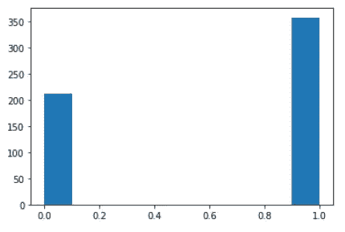
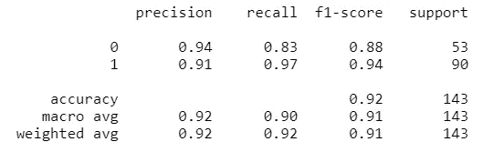
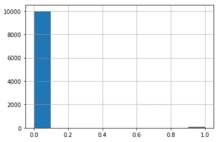
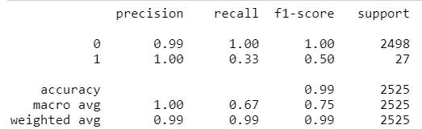
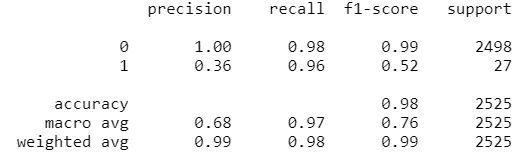
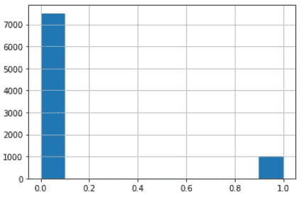
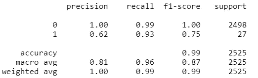

# 你需要知道的处理不平衡数据的两个技巧

> 原文：<https://medium.com/analytics-vidhya/two-techniques-you-need-to-know-to-handle-imbalance-data-6ce674d1434e?source=collection_archive---------17----------------------->


戴维·沃布鲁克在 [Unsplash](https://unsplash.com?utm_source=medium&utm_medium=referral) 上拍摄的照片

你在现实世界中做过机器学习分类问题吗？如果是这样，您可能对不平衡数据问题有一些经验。不平衡数据意味着我们想要预测的类别不成比例。构成大部分数据的类称为多数类。那些占较小部分的是少数阶级。例如，我们希望使用机器学习模型来捕获信用卡欺诈，欺诈活动大约占数百万笔交易的 0.1%。大多数常规交易会妨碍机器学习算法识别欺诈活动的模式。

让我们从一个使用 scikit-learn 提供的乳腺癌数据的简单案例开始。如下图，数据是平衡的。



原始乳腺癌数据

然后我们可以建立一个简单的决策树模型，观察性能。对于类别 1，精度显示 81%的模型预测类别 1 确实是类别 1；并且召回显示了 97%的真实肯定率，即 97%的实际类别 1 被模型捕获。



天平数据的性能矩阵

# 创建不平衡数据

对于实验，我们通过分别从类 0 和类 1 中抽取 10，000 和 100 个样本来创建不平衡数据。少数阶层的比例为 1%。



不平衡的乳腺癌数据

然后，我们对这种不平衡数据应用相同的简单决策树模型。类别 1 的真实阳性率从 97%下降到 33%。我们如何解决这个问题？



不平衡数据的性能矩阵

# 方法 1 —等级权重

Scikit-learn 提供了一种简单的方法来解决这个问题。通过为 DecisionTreeClassifier 指定 class_weight = 'balanced ',分类器会自动查找每个类的权重。我们的实验表明，使用平衡的类权重可以将召回率从 33%提高到 96%，但是会导致很多误报，准确率从 100%下降到 36%。

```
clf = DecisionTreeClassifier(random_state=0,min_samples_leaf=30,class_weight='balanced') 
clf = clf.fit(X_train, y_train)
```



通过平衡类权重寻址不平衡数据的性能矩阵

# 方法 2 —上采样

另一种方法是应用上采样。这意味着我们保留所有多数类，并从少数类中随机抽样替换，以增加少数类的比例。这里，我们从类 1 中随机选择 1000 条记录。少数民族阶层的比例增加到 13%。



上采样数据

我们再次用上采样数据训练我们的简单决策树模型。我们的实验表明，上采样产生了与方法 1 相当的真阳性率，同时将准确率从 3%提高到 62%。



通过上采样处理不平衡数据的性能矩阵

# 摘要

在本文中，我们 1)解释不平衡数据的问题；简单决策树模型对平衡乳腺癌数据工作良好，但对不平衡数据工作不佳。2)介绍了两种解决不平衡数据问题的方法。一种方法是类权重，另一种是上采样。下面列出了我们的基准和这两种方法之间的比较。注意，对于这两种方法，我们可以通过微调类权重和少数类比率来进一步提高性能。

# 参考

1.  [https://github . com/cola white/article/blob/master/handle _ unbalance _ data . ipynb](https://github.com/colawhite/article/blob/master/handle_imbalance_data.ipynb)
2.  [https://developers . Google . com/machine-learning/data-prep/construct/sampling-splitting/失衡数据](https://developers.google.com/machine-learning/data-prep/construct/sampling-splitting/imbalanced-data)