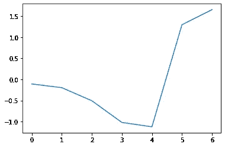

# 从哨兵-2A 数据中提取感兴趣点的两种方法

> 原文：<https://medium.com/analytics-vidhya/two-ways-of-extracting-points-of-interest-from-sentinel-2a-data-baa124b1ed92?source=collection_archive---------5----------------------->

最近我读到了一个由欧洲航天局组织的[竞赛](https://www.sentinel-hub.com/contest)，他们要求使用哨兵卫星免费提供的图像数据，尝试从当前的疫情中发现关于社会、城市和自然变化的见解。并不是说我是一个远程地理传感专家，但我认为这是一个好主意，教育自己一点关于这个主题。

首先，什么是 Sentinel-2 成像数据？

哨兵-2A 于 2015 年 6 月 23 日发射

哨兵是几年前由欧空局发射的一组卫星。每隔五天，他们拍摄所有陆地和沿海地区的照片。照片是用不同的波长拍摄的——比如 Sentinel-1，它有一个微波雷达，可以穿透云层，基本上可以建立一个地区的 3D 地图。Sentinel-2 可以在 13 种波长范围内拍照，从蓝光(443 纳米)到短波红外(2190 纳米)。还有其他用于不同目的的卫星。

最棒的是，来自这些卫星的图像是免费公开的——每个人都可以做他们的研究，甚至建立一个商业产品。围绕这些数据已经形成了一个完整的生态系统。

如果你有时间，绝对值得去看看。这就是我所做的。

这里我们处理的是地理数据——这些图像本质上是地图——和光谱数据——不同的物体对不同波长的光有不同的反射。因此，如果您进行研究，您可能希望深入到特定的地理对象或具有特定光谱的对象——由特定材料制成。

在这篇文章中，我将分享两种方法来做到这一点。如果您已经知道如何下载和预处理 Sentinel-2 图像，您可以跳过以下两节。

# 获取图像

让我们先下载图像。有两种方法可以做到这一点——通过 Copernicus Hub 上的[交互式网络界面](https://scihub.copernicus.eu/dhus/#/home),或者通过`sentinelsat` Python 包中可用的 API。API 肯定更方便，但是你应该至少去一次 web 界面，了解你到底需要下载什么。

原因是 Sentinel-2 拍摄的是 100*100 的区域，这些区域略有重叠。当我想得到我的家乡城市塔林的图像时，发现它正好位于这样一个重叠的区域。每张图片大约有 1 GB 的数据，所以我不想下载不必要的重复图片。

现在知道了我感兴趣的区域有代码“T35VLF ”,我可以预过滤 API 输出的内容。

你需要安装`sentinelsat`和`geopandas`包，并在 Copernicus Hub 上注册账号。同样`shapely`也不会有坏处，因为你想处理地理多边形。

现在下载一个特定的快照(大约 1 GB！)你用 dataframe index 作为参考。或者用*。下载 _ 全部()*

解压缩下载的档案，你得到你的数据。

# 将光谱带组合成一幅图像

解压存档后，会得到一堆名字复杂、目录结构看似晦涩难懂的目录。里面是 JPEG2000 格式的图像，适用于每个频段(共 13 个频段)。我们想阅读并结合成一个单一的 TIFF 文件，方便进一步的工作。

说到乐队，我们需要哪些？根据任务的不同，你可能需要 1 个、3 个、全部，或者我选择的 7 个，它们很好地代表了最初探索的大部分范围。

不同波长的图像具有不同的分辨率——我们使用的图像的像素边长为 10 或 20 米。我们希望将分辨率较小的图像外推至分辨率较大的图像。

接下来是处理目录结构和文件处理的代码片段。首先，定义正在使用的参数。

使外推像素之间的过渡平滑的二元样条外推函数。

现在让我们找到包含实际图像的目录，并将它们组合成 TIFF 文件，在必要的地方进行外推。

简而言之，它是做什么的？

*   这些图像位于颗粒目录的 IMG 数据子目录中。它们被分成 R10m、R20m、R60m 子目录，这些子目录表示像素分辨率。里面是对应每个频段的. jp2 文件。
*   我们正在使用`rasterio`库加载它们。
*   每个读取的对象都包含一个属性`profile`，该属性包含宽度、高度、坐标参考系统(CRS)、数据类型(dtype)和多边形在各自 CRS 中的坐标(`transform`属性)。当进行变换时，比如图像的裁剪，我们需要更新它。
*   由于我们只对塔林(`get_tallinn_polygon()`)感兴趣，我们想从一开始就裁剪频段层，并只将裁剪区域保存为 TIFF。`mask`来自`rasterio`的函数就是这么做的，但是首先它需要将塔林多边形坐标从通常的 lat/lng 格式转换成 EPSG:32635 ( `mem_file.crs`)坐标参考系统。
*   `mask`函数只对`rasterio`文件句柄起作用，我们不想先将全尺寸的 TIFFs 写入磁盘，然后重新打开它们，然后再进行裁剪——我们想立即执行。所以我们用`MemFile`来表示。

每个完整的 TIFF 文件会超过 1 GB，但是裁剪后的版本只有 90 MB。

# 使用 OpenStreetMap 数据库提取地理区域和对象

什么是 [OpenStreetMap](https://www.openstreetmap.org/) ？这是一个全球地图门户，类似于谷歌地图，但众包和维基风格——每个人都可以改变和改进地图。例如，添加新的餐馆，建筑编号，道路和其他一切适当的地图应该有。

由于它是免费和开放的，你可以下载整个世界——听起来怎么样！不过世界很大，所以有些数据提供商可以让你只下载特定国家的数据。这样的档案将包含该国的一切(道路、森林、房屋等)及其多边形坐标和元数据。我用一个这样的[下载爱沙尼亚](https://download.geofabrik.de/europe/estonia.html)——文件是`estonia-latest-free.shp.zip`。解包后，目录如下所示:

您可能已经猜到了，使用这些文件中的多边形和元数据，我们将裁剪 Sentinel 数据，就像我们之前提取塔林多边形一样。

我创建了一个特殊的函数来方便地做到这一点，给出的目录如上。

它利用了`geopandas`模块，该模块具有所有的`pandas`功能，但也提供了处理地理数据的特定功能。

输入包括:

*   OSM 数据位置
*   的名称。要加载的 shp 文件(如“道路”、“建筑”、“交通”)
*   `sub_polygon`，告知是否将整个爱沙尼亚划分为一个特定的多边形(是的，我们只想要塔林)
*   文件中的某些形状可能不是闭合的多边形，而是线串。我们尝试使用凸包方法(计算包含所有点的最小多边形)来闭合它们，但是当它是一个点时，有些仍然是不闭合的。所以`remove_non_polygons`将它们从数据帧中移除。
*   再次，裁剪哨兵地图需要 lng/lat 格式，所以需要`swap_coordinates`。如果你在任何时候得到“窗口不相交”的错误，首先检查这个，然后检查 CRS。

现在让我们尝试加载一个 TIFF 文件，使用 OSM 数据库提取公园和森林，并在指数为 5 的波段(B11，1610 nm，近红外)中可视化结果。

我们在这里看到的是给定区域的近红外反射率。从谷歌地图上可以看到，这些位置与实际情况非常吻合。

# 根据反射光谱寻找物体

有大量的文章和科学论文提供了现成的公式和技巧，说明如何通过不同波长的反射率(如光谱)来定位沼泽、森林、田野和其他自然物体。毕竟，首先也是最重要的哨兵卫星是为农村土地使用监测而创建的。

但是，如果我想寻找具有自定义光谱的东西呢？如果我想在城市环境中找到人造物体怎么办？我需要找到我感兴趣的特定材料的光谱，并尝试将这些区域从图像中分离出来。我该怎么做？

原来有一个由美国地质调查局精心编制和管理的不同光谱的数据库。你可以下载 [5.1 GB 的档案](https://www.sciencebase.gov/catalog/item/5807a2a2e4b0841e59e3a18d)，其中包含许多矿物、人造材料和有机物的光谱。他们还提供了直接适用于 Sentinel-2 波段的文件格式。

同样，对于下载和解压缩的归档文件，我编写了一个函数来加载感兴趣的材料。让我们加载“Sheet_Metal”来查找屋顶由钢制成的建筑物。

因此，我们提供未打包的库位置、材料名称、我们拥有的频段以及`normalize`。

为什么要将光谱数据归一化为 0 均值和单位方差？因为 Sentinel 图像数据有一个尺度，这个数据有另一个尺度，但我们只是想比较光谱的形状。我们也将很快使哨兵图像数据正常化。但首先，我们来看看剧情。

这是金属片在与我们的波段相对应的频率下的归一化反射率。

现在让我们用之前加载的`tiff_data`来找到那些金属屋顶。

*   首先，我们沿 0 轴标准化三维`tiff_data`——基本上，取每个像素并使其光谱的平均值和单位方差为零。
*   然后，我们获取金属板的目标光谱，计算它与每个像素之间的均方误差，生成误差热图。
*   然后，我们绘制这些误差的分布图，以得到一个线索，从哪里切入，只选取光谱与金属片的光谱相匹配的区域。

让我们取所有 MSE ≤ 0.2 的数据，显示结果并再次与 Google Maps 进行视觉比较。

由于这些建筑相对于整个城市来说相当小，我们将只选取地图的一个子集。蓝色表示最小的 MSE，它最符合金属片的光谱。

看来这种方法确实有效。

# 有什么限制吗？

结合这两种方法，可以做出很多有趣的事情。尽管有一些限制，你应该意识到不要在调试上浪费时间。

*   图像的分辨率为 10*10 米。这对于研究更大规模的区域来说已经足够了，比如自然区域，但是在城市地区你最多只能建造一座中等规模的建筑。
*   尽管我们选择的云量不超过 10%，但这适用于整个 100*100 公里的图片，您感兴趣的特定区域可能仍会被云遮住。
*   根据季节的不同，太阳在城市上空的高度不同，阴影也不同。这会改变反射的强度，并在结果中引入变化。

然而，有研究似乎表明了亚像素分析的可行性。例如，如果你有一个“灰色”的停车场，位于一个没有阴影的地方，那么汽车的存在与否应该以可预测的方式改变其反射率。这样你就可以从理论上分析城市活动的模式——不管一个地方是否繁忙。