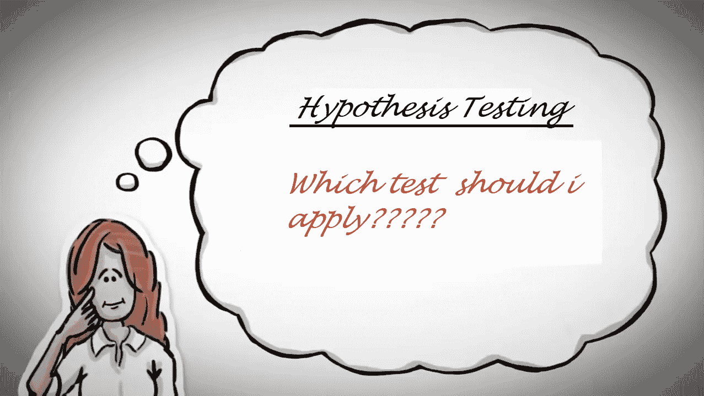

# 正确假设检验的类型和选择

> 原文：<https://medium.com/analytics-vidhya/type-and-selection-of-correct-hypothesis-tests-671e6ef2d05e?source=collection_archive---------15----------------------->

# 介绍

假设是对世界特定情况的假设，并且是可检验的。科学家通过猜测他们确信(或认为)是错误的来进行研究。假设检验的过程是有意义的，因为这是一种相当直观的方式来得出关于世界和其中的人的结论。我们经常非正式地做假设检验…