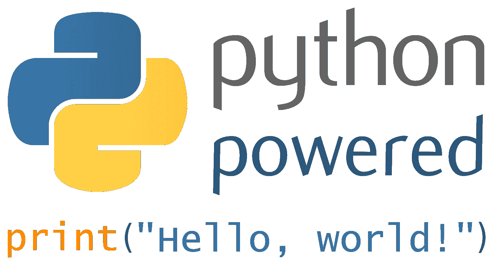

# Python 3.8 中的类型注释

> 原文：<https://medium.com/analytics-vidhya/type-annotations-in-python-3-8-3b401384403d?source=collection_archive---------1----------------------->

图片来源:[本杰明地狱](https://commons.wikimedia.org/wiki/File:Python3-powered_hello-world.svg)

Python 如此容易上手的一个原因是它有动态类型。您不必指定变量的类型，您只需将变量用作数据容器的标签。但是在更大的项目中，拥有类型是有帮助的。如果你有一个没有类型的未记录的函数，可能还有蹩脚的变量命名，新开发人员将会有一段艰难的时间。幸运的是，在 Python 3.6 中用 [PEP 526](https://www.python.org/dev/peps/pep-0526/#backwards-compatibility) 添加了变量注释🎉