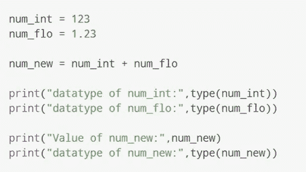
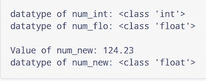
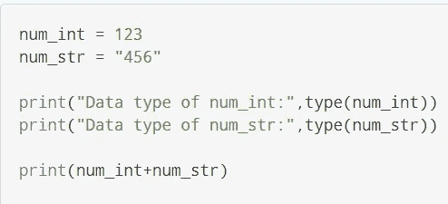
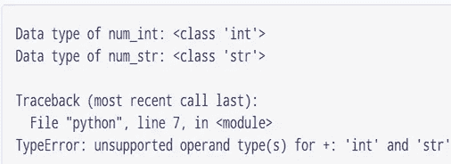
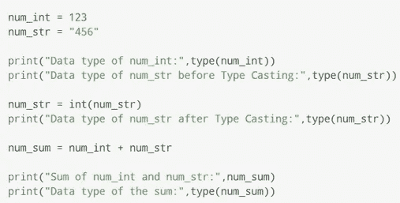
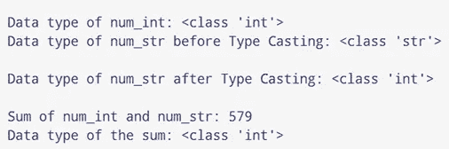

# Python 中的类型转换

> 原文：<https://medium.com/analytics-vidhya/type-conversion-in-python-a400550bd1fb?source=collection_archive---------16----------------------->

转换一种数据类型(整数、字符串、浮点等)的值的过程。)到另一种数据类型的转换称为 T **类型转换**。

Python 有两种类型的类型转换。

1.  隐式类型转换
2.  显式类型转换

**1。隐式类型转换**

在隐式类型转换中，Python 自动将一种数据类型转换为另一种数据类型。

让我们看一个例子，Python 提倡将较低的数据类型(integer)转换为较高的数据类型(float)以避免数据丢失。

**示例 1:将整数转换为浮点数**

隐式类型转换

当我们运行上面的程序时，输出将是，

输出

我们可以看到 ***num_new*** 有一个 **float** 数据类型，因为 Python 总是将较小的数据类型转换为较大的数据类型，以避免数据丢失。

**示例 2:添加字符串(高位)数据类型和整数(低位)数据类型**

隐式类型转换错误

当我们运行上面的代码时，我们会得到如下的 ***类型错误*** ，

从输出中我们可以看到，我们得到了 ***类型错误*** 。在这种情况下，Python 不能使用隐式转换。

然而，Python 有一个针对这类情况的解决方案，称为 ***显式转换*** 。

**2。显式类型转换**

在显式类型转换中，用户将对象的数据类型转换为所需的数据类型。

我们可以使用下面的预定义函数来执行显式类型转换。

a)int()

b)浮动()

c)str()

这种类型的转换也被称为**类型转换**，因为用户转换(改变)对象的数据类型。

**语法**:

<required_datatype>(表情)</required_datatype>

**示例 3:使用显式类型转换添加字符串和整数**

**程序**:

显式类型转换

**输出**:

