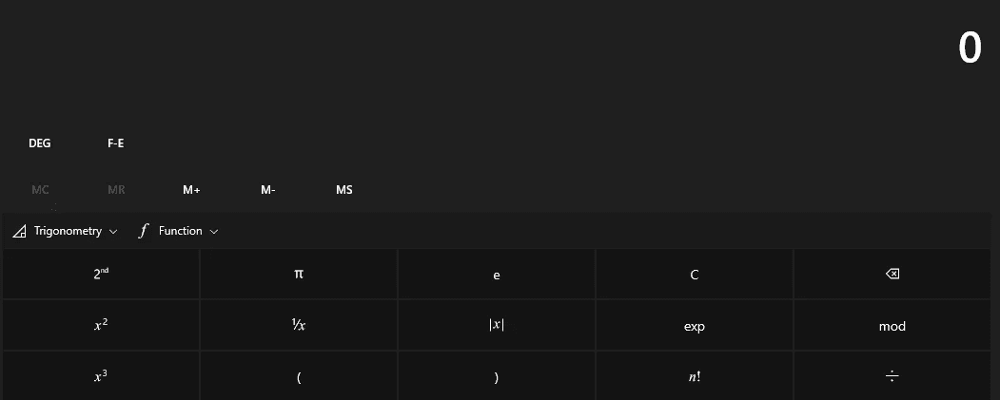
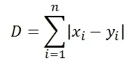
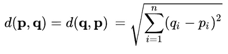
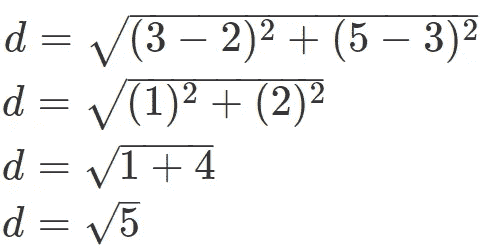
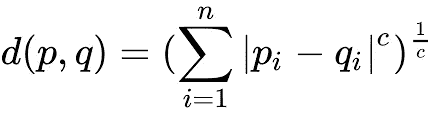
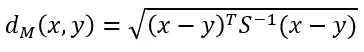

# 机器学习算法中使用的距离类型

> 原文：<https://medium.com/analytics-vidhya/type-of-distances-used-in-machine-learning-algorithm-c873467140de?source=collection_archive---------15----------------------->

图片来自[https://www.yadsmic.com/](https://www.yadsmic.com)

距离度量用于表示任意两个数据点之间的距离。有许多距离度量，但在本文中，我们将只讨论几个广泛使用的距离度量。

如果你是机器学习的新手，请查看:[机器学习简介](https://www.yadsmic.com/post/introduction-to-machine-learning)

# 距离类型:

1.  曼哈顿距离
2.  欧几里得距离
3.  闵可夫斯基距离
4.  汉明距离
5.  马哈拉诺比斯距离

# 曼哈顿距离

作为绝对差之和的曼哈顿距离

图片来自 https://www.yadsmic.com/

在 p1 在(x1，y1)且 p2 在(x2，y2)的平面中，它是|x1 — x2| + |y1 — y2|。

**举例:**

让我们从{ 3，5 }计算{ 2，3 }之间的距离

我们把它放在公式中

|2–3|+|3–5| = |-1| + |-2| = 1+2 = 3

在三维空间曼哈顿距离示例中:[{a，b，c}，{x，y，z}]:

**Abs[a x]+Abs[b y]+Abs[c z]**

# 欧几里得距离

平面或三维空间中两点之间的欧几里德距离测量连接两点的线段的长度。

图片来自[https://www.yadsmic.com/](https://www.yadsmic.com)

**示例:**

让我们从{ 3，5 }计算{ 2，3 }之间的距离

我们把它放在公式中

# 闵可夫斯基距离

闵可夫斯基距离是欧几里德距离和曼哈顿距离的推广。闵可夫斯基距离被应用于机器学习中以找出距离相似性。

图片来自[https://www.yadsmic.com/](https://www.yadsmic.com)

如果 **C = 1** 则为**曼哈顿距离。**

如果 **C = 2** 那就是**欧几里德距离。**

# 汉明距离

汉明距离是比较两个二进制数据字符串的度量。

如果‘p’和‘q’是二进制串，那么汉明距离就是从‘p’转换到‘q’所需的比特数，或者换句话说就是不同比特数

让我们考虑两个二进制字符串 A = '010 '和 B = '011 '

然后，如果将字符串 A ( 010)的 3 位从 0 更改为 1，则得到 B ( 011)，因此所需的位数或不同位数为 1，因此上述两个字符串的汉明距离为 1。

# 马哈拉诺比斯距离

Mahalanobis 两个向量 x 和 y 之间的距离，其中 S 是协方差矩阵。

图片来自[https://www.yadsmic.com/](https://www.yadsmic.com)

两个特征的协方差指示两个特征的值如何一起变化。它测量一个特性的值如何根据另一个特性的值而变化。

Mahalanobis 距离使用协方差矩阵的逆矩阵。等式中的“T”表示矩阵的转置。

*最初发表于*[*【https://www.yadsmic.com】*](https://www.yadsmic.com)*。*