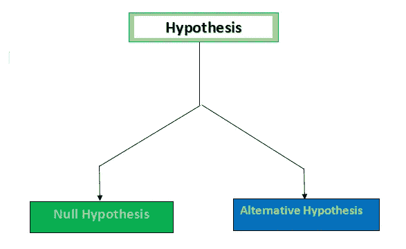

# 第一类和第二类错误

> 原文：<https://medium.com/analytics-vidhya/type1-and-type2-error-f8c01c801ddf?source=collection_archive---------19----------------------->

来源:- [Quora](https://www.google.com/search?q=false+positive+and+true+negative+pregnent+lady+&tbm=isch&ved=2ahUKEwjLwc_HlaDqAhV52nMBHa9TBNAQ2-cCegQIABAA#imgrc=Osa9pSR-OQ2bEM)

在理解这两种错误之前，我们首先要理解假设。

> **什么是假设？**

统计学家在没有观察数据的情况下做出的假设。当语句相互排斥时使用。

互斥语句:-如果两个语句不能同时出现，则它们是互斥的。如果扔硬币，它要么给出正面，要么给出反面。

抛硬币的例子:-问题。>检查投掷的硬币是否偏向头部？

H0 总是用所问问题的反义词，所以如果抛出来的硬币不会偏向正面，就意味着这是零假设(H0)，否则就是替代假设(H1)。

> 我们如何检验假设是无效还是替代假设？

p 值在其中起主要作用。如果任何检验统计的 p 值> 0.5，意味着给定的陈述是零假设。这里，p 值表现得像拇指值，任何小于 0.5 值都被认为是替代假设(H1)。

**图:- 1**

1.  无效假设:-与我们要证明的陈述相反。
2.  替代假设:-它支持我们想要证明的陈述。

## 假设检验是如何实现的？

我们将在零假设的基础上进行假设检验。即:

我们要么拒绝零假设，要么未能拒绝零假设。只有在零假设的帮助下，我们才能消除假设检验中的歧义。

零假设表示为:- H0(下标特征在此平台上不可用，其中 0 是 H 的下标)

> 理解 I 型和 II 型错误？

**图:-2**

理解图 2；

I >正确决策:-当零假设的真条件(垂直方框)与陈述(水平方框)匹配时，则决策被认为是正确的。

二。>第一类错误:-当零假设为真且语句拒绝零假设时，该错误称为第一类错误。

三。>第二类错误:-当零假设不为真，但语句未能拒绝零假设时，该错误称为第二类错误。

> 使用现实生活中的例子理解这两种类型的错误

问:律师想证明被指控的人有罪。

理解:——这里我们会得到一些情景；

一>正确的决策；

被指控的人没有犯任何罪，被法院释放。某人犯了罪，将被关进监狱。

错误；

这个人是无罪的，并被关进监狱。某人有罪，但未被记录入狱。

**图解表示:-**

**图:-3**

