# 深度学习中激活函数的类型

> 原文：<https://medium.com/analytics-vidhya/types-of-activation-functions-in-deep-learning-6c9d4ede6186?source=collection_archive---------18----------------------->

在制作深度学习模型时，我们通常需要考虑深度学习的各个方面。选择正确的层数、激活函数、历元数、损失函数、优化器等等。

我正在为我的一个项目重温这些概念，所以我决定写一下我们使用的不同的激活函数。

# 那么激活功能有什么用呢？

那么，为什么我们甚至使用激活函数，而不是直接将求和结果提供给下一层。

如果我们这样做，问题将是神经网络层不能随着时间的推移学习复杂的功能。激活功能为模型增加了非线性。这有助于它学习复杂的函数。通过对从层的权重获得的值使用激活函数来计算发送到下一层的特定节点处的结果。

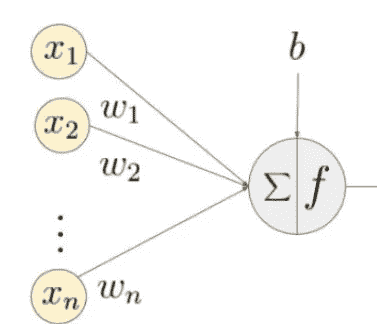

如上图所示，每个神经元都要做**两个计算**。首先对前几层的权重求和，然后计算激活函数。

所以现在我想我们知道为什么激活功能如此必要了。

现在让我们来看看几个激活函数。

# **1。乙状结肠**

这是我们做二元分类时最常用的激活函数之一。该函数给定为:

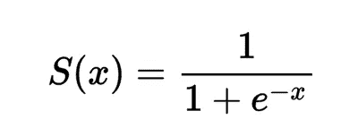

这个函数的值在 0 到 1 之间。为了了解这些值是如何分布的，我们可以画出这个函数

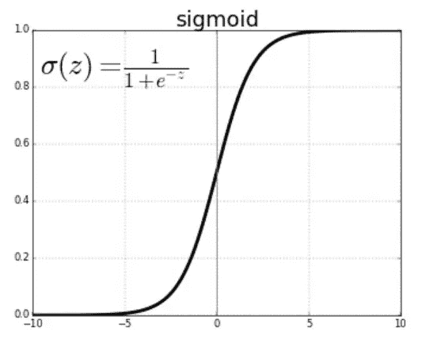

在反向传播过程中，借助导数的链式法则更新权值。这给 sigmoid 函数带来了一个问题，因为函数的导数的**值的范围是从 0 到 0.25。**因为值很小，所以如果我们在深度神经网络中使用 sigmoid 函数，我们可能会面临消失梯度的**问题。**

**什么是消失渐变？**

使用链式法则更新权重。但是在深度学习中有一个问题。如果函数的导数非常小，则被更新的权重变化非常小。这使得训练非常慢，因为训练都是关于更新权重以便它们收敛。

让我举一个小例子来说明直觉。假设我们正在从输出端更新第四个隐藏层。由于我们使用的是链式法则，我们将乘以前几层的导数。假设导数分别是 0.14，0.07，0.001。现在，如果我们将它们相乘，我们会得到值 0.0000098。

现在，该值是将用于更新权重的δWt。该值将带来非常小的变化，并且随着层数的增加而不断增加，因此命名为**消失梯度。**

**所以乙状结肠的使用通常仅限于二进制分类的输出。**

# 2.谭双曲线

tan 双曲线或 tan h 在某些性质上类似于乙状结肠。该函数如下所示:

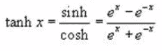

这个函数的值介于 1 到-1 之间。分布如下所示

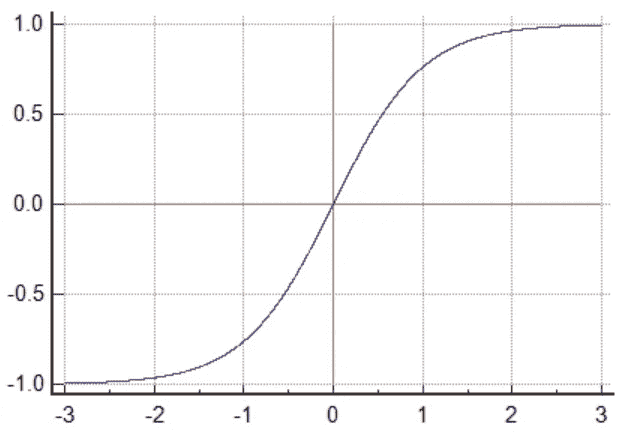

该函数的形状有点类似于 sigmoid，但其范围不是从 0 到 1，而是从-1 到 1，这使得它比 sigmoid 更有优势，因为它变成零中心。以零为中心的函数比以零为中心的函数收敛得更快。尽管如此，它仍然面临着像乙状结肠一样的渐变消失的问题。

# 3.ReLU

2010 年 Geoffery Hinton 和 Nair 推广了 ReLU 功能。它是最常用的激活功能之一。它简单地表示为:

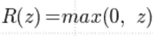

对于大于 0 的值，它是变量本身的值，当变量的值小于 0 时，它变为 0。

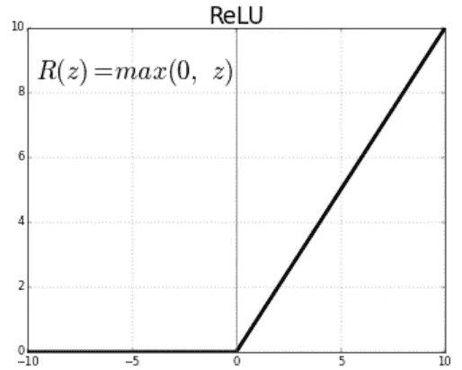

该函数在很大程度上解决了渐变消失的问题，因为对于所有大于 0 的值，该函数的导数都是 1。但是这里有一个问题。对于小于 0 的值，它将变为 0。因此，对于值小于 0 的图层，该值变为 0，并且由于我们借助链规则更新值，我们有时会发现**的权重根本没有更新的情况，因为应用时的乘积变为 0。**

**这个问题叫做神经元死亡**。这是因为在这种情况下，神经元无法执行其任务。因此，有相当多的即兴版本。

导数如下图所示:

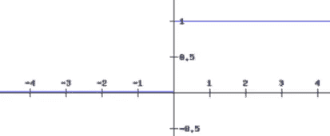

现在让我们来讨论 ReLU 函数的一些临时版本

# 4.泄漏 ReLU

ReLU 函数面临神经元死亡的问题。泄漏 ReLU 通过稍微重新定义功能来克服这个缺点。

该函数可表示为

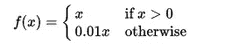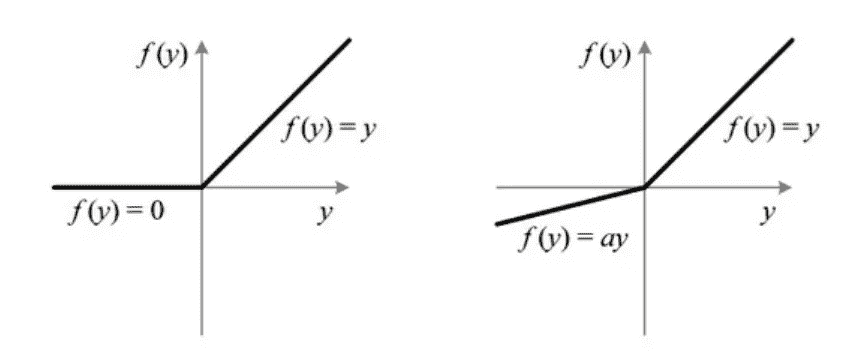

左边是普通的 ReLU 函数，右边是泄漏的 ReLU 函数。图中“a”的值很小，可以防止函数的导数变成 0。因此，这就避免了我们在 ReLU 中遇到的神经元死亡的问题。

但我们又有一个问题。假设在一个非常深的网络中，有许多导数的值小于 0。我们现在再次面临渐变消失的问题。虽然与棕褐色双曲线和乙状结肠相比，它不那么严重，但它仍然会使训练变慢。

为此，我们有另一种高级形式的泄漏 ReLU。

# 5.参数 ReLU

这个函数与泄漏的 ReLU 非常相似，但是这里当变量为负时，函数的系数不是常数，而是一个可学习的参数。

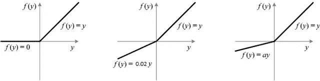

左边是 ReLU 函数，中间是泄漏 ReLU，右边是参数 ReLU。不要混淆，因为此图中的参数 ReLU 与上图中的泄漏 ReLU 相同。在泄漏 ReLU 中，系数是常数，而在参数 ReLU 中，它是可训练的超参数。

因为它是一个可训练的参数，所以它比泄漏 ReLU 执行得更好，尽管现在我们有更多的计算要做。

# 6.指数线性单位

这是 ReLU 激活功能的另一个临时版本。与其他形式的 ReLU 一样，它对负值的处理也有所不同。对于正值，上述所有 ReLU 单元执行相同的操作。

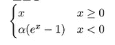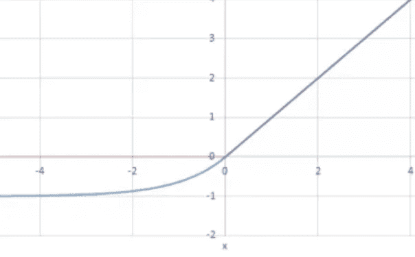

alpha 值定义了小于 0 的值的曲线。它是一个超参数，其值取决于用例及数据集。

# 6.Softmax

softmax 激活函数定义为

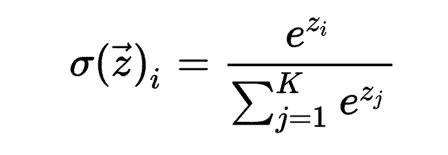

它通常用于多类分类问题的输出层。它给出了不同类别的概率。它也可以像 sigmoid 函数一样用于二元分类

# 结论

这些是深度学习中少数几个最常用的激活函数。虽然大多数深度学习框架都实现了这些功能，但最好能知道这些功能是什么，因为有时当我们处理模型问题时，这非常重要。例如，您可能正在尝试进行二进制分类，并且您在输出中使用了 ReLU 层，因为您认为它在任何地方都工作得很好。知道一个激活实际上做了什么可能会让你避免这样的问题。

谢谢