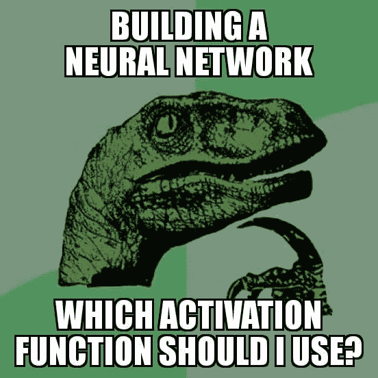

# 神经网络中使用的激活函数类型及如何选择？

> 原文：<https://medium.com/analytics-vidhya/types-of-activation-functions-used-in-neural-network-and-how-to-choose-cbbecac8457d?source=collection_archive---------19----------------------->

# 注意

在这篇文章中，我讨论了各种类型的激活函数，以及在使用它们时可能遇到的问题类型。

我建议从一个 ReLU 函数开始，并随着您的深入探索其他函数。你也可以设计你自己的激活功能给一个…