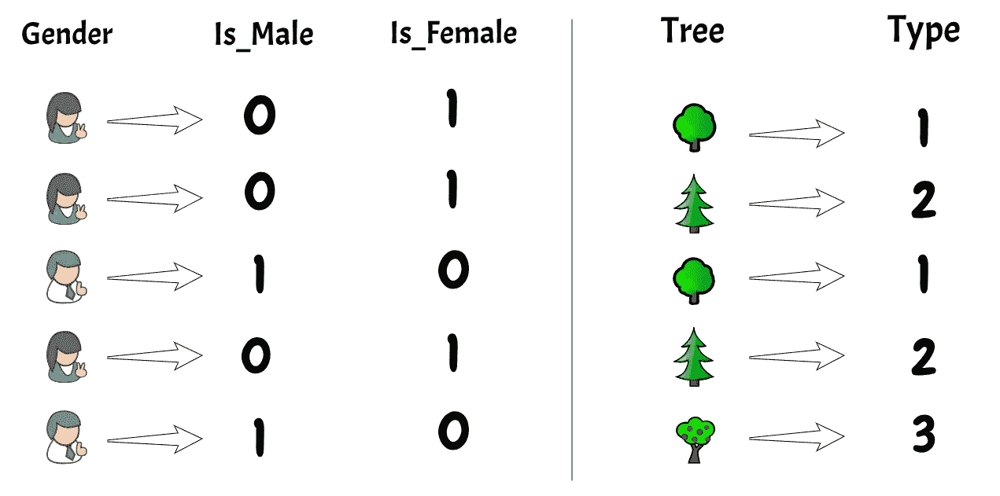
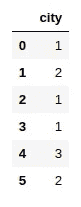
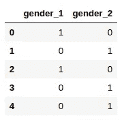
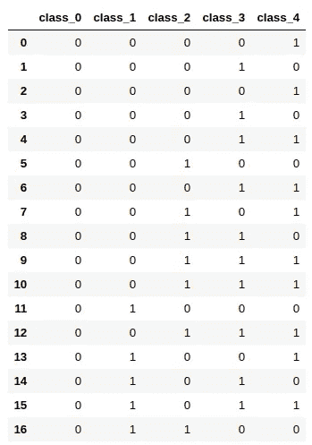
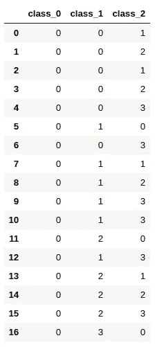
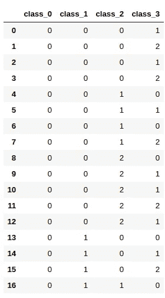
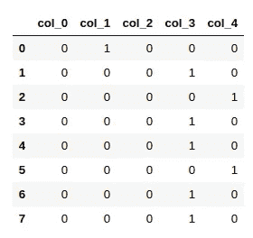
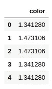
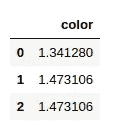
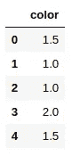

# 分类数据编码方案的类型

> 原文：<https://medium.com/analytics-vidhya/types-of-categorical-data-encoding-schemes-a5bbeb4ba02b?source=collection_archive---------0----------------------->

我们知道大多数机器学习库只接受数字形式的数据，因此将数据集中的分类变量转换为数字是非常重要的。我们不能把它们从我们的数据集中删除，因为它们隐藏了很多有趣的信息。学习处理这些变量的方法是至关重要的。



# **编码方案的类型**

**序数编码或标签编码**

它用于将非数字标签转换为数字标签(或名义分类变量)。数字标签始终介于 1 和类别数之间。

为类别选择的标签没有关系。因此，有一些联系或彼此接近的类别在编码后会丢失这些信息。列中的第一个唯一值变为 1，第二个变为 2，第三个变为 3，依此类推。

```
import pandas as pd
import category_encoders as cedata = pd.DataFrame({
    'city' : ['delhi', 'hyderabad', 'delhi', 'delhi', 'gurgaon', 'hyderabad']
})# create an object of the OrdinalEncoding
ce_ordinal = ce.OrdinalEncoder(cols=['city'])# fit and transform and you will get the encoded data
ce_ordinal.fit_transform(data)
```



**一热编码**

这里，我们将每个类别映射到一个向量，该向量包含 1 和 0，表示该特征是否存在。向量的数量取决于数据集中的类别。对于高基数特性，这种方法会产生大量的列，从而显著降低模型的学习速度。

```
data = pd.DataFrame({
    'gender' : ['M', 'F', 'M', 'F', 'F']
})# create an object of the OneHotEncoder
ce_OHE = ce.OneHotEncoder(cols=['gender'])# fit and transform and you will get the encoded data
ce_OHE.fit_transform(data)
```



**二进制编码**

首先，将类别编码为序数，然后将这些整数转换为二进制代码，然后将二进制字符串中的数字拆分为单独的列。

当您有大量类别，并且进行一次性编码会增加维度，从而增加模型的复杂性时，这是非常有用的。因此，二进制编码是对维数较少的分类变量进行编码的好选择。

```
# make some data
data = pd.DataFrame({
 'class' : ['a', 'b', 'a', 'b', 'd', 'e', 'd', 'f', 'g', 'h', 'h', 'k', 'h', 'i', 's', 'p', 'z']})# create object of BinaryEncoder
ce_binary = ce.BinaryEncoder(cols = ['class'])# fit and transform and you will get the encoded data
ce_binary.fit_transform(data)
```



**BaseN 编码**

在二进制编码中，我们将整数转换为二进制，即基数为 2。BaseN 允许我们将整数转换成任何底数的值。因此，如果您的数据集中有类似于 **city_name** 的数据，可能有数千个，那么建议使用 BaseN，因为它会在使用二进制编码后进一步降低维数。

您可以设置参数基数。这里，我在一个样本数据集上使用基值 4 和 3 进行了编码。

```
# make some data
data = pd.DataFrame({
 'class' : ['a', 'b', 'a', 'b', 'd', 'e', 'd', 'f', 'g', 'h', 'h', 'k', 'h', 'i', 's', 'p', 'z']})# create an object of the BaseNEncoder
ce_baseN4 = ce.BaseNEncoder(cols=['class'],base=4)# fit and transform and you will get the encoded data
ce_baseN4.fit_transform(data)
```



```
# create an object of the BaseNEncoder
ce_baseN3 = ce.BaseNEncoder(cols=['class'],base=3)# fit and transform and you will get the encoded data
ce_baseN3.fit_transform(data)
```



**哈希**

哈希是使用表示原始字符串的算法将字符串转换为通常较短的固定长度值的过程。

它使用 **md5** 算法将字符串转换成我们可以使用参数 n_components 定义的固定长度的较短字符串。如果您将参数设置为 5，那么不管类别的长度是 7 还是 700，算法都会将其转换为长度为 5 的字符串，最终得到 5 个不同的列来表示我们的分类值。

让我们在一个样本数据上尝试一下:

```
data = pd.DataFrame({
    'color' : ['Yellow', 'Black', 'Green', 'Blue', 'Blue', 'Green', 'Black', 'Blue']
})# create an object of the HashingEncoder
ce_HE = ce.HashingEncoder(cols=['color'],n_components=5)# fit and transform and you will get the encoded data
ce_HE.fit_transform(data)
```



**目标编码**

这里，用给定特定类别值的目标的后验概率和所有训练数据上的目标的先验概率的混合来替换特征。此外，它们不是为测试数据生成的。我们通常保存从训练数据集中获得的目标编码，并使用相同的编码对测试数据集中的特征进行编码。

```
data = pd.DataFrame({
    'color' : ['Blue', 'Black', 'Black','Blue', 'Blue'],
    'outcome' : [1,      2,        1,     1,      2,]
})# column to perform encoding
X = data['color']
Y = data['outcome']# create an object of the TargetEncoder
ce_TE = ce.TargetEncoder(cols=['color'])# fit and transform and you will get the encoded data
ce_TE.fit(X,Y)ce_TE.transform(X)
```



```
test_data = pd.DataFrame({
    'color' : ['Blue', 'Black', 'Black'],
})ce_TE.transform(test_data)
```



**漏掉一个**

这与目标编码非常相似，但在计算某个级别的平均目标以减少异常值的影响时，会排除当前行的目标。

```
data = pd.DataFrame({
    'color' : ['Blue', 'Black', 'Black','Blue', 'Blue'],
    'outcome' : [2,      1,        1,     1,      2]
})# column to perform encoding
X = data['color']
Y = data['outcome']# create an object of the TargetEncoder
ce_TE = ce.LeaveOneOutEncoder(cols=['color'])# fit and transform and you will get the encoded data
ce_TE.fit_transform(X,Y)
```



# 结论

在本文中，我们介绍了处理数据集中分类变量的各种技术。我希望这篇文章对你有用。你可以通过下面的评论区联系我！