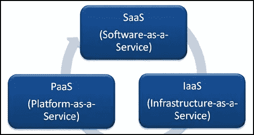
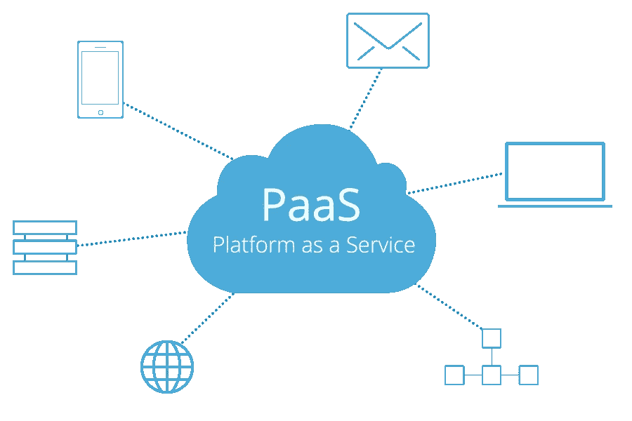
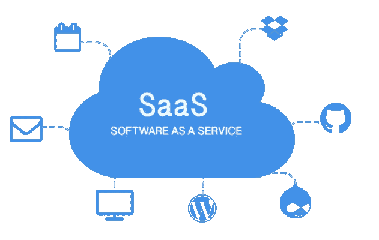
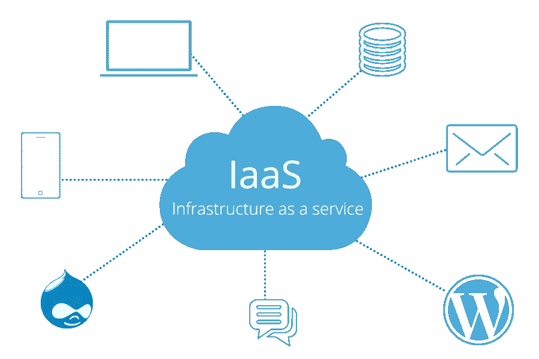

# 云计算服务的类型

> 原文：<https://medium.com/analytics-vidhya/types-of-cloud-computing-services-5fb559271fa0?source=collection_archive---------27----------------------->

> [全球新冠肺炎对云计算市场的影响预计将从 2019 年的 2330 亿美元增长到 2021 年的 2950 亿美元，CAGR 为 12.5%。](https://www.apexmarketsresearch.com/report/covid-19-impact-on-cloud-computing-market-by-664340/?utm_source=vaibhav)

# 什么是云计算-

云计算是一种技术方法，可以通过互联网存储和访问数据。它允许我们在线创建、修改和配置数据。要了解更多信息，你可以看看我的文章。

 [## 为什么选择云计算？

### 疫情已经在全世界制造了混乱，但是有一个领域已经从这个疫情中变得更加强大，那就是…

medium.com](/@ishannb/why-cloud-computing-fec84bc189aa) 

# 云服务的类型-

云计算服务有三种类型—

*   **平台即服务(PaaS) :**

平台即服务(PaaS)是一种云计算服务，通过互联网提供应用程序。在 PaaS 中，云提供商提供硬件和软件工具，以便用户可以使用它来设计、开发和测试应用程序。硬件和软件都托管在其基础设施上。不同的 PaaS 服务托管在云中，可以通过 web 浏览器访问。由于 PaaS 提供了自己的硬件和软件，因此用户可以自由安装硬件和软件来开发新的应用程序。AWS Elastic Beanstalk、Windows Azure、Heroku、Force.com、Google App Engine、Apache Stratos、OpenShift 都是 PAAS 的例子。

## 平台即服务的优势-

*   对用户来说简单方便
*   性价比高
*   裁员
*   效率
*   灵活性

*   **软件即服务(SaaS):**

软件即服务(SaaS)是一种云计算服务，其中不同的软件应用程序由服务提供商托管，不同的应用程序可以通过互联网访问。在 SaaS，整个应用程序是以托管形式提供的，它还提供基础设施、操作系统和不同的服务，从而使用户可以自行安装任何硬件和软件。SaaS 提供了完整的软件解决方案，因此您可以从任何云服务提供商那里购买 **随用随付**的服务。Google Apps、Dropbox、Salesforce、Cisco WebEx、Concur、GoToMeeting 都是 SAAS 的例子。

## SaaS 的好处-

*   易接近
*   可量测性
*   和睦相处
*   更容易管理
*   数据存储

*   **基础设施即服务(IaaS):**

基础设施即服务(IaaS)是一种云计算服务，通过互联网提供虚拟化的计算资源。在 IaaS 中，硬件、软件、服务器、存储和其他基础架构组件由第三方供应商代表其用户作为外包提供。在 IaaS 中，用户可以运行自己的应用和操作系统。在 IaaS 中，客户可以**按使用付费**，通常是按小时、周或月付费。DigitalOcean、Linode、Rackspace、亚马逊网络服务(AWS)、思科元云、微软 Azure 和谷歌计算引擎(GCE)是 IAAS 的一些例子。

## IaaS 的优势-

*   维护
*   自助供应
*   安全性
*   为您使用的东西付费
*   动态缩放