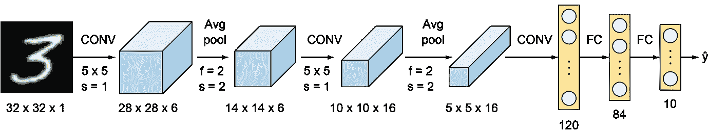
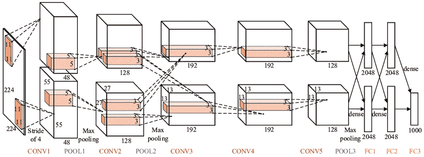
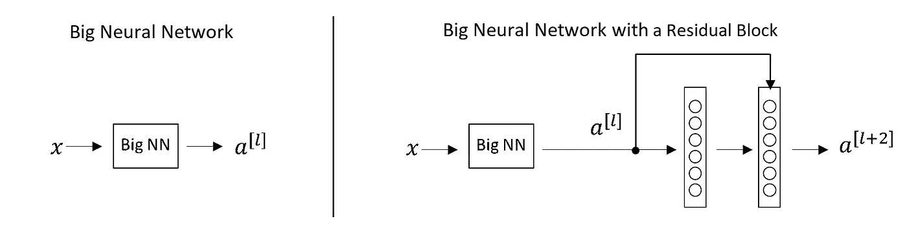
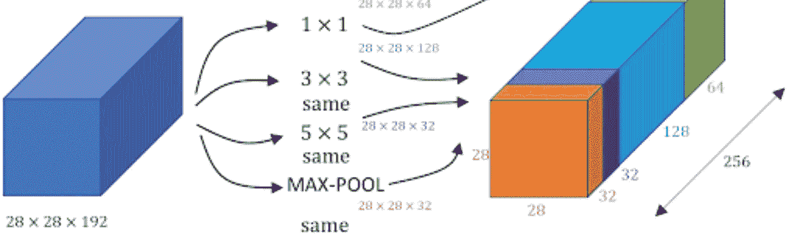
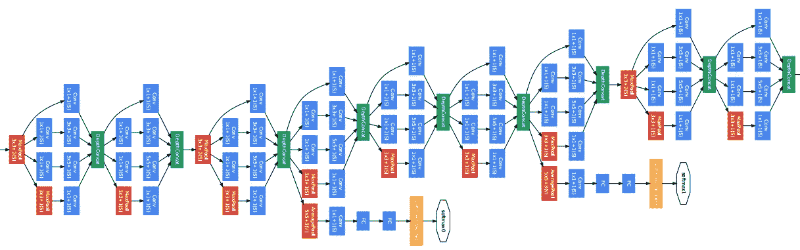

# 卷积神经网络的类型:LeNet、AlexNet、VGG-16 网、ResNet 和 Inception 网

> 原文：<https://medium.com/analytics-vidhya/types-of-convolutional-neural-networks-lenet-alexnet-vgg-16-net-resnet-and-inception-net-759e5f197580?source=collection_archive---------1----------------------->

在本文中，我们将看到不同种类的卷积神经网络，以及它们之间的区别。这些是一些开创性的 CNN 架构，旨在实现更高的精度并降低计算成本。

# 1.LeNet-5

这也是众所周知的经典神经网络，由 Yann LeCun，Leon Bottou，Yosuha Bengio 和 Patrick Haffner 在 20 世纪 90 年代为手写和机器印刷字符识别设计，他们称之为 LeNet-5。该架构旨在识别 MNIST 数据集中的手写数字。该架构非常简单易懂。输入图像是尺寸为 32*32*1 的灰度级，后跟两对步长为 2 的卷积层和步长为 1 的平均汇集层。最后，在输出层中激活 Softmax 的完全连接层。传统上，这个网络总共有 60，000 个参数。[参考](http://vision.stanford.edu/cs598_spring07/papers/Lecun98.pdf)原文。

Lenet-5 架构

# 2.AlexNet

该网络与 LeNet-5 非常相似，但更深，有 8 层，有更多的过滤器、堆叠卷积层、最大池、漏失、数据扩充、ReLU 和 SGD。AlexNet 是由 Alex Krizhevsky、Ilya Sutskever 和 Geoffery E. Hinton 设计的 ImageNet ILSVRC-2012 竞赛的获胜者。它是在两个 Nvidia Geforce GTX 580 GPU 上训练的，因此，网络被分成两个管道。AlexNet 有 5 个卷积层和 3 个全连接层。AlexNet 由大约 60 M 的参数组成。这个网络的一个主要缺点是它包含了太多的超参数。文中还引入了局部响应归一化的新概念。[参考](https://papers.nips.cc/paper/4824-imagenet-classification-with-deep-convolutional-neural-networks.pdf)原文。

AlexNet 架构

# 3.VGG-16 网

通过用多个 3×3 核大小的滤波器相继替换大核大小的滤波器(在第一和第二卷积层分别为 11 和 5 ), VGG 网解决了 AlexNet 的超参数太多的主要缺点。Simonyan 和 Zisserman 开发的架构是 2014 年视觉识别挑战赛的亚军。该架构包括 3*3 卷积滤波器、2*2 最大池层，步长为 1，保持填充相同以保持维数。总共，在网络中有 16 层，其中输入图像是尺寸为 224*224*3 的 RGB 格式，随后是 5 对卷积(滤波器:64、128、256、512、512)和最大池。这些层的输出馈入三个完全连接的层和输出层中的 softmax 函数。VGG 网络中共有 1.38 亿个参数。

VGG-16 建筑

**VGG 网的弊端:**
1 .训练时间长
2。重型型号
3。计算量大的
4。消失/爆炸梯度问题

# **4。ResNet**

ILSVRC-2015 竞赛的获胜者 ResNet 是超过 100 层的深度网络。残差网络类似于 VGG 网络，然而，对于顺序方法，它们也使用“跳过连接”和“批量标准化”，这有助于训练深层而不影响性能。VGG 网之后，随着 CNN 的深入，由于梯度消失问题使得导数变得无限小，训练变得很困难。因此，整体性能饱和甚至下降。跳过连接的想法来自于高速公路网络，其中使用了门控快捷连接。

普通深度网络与跳过连接的网络

对于上图中具有跳跃连接的网络，a[l+2]=g(w[l+2]a[l+1]+ a[l])

假设由于某种原因，由于重量衰减 w[l+2]变为 0，因此，a[l+2]=g(a[l])

因此，引入的层不会损害神经网络的性能。因此，增加层数不会降低训练精度，因为某些层数可能会使结果更差。在 LSTMs 中也可以看到跳过连接的概念。

# 5.初始网络

Inception network 也称为 GoogleLe Net，是由谷歌的开发人员在 2014 年的“深入卷积”中提出的。InceptionNet 的动机来自于图像中稀疏特征显著部分的存在，这些特征显著部分在大小上可以有很大的变化。由于这个原因，选择正确的核大小变得非常困难，因为对于全局特征选择大的核，而对于局部特征选择小的核。InceptionNets 通过在同一层堆叠多个内核来解决这个问题。通常，它一次使用 5*5、3*3 和 1*1 个过滤器。为了更好地理解，请参考下图:

谷歌网的初始模块

注意:相同的填充用于保持图像的尺寸。

正如我们在图像中看到的，三个不同的滤波器应用于同一级别，输出被合并并馈入下一层。这种组合增加了输出中的通道总数。这种结构的问题是参数的数量(大约 120M。)这增加了计算成本。因此，在将图像直接馈送到这些充当瓶颈并减少通道数量的滤波器之前，使用 1*1 滤波器。使用 1*1 滤波器，参数被减少到实际的 1/10。GoogLeNet 有 9 个这样的线性堆叠的初始模块。它有 22 层深(27 层，包括池层)。它在最后一个 inception 模块的末尾使用全局平均池。在同一篇论文中还提到了 Inception v2 和 v3，它们进一步提高了精度并降低了计算成本。

几个初始模块被连接起来形成一个密集的网络

在预测输出的网络中可以看到侧支，以便在较低的级别检查浅层网络性能。