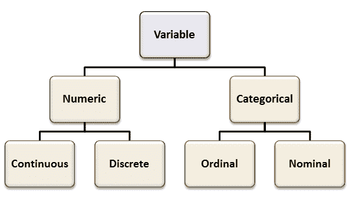
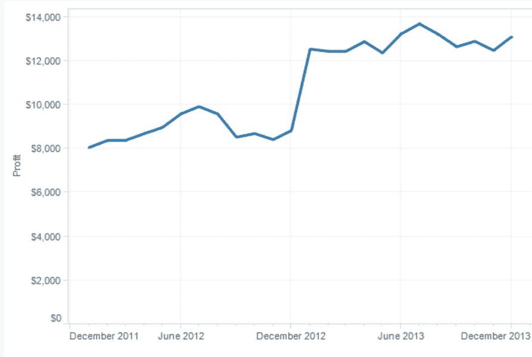
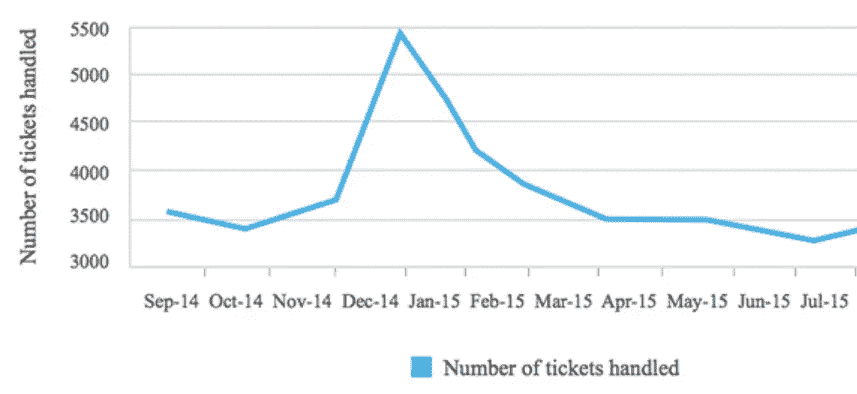
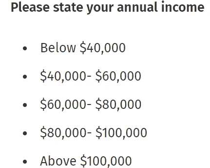
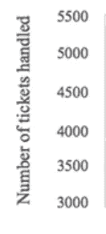
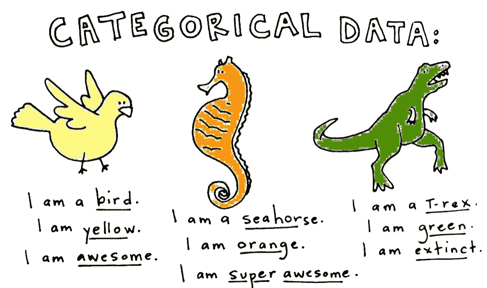
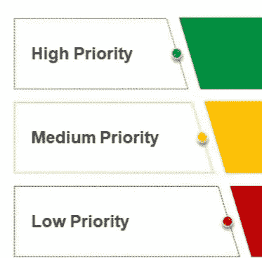

# 注释:数据类型

> 原文：<https://medium.com/analytics-vidhya/types-of-data-30667a80f5b4?source=collection_archive---------27----------------------->

没有“数据”这个主要成分，数据科学就什么都不是。那么什么是数据呢？

" F *收集在一起用于参考或分析的行为和统计数据*"

约翰·图基在他 1962 年的论文《数据分析的未来》中提出了一门新的科学学科叫‘数据分析’，这是数据科学基础中的重要工作之一。后来，1977 年出版的《探索性数据分析》一书更加突出地确立了这一领域。

**真实世界 vs 数据科学家的数据:**

**真实世界数据:**图像、视频、文本(博客、新闻、调查)、点击流(用户的应用程序交互)、日志(系统日志)、指标和数字(CPU%、内存%、财务、人数)、数据库、传感器测量等。

我们与之交互的大部分数据都不是结构化的，很难分析。为了进行正确的分析，需要努力将数据转换成结构化格式(最常见的形式是**表格**格式)。然而，并不是所有的数据都可以用这种格式表示(例如图形数据、空间数据)

现实世界的数据被分解成机器可理解的数据。示例:

*   图像被视为像素值的集合。
*   博客可以被视为字典等的索引集合。

从数据科学的角度来看，真实世界的数据被类型化为如下术语:**分类的**、**数值的**、**名义的**、**序数的**、**二进制的**、**区间的**、**比率的**、**离散的**、**连续的**、**计数的**、**时间的**

每种类型的数据都有不同的探索和处理技术，因此最好理解其中的细微差别

数据类型的 Google 搜索图像

**数字**:用数字而不是文本表示的数据，因此是可测量的。

**连续**:可以取无限个值的数据。例子:体重，身高，数量，利润如下所示

每月变化的利润值是连续数据的一个例子

**离散**:只能取不同值的数据。例如:IT 票证数量、班级学生数量、一个月中的天数。也叫**计数**数据。

票的计数总是不连续的

**间隔**:数据是沿着一个刻度测量的，其中每个点彼此之间的距离相等。区间数据可以相加或相减，但不能相除或相乘。绝对零度不存在。例如:pH 值刻度、摄氏温度等。

**比率**:几乎与区间标度相同，但绝对零度是存在的，可以被整除和相乘。比率数据没有任何负数值。例如:身高、体重、体积等。

票计数不能为负值，并且符合上述所有标准

**分类**:任何不是数字的数据，可以是文本、日期等。可能有这样的情况，将数值数据视为 1 表示通过，0 表示失败，但是它们没有任何数值意义。其他例子如姓名、班级、国家、婚姻状况等。

**名义**:无数值意义的离散值、事件类型示例、公司类型、语言名称等。不同类别之间没有数字关系

公司名称没有关系

**Binary** :只有两个类别的分类数据的特例。(真/假，0/1，通过/失败等。)

男性 vs 女性类别可以是二元的

**序数**:离散有序值。顺序在这里很重要，这是名词和序数的基本区别。例如:学生的班级、问题/bug 的优先级、公司层级

票有优先权，因此有顺序

**时间**:从理论上讲，这不是一种独立的数据类型，可以根据上下文和用途进行不同的处理。由于时间序列数据在今天的许多机器学习解决方案(预测)中很重要，甚至 pandas 也提供了易于使用的时间相关功能，因此值得单独提及

# 再次强调:

数据类型很重要，因为不同的统计方法适用于不同的数据类型。因此，了解数据的类型使你能够选择正确的分析方法。这是正确探索性分析的第一步。

注意:*统计和相关探索性分析可能不适用于音频/视频/图像数据，这些数据在深度学习领域越来越常见，将在稍后的帖子中讨论。*