# 机器学习中的距离类型

> 原文：<https://medium.com/analytics-vidhya/types-of-distances-in-machine-learning-5b1233380775?source=collection_archive---------3----------------------->

> 想知道机器学习算法是如何计算距离的吗？或者就这一次，你有没有想到计算距离的方法不止一种？

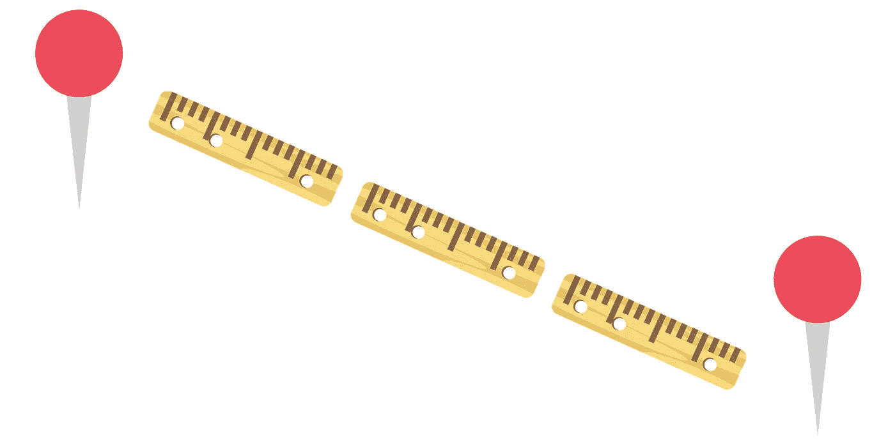

当你读到“距离”这个词时，这个词的基本定义就会浮现在你的脑海中，它是物体或点之间距离的数值度量。但是当你听到机器学习这个词时，你可能会认为它是不同的，猜猜是什么？确实是！

当我们说距离时，我们指的是距离度量。根据基本的数学定义，距离度量使用距离函数来提供数据集*中每个元素之间的关系度量。*

一些机器学习算法(监督或非监督)使用距离度量来了解输入数据模式，以做出任何基于数据的决策。良好的距离度量有助于显著提高分类、聚类和信息检索过程的性能。

# 距离度量

有许多距离度量，但在本文中，我们将只讨论几个广泛使用的距离度量。我们将首先尝试理解这些度量背后的数学，然后我们将确定使用这些距离度量的机器学习算法。

以下是常用的距离度量-

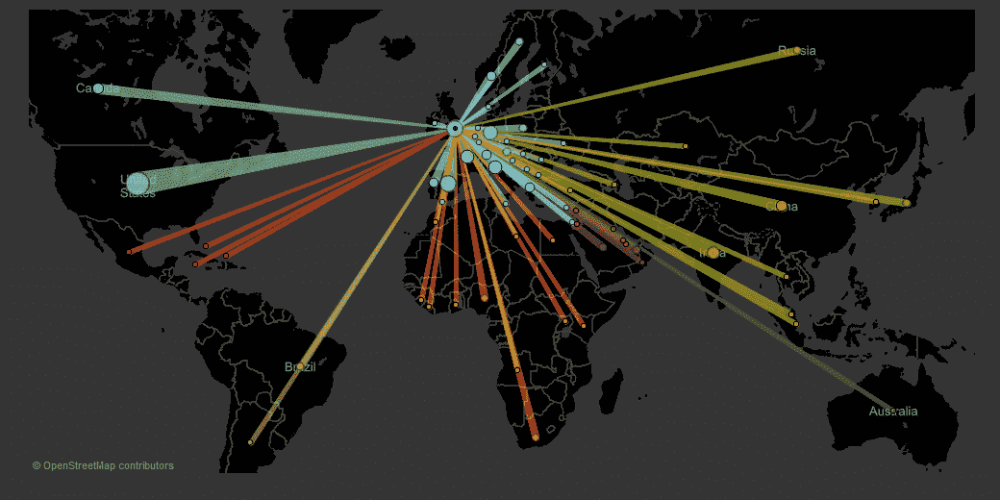

# 闵可夫斯基距离:

当我们想到距离时，我们通常会想象城市之间的距离。那是对距离概念最直观的理解。幸运的是，这个例子很好地解释了闵可夫斯基距离的限制。我们只能在赋范向量空间中计算闵可夫斯基距离，这是一种奇特的说法:“在一个空间中，距离可以表示为一个有长度的向量。”

先证明地图是向量空间。如果我们拿一张地图，我们看到城市之间的距离是赋范向量空间，因为我们可以在地图上画一个连接两个城市的向量。我们可以组合多个向量来创建连接两个以上城市的路线。现在，形容词“赋范”这意味着向量有它的长度，没有向量有负的长度。这个限制也满足了，因为如果我们在地图上画一条城市之间的线，我们可以测量它的长度。

同样，赋范向量空间是在其上定义了范数的向量空间。假设 X 是一个向量空间，那么 X 上的范数是一个实值函数| |*X*| |它满足以下条件

1.  **零矢量-** 零矢量的长度为零。说起来，如果我们看地图，这是显而易见的。从一个城市到同一个城市的距离是零，因为我们根本不需要旅行。从一个城市到任何其他城市的距离都是正的，因为我们不能旅行-20 公里。
2.  **标量因子-** 当你把向量乘以一个正数时，它的方向不变，尽管它的长度会改变。*例句:我们向北行进了 50 公里。如果我们朝同一个方向多走 50 公里，我们会向北走 100 公里。方向不变。*
3.  **三角形不等式-** 如果距离是一个范数，那么计算出的两点之间的距离将永远是一条直线。

你可能想知道为什么我们需要赋范向量，我们能不能不要简单的度量？赋范向量具有上述性质，这些性质有助于保持范数诱导的度量齐次和平移不变。

可以使用下面的公式计算距离

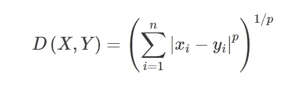

闵可夫斯基距离是广义距离度量。这里的广义是指我们可以操纵上述公式，以不同的方式计算两个数据点之间的距离。

如上所述，我们可以操作 *p* 的值，并以三种不同的方式计算距离-

*p = 1，曼哈顿距离*

*p = 2，欧几里德距离*

*p = ∞，切比雪夫距离(本文不再讨论)*

# 曼哈顿距离:

如果我们需要计算网格状路径中两个数据点之间的距离，我们使用曼哈顿距离。如上所述，我们使用 ***闵可夫斯基距离*** 公式，通过设置 ***p 的*** 值为 ***1*** 来求曼哈顿距离。

比方说，我们要计算两个数据点- ***x*** 和 ***y*** 之间的距离， ***d*** 。

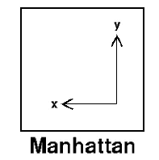

距离 ***d*** 将使用其笛卡尔坐标之间的 ***差*** 的绝对和来计算，如下所示:

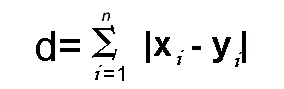

其中，*和 ***易*** 分别为向量 x 和 y 的变量，在二维向量空间中。即 ***x = (x1，x2，x3，…)*** 和 ***y = (y1，y2，y3，…)*** 。*

*现在距离 ***d*** 将被计算为-*

****(x1—y1)***+***(x2—y2)***+***(x3—y3)***+…+***(xn—yn)***。*

*如果您尝试将距离计算可视化，它将如下所示:*

*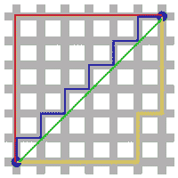*

*曼哈顿距离也被称为出租车几何，城市街区距离等。*

*当我们可以使用城市地图时，我们可以通过告诉人们应该向北走/开两个街区，然后左转，再走三个街区来指明方向。总的来说，他们将走过五个街区，这是曼哈顿从起点到终点的距离。*

# *L1 标准:*

*也被称为曼哈顿距离或出租车标准。L1 范数是空间向量的大小之和。这是测量矢量之间距离的最自然的方法，即矢量分量的绝对差之和。在这种范数下，向量的所有分量都具有相同的权重。*

*例如，具有向量 X = [3，4]:*

*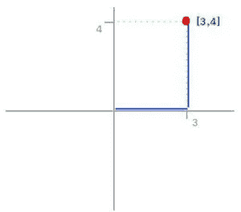*

*L1 范数的计算方法如下*

*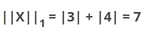*

*如图所示，L1 范数是从起点(0，0)到目的地(3，4)之间的距离，类似于出租车在城市街区之间行驶到达目的地的方式。*

# *欧几里德距离:*

*欧几里德距离是最常用的距离度量之一。通过将 ***p 的*** 值设置为 ***2*** ，使用 ***闵可夫斯基距离*** 公式进行计算。这将更新距离***d’***公式如下*

**

*欧几里德距离公式可以用来计算平面上两个数据点之间的距离。*

*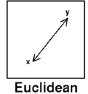*

*如果我们再看一下用来解释曼哈顿距离的城市街区的例子，我们会看到行驶路径由两条直线组成。当我们画另一条连接起点和终点的直线时，我们最终会得到一个三角形。在这种情况下，可以使用勾股定理计算两点之间的距离。*

# *L2 标准:*

*它是最流行的范数，也称为欧几里德范数。从一点到另一点是最短的距离。*

*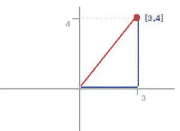*

*使用相同的示例，L2 范数计算如下*

*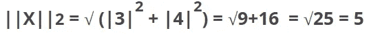*

*如图所示，L2 标准是最直接的路线。*

*对于 L2 范数，有一个需要考虑的因素，即向量的每个分量都是平方的，这意味着异常值有更多的权重，因此它可能会扭曲结果。*

# *汉娩距*

*在信息技术中，汉明距离表示两个相应的数据段可以不同的点数。它常用于各种错误纠正或对比字符串或数据的评估。*

*虽然乍一看似乎复杂而晦涩，但汉明距离是一种非常实用的度量数据字符串的方法。汉明距离包括计算哪一组对应的数字或位置不同，哪一组相同。例如，将文本字符串“hello world”与另一个文本字符串“herra poald”进行对比沿着相应的字符串有五个字母不同的地方。*

*为什么这很重要？汉明距离的一个基本应用是朝着一个结果或另一个结果纠正二进制代码。专业人士谈论一位错误或两位错误，即损坏的数据可以转换为正确的原始结果。问题是，如果有两个字符串和一个损坏的数据，必须确定损坏的或第三个数据集最接近哪个最终结果。这就是汉明距离的用武之地，例如，如果汉明距离是 4，并且一个结果有一个比特的误差，那么这很可能是正确的结果。这只是汉明距离对代码和数据串评估的应用之一。*

# **举例:**

**假设有两个字符串 1101 1001 和 1001 1101。**

**⊕11011001 1001101 = 01000100。因为，这包含两个 1，所以汉明距离 d(11011001，10011101) = 2。**

# *最小汉明距离*

*在一组长度相等的字符串中，最小汉明距离是该组中所有可能的字符串对之间的最小汉明距离。*

# *余弦相似度和余弦距离:*

*有两个术语:相似度和距离。它们彼此成反比，即如果一个增加，另一个减少，反之亦然。其公式为:*

> *1-余弦正弦=余弦距离*

*余弦相似性公式可以从点积公式中导出*

***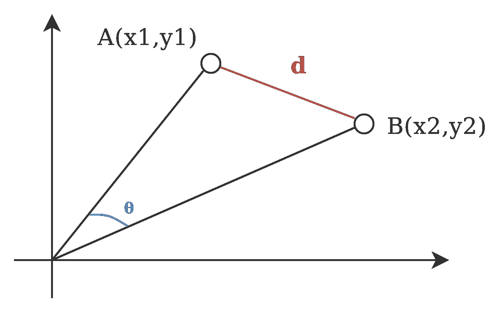*

*现在，你一定在想，余弦角的哪个值有助于找出相似点。*

**

*现在我们有了用来衡量相似性的值，我们需要知道 1，0 和-1 意味着什么。*

*这里余弦值 1 用于指向相同方向的向量，即在文档/数据点之间存在相似性。正交向量为零，即不相关(发现一些相似性)。指向相反方向的向量的值为-1(无相似性)。*

*要找到余弦距离，我们只需将值放入公式并计算。*

# *机器学习建模和距离度量*

*本节将使用示例帮助人们理解距离度量在机器学习建模中的用法。*

*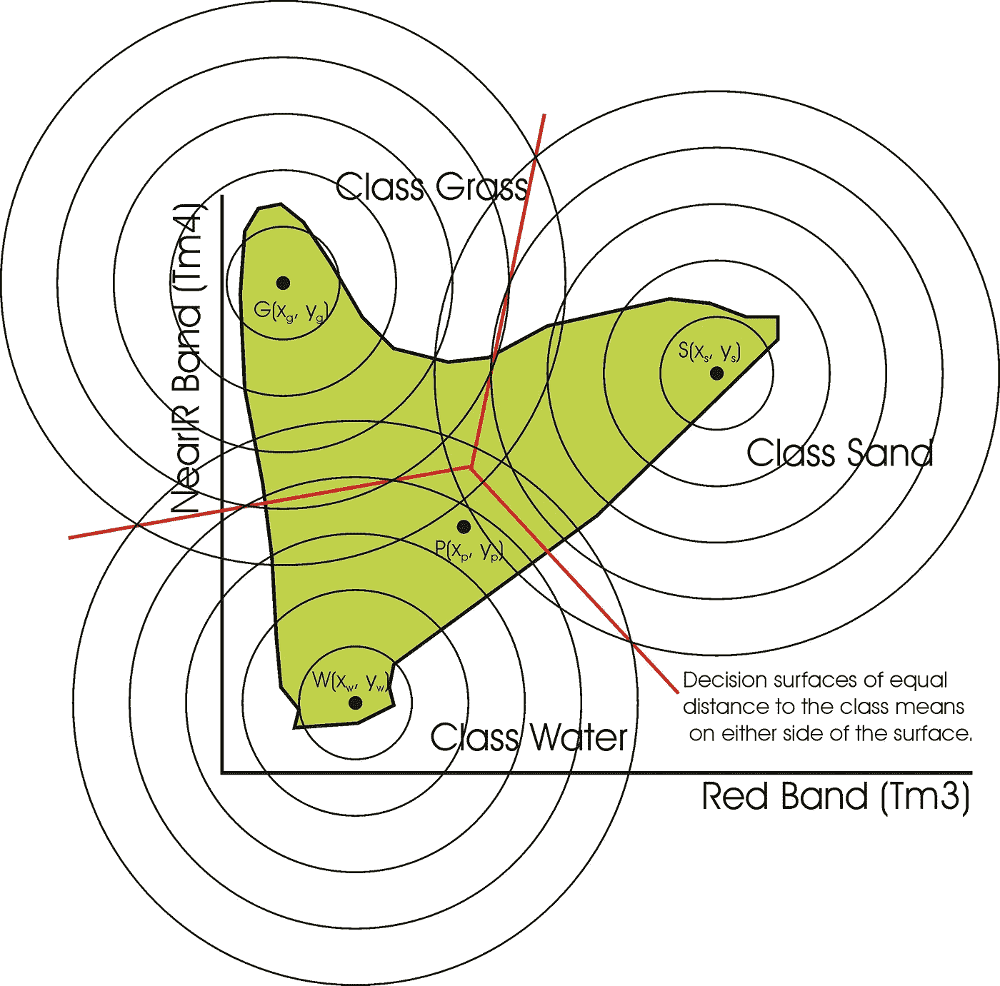*

# *1.分类*

***K-最近邻(KNN)-***

*KNN 是一种非概率监督学习算法，即它不产生任何数据点的隶属概率，而是 KNN 根据硬分配对数据进行分类，例如数据点将属于 0 或 1。KNN 使用距离度量来寻找相似或相异之处。*

*以具有三个类的 iris 数据集为例，我们将看到 KNN 如何识别测试数据的类。*

*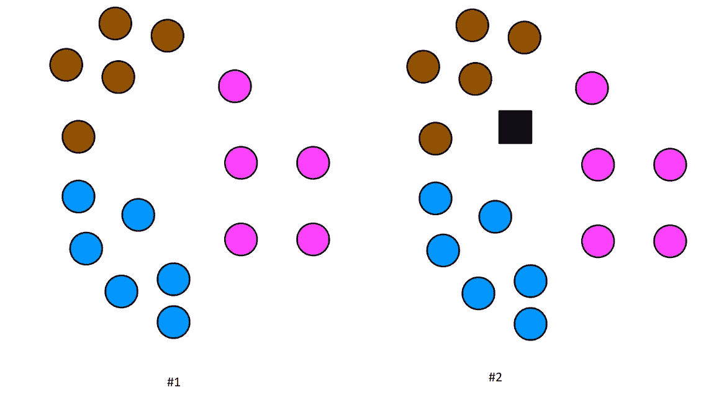*

*在黑色方块上方的#2 图像中是一个测试数据点。现在，我们需要在 KNN 算法的帮助下，找到这个测试数据点属于哪个类。*

*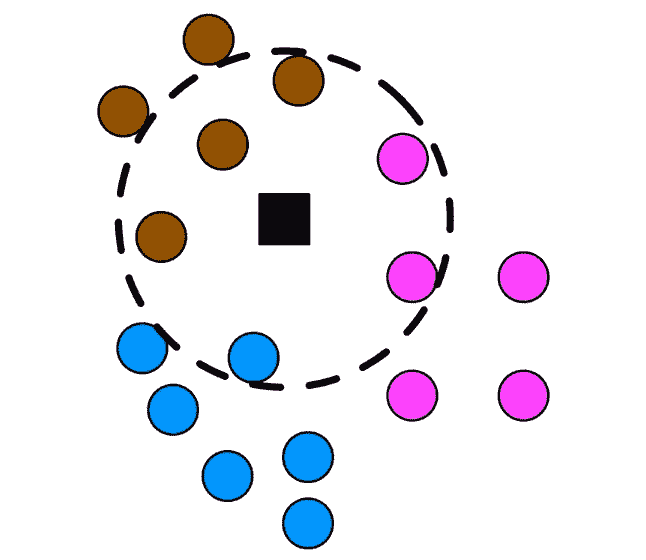*

*为了找到最近的邻居，我们使用距离度量。首先，我们计算每个训练和测试数据点之间的距离，然后根据 k *(* K 是一个测试数据点的最近邻居的数量)的值选择顶部最近的。然后，这 K 个数据点将用于决定测试数据点的类别。)*

*考虑到这个代码，*

```
*#Create a modelKNN_Classifier = KNeighborsClassifier(n_neighbors = 6, p = 2, metric='minkowski')*
```

*我们使用 p 值为 2 的闵可夫斯基距离度量，即 KNN 分类器将使用*欧几里德距离度量公式*。*

*随着机器学习建模的发展，我们现在可以训练我们的模型，并开始预测测试数据的类别。*

```
*#Train the model
KNN_Classifier.fit(x_train, y_train)#Let's predict the classes for test data
pred_test = KNN_Classifier.predict(x_test)*
```

*一旦选择了顶部最近的邻居，我们检查邻居中投票最多的类-*

*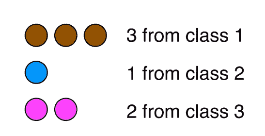*

*从上面的图像来看，它是类 1，因为它是投票最多的类。*

*通过这个小例子，我们看到了*距离度量*对于 KNN 分类器的重要性。这有助于我们获得已知类别的最接近的列车数据点。*

*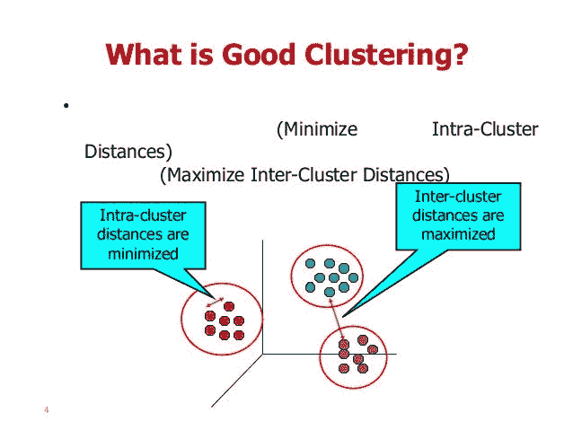*

# *2.使聚集*

***K-表示:***

*在概率或非概率的分类算法中，我们将获得带标签的数据，因此预测类别变得更容易。尽管在聚类算法中，我们没有关于哪个数据点属于哪个类的信息。距离度量是这种算法的重要组成部分。*

*在 K-means 中，我们选择几个定义聚类数的质心。然后使用*距离度量(欧几里德)*将每个数据点分配到其最近的质心。我们将使用 iris 数据来理解 K-means 的基本过程。*

*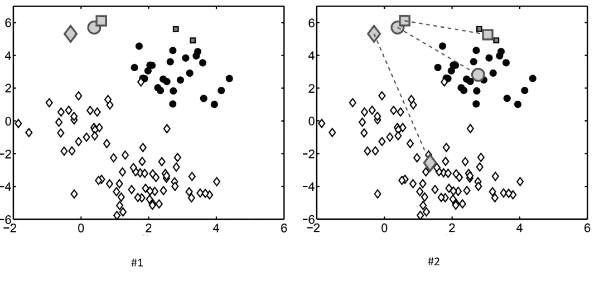*

*在上面的图像#1 中，你可以看到我们随机放置了质心，在图像#2 中，使用距离度量试图找到它们最近的聚类类。*

*正如我们在上面的例子中所看到的，在 K-Means 中的距离度量的帮助下，没有关于标签的任何知识，我们仅仅通过使用算法将数据聚类成 3 个类。因此，距离度量再次变得重要。*

**

# *3.自然语言处理*

***信息检索***

*在信息检索中，我们处理非结构化数据。借助 NLP 中使用的技术，我们可以创建矢量数据，以便在查询时可以用来检索信息。一旦将非结构化数据转换成向量形式，我们就可以使用*余弦相似性度量*从语料库中过滤掉不相关的文档。*

*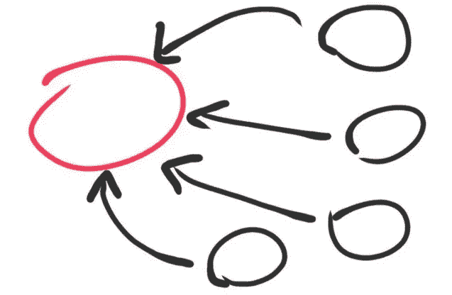*

# *结论*

> *一旦一个人深入到机器学习或数据分析或任何数据科学领域，他/她将需要深入了解课程中可用的距离，以便在正确的地方使用正确的距离度量来实现最佳结果。因此，本文旨在为人们提供一些流行的距离/相似性度量的知识，以及这些度量如何以及在哪里可以用于解决复杂的机器学习问题。*