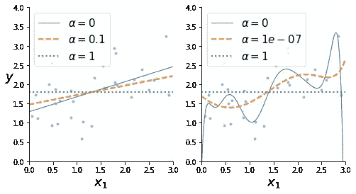

# 正则化的类型以及何时使用它们。

> 原文：<https://medium.com/analytics-vidhya/types-of-regularization-and-when-to-use-them-f0350ca651a7?source=collection_archive---------16----------------------->

约书亚·索蒂诺在 [Unsplash](https://unsplash.com/s/photos/data?utm_source=unsplash&utm_medium=referral&utm_content=creditCopyText) 上拍摄的照片

本文将解释 3 种类型的正则化，以及在哪里以及如何使用 Scikit-Learn 来使用它们。

# 为什么要用正规化？

首先我们需要明白为什么我们要正规化。正则化主要用于使模型不会过度拟合数据。多项式模型是最常见的正则化模型，因为它可能具有会导致模型过度拟合的高阶特征，正则化所做的是减少多项式次数，从而使模型不会过度拟合数据。

与减少训练数据中的特征数量等其他方法相比，使用正则化的优势在于，当移除特征时，我们会在训练时丢失有价值的信息。这就是为什么正则化更好，因为它减少了假设参数 **(θ)的影响。**

在这里，我将解释 3 种正规化的方法。

这是我们将要处理的虚拟数据。正如我们所见，它非常分散，多项式模型最适合此数据。

图 1:虚拟数据

# 里脊回归

*岭回归*(也称为*吉洪诺夫正则化)*是线性回归的正则化版本，其正则项等于:

岭回归正则项。

当将这一项添加到成本函数中时，迫使学习算法不仅拟合数据，而且保持模型权重尽可能小。

> 这一项只应在训练时添加到成本函数中。

超参数 **α** 控制你想要正则化模型的程度。现在，如果 **α** = 0，则该模型是没有任何正则化的正常线性回归模型。如果 **α** 非常大，那么所有的权重将非常接近于 0，并且模型将只是一条直线。

*岭回归成本函数:*

*岭回归成本函数*

> 这里 MSE 指的是“均方误差”

如果我们将 **w** 定义为特征权重的向量。然后脊回归使用向量 **w** 的 **l₂** 范数。

*对岭回归的解进行封闭:*

*岭回归的封闭形式解*

> 其中 **A** 是左上角为 0 的(n + 1) × (n + 1)单位矩阵，对应[偏差](/nerd-for-tech/what-exactly-a-bias-term-is-d177164b1956#:~:text=Bias%20term%20is%20an%20educated,in%20other%20fields%20of%20Engineering.)项。

*使用 Scikit-Learn 实现岭回归:*

现在，让我们来看看在一些线性虚拟数据上训练的不同岭模型。在左翼，使用简单的山脊模型进行线性预测。左侧是具有扩展多项式特征的数据，然后对数据应用岭回归。

图 2:不同α值的岭回归。

从*图-2* 中我们可以看出，增加 **α** 值会导致更平坦的预测，从而减少模型[方差并增加偏差](https://machinelearningmastery.com/gentle-introduction-to-the-bias-variance-trade-off-in-machine-learning/#:~:text=Variance%20is%20the%20amount%20that,algorithm%20to%20have%20some%20variance.)。

# 套索回归

*最小绝对收缩和选择算子回归*是线性回归的另一个正则化版本，就像岭回归一样，它在成本函数中添加了一个正则化项，但它使用了权重向量 **w** 的 **l** ₁范数。

*拉索回归成本函数:*

*拉索回归成本函数*

*拉索回归成本函数:*

让我们看看一些根据虚拟数据训练的套索模型:

图 3:不同α值的套索回归

Lasso 回归的一个重要特征是，它倾向于消除最不重要的要素的权重，例如，我们可以看到图*3*中的右图，其中 **α** = 1 模型几乎移除了所有要素，因为$ \α$值太高，看起来更像线性模型而不是多项式模型。随着 **α** 值的降低，我们看到模型变得更加多项式化，并且更好地拟合数据，但是当 **α** = 0 时，模型过度拟合数据，因此没有应用套索回归，因此最佳点似乎是 **α** = 1e-07。换句话说，Lasso 回归自动执行要素缩放并输出稀疏模型(即，具有很少的非零要素权重)。

# 弹性网

弹性网是岭回归和套索回归的中间地带。这是山脊和套索调整的混合，你可以使用混合比例 **r** 来控制两者的混合。当 **r** = 0 时，弹性网相当于岭回归，当 **r** = 1 时，等于套索回归。

*弹性净成本函数:*

*弹性净成本函数*

*使用 Scikit-Learn 实现弹性网络:*

> **l1_ratio** 对应混合比 **r** 。

# 那么什么时候用哪个呢？

几乎总是建议使用某种正则化，所以大多数时候应该避免简单的线性回归。那么应该用哪一个呢？

岭回归是很好的，如果想保留所有的特征，并避免权重爆炸，这是一个很好的默认设置。但是，如果您认为只有少数几个要素有用，那么最好使用套索回归或弹性网，因为它会将不太有用的要素的权重设置为 0。

通常，弹性网优于套索，因为当要素数量大于训练实例数量或许多要素高度相关时，弹性网可能会表现不稳定。

# 结论

在这篇短文中，我们学习了三种不同类型的正则化方法，以及它们如何有助于防止模型过度拟合，以及每种正则化类型的用途。

因此，继续努力，并尝试在您的下一个模型中实现它们！