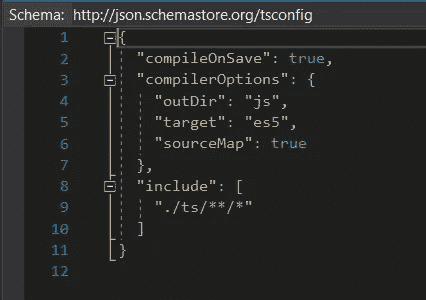
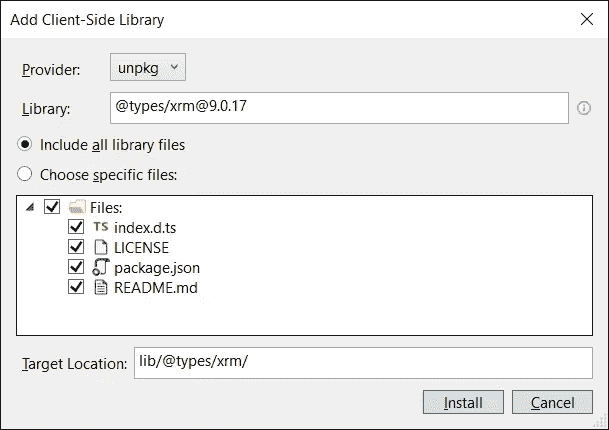
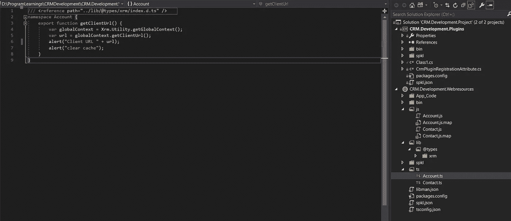
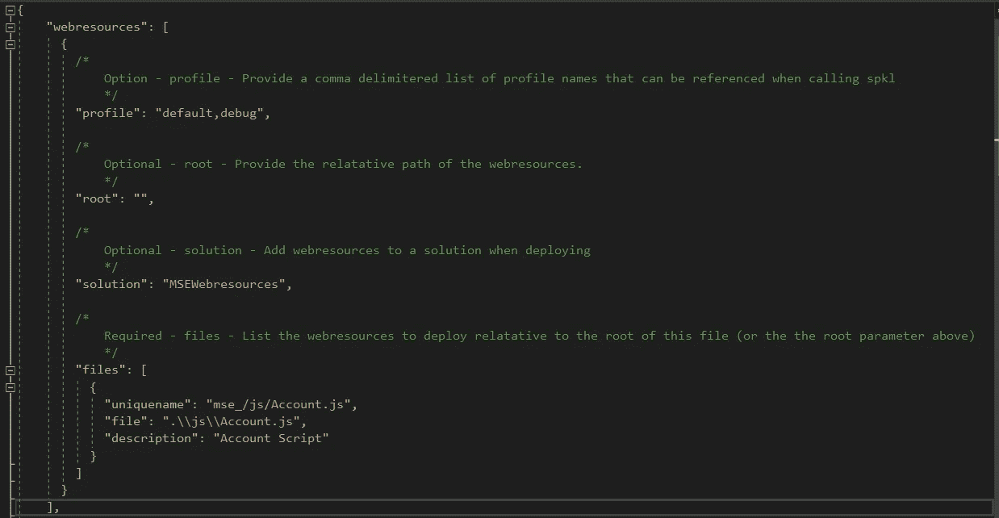
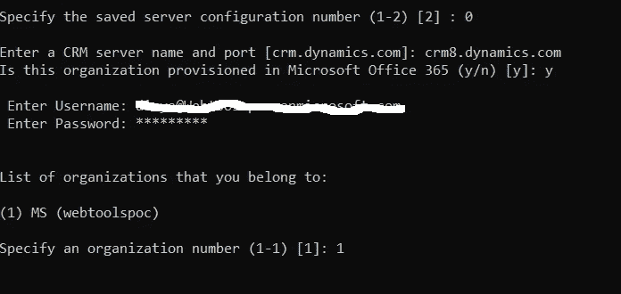
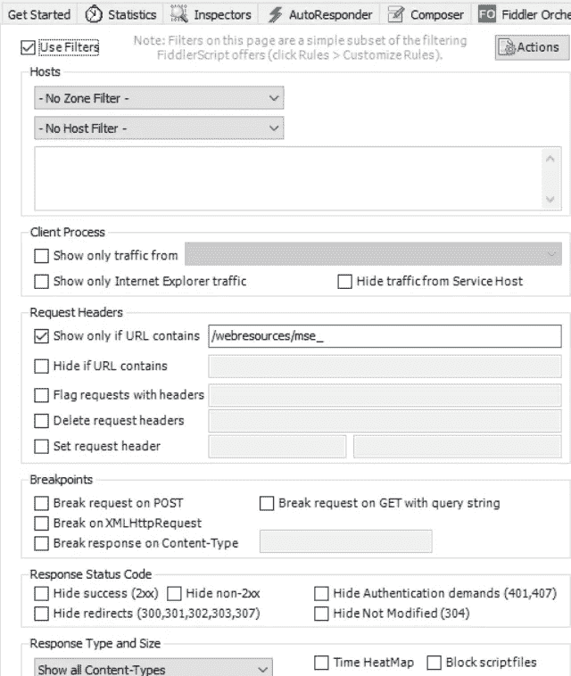
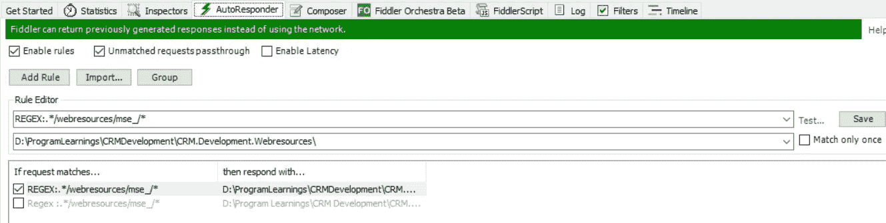
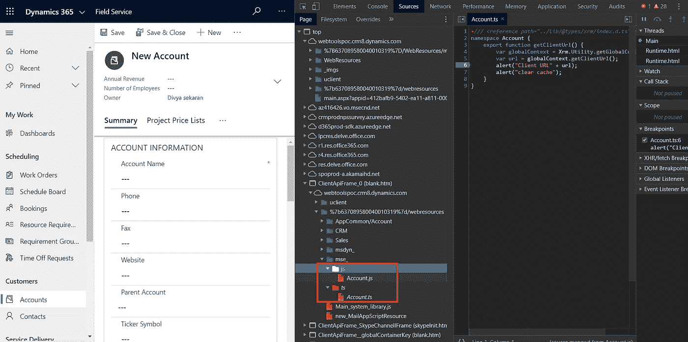
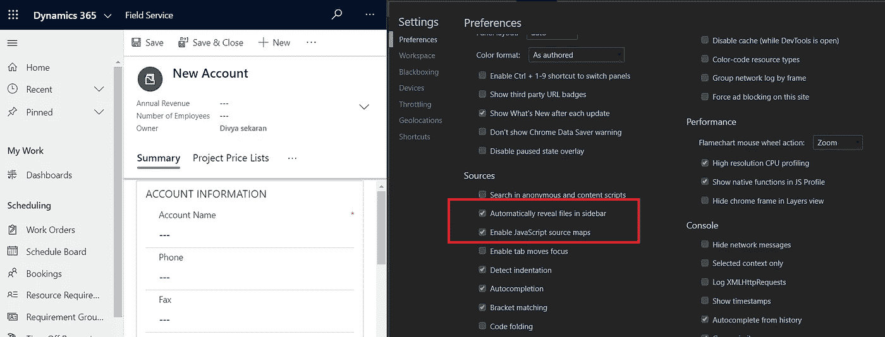

# CRM 365 的类型脚本开发

> 原文：<https://medium.com/analytics-vidhya/typescript-development-for-crm-365-48fbfb0b653d?source=collection_archive---------8----------------------->

TypeScript 是一种强类型、面向对象的编译语言。它是由微软的安德斯·海尔斯伯格(C#的设计者)设计的。TypeScript 既是一种语言，也是一套工具。TypeScript 是编译成 JavaScript 的 JavaScript 的类型化超集。换句话说，TypeScript 是 JavaScript 加上一些额外的特性。

# 为什么打字稿？

*   TypeScript 支持 JS 库和 API 文档
*   它是 Javascript 的超集。
*   它是可选类型的脚本语言
*   类型脚本代码可以转换成普通的 JavaScript 代码
*   更好的代码结构和面向对象的编程技术
*   允许更好的开发时间工具支持
*   它可以将语言扩展到标准 decorators、async/await 之外
*   编译时错误和智能感知可用

# 使用 Javascript 的痛点？

*   没有可用的静态类型。
*   有对面向对象编程的支持，但是需要巨大的努力才能在代码中显示出来
*   所有的类型错误都是在运行时发现的。

# 如何在 CRM 365 开发中利用 Typescript

有几种方法和途径可以在 CRM 中开始 typescript 开发，这是您可以实现的一种方法

*   用 typescript 文件创建本地文件夹
*   创建一个空的 VS 解决方案，点击“添加现有网站”并选择文件夹
*   单击为 ts 和 js 创建新文件夹
*   创建一个新文件 tsconfig.json 和如下所示的代码

tsconfig.json

*   从 https://nodejs.org/en/下载并安装 Node.js
*   通过将客户端库添加到网站项目来安装 npm 包@types/xrm 最新版本

XRM 包

*   创建一个新文件 Account.ts，该文件将引用 xrm 包并保存它，它将根据 tsconfig.json 中给出的编译器保存选项自动创建名为 Account.js.map 的 js 和源映射文件

Account.ts

*   使用 Nuget 包管理器安装 spkl 包
*   在 spkl.json 中复制粘贴下面的代码，如屏幕截图所示

spkl.json

右键单击 bat deploy-webresources.bat 并提供配置，它会自动将 web 资源上传到 CRM

# 使用 Fiddler 调试 CRM 中的 Typescript

我们不能在 CRM 中直接调试 typescript，因为我们不会将 ts 文件作为 web 资源添加到 CRM 中，调试传输的 js 文件会很困难**,但不要担心 CRM 和 Fiddler 已经提供了一个漂亮的选项，称为自动回复器，这将在这方面帮助我们。**

**每个 ts 文件都有一个源映射文件，它将被映射到 ts 文件本地。当您保存 ts 文件时，VS 会根据 tsconfig.json** 中的编译器选项自动创建这个 js.map 文件

js 和 ts 之间的映射文件

*   下载提琴手工具[https://www.telerik.com/download/fiddler](https://www.telerik.com/download/fiddler)
*   转到 Fiddler 并启用过滤器，转到过滤器选项卡，并在仅显示 URL 中给出/webresources/mse

过滤

Fiddler 将充当 CRM 和浏览器之间的代理，它将只过滤这些请求。

*   转到“自动回复”选项卡，并添加以下规则

自动回复规则

*   因此，每当它点击 webresources/mse_/ in URL 时，它将从本地文件夹中获取脚本，并为请求提供服务，就像这样，您可以在 chrome tools 中调试类型脚本，而无需将 web 资源上传到 CRM，这将最大限度地提高您的生产率，并且您可以在 CRM 中上传已完成并经过测试的脚本。
*   现在转到 CRM 并点击 f12，您将看到 js 以及要调试的 ts

# 调试 ts 的先决条件

*   在 Chrome 中，通过按 F1 启用设置中的以下选项，并启用高亮显示的选项。

Chrome 开发工具设置

*   并在本地文件夹路径中避免名称中出现空格

# 参考

*   [https://www . tutorialspoint . com/typescript/typescript _ overview . htm](https://www.tutorialspoint.com/typescript/typescript_overview.htm)
*   [https://www . geeks forgeeks . org/difference-between-typescript-and-JavaScript/](https://www.geeksforgeeks.org/difference-between-typescript-and-javascript/)
*   [https://docs . Microsoft . com/en-us/dynamics 365/customer engagement/on-premises/developer/streamline-JavaScript-development-fiddler-autoresponder](https://docs.microsoft.com/en-us/dynamics365/customerengagement/on-premises/developer/streamline-javascript-development-fiddler-autoresponder)
*   [https://github.com/scottdurow/SparkleXrm/wiki/spkl](https://github.com/scottdurow/SparkleXrm/wiki/spkl)