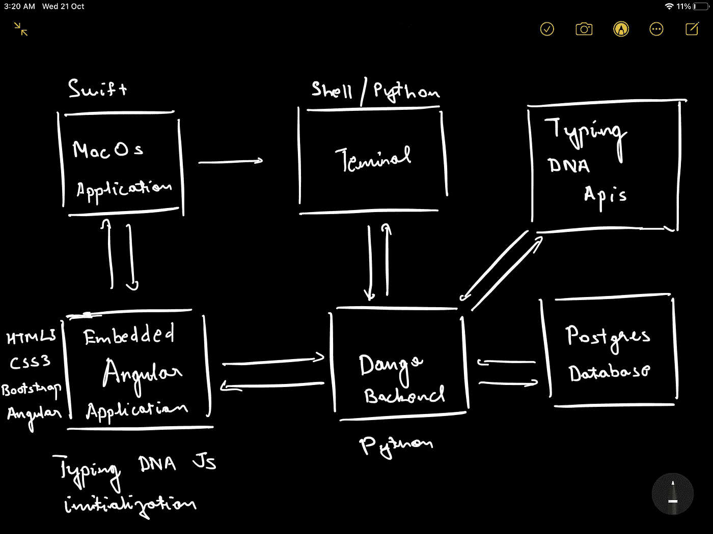

# 键入 DNA 命令行验证程序

> 原文：<https://medium.com/analytics-vidhya/typing-dna-command-line-authenticator-313837bdec73?source=collection_archive---------18----------------------->

该应用程序使用打字 DNA 认证服务，这是一种捕获用户打字模式的服务，用于认证用户想要运行的命令，如果通过验证，则允许用户执行这些命令。用户得到一个简单的弹出应用程序，他/她可以在其中添加/编辑需要针对用户的特定打字模式进行验证的命令。

# 演示:

# 该项目的灵感

所有开发人员在运行命令时都使用终端。和命令可以由任何用户运行，而无需验证它是由经过身份验证的特定用户还是由任何其他人显式运行的。如果任何人访问我的笔记本电脑或服务器，用户将能够运行该命令。

# 它的作用

该应用程序使用 DNA 认证服务来认证用户想要运行的命令，如果通过验证，则允许用户执行这些命令。用户得到一个简单的弹出应用程序，他/她可以在其中添加/编辑需要针对用户的特定打字模式进行验证的命令。

# 我是如何建造的

它有一个相互作用的 6 组件架构。swift 应用程序创建了一个易于使用的弹出窗口，其中包含一个用于 angular 的嵌入式应用程序。Angular 应用程序与 Django 后端交互，Django 后端存储并保存用户信息、命令信息、访问令牌，并与 DNA Apis 和 PostgresSQL 数据库交互。Swift 应用程序与终端交互，并同步系统中正在配置的命令。

# 我遇到的挑战

首先，我想到了使用 swift 应用程序的全局侦听器来获取所有的打字事件，并将其传递给 angular 应用程序，该应用程序具有打字 dna javascript 库，但是事件表单中的延迟在 javascript 库中创建了一个异常的打字模式。因此，我改变了一些位，让应用程序的工作，如在演示中看到的。

# 我引以为豪的成就

了解 DNA apis 的类型，因为这是一个有趣的项目。我在工程专业最后一年的时候听说过这个概念，但是看到一个产品在生产中工作并学习与之互动是很好的。我也很高兴能按时完成申请。我在 10 月 10 日知道了这个竞赛，想到了一个想法，但不确定是否能够完成它，因为我不知道 swift 开发，并且我在我的应用程序的开发生命周期中看到了许多漏洞。

# 我学到了什么

与 DNA 分型互动。
快速应用开发。一点 bash 脚本。swift 如何与 shell 脚本交互，反之亦然。

# 键入 DNA 命令行验证器的下一步是什么

通过对代码进行一些小的修改，这可以部署在服务器上，并作为 Mac 用户的适当应用程序。可以重用相同的 shell 脚本和后端来验证服务器上的命令请求。

# Github:

 [## anmolss 111/typing DNA-黑客马拉松-2020

### 键入 DNA 命令行验证器所有开发人员在运行命令时都使用终端。还有…

github.com](https://github.com/anmolss111/TypingDNA-Hackathon-2020)