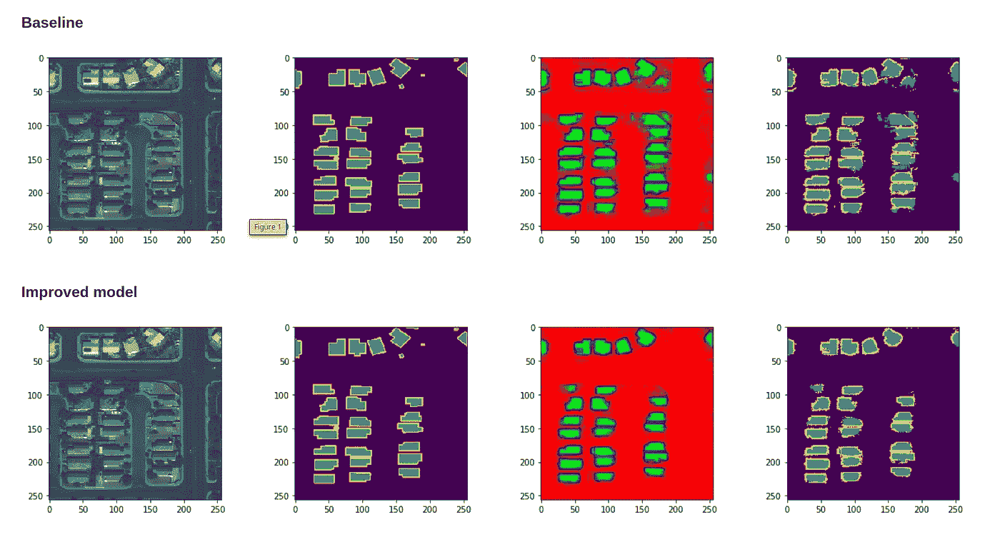
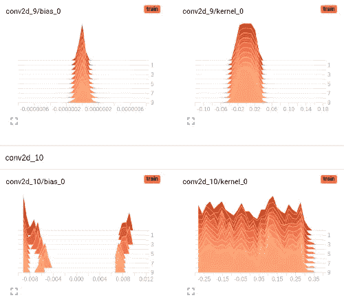
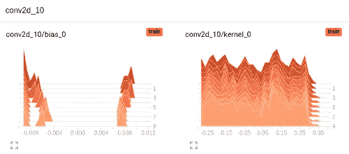
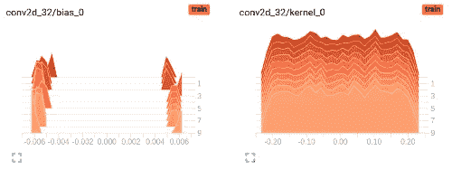
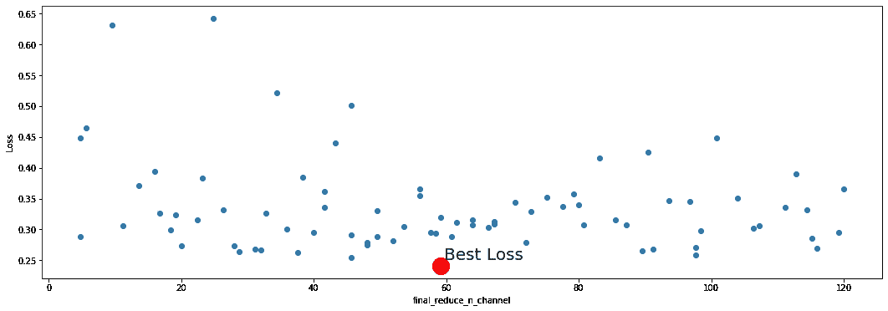

# 使用 TPE 超参数优化的 U-net 工程。

> 原文：<https://medium.com/analytics-vidhya/u-net-engineering-5a84ee193aaf?source=collection_archive---------11----------------------->

## 语义分割

# TLDR

CNN U-net 工程使用 Tensorflow Tensorboard 和 TPE 超参数优化。添加自定义层以增加 CNN 预测能力。所有代码都可以在这个小小的[项目](https://github.com/boggis30/SpaceNetUnet)中获得。

基准和改进模型在测试图像上的输出

# 动机

开发一个神经网络结构是一门艺术。有时它就像一个盲人摸象游戏。尽管对于相当多的问题已经有了许多先进的神经网络设计，但是每个问题都是独特的，并且没有理论预先提供指导，准确地说应该使用什么来实现最佳解决方案。在这篇文章中，我想分享我的想法和经验，用系统的方法解决这个问题。我试图利用两种方法:分析权重分布和超参数优化的 TPE 算法。在权重分析的基础上，我添加了一个自定义图层，以便在我认为缺乏概化能力的地方增加概化能力。我将这些方法应用到卫星影像的语义分割问题(建筑物足迹提取)中。

# 关心的领域

作为展示，我使用[太空网挑战拉斯维加斯的数据](https://github.com/SpaceNetChallenge/SpaceNetChallenge.github.io/blob/master/AOI_Lists/AOI_2_Vegas.md)。作为基线模型，我选择了 U-net，就像 CNN 在微软 Azure [的博客文章](https://azure.microsoft.com/en-us/blog/how-to-extract-building-footprints-from-satellite-images-using-deep-learning/)中提出的那样。我尝试对其设计进行更改，并在基线和改进架构的相同次数的学习迭代后比较验证集损失和视觉掩蔽。改进的体系结构有一些卷积滤波器作为附加定制层的超参数。这个超参数由树形结构的 Parzen 估计器(超点库)优化。

# 改进的 U 形网设计

## 权重分布分析

神经网络通常被认为是一个黑箱。然而，也有一些研究试图揭示 NNs 的内部结构。他们中的一些人试图发现参数分布和外推能力之间的关系(例如[https://arxiv.org/pdf/1504.08291.pdf](https://arxiv.org/pdf/1504.08291.pdf))。有一种观点认为，权重分布为高斯型分布的神经网络可能具有更好的性能。虽然这种说法没有得到严格的证明，但我的经验和直觉使我推测，权重分布形状平滑、看起来像高斯分布(或多或少)、逐代平缓变化的模型往往表现更好。让我们试着看看这如何应用于展示问题。

U-net CNN 架构

原始的 U-net 有三个过滤器的最终 conv 层。每个过滤器必须能够在最终特征图上区分目标类别。每个过滤器只有 65 个参数的容量，这可能是不够的。让我们看看不同层的过滤器权重是如何分布的。

幸运的是，有 Tensorflow tensorboard 工具可以让我们在神经网络黑盒学习时看到内部发生的事情。它就像黑暗房间里的手电筒。Tensorboard 有许多不错的功能。在这里，我们正在检查层权重直方图。下面是倒数第二个卷积层(conv2d_9)和最后一个卷积层(conv2d_10)的分布。

最后一个和倒数第二个分别有 195 和 2359808 个参数。根据上面做出的权重分布形状假设，可以假定最后一个没有足够的能力在当前数据集上很好地概括。让我们努力改善这一点。
分割模型试图将给定图像的每个像素分类为三类之一(背景/建筑物/建筑物边界)。因此，在最终的卷积运算中，只有 65 个参数对应于每个类别。改进的 U-net 增加了最终 conv 层中每个类的过滤器数量。
每个类别有三组过滤器。在激活之前，对应于
一类的过滤器在最终层中相加。让我们比较基线和改进模型的层权重分布。

基线:

改进型号:

可以推测，改良后的重量看起来没那么不堪一击，而且每一个时代都在发生变化。稍后我们将看到这是如何影响分割质量的。

# 超参数优化

改进模型中的自定义层可以具有不同数量的过滤器。我试图用树形结构的 Parzen 估计器( [hyperopt](https://github.com/hyperopt/hyperopt) 库)找到最佳数量的过滤器。这是一种贝叶斯优化方法，是不可微随机问题的合理选择。它用随机抽样的参数变量计算目标函数，并试图以一种非常巧妙的方式估计后验目标函数分布。关于算法背景的更多信息可以在本文中找到:[https://papers . nips . cc/paper/4443-algorithms-for-hyper-parameter-optimization . pdf](https://papers.nips.cc/paper/4443-algorithms-for-hyper-parameter-optimization.pdf)

在我的例子中，我估计了损失函数分布与自定义层中滤波器数量的关系。I 滤波器的型号为均匀(3，120)分布，基本上是均匀整数。三个过滤器相当于基线模型(每个类一个过滤器)。120 个过滤器(每个类 40 个过滤器)是 16G GPU 内存的上限。如果滤波器数量的增加并没有改善损失函数，它可能以接近 3 的估计值结束。我在这个项目中使用 Google Colab 作为免费的 GPU 运行时环境。我运行 100 次损失函数评估，这是受 Google GPU 时间限制的。谷歌将 GPU 时间限制在 4 小时，以避免像加密货币挖掘这样肆无忌惮的运行时使用。虽然我没有在文档中找到明确的时间限制，但我在经验上遇到了四个小时的限制。值得一提的是，hyperopt 可以选择在 MongoDB 中并行存储评估结果。因此，如果一个人需要更多的 GPU 时间，那么另一个免费的 GPU 运行时可以像 Kaggle 这样同时配对。如果对如何实现这一点感兴趣，我可以发布一个全面的指南，介绍如何只使用免费工具获得更多的 GPU 运行时间。如果你想了解更多，请在评论中告诉我。

下面是一个图，显示了远视运行以及各自的损耗和通道数之间的关系。

正如可以观察到的，最好的结果是用 57 个通道实现的，即每类 19 个通道。让我们看看它如何从测试集中寻找一个示例图像。

基准和改进模型在测试图像上的输出

# 结论

在这篇短文中，我展示了深度学习模型工程和进化的一种有意识的方式。非常感谢您对任何缺失或下一步改进的反馈和想法。