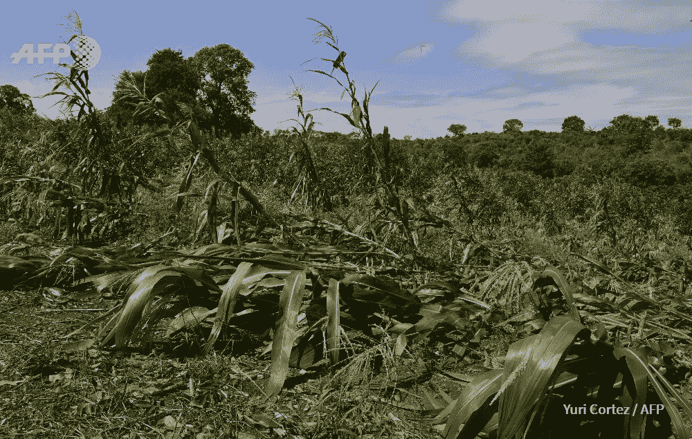
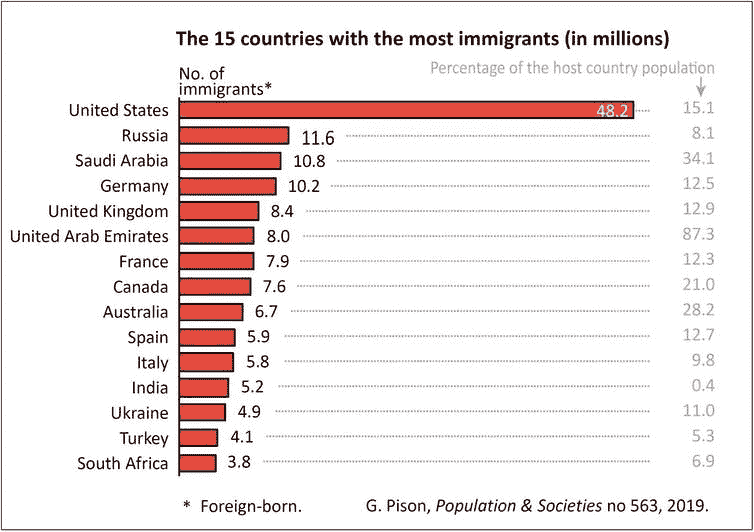
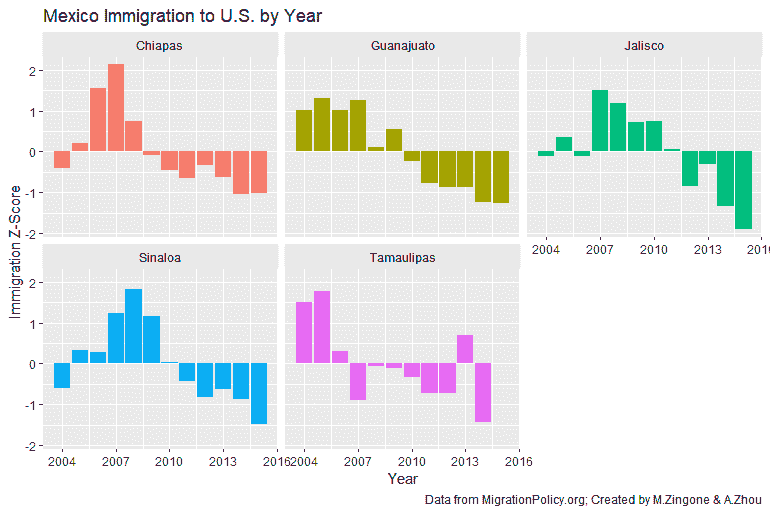
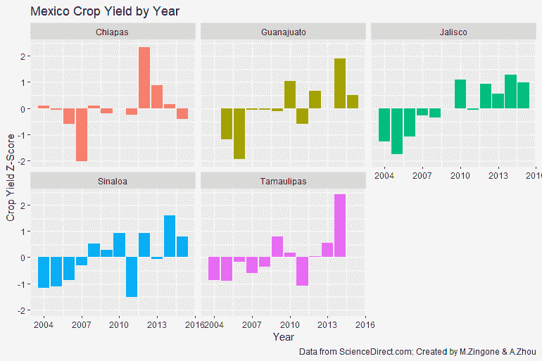
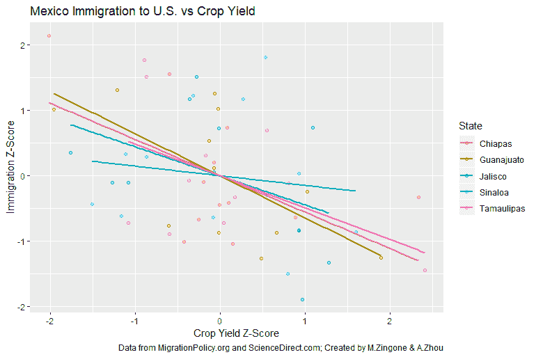
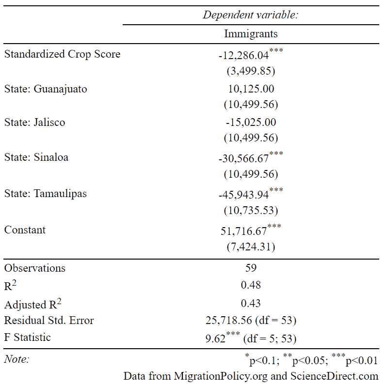

# 美墨移民很快将成为气候变化问题

> 原文：<https://medium.com/analytics-vidhya/u-s-mexico-immigration-will-soon-be-a-climate-change-issue-8be3dffb8a36?source=collection_archive---------15----------------------->

*图片:AFPMexico，2017 年 9 月*

*来自富裕国家的温室气体排放正在导致荒漠化，这使得热带地区的土地变得贫瘠，在某些情况下，完全不适合居住。*

**迈克尔·辛戈内和亚历克斯·周**

# 介绍

美国是世界上外国出生人口最多的国家。第二大移民国俄罗斯的移民人口比美国少近五倍，这让美国成为真正的国际移民特例。从历史上看，墨西哥一直是美国最大的移民输出国，占压倒性优势，全球超过 24%的墨西哥人口目前居住在美国(这包括目前居住在墨西哥的所有墨西哥裔人)。

*图片:Gilles Pison，根据联合国* [*数据*](https://www.un.org/en/development/desa/population/migration/data/index.asp)

为了理解为什么从墨西哥到美国的移民如此普遍，我们最好先考察一下美国的移民政策，该政策因将优惠待遇扩大到家庭关系而闻名。这一政策，加上历史上对家庭的定义特别宽松，导致了我们大量的移民人口，以及作为一个相对开放边境国家的全球恶名。1980 年至 2000 年间，美国的墨西哥裔人数激增了 450%，尽管我们的边境变得越来越军事化。

近年来，美国作为对移民最友好的国家之一的声誉受到了我国总统的密切关注。本质上，他认为经济价值应该优先于家庭关系——我们应该有选择地接纳医生、工程师和律师，而不是所谓的低技能工人进入 T21。

他的观点反映了美国国内更广泛的反移民情绪，这种情绪认为典型的拉美裔移民是非法居留，家庭人口多，受教育少。川普对墨西哥非法移民的担忧是有据可查的，他有时会将移民称为[罪犯、强奸犯和毒品走私犯/毒贩](https://www.washingtonpost.com/news/fact-checker/wp/2015/07/08/donald-trumps-false-comments-connecting-mexican-immigrants-and-crime/)，尽管[有强有力的](https://immigrationimpact.com/2016/04/29/donald-trump-immigration-crime-facts/) [证据](https://www.themarshallproject.org/2019/05/13/is-there-a-connection-between-undocumented-immigrants-and-crime) [反对](https://www.nytimes.com/2019/05/13/upshot/illegal-immigration-crime-rates-research.html)移民的犯罪率高于本土公民的观点。

不管你怎么说，仇外心理和不受约束的偏执正在渗入美国的外交政策决策——根据我们最近的选举结果，可以有把握地认为，他的观点引起了相当一部分美国选民的共鸣。

至关重要的是，我们最终要就移民问题达成一个令人满意的、公平的解决方案——不仅是为了目前居住在我们境内的 1110 万无证移民，也是为了他们的家人、朋友和其他受到他们不确定的身份和围绕这一身份的激烈、高度党派性辩论影响的人。

# 为什么要迁移？

出现了许多理论来解释为什么墨西哥和美国的边界是世界上最常跨越的国际边界。有各种各样的社会经济因素使得移民美国特别有吸引力。然而，在本文中，我们将考察一个规模虽小但稳步增长的研究机构，该机构揭示了一个令人惊讶的、经常被忽视的因素:气候变化。

这个论点实际上非常简单——如此简单，事实上，几乎令人惊讶的是，它没有得到更多的讨论:首先，我们知道气候变化已经明显改变了每年的天气模式，这些影响对于靠近热带的国家更加明显(尽管这些国家对这个问题的贡献最小)。我们也知道极端天气和上升的温度[会通过沙漠化和自然灾害降低农作物产量](https://www.nature.com/articles/ncomms6989)。凭直觉，我们还应该预测，这种农业生存能力的下降将导致农民在其他地方寻找工作，甚至可能跨越国际边界，并可能带着他们的家人一起走。

如果是真的，这种气候驱动迁移理论的影响是巨大的。首先，理解这一理论将在打击反移民情绪方面发挥很大作用，因为富裕国家[对导致气候变化的排放负有很大责任](https://www.theguardian.com/environment/2011/apr/21/countries-responsible-climate-change)，这将不成比例地影响资源较少的热带国家，使其无法首先应对极端天气；如果大量移民是其他内部问题的替罪羊，我们至少要负部分责任。

第二，这将表明人为的气候模式可能已经影响了全球运动，因为全球平均气温已经因人类活动而明显上升。第三，我们可以放心地将更多的人类流离失所加入未来全球变暖的可预测后果的不断增长的清单中。

# 分析和预测

我们的分析首先寻求深入了解作物产量和从墨西哥到美国的移民模式之间可能的相关性。我们在接下来的分析中使用的数据来自两个来源:一篇[MigrationPolicy.org 的文章](https://www.migrationpolicy.org/programs/data-hub/charts/origins-mexican-migrants-united-states-mexican-state-residence-number-and)提供了 2004 年至 2015 年墨西哥移民到美国的州级数据，以及 Ureta 等人的[研究论文](https://www.sciencedirect.com/science/article/pii/S0308521X18314045)详细介绍了同一时期墨西哥玉米作物的产量。

我们选择玉米作为感兴趣的作物有两个原因。首先，玉米是墨西哥最重要的作物，约占其耕地的 60%。第二，[一项关于温度上升对农作物产量影响的研究](https://www.pnas.org/content/114/35/9326)发现，在所有主要农作物中，玉米/玉蜀黍对温度最敏感。这些事实，加上墨西哥向美国移民的独特案例，使该国成为气候移民分析的一个特别有趣的目标。

我们首先通过可视化 2004 年至 2015 年的标准化移民和标准化作物产量来探索数据。下面两张图表展示了我们有数据的墨西哥五个主要州的时间序列趋势。

各州的具体趋势是惊人的。一般来说，每个州的移民高峰都与农作物产量的低谷相对应。换句话说，当收成不好时，人们似乎想退出。

顾名思义，作物产量是衡量土地效率的指标。它衡量的是给定土地面积上的作物产量。这一效率指标使我们能够在绝对农田面积发生变化的情况下比较不同时间的产量。这也让我们避免将移民只是减少整体农业劳动力与影响向外移民的环境作物效率之间的关系混为一谈。

为了进一步研究这种关系，我们绘制了标准化移民和标准化作物产量的对比图。下面的结果显示了一个明显的趋势:农作物产量越低，该特定年份的移民就越多。

最后，我们运行了一个简单的线性回归来预测基于农作物产量(标准化)的移民，在我们的模型中包括州作为虚拟变量。结果显示了作物产量和移民之间的统计显著关系，说明了各州具体的移民趋势。

根据上面的模型，我们看到，作物产量的 z 值每增加一个单位，我们可以预计从墨西哥到美国的移民平均减少约 12，000 人。相反，同样规模的作物产量下降将意味着大约 12000 多名*移民。标准化作物产量在 0.01 的显著性水平上是一个统计上显著的变量。虽然由于这项研究的局限性，我们无法确定地建立因果关系，但我们可以得出结论，有证据表明作物产量和移民模式之间有着密切的关系。*

# 最后的想法

如果我们利用之前确定的每增加一摄氏度玉米产量下降 7.4%的估计，我们将得出到 2025 年玉米产量下降约 6.66%至 16.28%，到 2050 年高达 29.6%(基于墨西哥变暖的当前[最佳估计](https://unfccc.int/resource/docs/natc/mexnc3e.pdf))。根据我们的模型，仅基于作物产量的下降，这些作物生存能力的下降每年就可能导致额外 5 万人流离失所。

当然，推断这一预测有许多局限性，但上述分析和[过去的研究](https://www.brookings.edu/research/the-climate-crisis-migration-and-refugees/)为墨西哥和全球与气候相关的流离失所描绘了一幅可怕的图景。然而，政府有许多方法可以帮助减轻我们预测的由气候变化引起的流离失所。

事实上，有证据表明墨西哥已经意识到这个问题，并正在寻找解决方案。墨西哥是唯一向《联合国气候变化框架公约》提交了三份国家来文的发展中国家，表现出对解决气候相关问题的强烈行政兴趣。

为了制定有效的计划，政府准确理解气候变化如何影响农作物产量至关重要。根据墨西哥[第三次国家信息通报](https://unfccc.int/resource/docs/natc/mexnc3e.pdf)，墨西哥预计将经历以下与农业相关的气象变化:

1.  **气温上升—** 到 2025 年，预计夏季气温上升幅度在 0.9 到 2.2 摄氏度之间，到 2050 年最高可达 4 摄氏度。这些温度上升将特别影响该国的中部和北部地区(作为参考，[赵等人](https://www.pnas.org/content/114/35/9326)发现，温度仅上升 1°C 就相当于墨西哥最重要的作物玉米产量平均下降 7.4%)。
2.  **降雨量减少—** 预计到 2025 年，墨西哥湾的降雨量将减少 5%左右，墨西哥中部的降雨量将减少 15%。到本世纪末，这些变化将导致到 21 世纪末可用于地下水补给和径流的水[减少 9.16%](https://www.researchgate.net/profile/M_Herrera-Pantoja/publication/281667677_Projected_impacts_of_climate_change_on_water_availability_indicators_in_a_semi-arid_region_of_central_Mexico/links/5a98b1acaca27214056d5bf0/Projected-impacts-of-climate-change-on-water-availability-indicators-in-a-semi-arid-region-of-central-Mexico.pdf) 。
3.  **更加频繁和严重的极端天气事件—** 严重的风暴和干旱在数量和强度上都将增加。到 2025 年，海水温度将上升 1 到 2 摄氏度，导致加勒比海、墨西哥湾和太平洋墨西哥部分的热带飓风越来越强，预计飓风中心 100 公里半径范围内的风力强度将增加 6%，降雨量将增加 16%。

墨西哥前总统费利佩·卡尔德龙说:“墨西哥特别容易受到气候变化的影响。”该国每年因荒漠化而失去 400 平方英里的土地，迫使大约 80，000 农民迁移。该国还面临着严重的洪水，特别是在塔巴斯科州，水供应减少，以及气候变化导致的飓风风险增加。

尽管墨西哥通过了立法(如 2012 年的移民法修正案)，简化了中美洲移民进入该国的程序，但美国一直在加大入境难度，驱逐更多非法移民，并加大努力在边境附近抓捕最近抵达的移民。2012 年，美国驱逐了创纪录的 40.9 万移民。

靠近极地的国家预计受气候变化的影响较小，应该开始准备迎接移民的涌入，这些移民是为了躲避极端天气、自然灾害和气候变化导致的作物歉收。特别是，美国[可能希望延长](http://box5213.temp.domains/~thealsbe/tps-u-s-immigration-law-and-the-incipient-language-of-climate-migration/)临时保护地位( [TPS](https://www.uscis.gov/humanitarian/temporary-protected-status) )的保护，以适用于与气候变化相关的影响，而不是自然灾害和武装冲突的狭窄范围。

人们有太多的理由迁移。在墨西哥人移民到美国的案例中，原因可能从政治紧张到经济衰退，或者如本分析所示，不同的作物产量。随着全球变暖在未来几十年影响墨西哥，农业可行性——或缺乏农业可行性——将继续成为普通墨西哥公民面临的一个更加紧迫的问题。气候变化肯定会以我们今天无法预测的更多方式影响后代。然而，有一件事是肯定的，那就是移民应该是我们讨论气候变化时的首要话题。