# 美国各州污染数据，可视化分析

> 原文：<https://medium.com/analytics-vidhya/u-s-pollution-data-by-state-a-visualization-analysis-part-1-44ec8f1f557f?source=collection_archive---------18----------------------->

我正在集中精力寻找各州的主要污染物，如果可能的话，寻找一种趋势。这个项目很重要，因为它有助于我们详细研究四种污染物中的每一种，并了解污染对每个州的影响。为了呈现数据，我的方法是结合图形和图表，包括饼图、条形图、地图和散点图。我的目标是更深入地挖掘污染的原因和影响，我们希望找到各州主要污染物的可能趋势。

由于我的数据集具有包含不同气体排放量的要素，因此我们可以创建条形图来查看哪一个州的每种气体排放量最高。我们可以使用饼图来查看各州的气体百分比。我们也可以用箱线图来表示所有的污染气体排放。因为我们有分类数据、状态，我们可以用条形图来表示这些特征。最后，我们可以做一个地图来看每个州不同的污染气体水平。

数据集:

我的数据《美国污染数据:2000 年以来美国的污染》可以在 Kaggle 找到。(https://www.kaggle.com/sogun3/uspollution)我们总共有 1746661 个条目和 29 个功能。

视觉化:

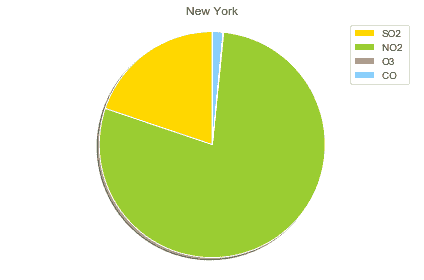

该图显示，在纽约市百分比最高的气体是二氧化氮。O3 的排放量非常低。在这个图表中看不到它。

**2000 年地块:**

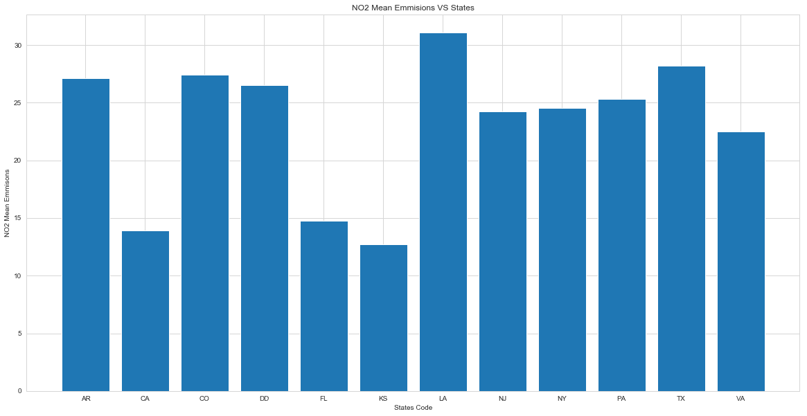

该图显示路易斯安那州在 2000 年期间有较高的 NO2 气体排放量。堪萨斯州在 2000 年的二氧化氮排放量较低。

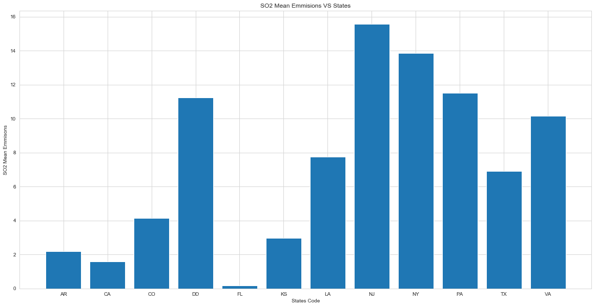

该图显示新泽西州在 2000 年有较高的 SO2 气体排放量。佛罗里达州在 2000 年的二氧化硫排放量较低。

该图显示，堪萨斯州在 2000 年期间的 O3 气体排放量较高。宾夕法尼亚州在 2000 年的臭氧排放量较低。

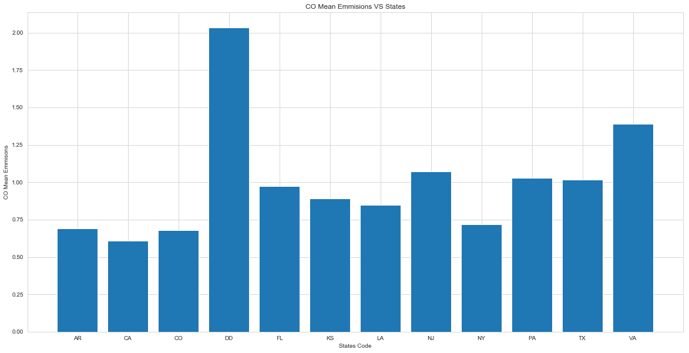

该图显示，哥伦比亚特区在 2000 年期间的一氧化碳排放量较高。加州其次是纽约在 2000 年的二氧化碳排放量较低。

**2016 年剧情:**

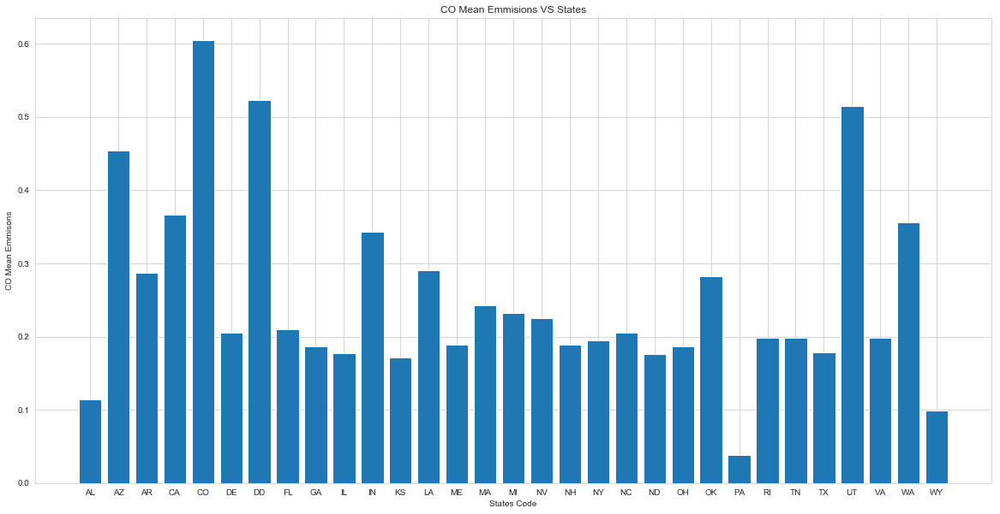

该图显示，科罗拉多州在 2016 年的 CO 气体排放量较高。宾夕法尼亚州 2016 年的二氧化碳排放量较低。

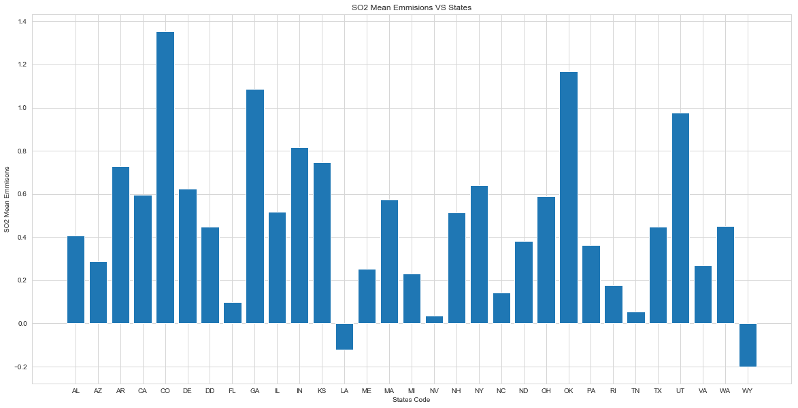

该图显示，科罗拉多州 2016 年的二氧化硫气体排放量较高。路易斯安那州和怀俄明州 2016 年的二氧化硫排放量较低。

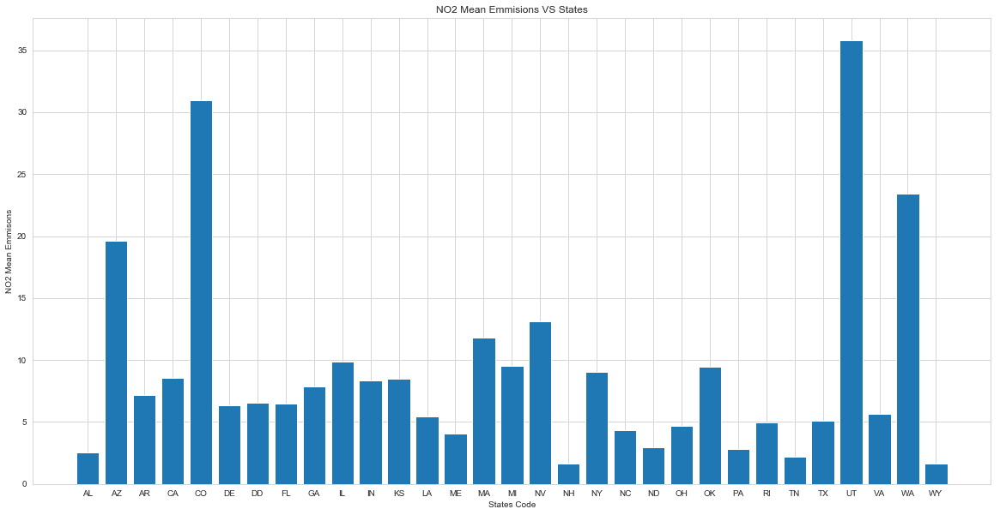

该图显示，犹他州在 2016 年期间的 NO2 气体排放量较高。新罕布什尔州在 2016 年期间的 NO2 排放量较低。

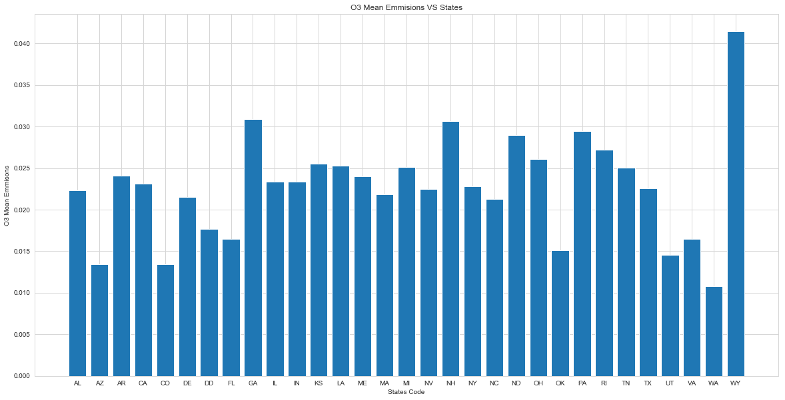

该图显示，怀俄明州在 2016 年的 O3 气体排放量更高。华盛顿在 2016 年期间的 O3 排放量较低。

**热点图:**

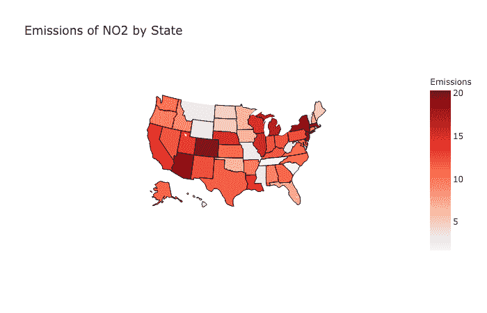

显示各州 NO2 排放量的地图。在纽约、新泽西、亚利桑那和科罗拉多发现了较高的 NO2 排放。

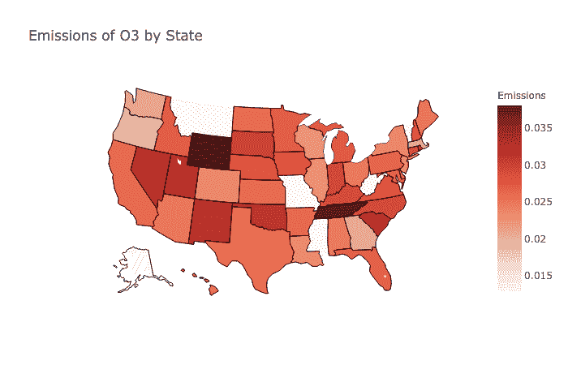

显示各州 O3 排放量的地图。怀俄明州和田纳西州的 O3 排放量更高。

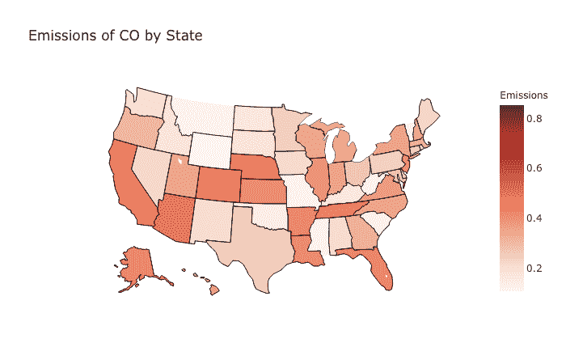

显示各州二氧化碳排放量的地图。佛罗里达州和亚利桑那州的一氧化碳排放量较高。

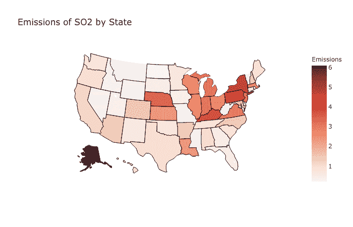

显示各州二氧化硫排放量的地图。二氧化硫排放量较高的是纽约。气体排放量的最小值可以在怀俄明州找到。

网址:([https://github.com/Cristinamulas/data_visualitation](https://github.com/Cristinamulas/data_visualitation))

八。讨论/限制

从数据中，我可以看到，在城市活动较多的州，气体排放水平较高。纽约州排放的二氧化氮和二氧化硫气体水平最高，我可以假设这是由于该州高度的城市活动和人口。佛罗里达州和亚利桑那州二氧化碳排放量最高，怀俄明州和田纳西州的臭氧排放量最高。为了更好地理解这些结果的原因并支持我的假设，我需要各州人口统计、城市和农村活动的数据。

九。结论和未来工作

通过这一分析，我有信心确定哪些州在不同年份的气体排放量较高。

在我未来的工作中，我可以整合城市和州的人口统计数据，包括人口和人口统计活动，以查看气体排放和上述因素之间是否存在潜在的相关性或因果关系。我还想添加更多的数据到其他国家，这样我就可以做我们的全球可视化。此外，我想做我的项目，包括美国所有的城市和县。