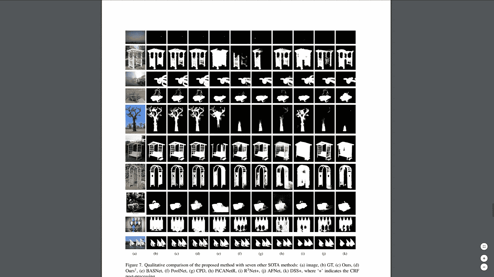

# U2-Net:使用嵌套 U-结构深入显著对象检测研究论文摘要

> 原文：<https://medium.com/analytics-vidhya/u2-net-going-deeper-with-nested-u-structure-for-salient-object-detection-research-paper-summary-e36911353b38?source=collection_archive---------4----------------------->

## 我们要前景！！！🔥 🔥

## 概述:-📑

1.  什么是显著物体检测？
2.  介绍
3.  使用的主要技术
4.  造纸技术
5.  体系结构
6.  关于培训
7.  结论

## 什么是显著物体检测？🎃

**显著物体检测(SOD)** 是一种基于任务的视觉注意机制，算法旨在探索场景或图像上比周围区域更注意的**物体**或区域。😃

## 简介:-📗

**SOD** 不是一个有趣的😕与**图像识别或图像分类**相比，受 DL 研究人员的影响，因此开发的神经网络更专注于图像识别和图像分类，而不是 SOD。迄今为止，神经网络是通过考虑图像分类或图像识别的问题而发展起来的。因此，他们面临的一个问题是，SOD 领域的研究人员因为使用图像分类或图像识别模型，如 **VGG、AlexNet、ResNet 等**而面临的问题是，这些网络过去常常采用额外的特征，并且**深度**，因此，与上下文信息相比，他们提取了许多精细的细节。

**使用的主要技术:-🔆**

在**多层次深度特征集成技术中，**我们获取图像的碎片并尝试提取上下文特征，另一种技术是**多尺度特征提取**，如下图所示

它放弃了使用小块来提取上下文特征的方法，而是使用金字塔方案，即😻

这也是用于俱乐部的两个对象，但这些技术更复杂一点，这将在文章中进一步解释。

## 纸的技术:-

本文中使用的技术是**多尺度特征提取**，它是从零开始实现的，不像以前使用的那样使用预训练的主干模型，如 VGG、AlexNet、ResNet 等。😲它是受 U-Net 的启发而建立的，一种新颖的网络剩余 U-block，RSU 捕捉级内多尺度特征。🔥

为了保留上下文信息而不是更多地关注细节，使用了上述架构，其中 U-block 提取了上下文特征。

所获得的特征被下采样，从而使得**上下文特征**被保留，并且最终，我们的结果不会受到所提取的图片细节(即颜色、纹理等)的影响。在特征被提取之后，它们在**上采样**之后被编码和解码🌝。该模型的计算也非常少(可以在图中观察到)，因为它关注于**下采样**特征。

## 建筑:-🌉

该模型的完整架构包含 6 个编码器、5 个解码器和 1 个包含 sigmoid 函数和 1 个 3*3 维卷积层的显著图融合模块。

## 关于培训:-🏃

用于训练的数据集是最大和最常用的训练数据集，即 DUTS-TR💯，为了进行评估，他们使用了 6 个常用数据集 DUTS 欧姆龙，DUTS-TE，HKU-IS，ECSSD，PASCAL-S，SOD。

使用以下方法测量精度:-
1。精确召回曲线
2。最大 F 值
3。平均绝对误差
4。加权 F 测量值
5。结构尺寸
6。边界的松弛 F-测度

## 结论:-💻

结果似乎非常令人满意，并且比图中所示的其他显著对象检测模型更加清晰，但是我注意到这个模型的一个不令人满意的地方是它失败了😿当画面移动时。我要感谢这篇研究论文的作者。这是[研究论文](https://arxiv.org/pdf/2005.09007v2.pdf)的链接。点击[链接](https://github.com/NathanUA/U-2-Net)可以找到代码。😍和往常一样，你可以在 LinkedIn 上找到我😻还有在 [Github](https://github.com/MaheepChaudhary) 上。❤️