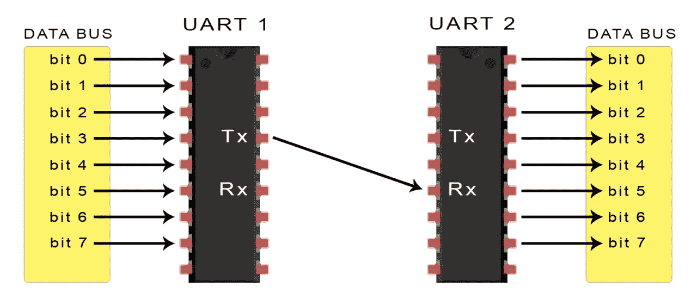
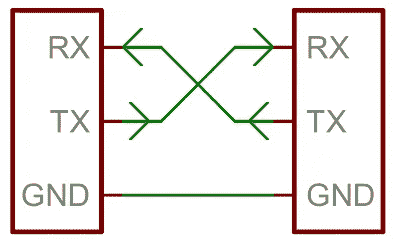
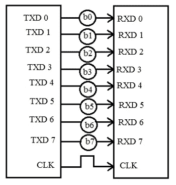
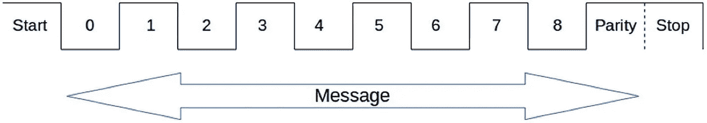

# UART 通信

> 原文：<https://medium.com/analytics-vidhya/uart-communication-4cef0840be2e?source=collection_archive---------12----------------------->

各位好，

我带来了另一个有趣的主题名称 **UART 通信**它是最受欢迎的通信接口之一，在物联网安全和渗透测试中具有重要意义。

## 那么我们先来了解一下什么是 UART，为什么要 UART？

组件交换数据有两种方式

1.  **串行通信**
2.  **并行通信**

**串行通信:-** 串行通信用于通过给定介质一次传输一位。

**串行通信**

**并行通信:-** 在并行通信中，数据块同时传输，每个位需要一个单独的通道(以及一条参考线，通常为地)。因为并行通信一次传输大量数据，所以这种方法需要几条单独的线路来促进通信。可以想象，这将导致电路板上需要更多的面积，而这通常不是首选。

**并行通信**

> **UART 是一种异步串行通信协议，用于许多嵌入式和物联网设备。异步只是意味着与同步协议不同，它没有同步用于两个设备之间进行通信的时钟。**

UART 的数据传输不需要额外的外部时钟线(CLK)。这也是在串行设备之间异步传输数据时采取许多其他预防措施以最大限度减少数据包丢失的原因。

# UART 数据包

UART 数据包由几个部分组成

1.  起始位
2.  消息
3.  奇偶校验位
4.  停止位

**UART 数据结构**

1.  **起始位:-** 起始位表示下一个是 UART 数据。这通常是一个低脉冲(0)，您可以在逻辑分析仪中查看。
2.  **消息:-** 要以 8 位格式传输的实际消息。例如，如果我必须传输值 A(十六进制的值 0x41 ),它将在消息中作为 0，1，0，0，0，0，0 和 1 传输。
3.  **奇偶校验位:-** 奇偶校验位在现实生活中并不那么重要，因为我还没有看到很多设备使用它。奇偶校验位用于通过计算消息中高值或低值的数量来执行错误和数据损坏检查，并根据它是奇数奇偶校验还是偶数奇偶校验来指示数据不正确。请记住，奇偶校验位仅用于数据损坏检查和验证，而不是实际的纠正。
4.  **停止位:-** 最后一位，表示报文已经传输完毕。这通常由高脉冲(1)完成，但也可以由多个高脉冲完成，具体取决于设备开发人员使用的配置。

> 在理解了 UART 数据结构的工作原理后，我们将了解 UART 端口，有时是基于硬件或基于软件的。为了给出一个很好的例子，我们将看看 Atmel 的微控制器 AT89S52 和 ATMEGA328，它们只有一个硬件串行端口。如果需要，用户可以在特定的通用输入/输出(GPIOs)上仿真更多的软件 UART 端口。

这就是我们希望你理解 UART 通信背后的概念的全部内容，欢迎在下面发表评论。我希望你今天学到了一些东西。

在下一个主题中，我们将讨论波特率和 UART 开发的连接。

谢谢你

过得愉快