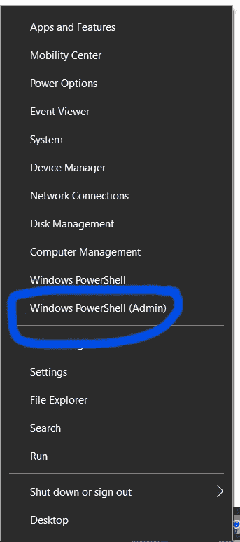
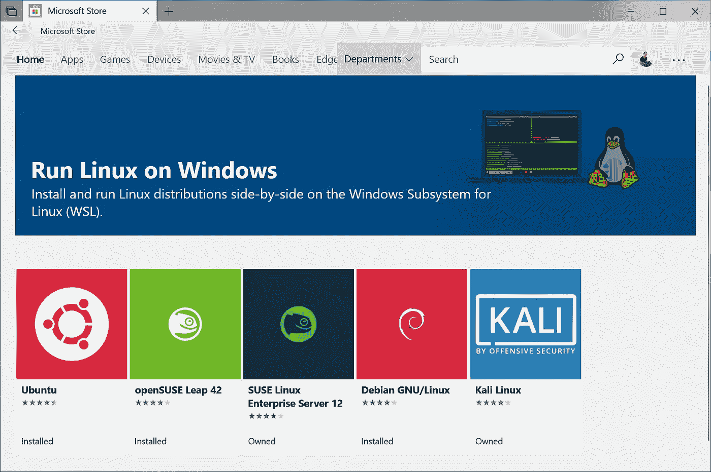
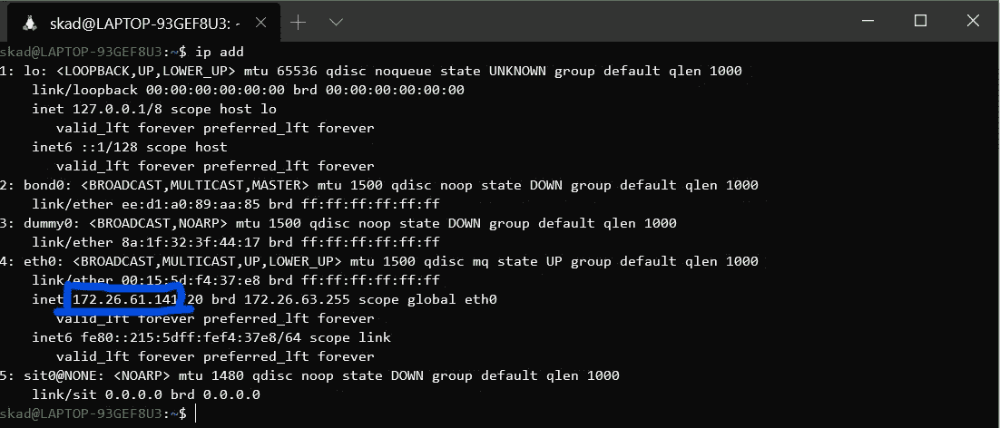
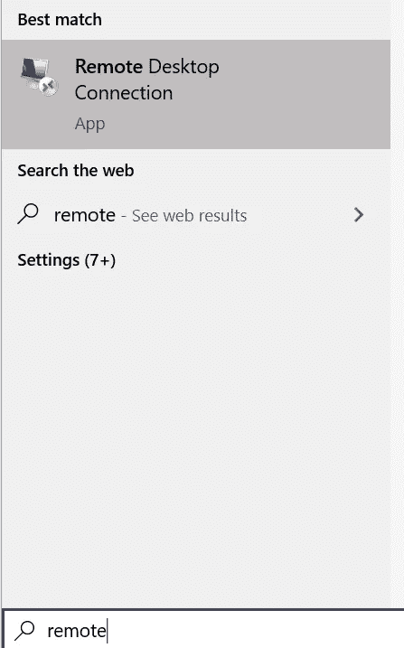
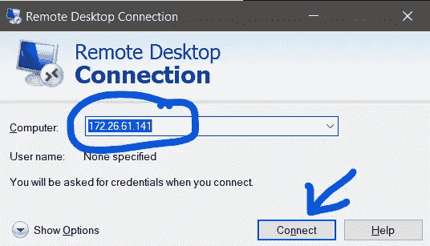
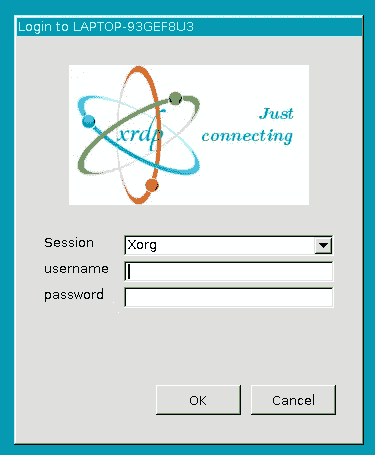
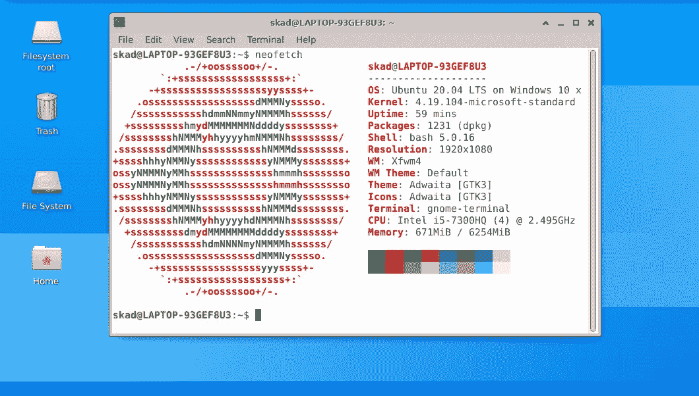

# 在 Windows 10 上使用 WSL2 的用户界面 Ubuntu。再见双靴！？

> 原文：<https://medium.com/analytics-vidhya/ubuntu-with-user-interface-on-windows-10-using-wsl2-goodbye-dual-boot-661a9b1de142?source=collection_archive---------4----------------------->

2013 年的夏天。我决定在装有 UEFI 和 Windows 10 的新笔记本电脑上安装 Ubuntu 13.04 LTS。安装非常顺利，我既不会操作 Ubuntu，也不会操作 Windows。好了，我找回了我的笔记本电脑，这个简短故事的寓意:**双引导在当时对像我这样的新人来说是一场灾难，现在他们中的大多数人仍然害怕。**(我再也不怕了，成就解锁！)

没必要再害怕了。Windows 10 20.04 build 将附带完整的 Linux 内核。您将能够在 Windows 中运行任何 Linux 发行版(那些可以在 Windows Store 上获得的发行版)。与虚拟机不同，它将在几秒钟内启动。

*那么让我们检查一下需求:*

1.  带有 2004 版本的 Windows 10(如果你的机器不是最新的，请检查更新)
2.  **一些命令**(解释如下)(微软提供)
3.  **良好的互联网连接**
4.  **耐心和好奇心**(可选)

让我们从命令开始。您必须以管理权限打开 PowerShell。

> 右键单击开始图标，然后单击 Windows PowerShell (Admin ),如图所示。



Windows PowerShell(管理)

现在依次输入如下命令，如下图所示:

1.  首先，我们需要启用 Windows Linux 子系统。

```
Enable-WindowsOptionalFeature -Online -FeatureName Microsoft-Windows-Subsystem-Linux
```

2.以下命令将启用虚拟机功能，这是必须的！

```
dism.exe /online /enable-feature /featurename:VirtualMachinePlatform /all /norestart
```

3.现在，双重启用 WSL 特性。

```
dism.exe /online /enable-feature /featurename:Microsoft-Windows-Subsystem-Linux /all /norestart
```

4.**重启电脑**

5.从 Microsoft Window 网站下载并安装最新的内核包(WSL2 ):

> [https://docs.microsoft.com/en-in/windows/wsl/wsl2-kernel](https://docs.microsoft.com/en-in/windows/wsl/wsl2-kernel)

***仅从微软网站*** 下载 WSL2 包

6.我们必须将 WSL2 设置为默认值。

```
wsl --set-default-version 2
```

> 如果你完成了以上步骤，你就可以很容易地在你的 Windows 机器上运行 Docker 了。事实上，你将能够运行任何需要 Linux 内核的东西。

7.从微软商店安装任何可用的发行版。对于本文，我将安装 Ubuntu。



来源:微软视窗网站

8.创建用户名和密码。你现在有一个正在运行的 Ubuntu CLI。是时候安装桌面管理器了。首先我们会更新数据库，用 apt 升级。

```
sudo apt update && sudo apt upgrade -y
```

9.为 Ubuntu 安装桌面环境 ***Xfce4*** 。这是一个耗时的过程(取决于你的网速)。所以去喝杯咖啡吧。坐好，放松一会儿！

```
sudo apt install xfce4 -y 
```

> Xfce 有很多替代品，比如 GNOME、KDE、Mate 等等。你可以谷歌一下，看看如何安装。变成了个人选择。Xfce 是轻量级的，易于使用。嗯，我已经帮你谷歌过了！

10.现在我们需要 Ubuntu 的远程桌面协议(RDP)。我们将安装 [XRDP](http://xrdp.org/) 一个开源 RDP。安装后，将启用 XRDP。

```
sudo apt install xrdp -y && sudo systemctl enable xrdp
```

> 坚持住！我们快到了！

11.我们会告诉 XRDP 使用 XFCE

```
echo xfce4-session >~/.xsession && sudo service xrdp restart
```

11.现在我们需要 Ubuntu type `ip add`的 IP 地址才能找到。复制 IP 地址。我的情况是 *172.26.61.141。*



在我的例子中，IP 地址是 172.26.61.141

12.在 Windows 中打开远程桌面连接。



远程桌面连接

13.输入你复制的 Ubuntu 的 IP 地址，按连接。



输入 IP 地址，然后按连接

14.一旦连接建立，你将被要求输入用户名和密码 **Ubuntu(不是 Windows)。**



15.好了，你现在完成了。迎接你的将是一个完全运行的桌面环境。



耐心得到了回报！

> 因此，对于大多数常见的应用程序，不需要双重引导。只要使用 WSL2，你就可以了。但是超级用户，你必须双启动你的电脑！