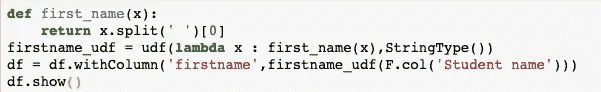

# Pyspark 中的 UDF

> 原文：<https://medium.com/analytics-vidhya/udfs-in-pyspark-270bc7890786?source=collection_archive---------13----------------------->

Pyspark sql 库本身提供了多种应用于数据框的函数，但是我们可以在任何特殊需求的情况下定义自己的函数。这些被称为 UDF 或用户定义函数。我们将深入探讨在 pyspark 数据帧及其不同格式中应用 UDF。

**不同格式**

1.  **自定义项()**

这被认为是在 pyspark 上定义 UDF 最容易理解的方式。我们将采用学生姓名和分数的示例数据集，并在其上测试我们的功能。数据看起来像这样

假设我们想要提取所有学生的名字，这可以通过 udf 来完成，如下所示

结果是

其工作原理是，我们定义一个 python 函数，并将其传递给 pyspark 的 udf()函数。

这是一种编写 udf 的混乱方式，尽管对于可解释性来说很好，但是当涉及到以这种格式编写代码的可维护性时，你有两个函数来管理 python 函数和 pyspark udf。

**2。@udf decorator**

对于上面的例子，定义 udf 的一种更干净的方式是通过 UDF 装饰器，如下所示

这里您只需要定义一个函数和返回数据类型，但是如果您想将同一个函数用作 python 函数和 pyspark udf 呢？例如，假设我想先在一个较小的数据集上测试我的函数，然后在 pyspark 数据帧上使用它。

其中一种方法是注释掉@udf decorator，这样函数就又变成了一个普通的 python 函数。

**3。@ py_or_udf**

为了能够使用与 python 和 pyspark udf 相同的函数，我们可以定义一个新的 decorator @py_or_udf，如下所示

这是定义 pyspark udfs 的最干净的方法，因为它可以在部署和实验时有效地使用。

**应用 pyspark udfs 行**

为了理解这一点，我们将举一个简单的例子，假设我们想要根据分数标准来标记学生在某一科目上是通过还是失败

如果科目是数学，分数超过 50 分，那么通过，

其他科目分数> 40 则及格

正如你所看到的，上面的问题涉及到要解决的 2 行数据帧，“考试名称”和“考试点”，将有一定的语法变化，以应用自定义项

从上面的例子中你可以看到，我们可以将 dataframe 作为一个结构来传递，并在其上应用 udf。

**对聚合数据应用 UDF(udaf):**

Pyspark 不直接支持用户定义的聚合函数，但是有一种方法可以在 pyspark 中使用来实现它们。

我们可以做的是在一个组中使用 F.collect_list()或 F.collect_set()函数来分别收集列表或集合中的数据，并在列表顶部应用我们的 udf。

我们将以一个简单的问题为例，找出每个科目的平均分数，看看如何使用 udf 来实现，尽管已经有一些方法可以不用 UDF 来实现，但这只是一个简单的例子！

collect_list 语句返回一个带有单列标记列表的数据帧

获得 get_avg_marks()后，将 udf 应用于数据帧，以获得每个科目的平均分数。

**结论**

在 pyspark 数据帧上使用 pandas udfs 时，有一些更高级的主题可以派上用场，这本身就是一个详细的主题，需要单独的文章。

我正在撰写一系列文章来帮助理解数据科学和工程最基本的方面，即数据转换。如果您想了解 pyspark 中的 windows 函数，请参考下面列出的文章。

谢谢！！

 [## pyspark 中的窗口函数介绍及实例

### 作为数据科学家/数据工程师，大数据转型是一个非常重要的方面。Spark 框架是…

medium.com](/analytics-vidhya/intro-to-window-function-in-pyspark-with-examples-3a839b6e1cac)