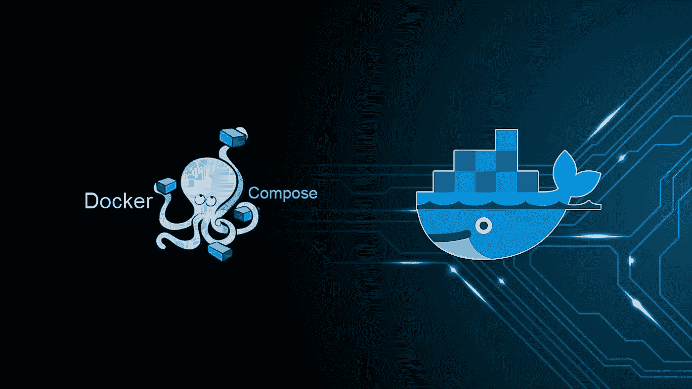
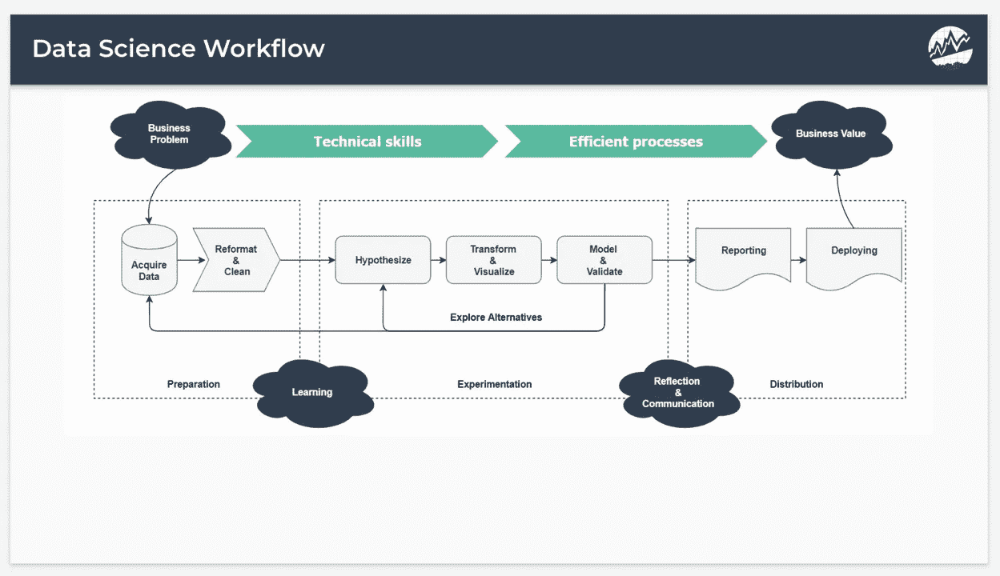
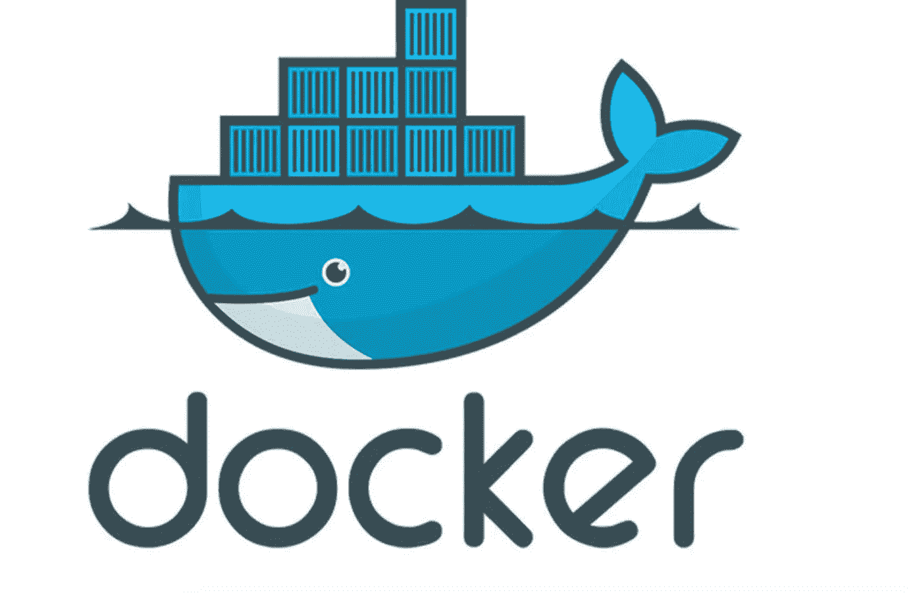
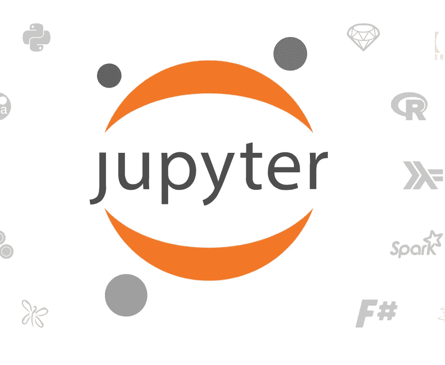
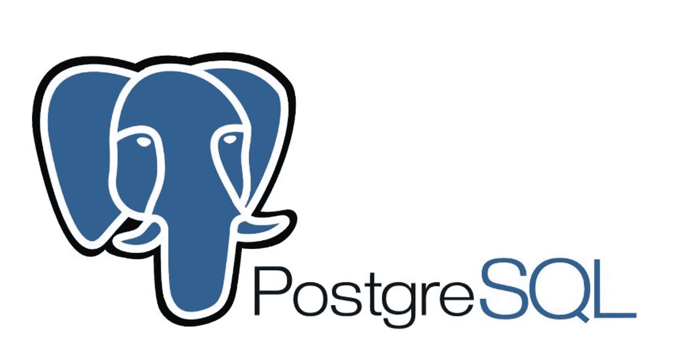
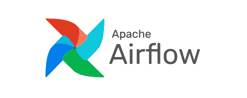
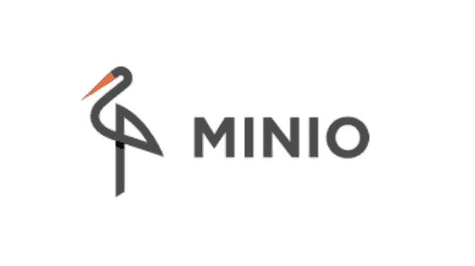

# 终极数据科学工作流-使用 Docker

> 原文：<https://medium.com/analytics-vidhya/ultimate-data-science-workflow-with-docker-f94791740568?source=collection_archive---------19----------------------->

照片:wallpaperaccess.com/docker

## 集装箱化您的工作流程

> “简单是最复杂的”——莱昂纳多·达芬奇

> 本文旨在将所有必要的数据科学技术编译到一个堆栈中，并在 docker 的帮助下统一部署它们。

**目录:**

1.  阶段 1:介绍 Docker 和工作流程
2.  第二阶段:使用的技术
3.  阶段 3 : Docker 编写代码

# 我所说的“工作流”是什么意思？

图片提供:马特·丹乔(LinkedIn)

工作流指的是在一个大项目中执行的所有过程和子过程。在数据科学中，此工作流指的是数据清理、EDA、模型开发和部署的组合。

# 为什么是 Docker？

供图:docker.com

简单地说，Docker 是一个集装箱化软件，它帮助将软件打包成标准化的单元，以便开发、运输和部署。

如今的开发需要的不仅仅是写代码。多种语言、框架、架构以及它们之间的接口很快变得复杂。Docker 简化了这个工作流程，同时让开发人员可以自由地为每个项目选择工具、应用程序堆栈和部署环境。

**该数据科学堆栈中使用的技术**:

> 下面列出的所有技术都被选中，因为它们是开源和免费的。

1.  [气流](https://airflow.apache.org)
2.  Jupyter
3.  [PostgreSQL](https://www.postgresql.org)
4.  [MinIO](https://min.io)
5.  [超集](https://superset.incubator.apache.org)

和一些支持技术。

# 什么，为什么，什么时候。

## 朱皮特

供图:Jupyter.org

什么东西？

Jupyter 为开发人员提供笔记本作为开源 web 应用程序，允许创建和共享包含实时代码、公式和叙述性文本的文档。

**为什么:**

Jupyter 项目得到了数百万开发人员的支持，是几乎所有数据科学家的 goto 软件，也是行业规范。

**何时:**

所有数据科学项目都是从导入、检查和操作数据开始的。Jupyter 通过提供一个数据清理、转换和可视化的接口在这方面提供了帮助。

## 一种数据库系统

供图:postgresql.org

**什么:**

PostgreSQL 是一个开源的对象关系数据库系统，它使用 SQL 语言来存储和扩展最复杂的数据工作负载

**为什么:**

PostgreSQL 附带了许多功能，可以帮助开发人员构建应用程序，保护数据完整性并构建容错环境。而且它是免费和开源的。

**何时:**

在操作、清理和可视化数据集之后，所有这些工作都需要存储在某个地方，这就是 postgres 的用武之地，它与 Python 和 web 应用程序接口 PGAdmin 的流畅集成消除了存储和管理数据集的所有复杂性。

## 阿帕奇气流

供图:airflow.apache.org

**什么:**

Airflow 是一个帮助开发人员安排、监控和管理工作流的平台。

**为什么:**

气流有一个模块化的架构，它的管道可以被配置为 Python 代码，它是可扩展的，即允许创建自定义操作符和执行器。

**何时:**

团队倾向于单独处理子任务，这导致对自动化和监控的需求增加，这就是 Airflow 通过提供管理工具来保持工作流平稳运行的地方。

## 米尼奥

供图:min.io

**什么:**

MinIO 是用于
机器学习和分析的高性能、软件定义的对象存储套件。它关注 Web 扩展模型，同时牢记用户需求。

**为什么:**

MinIO 是开源的。这意味着 MinIO 的客户可以自由锁定、自由检查、自由创新、自由修改和自由再分配。MinIO 还与 AmazonS3 流畅兼容，这使它成为最好的云原生解决方案。

**何时:**

当建立机器学习模型时，有必要不时地存储、重新开发和改进模型。这就是 MinIO 的用武之地，它为开发者提供了一个平台和极简界面来保存和实验他们的模型。

## Apache 超集

供图:superset.incubator.apache.org

什么东西？

Apache Superset 是一个现代化的企业级商业智能 web 应用程序，它为团队提供了向客户展示其见解的必要工具。

**为什么:**

Superset 为用户提供了丰富多样的可视化工具、仪表盘和企业就绪认证。它是开源的、免费的，并允许在 SQLAlchemy 的帮助下与 SQL RDBMS 集成。

**何时:**

在清理数据和开发模型后，需要借助 Superset 的可视化和语义分层向客户展示见解，用户可以轻松满足这些需求。

# 码头工人来救援了！

虽然所有这些工具本身都很棒，但我们需要一种方法让它们在一个平台上协同工作。

这就是 docker 的用武之地。通过为这些工具创建容器，并让它们无缝地相互通信，我们可以创建最终的数据科学工作流。

以下是这一切是如何实现的一瞥:

要开始使用自己的工作流容器，请访问 my [GitHub](https://github.com/ArsalanSahab/Docker_Data_Science_Stack) 获取详细的代码和说明。