# 甘斯的终极之旅

> 原文：<https://medium.com/analytics-vidhya/ultimate-journey-of-gans-7e5df53b01b?source=collection_archive---------2----------------------->

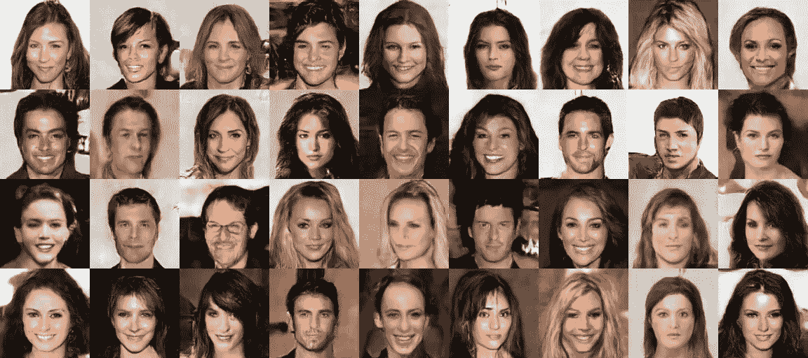

> “我不能创造的，我不理解。”
> 
> —理查德·费曼

*嘿，科技极客们！*

*甘是由伊恩·戈德费勒和伊恩·古德费勒以及蒙特利尔大学的其他研究人员，包括约舒阿·本吉奥在 2014 年介绍的。许多其他研究人员都提到了甘斯，脸书的人工智能研究主任 Yann LeCun 称对抗性是“过去 10 年中最有趣的想法”甘的被认为是创造性的神经网络，更像是画一幅画或创作一首新歌。生成对抗网络由两个神经网络结构组成，它们相互竞争以产生更好的输出。GAN 由于其学习数据分布和随后模拟数据的巨大潜力而越来越受欢迎。*

*在这篇博客中，我将对 GAN 及其类型进行介绍，但我们会看到，对抗性训练是一个启发性的想法，因其简单而美丽，它代表了机器学习的真正概念进步，尤其是对自然生成的模型而言。*

让我们开始吧！

> **生成模型**

*根据维基百科*

> “一个**生成模型**是一个给定目标 *y* 的可观察对象 *X* 的条件概率模型，象征性地，{P(X|Y=y)}”

无论其定义如何，生成模型都围绕着生成独立变量和因变量的随机实例或给定因变量 Y 的独立变量 x 的观察值。在硬币的另一面，我们有一个**判别模型或判别分类器**(没有模型)可用于“判别”给定观察值 *x* 的目标变量 *Y* 的值。

为了训练生成模型，我们首先收集某个领域的大量数据(例如，想象数百万的图像、句子或声音等。)然后训练一个模型生成类似的数据。基本上，神经网络我们用比参数数量更少的数据来训练模型，因此模型被迫在内部生成数据。所有类型的生成模型的主要目标是学习训练数据的分布，以生成具有一些变化的新数据点。*神经网络基本上模仿数据点的真实分布来模拟分布*。

生成模型的例子正是朴素贝叶斯算法，它通过总结每个输入变量和输出类的概率分布来工作。为了进行预测，每个可能结果的概率都是用每个变量计算出来的，因此，独立的概率被组合起来，预测出一个最有可能的结果。当我们对这个过程进行逆向工程时，我们得到了每个变量的概率分布，可以对其进行采样以生成新的特征值。

> **生成敌对网络**

以甘为例，这些都是基于深度学习的生成模型。换句话说，甘的研究围绕着一种叫做深度卷积网络的标准化方法，这种方法是由[亚历克·](https://github.com/Newmu)等人在白皮书“[使用深度卷积生成对抗网络进行无监督表示学习](https://arxiv.org/abs/1511.06434)”中形式化的。

让我们以一个例子开始 GAN 的终极之旅——我们有一组图像作为输入，并基于它们生成样本作为输出。因此，在这个例子中，你需要理解 GAN 的方法属于无监督学习的范畴，我们将在没有任何标签或目标变量的情况下提供模型。GAN 背后的理念简单明了:

*GAN 基本上包含两个在零和博弈框架下相互竞争的神经网络，即生成器和鉴别器。*

谈到架构，它有两个子模型，即**生成器**，即生成图像；以及**鉴别器**，用于对生成器模型生成的图像进行真假分类。让我们深入了解更详细的解释

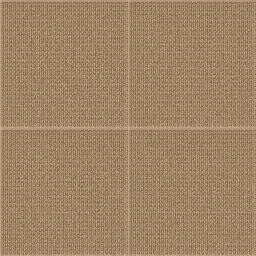

***生成器***

*   生成器基本上采用固定长度的随机输入向量，并在固定长度向量的上下文中生成随机样本。
*   然而，把它放在一个不同的方式生成器的目的是欺骗鉴别器，以为它看到的是真实的图像，而实际上看到的是赝品。我们可以认为发电机是赝品。
*   从技术上讲，基本上样本是从高斯分布中随机抽取的，样本用于生成过程的种子。
*   在训练过程之后，向量样本将落入强调数据的压缩分布的问题域中。

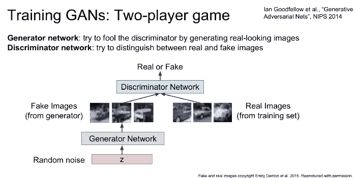

来源:[http://cs 231n . Stanford . edu/slides/2017/cs 231n _ 2017 _ lecture 13 . pdf](http://cs231n.stanford.edu/slides/2017/cs231n_2017_lecture13.pdf))

***鉴别器***

*   由生成器生成的例子是真的还是假的，因为分类是鉴别器的目标。然而，真实的例子来自训练集，并且生成的样本是鉴别器模型的输出。
*   如果你认为 discriminator 的行为像一个正常的分类模型，用于区分真实和虚假的图像，那么你是对的！。
*   鉴别器从输入数据集中提取真实图像，从生成器中提取虚假图像，并输出一个判断，判断给定图像是否合法
*   在训练过程之后，鉴别器模型被丢弃，因为我们对生成器感兴趣。大多数案例鉴别器模型被设计为从问题领域的示例中提取特征。

***甘背后的机制***

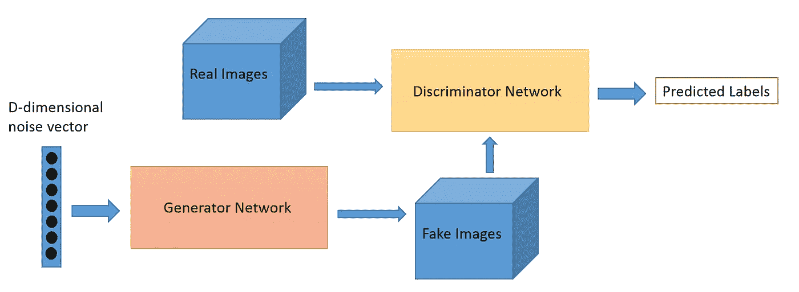

甘的基本机制围绕着**最小最大表示**两个网络相互竞争，以提高自己将随机噪声转换为逼真的图像。

**我们必须有足够的信心来分辨一个图像是来自原始数据集还是来自假数据集。为了实现这一点，我们可以相应地标记图像，并执行经典的 [**反向传播**](https://en.wikipedia.org/wiki/Backpropagation) ，允许鉴别器随着时间的推移进行学习，从而更好地区分图像。如果鉴别器做了正确的分类，那么我们就有了损失梯度形式的正反馈，在失败的情况下负反馈得到了回报！**

***发生器*** 基本输入随机噪声，欺骗鉴别器，使其相信图像是真的还是假的。所以这个信息可以被 [**再**](https://en.wikipedia.org/wiki/Backpropagation) 反向传播。如果鉴别器识别出发电机的输出是真实的，这意味着发电机执行得很好，应该得到奖励。另一方面，如果鉴别者意识到它得到了一个假的图像，那么应该用负反馈指出它。

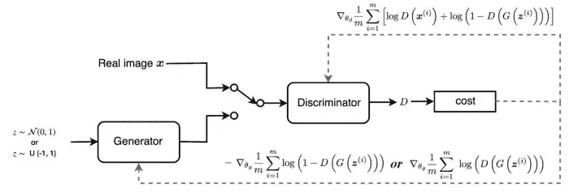

(来源:[https://medium . com/@ Jonathan _ hui/gan-whats-generative-adversarial-networks-and-its-application-f 39 ed 278 ef 09](/@jonathan_hui/gan-whats-generative-adversarial-networks-and-its-application-f39ed278ef09))

*因为我想让这篇文章更全面，所以要了解甘背后的数学，请参考这个* [***链接***](/@jonathan_hui/gan-whats-generative-adversarial-networks-and-its-application-f39ed278ef09) ***。***

> **以下是对一些流行甘**的逐点讲解

> ***深度卷积生成式逆向网络***

*   深度学习神经架构能够生成模拟训练集上可用数据模式的输出。
*   生成对抗网络与 DCGAN 的主要区别在于，DCGAN 用卷积层代替了生成对抗网络模型的全连接层。
*   让我们从一个真实世界的例子开始，伪造者(又名“生成器”)试图制作假画并作为真实图像传递。

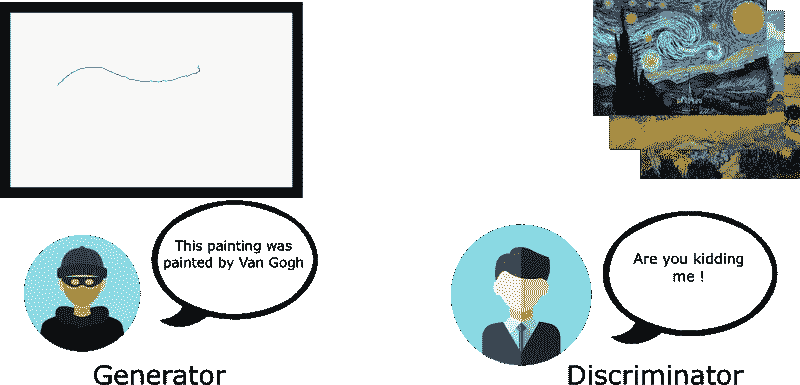

来源:[https://www . freecodecamp . org/news/how-ai-can-learn-to-generate-pictures-of-cats-ba 692 CB 6 EAE 4/](https://www.freecodecamp.org/news/how-ai-can-learn-to-generate-pictures-of-cats-ba692cb6eae4/)

*   在硬币的另一面，鉴别者实际上试图利用他们对真画的知识来抓住伪造者。随着训练的进行，伪造者伪造真实照片的技术越来越好。

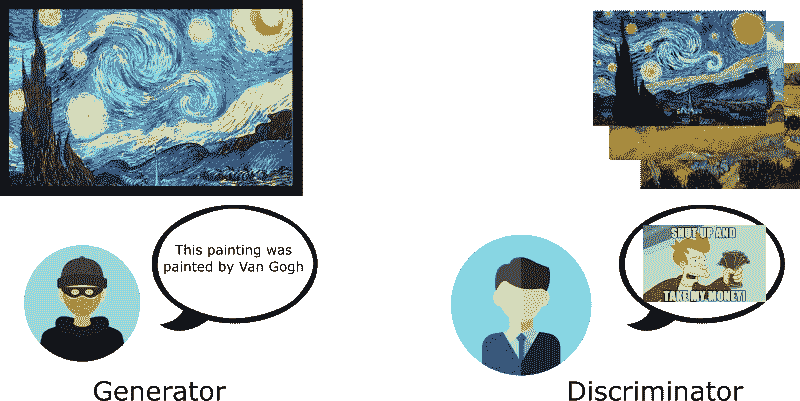

来源:[https://www . freecodecamp . org/news/how-ai-can-learn-to-generate-pictures-of-cats-ba 692 CB 6 EAE 4/](https://www.freecodecamp.org/news/how-ai-can-learn-to-generate-pictures-of-cats-ba692cb6eae4/)

*   然而，发生器具有随机噪声矢量，并产生图像。生成的图像进入鉴别器，鉴别器在训练集和实际图像之间进行比较
*   鉴别器返回一个介于 0(伪图像)和 1(真实图像)之间的数字，这只是一个典型的分类。

***描述者的故事***

*注意事项*

*   对于 DCGAN 中的鉴别器，要记住，它将真实或虚假图像作为输入，并输出分数。

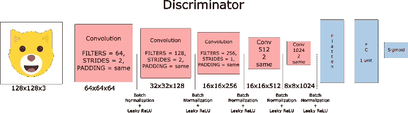

来源:[https://www . freecodecamp . org/news/how-ai-can-learn-to-generate-pictures-of-cats-ba 692 CB 6 EAE 4/](https://www.freecodecamp.org/news/how-ai-can-learn-to-generate-pictures-of-cats-ba692cb6eae4/)

*   每个卷积层的滤波器大小应该加倍。
*   建议使用步进卷积层而不是下采样**。**
*   忽略输入图层有助于在每个图层进行批量归一化，因为这会降低协方差偏移。使用 **Leaky ReLU** 作为激活功能，因为它有助于避免消失梯度效应。

***发电机的故事***

*注意事项*

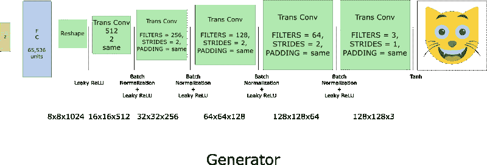

来源:[https://www . freecodecamp . org/news/how-ai-can-learn-to-generate-pictures-of-cats-ba 692 CB 6 EAE 4/](https://www.freecodecamp.org/news/how-ai-can-learn-to-generate-pictures-of-cats-ba692cb6eae4/)

*   然后，我们创建一个发电机。请记住，*采用随机噪声矢量(z)作为输入，并输出* *假图像，这要归功于转置卷积层。*
*   生成器通过将随机噪声作为输入并输出假图像来开始它的旅程。这是因为转置的卷积层
*   每个转置卷积层的滤波器大小减半，而图像大小加倍。发生器与输出层使用的激活函数 ***tanh*** 配合使用效果最佳

> **有条件的甘(cGANs)**

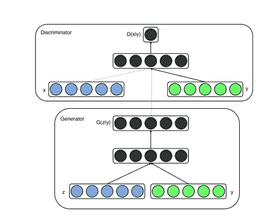

来源:[https://arxiv.org/pdf/1411.1784.pdf](https://arxiv.org/pdf/1411.1784.pdf)

*   如果 ***生成器*** 和 ***鉴别器*** 都以 y 的一些额外信息为条件，则 GAN 的可以在条件语句上得到更多扩展。
*   cGAN 背后的主要思想是训练一个有条件的生成性对抗网络。可将 **y** 送入**鉴别器**和**发生器**作为辅助输入层进行调理。
*   为了区分真假数据，标签也作为训练过程中的输入被推入鉴别器。

> **拉普拉斯金字塔甘(LAPGAN)**

*   LAPGAN 基本上是线性可逆图像表示，由一组相隔一个倍频程的带通图像和一个低频残余组成。
*   该 GAN 使用**多重发生器和鉴别器**以及不同级别的拉普拉斯金字塔。
*   主要使用 LAPGAN，因为它可以生成非常高质量的图像。
*   建筑**金字塔每一层的下采样图像**。还执行放大，以便从这些层处的条件 GAN 获取一些噪声，直到它达到其原始大小。

> **堆栈根**

*   [StackGAN](https://arxiv.org/abs/1612.03242) 旨在借助[计算机视觉](https://heartbeat.fritz.ai/the-5-computer-vision-techniques-that-will-change-how-you-see-the-world-1ee19334354b)提供一个从文本描述生成高质量图像的解决方案。
*   这些 GAN 堆叠在一起，生成围绕文本描述的图像
*   他们通过草图提炼过程将困难的问题分解成更容易处理的子问题。

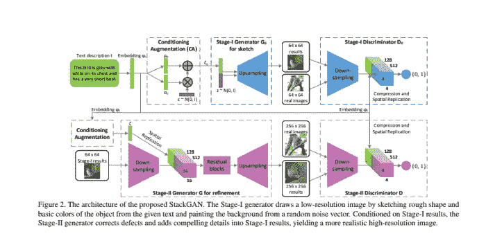

来源:https://arxiv.org/pdf/1612.03242.pdf

*   它基本上由两个阶段组成。第一阶段根据文本描述转换对象的形状和颜色，输出低分辨率图像。
*   第二阶段 GAN 接受第一阶段的输入和文本描述，并生成具有逼真细节的高分辨率图像。

> **InfoGAN 的**

*   [InfoGAN](https://arxiv.org/abs/1606.03657) 是 GAN 的信息论扩展，能够以无监督的方式学习解开的表示。
*   当数据集非常复杂时使用，当数据集未被标记时训练 cGAN 时也使用。
*   [InfoGAN](https://arxiv.org/abs/1606.03657) 也可用作从图像输入中提取**特征的**技术。

> **超分辨率氮化镓(SRGAN)**

*   [SRGAN 的](https://arxiv.org/abs/1609.04802)是一种设计 GAN 的方法，GAN 是一种深度神经网络，与对抗网络一起使用，以产生**更高分辨率的图像。**
*   用于优化放大原始低分辨率图像，以增强其细节，同时最大限度地减少误差。

> **用生成性对抗网络发现跨域关系(迪斯科 GANS)**

*   [DISCO](https://arxiv.org/pdf/1703.05192.pdf) GANS 白皮书作者提出了一种基于生成对抗网络的方法，该方法学习发现不同域之间的关系。

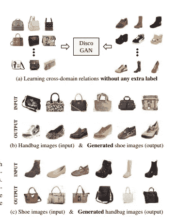

来源:[https://arxiv.org/pdf/1703.05192.pdf](https://arxiv.org/pdf/1703.05192.pdf)

*   Disco GAN 基本上用于**网络传输风格**中，作为一个区域到另一个区域的一部分。在这个过程中，它保留了关键属性，如方向和人脸身份。

> 给我看一些代码！
> 
> **Keras 驱动的 DCGAN 示例**

> 就这样，我们结束了甘的旅程。然而，还有更多类型的 gan，但我们无法在本文中涵盖所有类型的 gan！

> **参考文献**

*   [http://cs229.stanford.edu/notes/cs229-notes2.pdf](http://cs229.stanford.edu/notes/cs229-notes2.pdf)
*   [https://skymind.com/wiki/generative-adversarial-network-gan](https://skymind.com/wiki/generative-adversarial-network-gan)
*   [https://towards data science . com/image-generator-drawing-cartons-with-generative-adversarial-networks-45e 814 ca 9 b 6 b](https://towardsdatascience.com/image-generator-drawing-cartoons-with-generative-adversarial-networks-45e814ca9b6b)
*   [https://heart beat . fritz . ai/introduction-to-generative-adversarial-networks-gans-35ef 44 f 21193？gi=36ebd0fd3ae5](https://heartbeat.fritz.ai/introduction-to-generative-adversarial-networks-gans-35ef44f21193?gi=36ebd0fd3ae5)
*   [https://medium . com/@ Miguel mendez _/vaes-I-generating-images-with-tensor flow-f 81 B2 f1 c 63 b 0](/@miguelmendez_/vaes-i-generating-images-with-tensorflow-f81b2f1c63b0)
*   [https://www . geeks forgeeks . org/generative-adversarial-network-gan/](https://www.geeksforgeeks.org/generative-adversarial-network-gan/)
*   [http://papers . nips . cc/paper/2020-on-discriminant-vs-generative-classifiers-a-comparison-of-logistic-regression-and-naive-Bayes . pdf](http://papers.nips.cc/paper/2020-on-discriminative-vs-generative-classifiers-a-comparison-of-logistic-regression-and-naive-bayes.pdf)
*   [https://www . freecodecamp . org/news/how-ai-can-learn-to-generate-pictures-of-cats-ba 692 CB 6 EAE 4/](https://www.freecodecamp.org/news/how-ai-can-learn-to-generate-pictures-of-cats-ba692cb6eae4/)

如果你喜欢这个帖子，请跟我来，只要你认为我值得，就按下那个按钮。如果你注意到思维方式、公式、动画或代码有任何错误，请告诉我。

*干杯！*