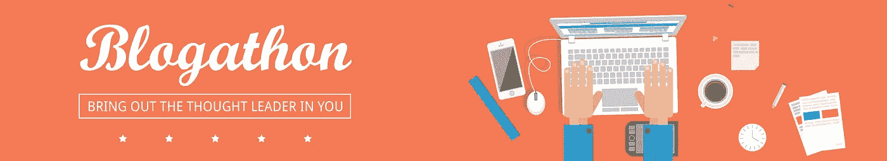

# 数据科学博客——2500 美元待价而沽！

> 原文：<https://medium.com/analytics-vidhya/ultimate-machine-learning-blogathon-amazing-prizes-ee518d2b72f4?source=collection_archive---------1----------------------->

*学习，与社区分享您的学习成果，赢取大奖！*

> “如果你想改变世界，就拿起笔来写吧。”—马丁·路德

*注意:这个博客已经结束了，但是我们一直对在我们的平台上发表你的文章持开放态度。请联系我们，我们期待您的贡献！*

# 宣布获胜者

我们看到绝大多数社区成员都参与了这个博客聚会！我们收到了大量各种主题的帖子，我们很高兴宣布获胜者:

**最受欢迎文章奖**

*   **第一名:** [吴恩达机器学习教程的 Python 实现(上)](/analytics-vidhya/python-implementation-of-andrew-ngs-machine-learning-course-part-1-6b8dd1c73d80) by [Srikar](https://medium.com/u/afc1c8c8f5bc?source=post_page-----ee518d2b72f4--------------------------------)
*   **第二名:** [机器学习面试的 25 个有趣问题](/analytics-vidhya/25-fun-questions-for-a-machine-learning-interview-373b744a4faa)作者 [Tirthajyoti Sarkar](https://medium.com/u/cb9d97d4b61a?source=post_page-----ee518d2b72f4--------------------------------)
*   **第三名:** [用 Python 从头开始构建一个简单的聊天机器人(使用 NLTK)](/analytics-vidhya/building-a-simple-chatbot-in-python-using-nltk-7c8c8215ac6e) 作者 [Parul Pandey](https://medium.com/u/7053de462a28?source=post_page-----ee518d2b72f4--------------------------------)

**拥有 10 个以上独特粉丝的最受欢迎文章:**

*   **第一名:** [Parul Pandey](https://medium.com/u/7053de462a28?source=post_page-----ee518d2b72f4--------------------------------) (6 篇)
*   **第二名:** [安基特·拉蒂](https://medium.com/u/de4d8ccba343?source=post_page-----ee518d2b72f4--------------------------------) (5 篇)
*   **第三名:** [斯丽卡](https://medium.com/u/afc1c8c8f5bc?source=post_page-----ee518d2b72f4--------------------------------) (4 篇)

# 介绍

我们很高兴地宣布推出 [Analytics Vidhya](https://www.analyticsvidhya.com/) 的 Blogathon，这是一项将您的写作能力与机器学习技能相结合的终极竞赛！

Analytics Vidhya 一直处于知识共享的前沿，我们希望在我们的社区成员中延续这一趋势。我们不仅会在 Analytics Vidhya 的 Medium 页面上发布最好的文章，还会向每一位作者提供关于他们文章的反馈。

除了在广大观众面前获得认可，还有丰厚的奖品可以赢取！文章的重点可以是任何数据相关领域——数据科学、机器学习、深度学习、人工智能、商业分析等。

博客聚会于今天，8 月 25 日开始，将于 9 月 23 日结束。除此之外，您将有额外的一周时间来处理我们对已提交文章的反馈。

**我们将在 9 月 30 日宣布每个类别的获胜者。**

# 我如何参与？

要参加比赛，你需要 [**在这里填写你的详细信息**](https://docs.google.com/forms/d/e/1FAIpQLScUy9fhSiQW5Bg3vgALAN6OEzox7FgP_-O2DEk468RYxo4ZLg/viewform?usp=send_form) 。然后，我们将把你作为作者添加到我们的媒体出版物中，你可以开始向我们发送你的草稿。真的就这么简单！

# 要赢得的丰厚奖品

符合 Analytics Vidhya 标准的每篇文章都将在我们的媒体页面上发布。**您将赢得 2500 美元以上的奖金！**奖品分为三类:

**最受欢迎的文章:**这将由文章获得的独特粉丝数决定。

*   一等奖——500 美元
*   二等奖——250 美元
*   三等奖——150 美元

**拥有 10 个以上独特粉丝的文章数量最多:**顾名思义，你提交的文章越多，聚集的粉丝越多，你抢这个奖的几率就越大！

*   一等奖——500 美元
*   二等奖——250 美元
*   三等奖——150 美元

**编辑奖:**该类别将由 AV 的内部编辑团队进行评判，获胜者将获得 500 美元！

还有更多..

**前 25 名博主每人将免费获得 6 个月 AV 的“** [**计算机视觉使用深度学习**](https://trainings.analyticsvidhya.com/courses/course-v1:AnalyticsVidhya+CVDL101+CVDL101_T1/about) **”课程！这是一门独一无二的课程，它将向你介绍简历的世界，并确保你成为该领域的大师。**

**前 50 名参与者将获得 DataHack 2017** [**第 1 天**](https://trainings.analyticsvidhya.com/courses/course-v1:AnalyticsVidhya+dhs2017+2017_a1/about) **和** [**第 2 天**](https://trainings.analyticsvidhya.com/courses/course-v1:AnalyticsVidhya+dhs2017+2017_a2/about) **会谈**——去年印度总理分析大会上发生的所有会议的集合。聆听商业领袖、领域专家、高级数据科学家和分析领域的其他知名人士。一个不容错过的机会！

对于那些不符合我们标准的文章，我们将确保为您提供关于如何在未来使这些文章变得更好的反馈。

# 条款和条件

*   你的文章内容应该是独一无二的，不能在其他地方发表。每篇文章都将被严格检查是否抄袭
*   您可以随意提交任意多的内容。但是，不要多次提交同一篇文章
*   提交内容已经开放，将于 2018 年 9 月 23 日 IST 时间 23:59(GMT+5:30)截止
*   如果文章在截止日期前提交，我们将提供额外的一周时间来处理我们给出的任何反馈
*   除非与 Analytics Vidhya 讨论，否则不允许在其他地方重新发布您的任何文章
*   分析 Vidhya 有权取消/拒绝任何提交而无需任何解释
*   所有奖项的决定，如分析 Vidhya 所宣布的，将是最终的

听起来是个不容错过的好机会？这就是我们所期待的态度——请在这里 [**填写您的详细信息**](https://docs.google.com/forms/d/e/1FAIpQLScUy9fhSiQW5Bg3vgALAN6OEzox7FgP_-O2DEk468RYxo4ZLg/viewform) ，我们会将您添加为我们媒体出版物上的作者。快乐写作！