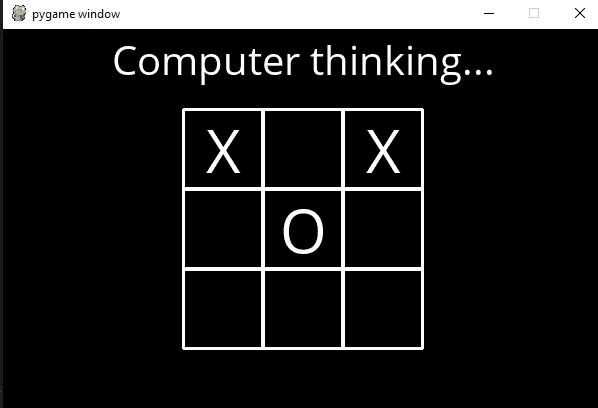
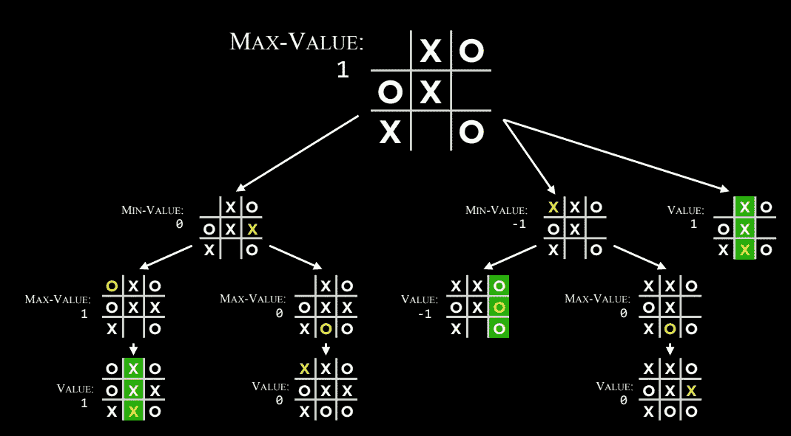
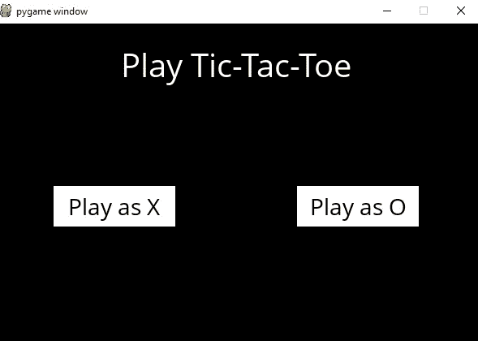

# 无与伦比的井字游戏 AI

> 原文：<https://medium.com/analytics-vidhya/unbeatable-tic-tac-toe-ai-3411dff06f96?source=collection_archive---------6----------------------->

井字游戏是一种简单的游戏。构建一个无与伦比的人工智能也很简单。人工智能将研究极大极小算法。 **Minimax** 是人工智能、决策理论、博弈论、统计学和哲学中使用的决策规则，用于 *mini* 最小化最坏情况下可能的损失。



工作游戏

**附言**假设大家都懂井字游戏！无红利(ex-dividend)

# 人工智能

历史上，人工智能有 4 种不同的方法。每一个都被不同的人用不同的方法使用。

“令人兴奋的新努力，让计算机思考……有思想的机器，在完全和字面意义上。”(豪格兰，1985)

**理性思考，** *“使感知、推理和行动成为可能的计算研究。”(温斯顿，1992)*

**为人处事，** *“研究如何让计算机做目前比人类更好的事情。”(里奇和奈特，1991)*

**理性行事，** *“人工智能……关注的是人工智能的行为。”(尼尔森，1998)*

我们不会谈论更多，但我的目标是给你一些关于不同人工智能方法的直觉。

这些定义来自《Russel 和 Norvig 的人工智能》一书*。*

# 搜索问题

井字游戏是一个怎样的搜索问题？AI 的每一步棋都是基于最后的输出。我们想创造一个永远不会输的人工智能，它可能会以平局告终，但永远不会输。所以 AI 必须从可用的移动中搜索，这可以导致最好的结果(赢甚至平局)。

## 搜索问题的术语。

*agent* ，一个感知其环境并对该环境做出反应的实体。

*状态，*代理及其环境的一种配置。

*初始状态，*代理开始的状态。

*动作，*状态下可以做出的选择。

*转换模型*，描述在任何状态下执行任何适用的动作会产生什么状态。

*状态空间，*任何动作序列从初始状态可达的所有状态的集合。

*目标测试，*确定给定状态是否是目标状态的方式。

*路径成本，*与给定路径相关的数值成本。

# 谅解

正如我们讨论的术语，对于井字游戏，我们的代理可以是 X 或 o。为了简单起见，X 总是先开始。你可以选择 X 或者 o。



使用极大极小值的井字游戏的树结构。

一般来说，如果 X 赢了，我们分配 1，如果 O 赢了，我们分配-1，如果平局，我们分配 0。极大极小算法将最大化 X 并最小化 o。在上面的图像中，下一步是 X。AI 必须从剩余的空间中选择输出最大值的移动。x 有 3 个选择，它会尝试每个选择，选择最大值。井字游戏是 1v1 游戏。所以下一步棋是 O，现在 AI 会扮演 O，选择一个最小值。这个过程会一直持续到游戏结束。

# 履行

我们的游戏由这十个功能组成。其中 b 是棋盘，m 是移动。

初始状态():返回空矩阵。

COUNT(b):返回 X 和 o 的计数。

玩家(b):返回哪个玩家在状态 b 下移动

动作(b):返回状态 b 中的合法动作

结果(b，m):返回在状态 b 中采取动作 a 之后的状态

终端(b):检查状态 b 是否是终端状态

效用(b):最终状态 b 的最终数值

MINIMAX(b):返回当前棋盘上的最佳走法

MAX_VALUE(b):返回板上的最大值，递归调用 *min_value*

MIN_VALUE(b):返回板上的最小值，递归调用 *max_value*

## 初态

每个井字游戏都以一个空的 3x3 矩阵开始。

```
X = "X"
O = "O"
EMPTY = None
def initial_state():
    return [[EMPTY, EMPTY, EMPTY],
            [EMPTY, EMPTY, EMPTY],
            [EMPTY, EMPTY, EMPTY]]
```

## 数数

这将有助于跟踪下一个要移动的玩家。返回棋盘上 X 和 O 的个数。

```
def count(board):
    count_x, count_o = (0, 0)
    for i in range(3):
        for j in range(3):
            if board[i][j] == X:
                count_x += 1
            elif board[i][j] == O:
                count_o += 1
    return count_x, count_o
```

## 运动员

追踪他们的行动。返回有下一轮机会的玩家。

```
def player(board):
    count_x, count_o = count(board)
    if count_o + count_x == 0:
        return X
    elif count_x > count_o and count_x + count_o != 9:
        return O
    elif count_x == count_o and count_x + count_o != 9:
        return X
    elif count_x + count_o == 9:
        return X
```

## 行动

在每种状态下，返回棋盘上所有可能动作(I，j)的集合。

```
def actions(board):
    action = []
    for i in range(3):
        for j in range(3):
            if board[i][j] == EMPTY:
                action.append((i, j))
    return action
```

## 结果

它将状态和动作作为输入，并在动作发生后返回状态。返回在棋盘上移动(I，j)产生的棋盘。

```
def result(board, action):
    board_copy = copy.deepcopy(board)
    if not action in actions(board):
        raise Exception
    else:
        move = player(board_copy)
        i, j = action
        board_copy[i][j] = move
        return board_copy
```

## 赢家

如果游戏结束，检查状态。并返回游戏的获胜者，如果有的话。

```
def winner(board):
    for i in range(3):
        if (board[i][0] == board[i][1] == board[i][2] and board[i][0] != EMPTY):
            return board[i][2]
        elif (board[0][i] == board[1][i] == board[2][i] and board[0][i] != EMPTY):
            return board[2][i]if (board[0][0] == board[1][1] == board[2][2] and board[0][0] != EMPTY):
        return board[0][0]
    elif (board[0][2] == board[1][1] == board[2][0] and board[2][0] != EMPTY):
        return board[0][2]
    else:
        return None
```

## 末端的

检查游戏是否结束。如果游戏结束，则返回 True，否则返回 False。

```
def terminal(board):
    count_x, count_o = count(board)
    if count_x + count_o == 9 or winner(board) != None:
        return True
    else:
        return False
```

## 效用

赢家状态的效用，如果 X 赢了游戏，则返回 1，如果 O 赢了，则返回-1，否则返回 0。

```
def utility(board):
    if winner(board) == X:
        return 1
    elif winner(board) == O:
        return -1
    elif winner(board) == None:
        return 0
```

## 极大极小

对于参与人 X，我们想最大化，所以我们用负无穷大作为一个较小的值，对于 O，我们用正无穷大。

```
import mathdef minimax(board):
    if terminal(board):
        return None
    if player(board) == X:
        vI = -math.inf
        move = set()
        for action in actions(board):
            v = min_value(result(board,action))
            if v > vI:
                vI = v
                move = action
    elif player(board) == O:
        vI = math.inf
        move = set()
        for action in actions(board):
            v = max_value(result(board,action))
            if v < vI:
                vI = v
                move = action
    return movedef max_value(board):
    if terminal(board): 
        return utility(board)
    v = -math.inf
    for action in actions(board):
        v = max(v, min_value(result(board, action)))
    return vdef min_value(board):
    if terminal(board): 
        return utility(board)
    v = math.inf
    for action in actions(board):
        v = min(v, max_value(result(board, action)))   
    return v
```

现在你有了工作代码。但是作为游戏怎么跑呢？

1.  将上面实现的文件保存为 tictactoe.py
2.  [下载](https://drive.google.com/file/d/14z0eyY2OjLewQxeW7qV-Zw2jUJNlVwVE/view) runner 文件(模块名为 *pygame，已安装*)。将两个文件放在同一个文件夹中。
3.  现在运行 runner.py 文件。你有正常的井字游戏。



最终输出