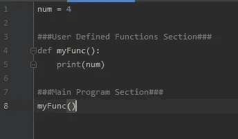
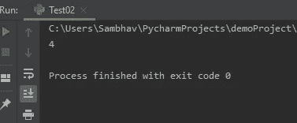
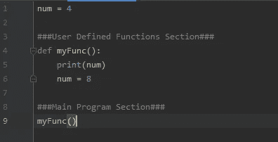
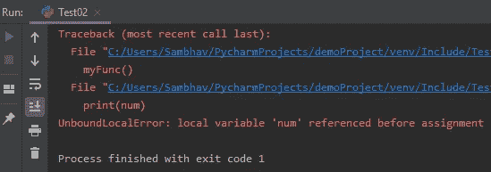
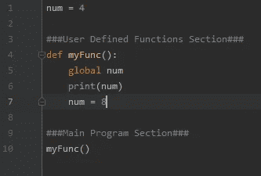

# Python 中的 UnboundLocalError

> 原文：<https://medium.com/analytics-vidhya/unboundlocalerror-in-python-edfe9aaf49e4?source=collection_archive---------7----------------------->

当几分钟前运行顺畅的代码由于一个愚蠢的错误而停滞不前，并因此显示一个在 Python 开发人员中很流行或相当常见的错误，名为"*unboundlocalrerror*"时，这是非常令人恼火的。

这个故事，或者更确切地说是我写的一篇博客，描述了这个错误的本质，它是如何发生的，为什么会发生&你应该如何解决来消除它。

**该如何？**

考虑下面的片段:

光滑外壳

在上面截图的片段中， **num** 的值最初是 4(在 Python 中被视为全局的，因为它是在方法之外声明的)。在名为 **myFunc()** 的方法中，我们只是打印它的值。所以输出是:

平滑案例(结果)

现在，让我们来修改一下上面的光滑案例，让我们来面对问题。考虑下面的片段:

有问题的案例

请注意，我们首先计划打印 **num** 的值，然后将其值修改为 **8(第 6 行)。**让我们像以前一样通过调用函数 **myFunc()** 再次运行代码。

有问题的案例(结果)

很容易看出，这个帖子的整个主题在上面的错误中可见，***unboundlocalrerror***。让我们通过更有趣的“为什么”部分来理解其背后的原因…

**为什么？**

这个错误是由作用域的一个小错误引起的。在 python 中，如果没有给函数中的所有变量赋值，那么它们就是全局变量。

这意味着如果一个变量只在函数外部被引用，那么它就是全局变量。然而，如果我们在函数中给一个变量赋值，除非明确声明是全局的，否则它的作用域就是局部的。

在第一个例子中(平滑的情况)，我们没有给函数中的 x 变量赋值，只是引用它来打印。于是 **x** 就是**全局 。**

在第二个例子(有问题的情况)中，我们将值 8 赋给 x，因此 x 的作用域是***local***to function，我们试图在将任何值赋给 **x** 之前打印它。

**解决方案！:)**

在函数内部修改关键字 **global** 之前，您需要使用它，如下所示。

又光滑了！

关注**第 5 行**，这里我们放置了关键字 ***global*** 来告诉 Python 解释器，在这之前对 **num** 的值所做的任何改变，都反映了它的全局值。换句话说，每隔一次出现 **num 就改变它。仅此而已。完成了。**

还有一种解决方法，即使用 ***非本地*** 关键字，但这通常是不可取的。因此，我没有在这里讨论它。

> 我希望这篇简单的业余帖子能让那些刚开始接触 Python 的人(比如我)和那些面临这个错误的人感兴趣。请继续关注许多与 Python 编程相关的帖子。我会努力成为媒体社区的积极分子。

**感谢阅读！**

**干杯！！**