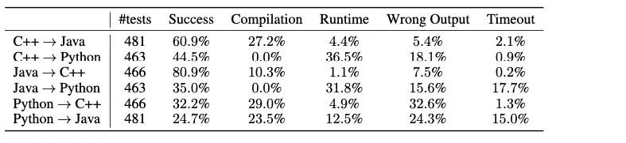

# 拆箱脸书的代码转换器-一个人工智能翻译

> 原文：<https://medium.com/analytics-vidhya/unboxing-facebooks-transcoder-an-ai-translator-2d0a13bb0296?source=collection_archive---------30----------------------->

将源代码从一种高级语言转换成另一种高级语言的源到源翻译器(也称为转换编译器)并不是一种全新的技术。这些转换编译器用于将代码库从弃用的语言(如 python 2)转换为现代语言。

转换编译器建立在手写规则的基础上，这些规则应用于源代码的抽象语法树。构建代码转换器需要对源语言和目标语言有很好的理解，并且需要不断地手工修改规则。这很费时间。此外，一些公司为这种翻译花费了巨额资金。

> 自然语言处理以其“注意”机制获得了广泛的关注。

神经机器翻译是将一种语言的文本转换成另一种语言。将 NMT 应用于编程语言是代码转换器的根本思想。

为了更好地理解代码转换器，我们将从将代码从一种编程语言转换成另一种编程语言所涉及的主要挑战开始。

# 挑战

## 类型系统

将 python 这样的动态类型语言转换成 java 这样的静态类型语言是一项具有挑战性的任务

例如 python 中的“my=3”应该转换成“int my=3”。

## Python 的问题

缩进错误是 python 程序员常见的错误之一。这也让我们的代码转换器头疼。这是因为缩进在像 Java 这样的语言中没有意义。

## 有意义嵌入空间

在嵌入空间中，源语言和目标语言关键字的编码应该更接近。

## 抗噪声能力强

输出不应该是一些抛出错误的垃圾。

# 代码转换器模型

代码转换器的架构类似于带有编码器和解码器的变压器。

无监督机器翻译的三个原则是

## 交叉编程语言模型预训练

该原理通过在潜在表示中更紧密地映射相似的单词，使得嵌入空间有意义，而不管语言如何。

在 NLP 翻译中，数字和城市名称在每种语言中都很常见。类似地，编程语言也有某些共同的关键字，比如 for while try 等..重要的是将它们映射得更近。我们通过使用屏蔽语言建模来做到这一点，我们屏蔽一些随机标记，并训练我们的代码转换器根据上下文来预测它们。

我们用不同语言执行上述步骤，以创建高质量的跨语言序列表示。

## 去噪自动编码

我们的代码转换器是根据上述原则用预训练的 XLM 模型初始化的。但是我们的代码转换器现在没有用。为了实现这一点，我们训练该模型以去噪自动编码(DAE)为目标来编码和解码序列。模型被训练成在给定该序列的损坏版本(即，混洗和屏蔽输入记号)的情况下预测记号序列。

作为解码器的输入给出的第一个符号是指示输出编程语言的特殊标记。

解码器总是生成一些有意义内容，而不管噪声如何。这对我们下一步至关重要。

## 回译

我们代码转换器现在可以进行翻译了，但是结果可能没有意义。为了训练我们模型的核心目的，我们使用反向翻译。

源-目标模型与并行训练的反向目标-源模型耦合。

目标-源模型用于将目标序列翻译成源语言，产生对应于真实目标序列的噪声源序列。然后以弱监督的方式训练源-目标模型，以从由目标-源模型生成的噪声源序列中重建目标序列，反之亦然。

训练继续进行，直到达到收敛。

有了这些原则，我们可以克服除压痕问题之外的所有挑战。这由预处理来处理。

## 预处理

我们在 NLP 任务的预处理中使用标记化。类似地，不同编程语言的不同记号赋予器解决了缩进和与特定语言相关的问题。

## 最后的想法

这个代码转换器被训练来单独翻译功能。这可以扩展到复杂的类和对象。代码转换器的结果是:

## 参考

[https://arxiv.org/abs/2006.03511](https://arxiv.org/abs/2006.03511)