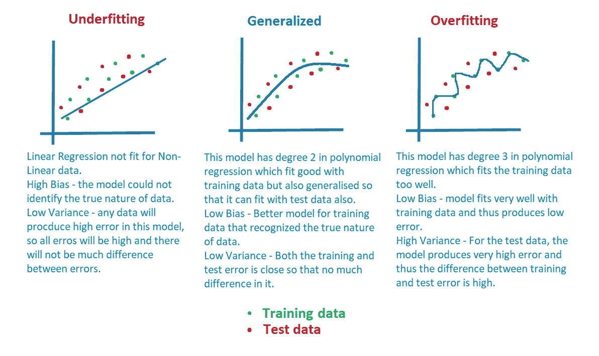

# 营养不良——普遍——营养过剩

> 原文：<https://medium.com/analytics-vidhya/underfitted-generalized-overfitted-83e815b05d1d?source=collection_archive---------16----------------------->

关于偏差和方差如何使模型欠拟合或泛化或过拟合的简要说明！

在这篇文章中，为了便于理解，我没有写很多段落，只是做了一个信息图。

营养不良——普遍——营养过剩

# Uunder fitted:

模型可能非常不适合训练和测试数据(高偏差和低方差)-上图中最左侧的图表。这就是所谓的**吃不饱**。

# 过度装配:

模型可以很好地拟合训练数据，而很差地拟合测试数据。(低偏差和高方差)—上图中最右边的图。这就是所谓的**过度劳累。**

# 一般化:

一个理想的模型应该是低偏差和低方差的。

C结束语:

这篇文章很小，因为我不想让读者更加困惑。

如果您对偏差-方差、过度拟合和欠拟合有任何其他想法，请留下您的评论。

如果你想深入了解偏差——方差，请阅读我之前的博客[过度拟合——偏差——方差——正则化](/@aasha01/overfitting-bias-variance-regularization-fd929ff54218)。

编程快乐！