# 机器学习中的欠拟合与过拟合(与最佳拟合)

> 原文：<https://medium.com/analytics-vidhya/underfitting-vs-overfitting-vs-best-fitting-in-machine-learning-91bbabf576a5?source=collection_archive---------11----------------------->

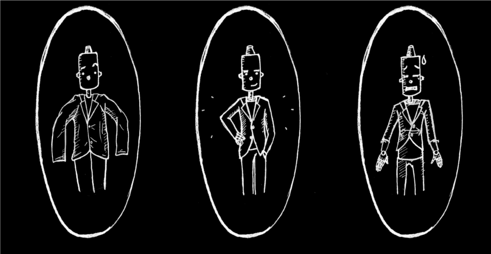

# 机器学习中欠适应和过适应的挑战

在数据科学家的面试中，你不可避免地会遇到这个问题:

> 你能解释一下在机器学习的背景下什么是欠适应和过适应吗？用一种非技术人员也能理解的方式来描述它。

您以非技术性和易于理解的方式解释这一点的能力可能很好地决定了您是否适合数据科学角色！

即使当我们在进行一个[机器学习](https://courses.analyticsvidhya.com/courses/applied-machine-learning-beginner-to-professional?utm_source=blog&utm_medium=underfitting-overfitting-best-fitting-machine-learning)项目时，我们也经常会面临这样的情况，即我们会遇到训练集和测试集之间意想不到的性能或错误率差异(如下所示)。一个模型怎么能在训练集上表现得如此之好，而在测试集上表现得如此之差？

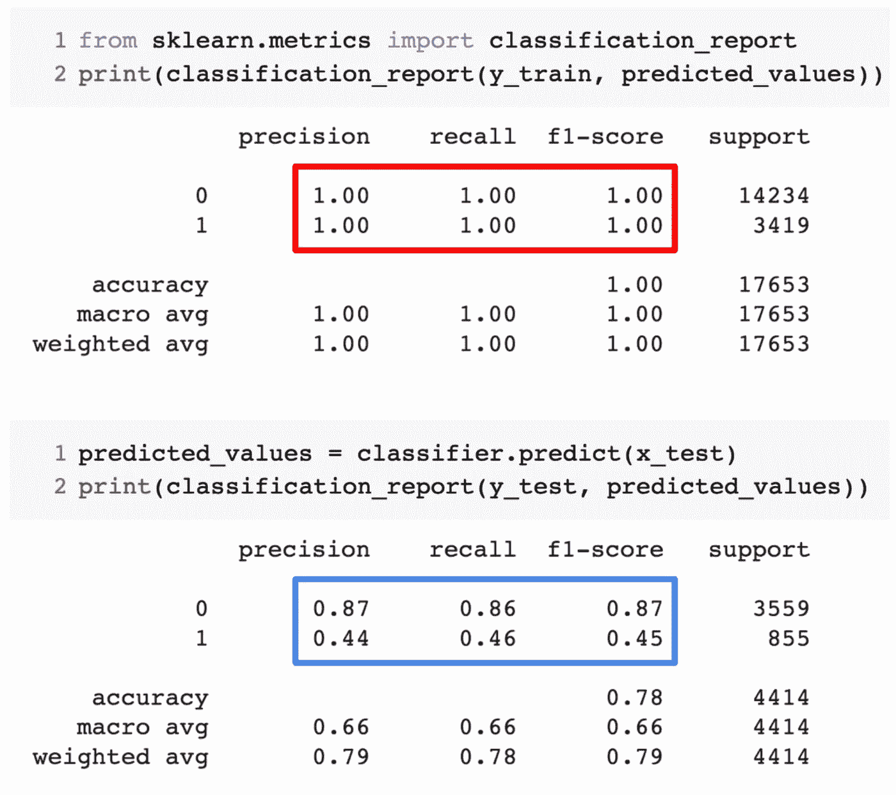

每当我使用[基于树的预测模型](https://www.analyticsvidhya.com/blog/2016/04/complete-tutorial-tree-based-modeling-scratch-in-python/?utm_source=blog&utm_medium=underfitting-overfitting-best-fitting-machine-learning)时，这种情况就经常发生。由于算法的工作方式，您可以想象避免陷入过度拟合陷阱是多么棘手！

此外，当我们无法找到我们的预测模型表现出这种异常行为的潜在原因时，这可能会非常令人沮丧。

这是我的个人经验——向任何经验丰富的数据科学家询问这个问题，他们通常会开始谈论一些花哨的术语，如过拟合、欠拟合、偏差和方差。但是很少有人谈论这些机器学习概念背后的直觉。我们来纠正一下，好吗？

# 让我们举一个例子来理解欠拟合和过拟合

我想用一个真实的例子来解释这些概念。很多人谈论理论角度，但我觉得这还不够——我们需要想象欠适应和过适应实际上是如何工作的。

所以，让我们为了这个回到大学时代。

考虑一个由 3 名学生和一名教授组成的数学班。

现在，在任何教室里，我们都可以把学生大致分为三类。我们将逐一讨论它们。

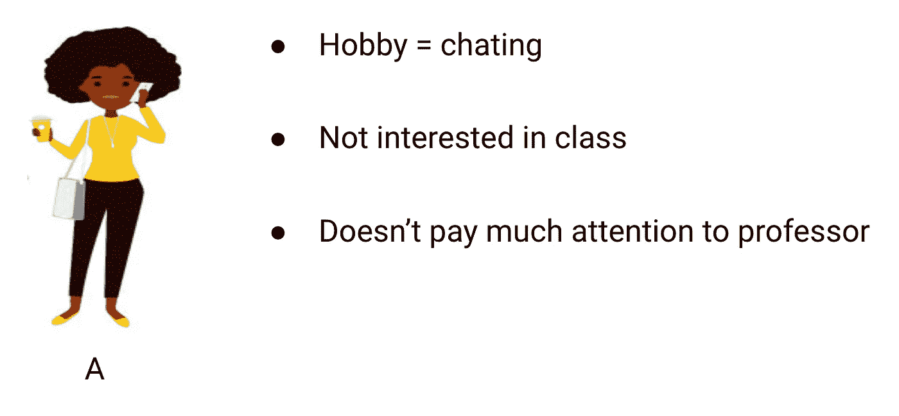

假设学生 A 类似于一个不喜欢数学的学生。她对课堂上教授的内容不感兴趣，因此不太注意教授和他教授的内容。

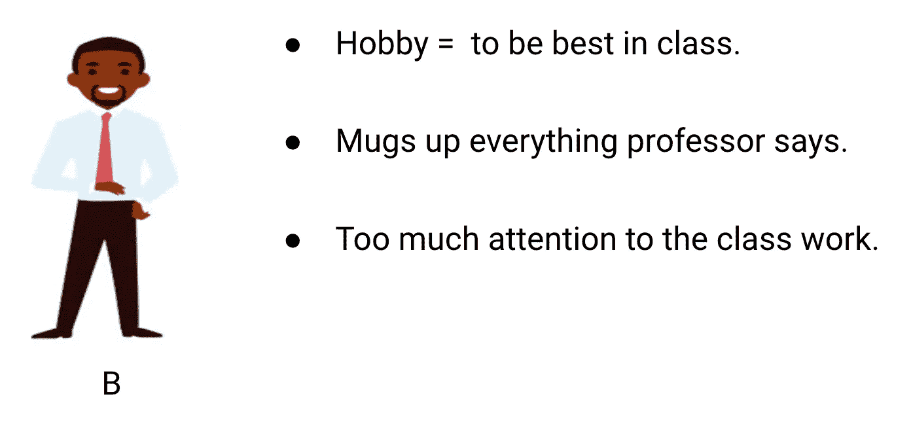

让我们考虑学生 b。他是最有竞争力的学生，他专注于记住课堂上教授的每一个问题，而不是专注于关键概念。基本上，他对学习解决问题的方法不感兴趣。

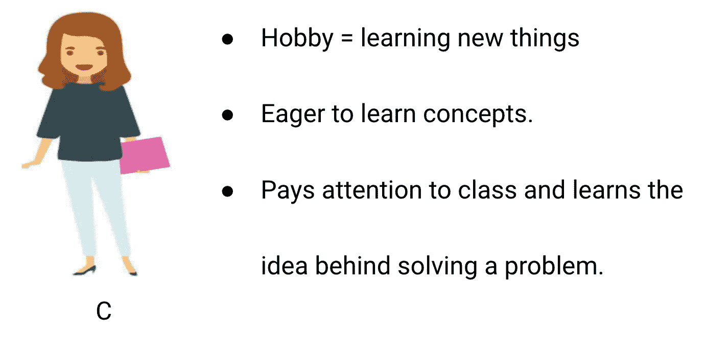

最后，我们有一个理想的学生 c。她对学习数学课中的关键概念和解题方法非常感兴趣，而不仅仅是记住给出的答案。

我们都从经验中知道教室里发生了什么。教授首先讲课，教学生有关问题和如何解决它们。在一天结束的时候，教授只是根据他在课堂上所教授的内容进行一个小测验。

障碍来自学校规定的学期测试。这就是新问题(看不见的数据)出现的地方。学生们以前没有见过这些问题，当然也没有在课堂上解决过。听起来很熟悉？

那么，让我们来讨论一下当老师在一天结束时进行课堂测试时会发生什么:

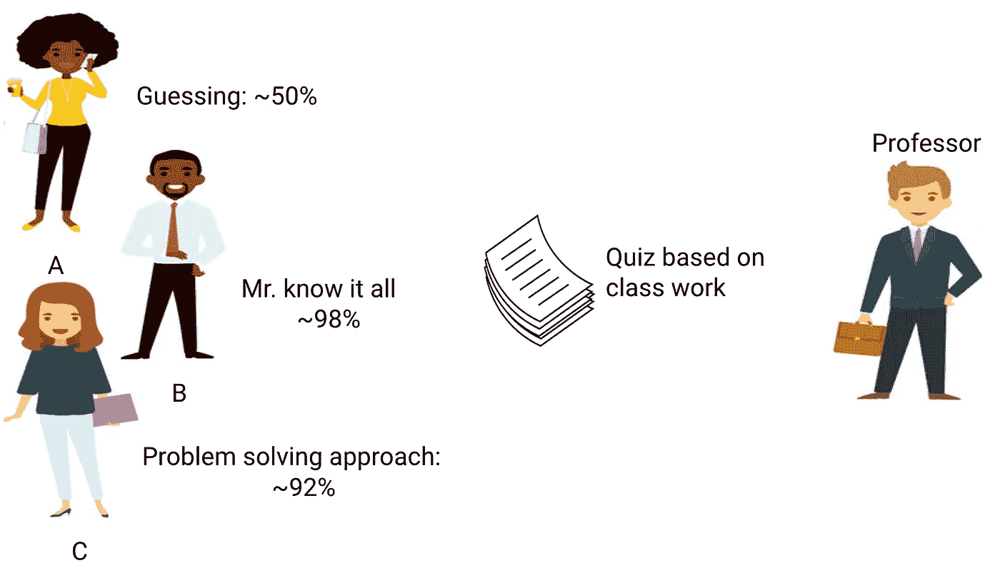

*   学生 A 被自己的世界搞得心烦意乱，只是简单地猜测答案，在测试中得了大约 50%的分数
*   另一方面，记住了课堂上所教的每一个问题的学生能够凭记忆回答几乎每一个问题，因此在课堂测试中获得了 98%的分数
*   对于学生 C，她实际上用她在课堂上学到的解决问题的方法解决了所有的问题，得分 92%

我们可以清楚地推断，简单地记忆所有东西的学生得分更高，没有太多困难。

现在情况变了。让我们也看看在月考期间会发生什么，当学生不得不面对老师在课堂上没有教过的新的未知问题。

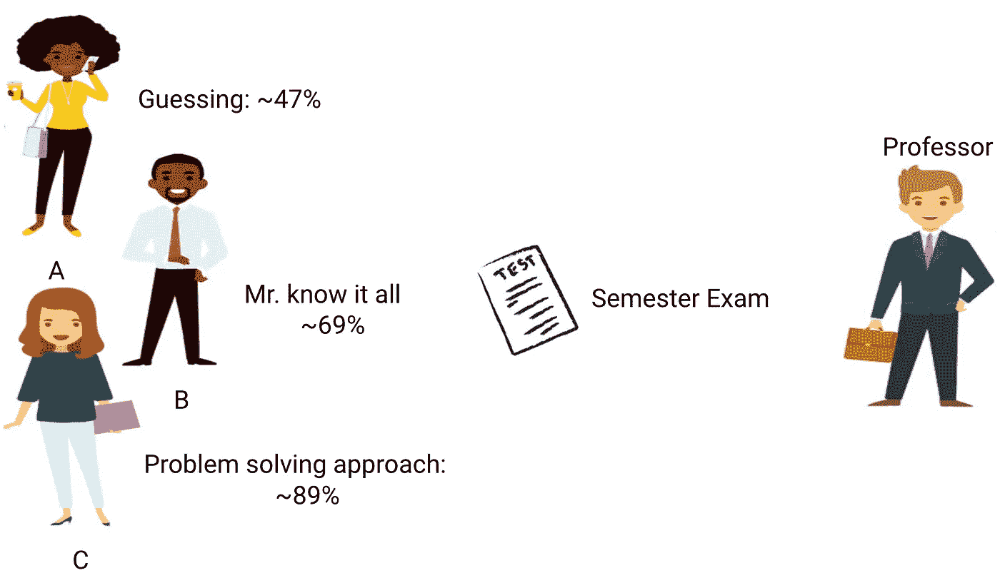

*   在学生 A 的例子中，情况没有太大的变化，他仍然随机地回答问题，正确率约为 50%。
*   在学生 B 的情况下，他的分数显著下降。你能猜到原因吗？这是因为他总是记住课堂上所教的问题，但这次月考包含了他从未见过的问题。因此，他的表现明显下降
*   在学生 C 的情况下，分数大致保持不变。这是因为她专注于学习解决问题的方法，因此能够应用她所学的概念来解决未知的问题

# 这与机器学习中的欠适应和过适应有什么关系？

您可能想知道这个例子与我们在决策树分类器的训练和测试分数中遇到的问题有什么关系？好问题！

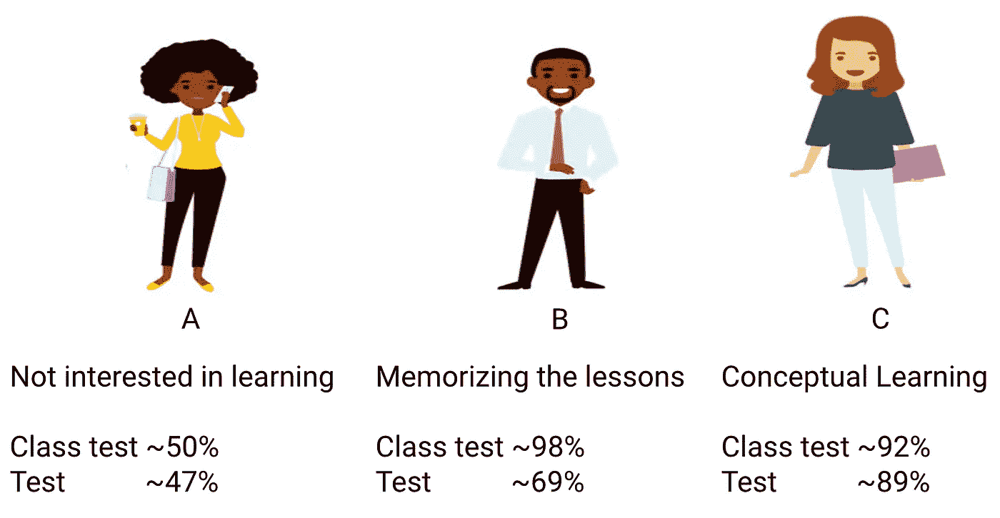

所以，让我们把这个例子和我之前展示的决策树分类器的结果联系起来。

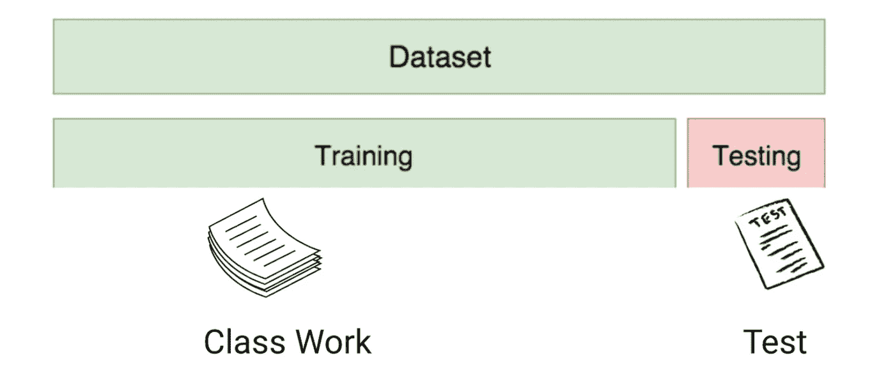

首先，类工作和类测试分别类似于训练数据和对训练数据本身的预测。另一方面，学期测试代表来自我们的数据的测试集，这些数据是我们在训练我们的模型之前保留的(或者是真实世界机器学习项目中看不见的数据)。

> 现在，回想一下我之前提到的决策树分类器。它在训练集上得到了满分，但在测试集上却表现不佳。与我们刚刚讨论的学生示例相比，分类器与试图记住训练集中每个问题的学生 B 建立了类比。

类似地，我们的决策树分类器试图从训练数据中学习每一个点，但是当它在测试集中遇到新的数据点时会受到严重影响。它不能很好地概括它。

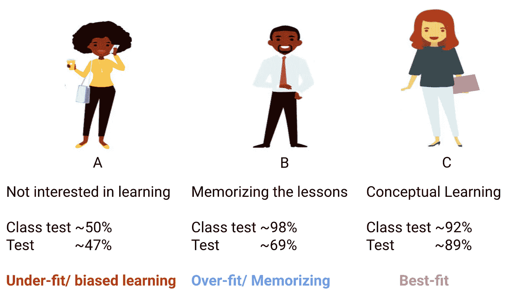

> ***任何给定模型在训练数据上表现太好，但在测试集上性能显著下降的这种情况称为过拟合模型。***

例如，像[决策树](https://courses.analyticsvidhya.com/courses/getting-started-with-decision-trees?utm_source=blog&utm_medium=underfitting-overfitting-best-fitting-machine-learning)、 [KNN](https://www.analyticsvidhya.com/blog/2018/03/introduction-k-neighbours-algorithm-clustering/?utm_source=blog&utm_medium=underfitting-overfitting-best-fitting-machine-learning) 和[其他基于树的算法](https://www.analyticsvidhya.com/blog/2016/04/complete-tutorial-tree-based-modeling-scratch-in-python/?utm_source=blog&utm_medium=underfitting-overfitting-best-fitting-machine-learning)这样的非参数模型非常容易过拟合。这些模型可以学习可能导致过度拟合的非常复杂的关系。下图总结了这一概念:

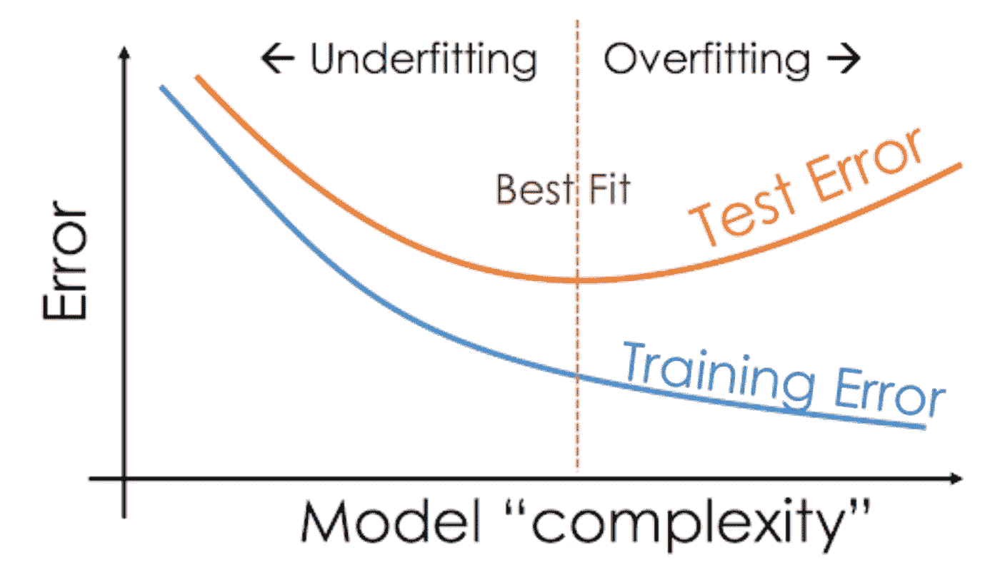

> ***另一方面，如果模型在测试和训练集上表现不佳，那么我们称之为欠拟合模型。这种情况的一个例子是对非线性数据建立线性回归模型。***

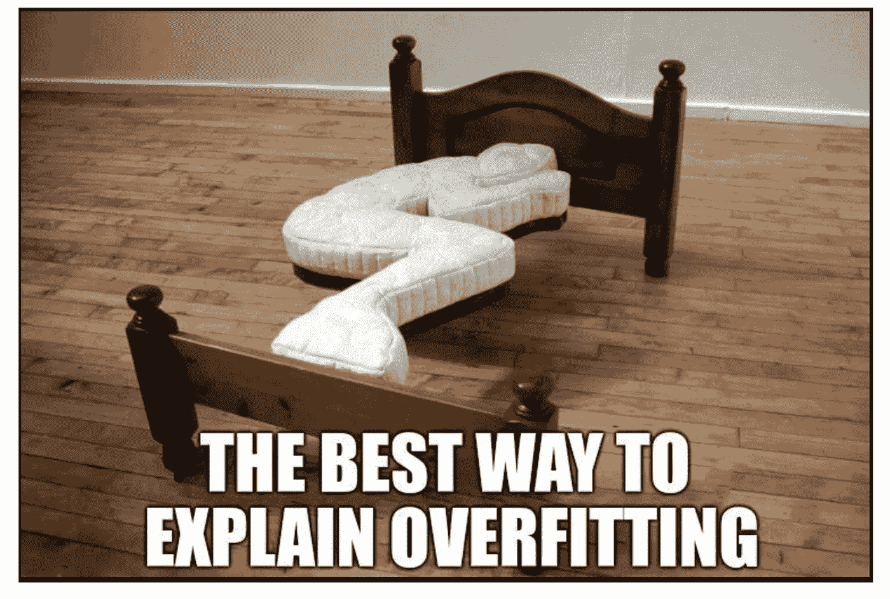

# 结束注释

我希望这个简短的直觉已经消除了你可能对欠拟合、过拟合和最佳拟合模型以及它们在引擎盖下如何工作或表现的任何疑虑。

欢迎向我提出以下任何问题或想法。

你也可以在分析 Vidhya 的 Android 应用上阅读这篇文章

*原载于 2020 年 2 月 7 日*[*https://www.analyticsvidhya.com*](https://www.analyticsvidhya.com/blog/2020/02/underfitting-overfitting-best-fitting-machine-learning/)T22。