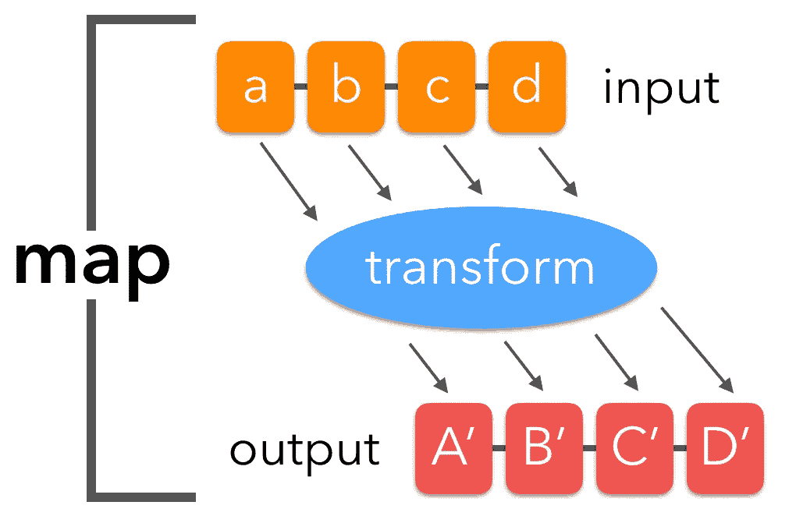
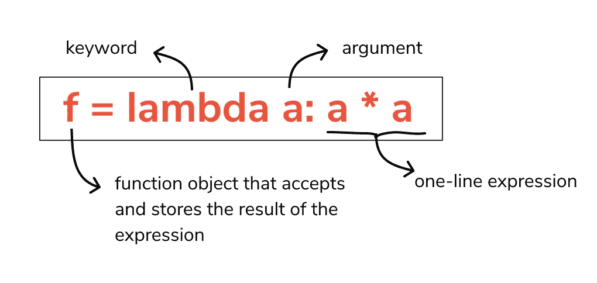

# 被低估的 Python 编程要点

> 原文：<https://medium.com/analytics-vidhya/underrated-essentials-of-python-programming-36c5340bea6?source=collection_archive---------32----------------------->


诞生于 20 世纪 80 年代后期的 Python 语言逐渐成为业界主要的开发工具之一。由于其优雅和简单，Python 被用于 Web 开发、数据科学、机器学习框架，甚至视频游戏开发等领域。

尽管 Python 功能多样，语法简单，但学习者还是会远离 Python 提供的一些基本而强大的功能。在这篇文章中，我们将深入那些被低估的功能，初学者回避。

# **map()函数**

在我们开始之前，请仔细阅读术语来理解 map()函数的工作原理。

*   ***迭代*** *是通用的计算机科学术语；它指的是对一组元素执行一个动作，一次一个元素。一个很好的例子是* ***循环。***
*   ***迭代器*** *是表示数据流的对象；它一次返回一个元素的数据。它还会在迭代过程中记住自己的位置。*
*   ***Iterable****是一个我们可以循环的对象(如字符串、列表或文件)。从****Iterable****中，我们得到了****iterator****。*

[**map()** 函数](https://docs.python.org/3/library/functions.html#map)返回将函数应用于给定 iterable(列表、元组等)的每一项后的结果的 map 对象。).如果传递了额外的 iterable 参数，该函数必须接受同样多的参数，并并行应用于所有 iterable 中的项。

对于多个可迭代对象，当最短的可迭代对象用尽时，迭代器停止。映射是可迭代的，就像列表和元组一样，所以我们可以使用 for 循环来查看映射中的所有值。

*   map:遍历序列并对每个元素执行操作的处理模式。
*   映射:一个集合中的每个元素都对应于另一个集合中的一个元素的关系。

**语法**

```
map(fun, iter)#Parameters
#***fun:*** *Function to which map passes each element of iterable.*
#***iter:*** *It is an iterable which is to be mapped.*
```



> 如果没有`map()`，我们将被迫编写复杂的代码来*【循环】*多个项目的函数。

**示例**

```
#Cacluate Square of a Numberdef calculateSquare(n):
    return n*n

numbers = (1, 2, 3, 4)
result = map(calculateSquare, numbers)
print(result)

# converting map object to set
numbersSquare = set(result)
print(numbersSquare)
```

# 希腊字母的第 11 个

[Lambda](https://python-reference.readthedocs.io/en/latest/docs/operators/lambda.html) 是 Python 创建匿名函数的方式。这些和其他函数一样，但是没有名字。我们的目标是让*变得简单*或者*变得短命*，并且在一行中写出函数比创建一个命名函数更容易。Lambdas 比全函数定义更受限制。但我认为它们对于简单的小数据清理任务非常有用。

**语法**

```
lambda arguments: expression
```

你用单词 **lambda** 声明一个 lambda 函数，后跟一列参数，再跟一个冒号，然后是一个表达式，这是关键。然后在执行 lambda 时返回表达式值。lambda 中只有一个表达式需要求值。



**注意**lambda 参数不能有默认值，lambda 本身也不能有复杂的逻辑，因为你只能使用一个表达式。

**示例**

*   **不使用 Lambda:**identity 函数是一个返回其参数的函数，使用关键字 def 用标准 Python 函数定义来表示，如下所示:

```
def identity(x):
    return x
```

*   **使用 Lambda:** Lambda 定义不包含“return”语句，它总是包含一个返回的表达式。相比之下，如果您使用 Python lambda 构造，您会得到:

```
lambda x: x
```

我们可以将 lambda 函数与 filter()、map()和 reduce()等内置函数一起使用。

*   **使用 lambda()和 filter():**Python 中的 filter()函数接受一个函数和一个列表作为参数。这提供了一种过滤序列中所有元素的优雅方式。
*   **使用 lambda()和 map():**Python 中的 map()函数接受一个函数和一个列表作为参数。
*   **lambda()与 reduce()一起使用:**Python 中的 reduce()函数接受一个函数和一个列表作为参数。

# 结论

读完这篇文章后，我希望你对 Map()和 Lambda 函数有所了解，它们通常被程序员忽略。对于初学者，我建议你必须掌握这些功能，因为从长远来看，这肯定会对你有帮助。了解你正在使用的语言的来龙去脉会让你像一个工匠一样编程。这些只是我认为值得分享的一小部分东西。编码快乐！