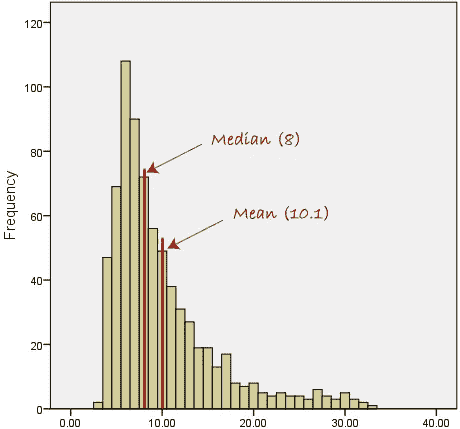

# 您可能要开始考虑的被低估的统计数据

> 原文：<https://medium.com/analytics-vidhya/underrated-statistic-measures-that-you-may-want-to-start-considering-f8c2b5151fe6?source=collection_archive---------11----------------------->

为什么不开始考虑中位数，而更多地关注我们的标准差呢？

这张封面图片可能与故事贴无关，但我想用这个空间来放我拍的图片。

*免责声明:这篇帖子是我对我认为应该更多关注的统计方法的思考过程。我不是统计学专家，在这篇文章中，我只是分享我的观点。*

当我写我的学士论文时，我第一次开始使用统计学工作，但回过头来看手稿，我可以看到我缺乏统计学的基本基础。这并不意味着我的论文中的结论是不可接受的，只是我没有提供我在论文中使用的方法的完整论据，这有点困扰今天的我。

原因不是因为我以前没有上过统计课。原因很简单，当我选修这门课时，我还没有应用统计学的第一手实际经验。回想起来，现在我知道我可以从我的学士项目中改进什么，我应该使用什么措施，等等。等等。这种认识不仅仅是因为我现在是统计学专家，而是因为我已经有了在现实生活中使用统计学的经验，我可以理解统计学中的所有基本计算。

所以我变得比以前更习惯于处理和分析数据。但这并不意味着我的兴趣直接来自于我对统计理论的理解。因此，在我申请工作的间隙，我开始在可汗学院上基础统计学课，在那里我意识到有些统计方法没有得到应有的重视。在这篇文章中，我建议在描述你的数据时加入中位数，并更多地关注标准差。

# 开始在你的分析中包括中位数。

当我们有了数据集后，在继续其他步骤之前，我们首先要做的是了解数据集中发生了什么。在推断统计中，我们通常处理样本总体，它提供了我们总体的一个小画面。集中趋势是描述我们的数据集的一个强有力的度量，在我们做任何进一步的事情之前对其进行评估是很重要的。有三个重要的衡量标准:(算术)平均值、中值和众数。

均值是人们在解释数据时最常用的衡量标准。然而，均值对远离数据分位数的异常值非常敏感。还有一个中位数，尽管经常被忽略，但在我们的数据分析过程中，它是值得我们花费时间的(实际上，在 R 中，你只需要键入 median(x)，就可以得到它)。如果我们必须比较均值和中值，中值可以比存在异常值时的均值给出更好的集中趋势估计。

对于中值，我们只需按升序排列值并选择中间值，而对于平均值，我们将所有值相加，然后除以平均值计算中的观察次数。确定中位数不涉及平均值计算中的值的求和，因此它对大或小异常值的存在不太敏感。另一方面，在平均值的计算中，大的异常值的存在会导致平均值的高估，而小的异常值会导致低估。

然而，即使均值比中值对异常值更敏感，问题也不在于“什么时候用均值，什么时候用中值？”。我的建议是简单地把这两者放入你的描述性统计中。

有些时候，中位数提供了更好的解释，如不对称或偏斜分布(即左偏和右偏)。例如，在许多数据以升序分布在最典型值(直方图中的峰值)右侧的情况下，中值可以显示最有可能落在典型值之间的中间值。另一方面，如果我们使用 mean，我们将必须对所有值求和，这些值由高于典型值的值组成，反过来，我们将得到高于数据集中典型值的值。因此，在这种情况下，中值显示了给定频繁条件下样本行为的趋势，而均值却不能这样做，即使均值在数学上是正确的。

偏态分布(来源:[https://statistics . laerd . com/statistical-guides/measures-central-trend-mean-mode-median . PHP](https://statistics.laerd.com/statistical-guides/measures-central-tendency-mean-mode-median.php))

在对称分布或正态分布中，平均值和中值之间通常没有很大的差异，尽管异常值仍然会有影响。然而，从我的经验来看，当我处理异常值时，我同时使用了均值和中值，这两者之间并没有很大的差异。我猜这种差异真的取决于你的异常值的性质。我将一个值称为异常值的限度是，该值是否落在下四分位数(Q1)的外部范围内— 25%到上四分位数(Q3) + 75%。此外，它还取决于具有异常值的观察值的数量(n)以及异常值的大小。如果有典型值的观测值比有离群值的观测值多，我猜均值不会比中值差太多，均值可以解释数据。问题是，有了异常值，您的平均值和中值估计的准确性可能会很低。

无论哪种方式，我想最好将它们包含在你的描述性统计中，这样你就可以更好地解释你的数据，而不会冒高估或低估你的数据的风险。另一个解决方案是考虑其他类型的平均值。在本文的开头，我提到了(算术)平均值，这是我们通常使用的平均值类型，也是对异常值敏感的类型。我刚刚发现了其他类型的均值，可以减少异常值的影响，并可以提供更好的数据解释。我不会涵盖这些平均的完整解释，但我会在这里提到他们，你可以检查他们在任何统计论文。

*   加权平均值，通过根据重要性对这些值进行加权来计算平均值。
*   几何平均值，它是算术平均值的对数标度，或者是一个观察值的乘积的 n 次方根。当您处理偏态分布或值呈指数变化时，这是一个合适的度量。
*   调和平均值。

这些简单的解释来自:

 [## NCBI - WWW 错误阻止诊断

### 由于可能的误用/滥用，您对 www.ncbi.nlm.nih.gov NCBI 网站的访问已被暂时阻止…

www.ncbi.nlm.nih.gov](https://www.ncbi.nlm.nih.gov/pmc/articles/PMC3127352/#:~:text=Mean%20is%20the%20most%20commonly,refers%20to%20the%20arithmetic%20mean) 

# 更加关注标准差

标准差似乎没有得到应有的重视。这是一个非常重要的分布度量，但可能因为它的计算非常复杂，或者可能它没有提供直接的解释，在数据集的解释中，标准差有时会被忽略。例如，提供某个地区的工资信息。我通常看到的是，文章提到了某个地区某个职位的平均工资，但没有提到工资的变化，如果你想想，这可以提供一个更好的画面，你应该从这个特定的职位期望多少工资。我将在下面的段落中解释。

标准差是衡量一个值离平均值有多远的指标。在描述性统计中，它补充了趋势的度量，因此它是对描述我们的数据的中位数和均值的补充。解释标准差的另一种方式是:它是数据集中变化的度量。它显示您的数据是否由变量值组成，您的数据是否高度分散，或者您的数据是否多样化。

回到薪水的例子，假设您正在搜索巴黎一名数据分析师的平均薪水。结果是 50 000 欧元/年，你可能会觉得这很棒。但是，您发现工资的标准偏差是 15 000 欧元/年，这表明巴黎数据分析师职位的工资变化很大。然后你研究一下这些因素，发现工资取决于行业，某些行业可能会给高工资，而其他行业可能不会。所以，有了标准差，你就能更好地了解一个群体的真实情况。

此外，标准差是比较两组数据的重要尺度。关于薪水，你在成为数据分析师和数据科学家之间左右为难。你发现巴黎数据分析师的平均工资为 50 000 欧元，变动幅度为 15 000 欧元，而数据科学家的平均工资为 50 000 欧元，变动幅度为 2 000 欧元。从这个描述中，你可以说数据分析师职位的工资变化比数据科学家更大，所以更保险地说，如果你在巴黎成为一名数据科学家，你有更大的机会获得 50 000 欧元/年。然而，为了有效地比较几个数据集，您应该注意样本的数量。例如，如果有 5 000 名受访者参与了数据分析师的薪酬调查，而只有 200 名受访者参与了数据科学家的薪酬调查，那么数据分析师的薪酬估计要比数据科学家好。所以，这是你在描述数据时需要理解的另一个度量:观察次数。

# 底线:中位数和标准差和平均值一样重要

所以，均值并不是描述你数据的唯一方式。在某些情况下使用中位数，特别是当您的数据有偏差时，而不是平均值，但在您的数据描述(或描述性统计，或汇总统计)中同时提供两者总是好的。此外，用传播的度量来补充趋势的度量可以为您的数据提供更好的解释。

根据我的经验，这是在开始用我的数据做任何事情之前的重要一步。我拿着原始数据，检查了中间值、平均值和标准偏差。如果中间值和平均值之间有很大的差异，我会检查异常值，等等。等等。直到我的数据最终变得有意义，然后再做进一步的分析。