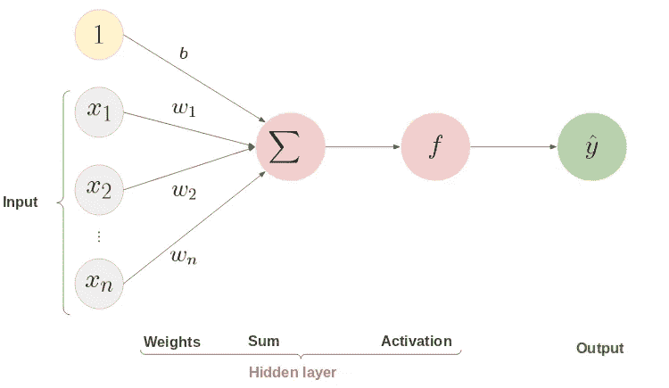
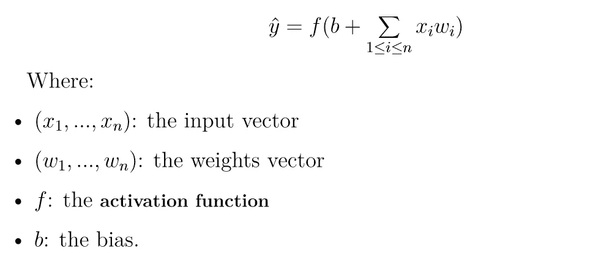
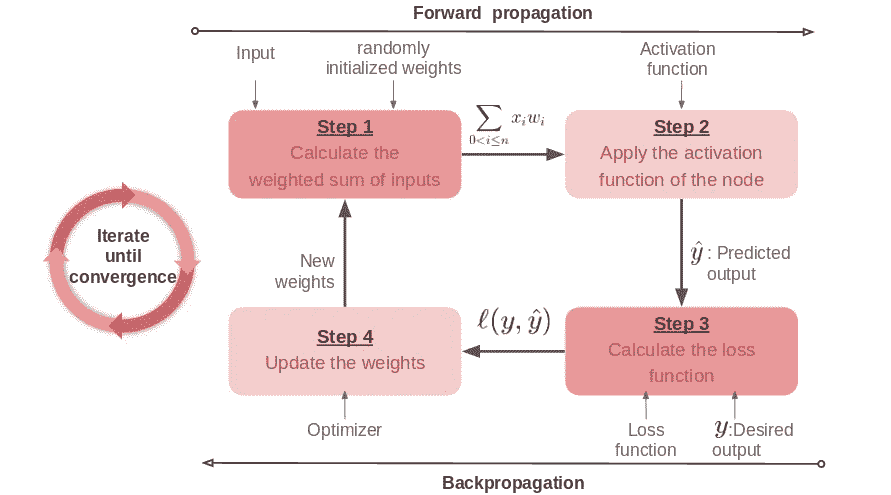
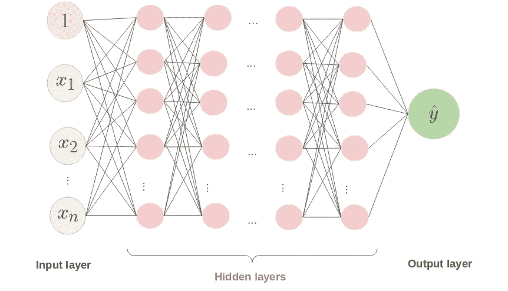

# 3 分钟解释深度学习的基础知识

> 原文：<https://medium.com/analytics-vidhya/understand-basics-of-deep-learning-in-5-minutes-484c6ada47cf?source=collection_archive---------18----------------------->

## 一步一步的实用解释

eep 学习代表了机器学习的一个子领域，它依赖于一种在结构和功能上都类似于人脑的算法，称为人工神经网络。它模拟人类神经元传输和处理数据的功能，将数据转化为有用的信息。

由 [Robina Weermeijer](https://unsplash.com/@averey?utm_source=medium&utm_medium=referral) 在 [Unsplash](https://unsplash.com?utm_source=medium&utm_medium=referral) 上拍摄的照片

神经网络的基本形式是一个**感知器**，它是一个单层神经网络模型，设计用于监督二进制分类，由 Frank Rosenblatt 于 1957 年发明[1]。

# 感知器:

该模型的隐含层由**一个神经元** ( **计算单元**)组成，因此其简单性将有助于我们理解神经网络功能的基础。**正向传播**中感知器的结构如下所示:

作者创建的图像

输入向量的预测输出为:

> 感知器的算法经历两个主要阶段**，首先是正向传播** **，然后是反向传播。**

## 1/正向传播**的步骤**:

*   初始化权重(大部分时间是随机的)和**输入层**，它用数字表示数据。
*   计算输入的**加权和。**
*   将激活函数(可以是整流线性单元、Sigmoid、tanh 或 Softmax…) 应用于无法计算的和与偏差，这给了我们**预测输出**。

## 2/反向传播的步骤:

*   计算并优化预测输出和期望输出之间的**损失函数**(可以是均方误差损失、平均绝对误差损失、二元交叉熵……)
*   更新**权重**。

重复这两个步骤，直到通过在每次迭代中更新权重来最小化误差。

这个简图总结了感知器的学习过程:

作者创建的图像

作为结论，人工神经网络是由**多个感知器**连接而成，并对**不同的**激活函数进行操作。

**隐藏层数**表示网络的深度。因此，一个深度神经网络由**多于一个隐含层**组成如下:

作者创建的图像

**参考文献**:

[1] Marvin Papert Minsky 和 Seymour。感知器，第一卷。麻省理工出版社，1969 年。