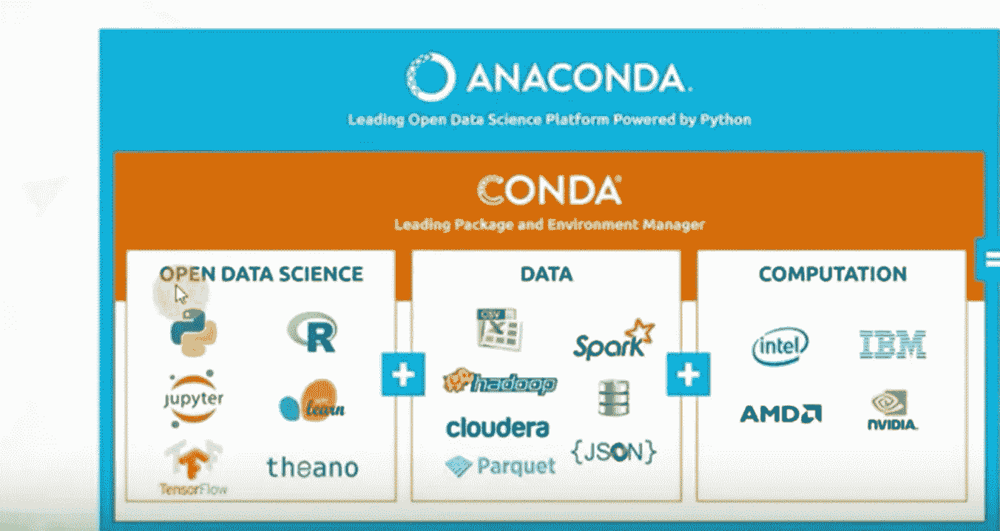
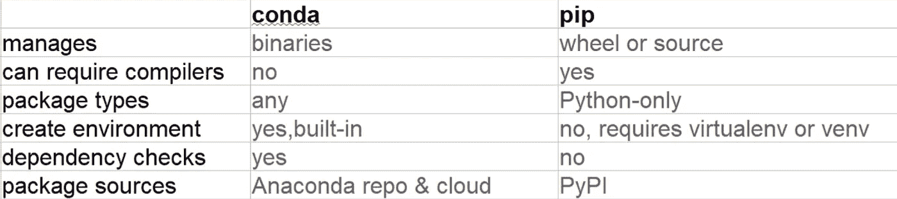

# 了解 Conda 和 Pip

> 原文：<https://medium.com/analytics-vidhya/understand-conda-and-pip-9e5c67da47cc?source=collection_archive---------3----------------------->

康达和皮普太像了，但又太不一样了。虽然，这两个工具的一些功能重叠，但是它们是为不同的目的而设计的。

**Pip(内置于 Python 中)**

[Pip](https://pip.pypa.io/en/stable/) 是 Python 打包权威推荐的工具，用于从 Python 包索引( [PyPI](https://pypi.org/) )安装包。Pip 安装打包成 wheels 或源代码发行版的 Python 软件。后者可能要求系统在成功调用 pip 之前安装兼容的编译器，并且可能安装库。

Pip 安装像 numpy，pandas，matplotlib 等软件包。，以及它们的依赖项。

```
pip install numpy
pip install pandas
pip install <any other library>
```

因此，不同的 Python 资源以 pip 包的形式交付。很多时候，开发人员在不同的项目中使用不同版本的库。在这种情况下，组织不同的 python 包变得很麻烦。一个简单的例子是在同一台机器上做 web 开发项目和数据科学项目。它将把所有的 python 包混在一起。这个乱七八糟的解决方案是 [**anaconda**](https://www.anaconda.com) **。**

**康达**

Conda 是一个开源的包管理系统和环境管理系统，运行在 Windows、macOS 和 Linux 上。Conda 快速安装、运行和更新软件包及其依赖项。它是为 Python 程序创建的，但是它可以为任何语言打包和分发软件。Conda 包和环境管理器包含在 Anaconda 的所有版本中(它是一个用于数据科学的 Python 发行版，包含 conda，如下所示。)、Miniconda 和 Anaconda 存储库。



**b/w Conda 和 Pip 的差异**

1.  Pip 安装 Python 包，而 conda 安装可能包含用任何语言编写的软件的包。
2.  Conda 能够创建隔离的环境，其中可以包含不同版本的 Python 和/或安装在其中的包。这在使用数据科学工具时非常有用，因为不同的工具可能包含相互冲突的要求，这可能会阻止它们全部安装到一个环境中。Pip 没有对环境的内置支持，而是依靠其他工具如[*virtualenv*](https://virtualenv.pypa.io/en/latest/)*来创建隔离的环境。*
3.  *安装软件包时，pip 以递归、串行循环的方式安装依赖项。相反，conda 使用可满足性(SAT)求解器来验证环境中安装的所有软件包的所有要求都得到满足。该检查可能会花费额外的时间，但有助于防止破坏环境的创建。*

*与 Anaconda 存储库相比，PyPI 拥有庞大的存储库*

*将 pip 与 conda 结合的一个主要原因是当一个或多个软件包只能通过 pip 安装时。Anaconda 存储库中有超过 1500 个包，包括最流行的数据科学、机器学习和 AI 框架。这些，以及 Anaconda cloud 上来自 channeling 的数千个额外的软件包，包括 [conda-forge](https://conda-forge.org/) 和 [bioconda](https://bioconda.github.io/) ，都可以使用 conda 安装。尽管有这么大的软件包集合，但与 PyPI 上超过 150，000 个可用的软件包相比，它仍然很小。有时需要一个软件包，它不是作为 conda 软件包提供的，而是在 PyPI 上提供的，可以与 pip 一起安装。在这些情况下，尝试同时使用 conda 和 pip 是有意义的。*

*Conda 和 Pip 的表格比较*

**

## *包裹*

*随着不同工具的出现和消失，重要的是要记住每个人都有不同的需求、偏好和用例，因此您必须自己选择适合您的工具。*

*如果你喜欢我的文章，请让我知道为文章鼓掌。更多即将到来。*