# 以更直观的方式理解模型的顺序。

> 原文：<https://medium.com/analytics-vidhya/understand-sequence-to-sequence-models-in-a-more-intuitive-way-1d517d8795bb?source=collection_archive---------0----------------------->

## TensorFlow 中带有端到端机器翻译示例的序列到序列模型。

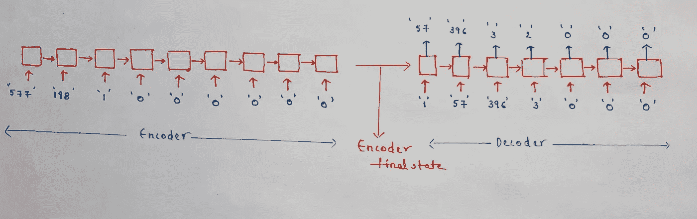

具有样本输入的编码器-解码器模型的详细架构。

## 先决条件:

对 LSTM 和张量流有一个基本的了解就足够了。

## 目录:

1.  引言。
2.  高层架构解释。
3.  数据预处理。
4.  训练编码器-解码器模型。
5.  如何写推论？
6.  结果。
7.  编码器-解码器模型的缺点。

## 1.简介:

编码器-解码器模型用于机器翻译、对话聊天机器人。它还用于图像字幕(给定一幅图像简要描述该图像)、视频字幕(给定一个视频文件简要描述该视频)、LaTex 数学表达式(给定一幅图像的公式生成 LaTex 格式的数学表达式)。

在这篇文章中，我将致力于机器翻译。我们的目标是给出一个意大利语句子，将其转换成英语句子。我已经从这个[源](http://www.manythings.org/anki/ita-eng.zip)获取了数据。它包含超过 33.6 万条意大利语到英语的翻译。

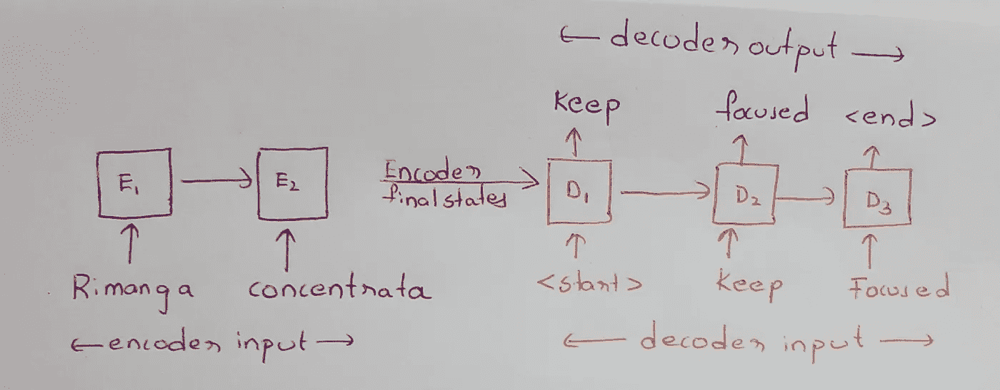

编码器-解码器高级架构

## 2.高层架构解释:

理解架构有助于我们了解应该如何准备数据。我们的模型有两个模块编码器和解码器。每个模块包含一个递归神经网络(RNN)。e₂e₁分别是时间步长 1 和 2 的编码器 RNN。d₂d₁分别是时间步 1 和 2 的解码器 RNN。

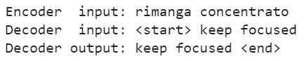

样本值输入

编码器输入是一个意大利句子。解码器输入是在句子前带有开始标记(< *start* >)的英语句子，解码器输出是带有结束标记(< *end* >)的同一句子的一个时移版本。我们将在后面的章节中理解( *<开始>* )和( *<结束> )* 标记的重要性。

样本数据的基本编码器-解码器模型说明:

*   编码器输入将被发送到编码器 RNN。它将在两个时间步骤后返回单元格状态和隐藏状态(因为输入的意大利语句子的长度是 2)

> 这些状态被传递给解码器，并作为解码器的初始状态。这意味着只有当你听完整个意大利句子，你才能开始把它翻译成英语。

*   给定这些初始状态，解码器的第一步' *< start >* '将作为输入发送。我们希望我们的模型预测单词*‘keep’*。
*   在第二个时间步，*“保持”*将作为输入发送，我们希望我们的模型预测*“聚焦”*。并且继续进行，如上图所示。

> 这种将解码器输入移动一个时间步长并将其用于解码器输出的方法称为教师强制。

## 3.数据预处理。

清理数据，下面的代码将数据转换成小写，规范字符串，删除不需要的字符，并在标点符号前添加一个空格。

代码:清理输入字符串。

让我们清理样本点的字符串并检查输出。

代码:清除样本数据点的文本数据。

现在将这段代码包装在一个函数中，该函数将' *num_examples* '作为输入参数，并返回输入输出对。

代码:返回特定数量的编码器输入、解码器输入和解码器输出的函数

为了简单起见，只生成 20K 意大利语-英语序列对。

```
num_examples=20000
ita_data,eng_in,eng_out,eng_data=makedata(num_examples)
```

将文本数据转换成数字形式，一个简单的方法是应用记号化器并将文本数据表示成整数表示。

代码:初始化意大利语标记器

默认情况下，Tokenizer 将删除所有标点符号，因为我们已经在预处理中处理了标点符号，所以我们添加了带有空字符串的 filters 参数。应用*填充*，以便每个序列都是相同的形状。

代码:将意大利文本数据转换为整数序列，然后进行填充。

类似地，我们将标记化应用于 decoder_input 和 decoder_output。

代码:标记解码器输入和输出

令牌化后的样本输入数据，额外的零是由于填充使得每个输入序列具有相同的长度。

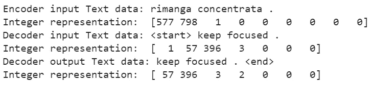

Tokenizer 还将单词索引对存储在字典 word_index 中。

生成单词及其索引的查找表，这将有助于推理。

打印字典 eng_word_index 的前 15 个值。

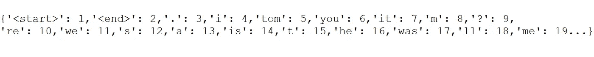

图:eng_word_index 的输出(仅前 15 个值)

让我们看看输入和输出的形状，以及意大利语和英语在标记化后的词汇量。

所有意大利语句子的长度都是 9，英语句子的长度是 7。英语句子中共有 2250 个独特的单词，意大利语句子中共有 5524 个独特的单词。

样本值输入


抽样输出

让我们用样本输入重新绘制编码器-解码器架构。

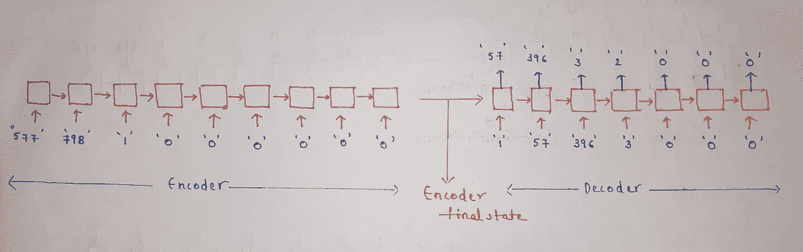

具有样本输入的编码器-解码器模型的详细架构。

## 4.训练编码器-解码器模型。


编码器-解码器模型培训

这里我们选择 LSTM 作为我们的 RNN 层。不过，你也可以选择 GRU。

对于我们的编码器 RNN，我们将传递我们的输入序列，输入形状将是(批处理大小，输入序列长度)。

在将我们的输入发送到 LSTM 图层之前，LSTM 图层需要一个 3D 输入。我们当前的输入形状是二维的。一个简单的方法是添加一个嵌入层。

代码:初始化编码器输入并将其传递给嵌入层。

现在嵌入后的形状是(Batch_size，inp_seq_length，output_dim)，(也就是(Batch_size，9，128))。让我们把嵌入层的输出传递给 LSTM 层。让我们称这一层为 encoder_lstm。

代码:完整的编码器代码

因为我们想要编码器的最终状态，所以我们给 return_state =True。这将返回给我三个输出。最后一个时间步长的 hidden_state/output(无，256)，最后一个时间步长的 hidden_state/ output(无，256)，最后一个时间步长的 cell_state(无，256)。

让我们取最后两个张量 hidden_state 和 cell_state。我们将把编码器的这些最终状态作为初始状态传递给解码器。

将隐藏状态和单元格状态保存到变量 encoder_states

类似地，我们将把 decoder_input 传递给一个嵌入层，然后把它传递给一个 LSTM。

代码:完整的解码器代码。

如果你仔细观察上面的代码:

1.  我们作为输入传递给解码器层的形状不是 target_sequence_length(它是 7)。在训练期间，我们将传递长度为 7 的输入，但是在推理期间，我们一次只传递一个输入。因此，如果我们保持*‘None’*，它将在两种情况下都有效。我们将在本帖的推理部分更详细地理解它。
2.  decoder_lstm 有一个属性初始状态，就是 encoder_final 状态。

decoder_lstm 返回三个输出。

*   所有时间步长的隐藏状态/输出。(无，无，256)。
*   最后一个时间步的隐藏状态/输出。(无，256)
*   最后一个时间步长的单元状态。(无，256)

每个时间步长的输出都是形状(无，256)。但是，在每个时间步，解码器输出应该是 eng_vocabulary 中的一个单词。通过 units=eng_vocab_size 向每个解码器输出传递一个密集层，如下所示。

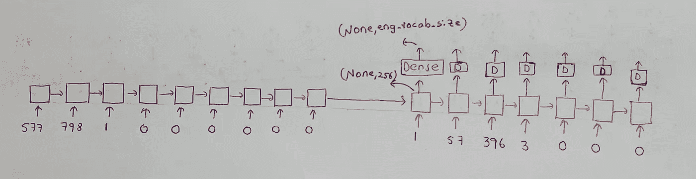

在每次解码器输出后传递密集层(units=eng_vocab_size)。

由于我们希望在每个时间步通过密集层，因此用时间分布层包裹密集层。

Code:密集层到解码器输出的每个时间步。

我们的模型有两个输入，编码器输入，解码器输入和一个输出密集输出。

带编码器和解码器的最终模型

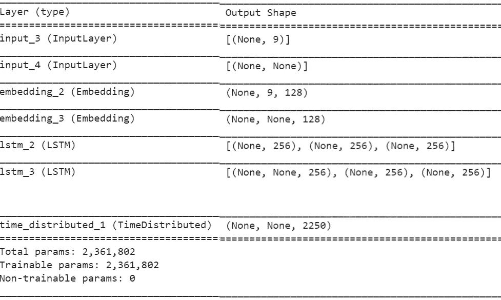

模型摘要

> 我们在每个时间步的 *dense_output* 形状的预测值是 *(None，eng _ vocab _ size)soft max probabilities*，但是目标即 *tar_lan_out* 是一个整数序列数据。两个形状不匹配。！！怎么办。

我们可以在训练之前将我们的目标数据转换成 *one_hot_encoded* 形式，或者使用损失函数作为“*sparse _ category _ cross entropy*”。

在开始训练之前编译模型。

现在是训练模型的时候了。

开始训练模型。

## 5.推论:


用示例说明编码器-解码器模型中的推理

请继续阅读该部分，以理解我们在推理部分到底在做什么。

> 给定一个意大利序列，如果我们使用 model.predict(seq)，你会得到一个错误。请记住，我们需要有两个输入编码器 _ 输入和解码器 _ 输入，然后只有你会得到解码器 _ 输出。

该模型将采用两个输入意大利语序列和英语序列，您将获得输入的时移版本，如下所示。


标记化后的输入和输出示例

> 但是我们的目标是预测一个只有意大利语句子的英语句子。

因此，很明显，我们不能使用我们已经培训过的相同模型，让我们稍微修改一下这个模型，以便它能为我们的目的服务。

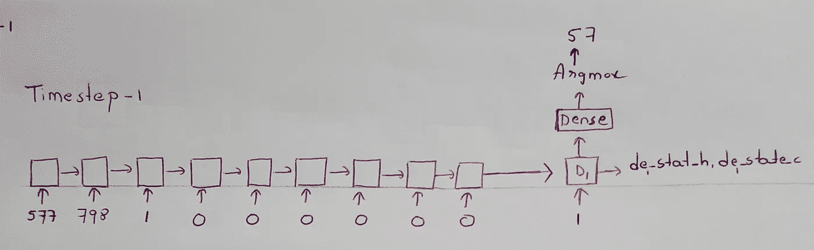

时间步长 1 的解码器

让我们把它分解成每一个时间步。像往常一样，我们将输入发送到编码器，并获得最终状态。在解码器的第一个时间步，用编码器最终状态初始化，并发送输入 *1。(**的文字索引<开始>)。*这有助于解码器理解这是序列的开始。

解码器输出形状(无，256)被传递到密集层(无，eng_vocab_size)。为了得到解码器以最大概率预测的字，应用 Argmax。

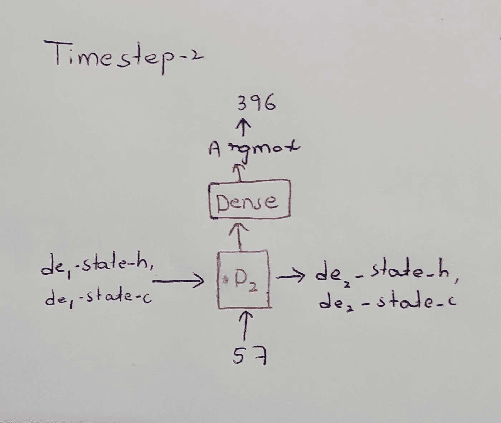

时间步长 2 的解码器

在时间步长-2 D2 中，将采用两个输入，先前的状态值和先前的输出。

如左图所示，D2 采用先前的状态值和输出。

像往常一样，我们将在解码器的顶部应用一个密集层，并在顶部应用一个 argmax 层，以获得单词的 token_id 表示。

如下所示，D2 州值将用于下一个时间步长。

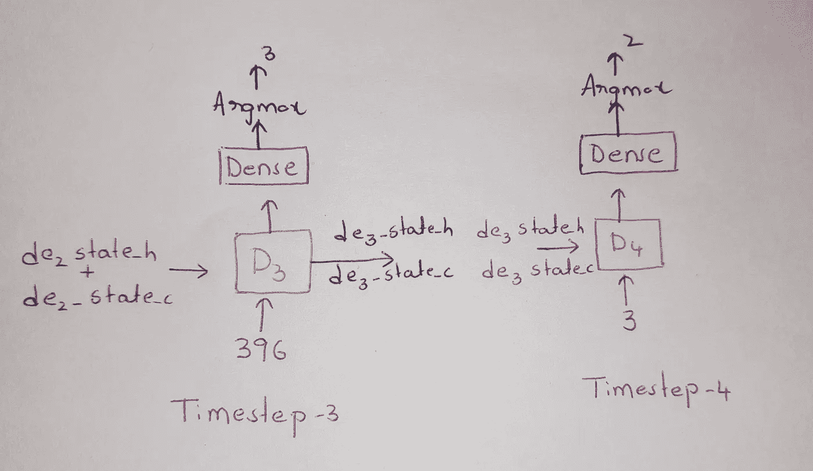

时间步长 3 和 4 的解码器。

时间步骤 3 和时间步骤 4 的流程类似。为了更好的理解，请浏览下面的图片。

在时间步长-4 中，解码器已经预测了 *2( <停止>)。*一旦解码器预测到<停止>表示句子完成，我们将停止解码器。

让我们构建一个*编码器 _ 模型*，它接受一个输入 _ 序列并给出状态值。

推理编码器模型—在给定输入序列的情况下返回 encoder_lstm 输出

> encoder_model 给出最终的状态值，然后退出画面。

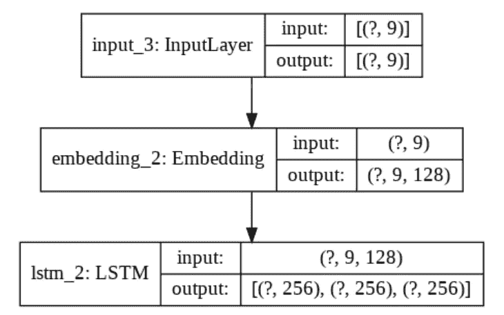

编码器型号摘要

如左图所示，编码器接受 shape(None，9)的输入，9 是意大利语序列的 max_length。

输入被传递到嵌入层，然后传递到编码器 _LSTM，返回单元状态值。我已经在前一节讨论了这些形状。

> 创造一个没有经过训练的新模型有什么用，之前做的训练不会变得没用吗？

如果你观察清楚，我们使用的是相同的图层。为了进一步确认，打印编码器嵌入层的前 10 个权重。在编码器模型中，嵌入层是第二层，在我们的训练模型中，它是第三层。

将编码器模型的权重与我们在上一节中训练的模型进行比较。

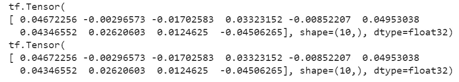

编码器模型和训练中使用的模型的权重

我们来定义一下 decoder_model。它需要三个输入:输入序列、隐藏状态、单元状态。

解码器型号的输入。

将解码器输入传递到嵌入层。然后传递给 decoder_lstm。

解码器模型的推理

将解码器输出传递到密集层，以找到解码器预测的每个单词的概率。

将解码器模型传递到密集层

> decoder_embedding_layer、decoder_lstm、decoder_dense 是我们在训练时在解码器中使用的相同层。

将所有东西放在一起并定义模型。decoder_model 采用两个输入 input_sequence 和初始状态，并返回两个输出，即每个字的概率输出、单元状态值。

推理的完全解码器模型

可视化架构:

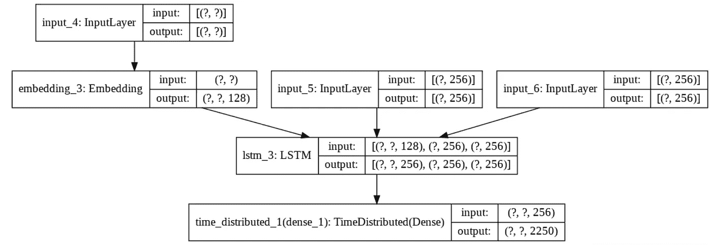

解码器模型有三个输入，第一个输入被传递到嵌入层，另外两个输入是单元状态和隐藏状态。

1.  将输入序列传递给编码器，并获取 encoder_final_state 值。

将样本序列传递给编码器模型并获取输出

2.用<start>令牌的 word_index 值初始化一个变量 target_variable。</start>

用<start>初始化形状(1，1)的目标字。</start>

在解码器的第一个时间步，将目标变量和编码器最终状态发送到解码器模型，以获得输出和状态。

> 我们只向解码器发送一个形状字(1，1)。但是在训练中，如果我们已经将 input_to_decoder 的形状声明为(Batch_size，max_len_sentence ),那么我们的推断可能不起作用，因为解码器接受 max_len_sentence 的 input_length。
> 
> 因此，为了使 input_to_decoder 能够接受任何长度的句子，并在训练和推理过程中工作，我们将 input_to_decoder 的形状声明为(None，None)。

将编码器状态和<start>传递给解码器并获得输出</start>

将 argmax 应用于输出，以获得解码器以最高概率预测的单词。

向解码器输出传递一个 argmax，以获取解码器以最大概率预测的单词。

我们将继续这个过程，直到到达字符串的末尾或句子的最大长度。

为我们的解码器添加一个终止条件。

将所有内容组合在一起，包装在一个推理函数中，该函数将意大利语序列作为输入，并返回英语句子。

代码:完整的推理代码

## 6.结果:

以下是一些结果。如果您想生成以下格式的结果表，请随意查看博客末尾引用的代码库。

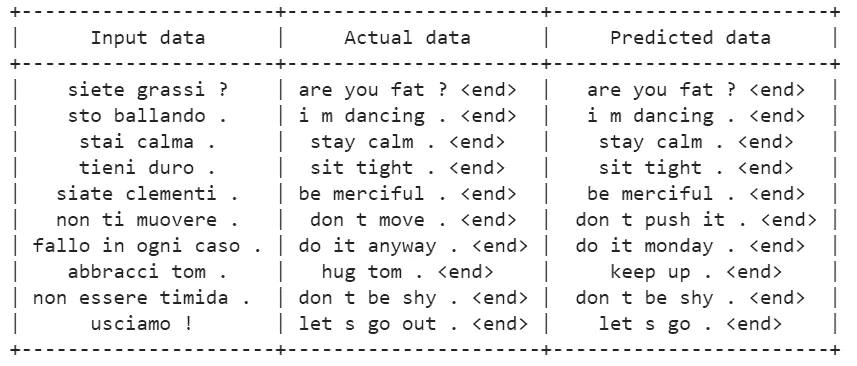

训练后获得的输出。

是的，如果你仔细观察，有些结果并不太好。我们将在下一节讨论我们能做些什么。但至少有了 20k 行的训练数据，我们得到的预测词拼写是正确的。

> 要进一步提高模型性能，请在整个数据上训练模型，使用嵌入层、LSTM 大小。
> 
> 为什么你认为我们的模型没有任何拼写错误？

请记住，我们对每个单词进行了标记和索引。所以每次我们的解码器预测字典中的任何单词。所以没有机会犯拼写错误。

> 如何让解码器学习新单词？

不要在单词级别进行标记，而是在字符级别进行标记。所以每次解码器都会预测一个字符。就代码而言，这是一个小变化。

```
Tokenizer(filters='',char_level=True)
```

## 6.模型的缺点:

我已经在[笑话数据集](https://www.kaggle.com/jiriroz/qa-jokes)上训练了相同的模型。它包含一个问题(“小鸡为什么要过马路”)、相应的答案(“为了到达另一边”)和一个唯一的 id。与我们在帖子中使用的数据集相比，独特单词的数量和句子的长度相对较大。你可以在我的 GitHub 知识库中找到这个模型的笔记本细节和语言翻译模型。

> 声明:笑话数据集可能会冒犯一些人。我只是用它来学习。

经过 50 个时期的训练，这个模型没有学到很多东西，这是我得到的一些结果。

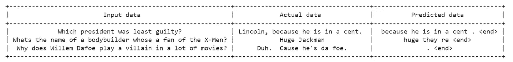

笑话数据集的输出。

问题出在编码器上，给定一个 100 个单词的句子，编码器给解码器的只是两种状态。编码器不能捕捉句子的本质。

> 当我们将一段信息从意大利语翻译成英语时，让我们从人类的角度来理解这一点。我们不会读整段，然后逐字翻译。我们所做的是读几行意大利语，然后翻译成英语，读几行，然后翻译回来…直到段落结束。

如果我们可以建立一个系统，在预测之前从所有编码器状态中提取信息，而不是只获取最终状态，那么它就可以很好地工作。同样叫 ***关注*** 哪个比较受欢迎。注意力是如何工作的超出了这篇文章的范围。

我很高兴你已经走到了最后，并在理解序列中迈出了下一步，以更紧密地对模型进行排序。如果你能给我任何形式的反馈，我将非常高兴。

你可以在这个 GitHub [链接](https://github.com/GowthamChowta/Machine-Translation-blog)中找到完整的代码。也可以在 [LinkedIn](https://www.linkedin.com/in/gauthamchowta/) 上联系我。

# 参考资料:

1.  [https://blog . keras . io/a-ten-minute-introduction-to-sequence-to-sequence-learning-in-keras . html](https://blog.keras.io/a-ten-minute-introduction-to-sequence-to-sequence-learning-in-keras.html)
2.  [应用人工智能课程](https://www.appliedaicourse.com/)


如果你觉得这个博客有用，请点击拍手按钮，让我的一天更快乐..:)