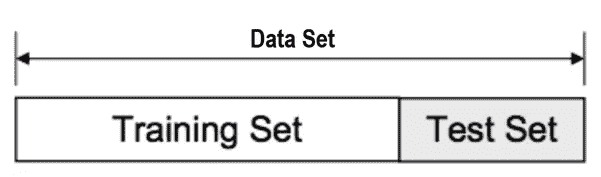
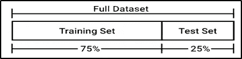
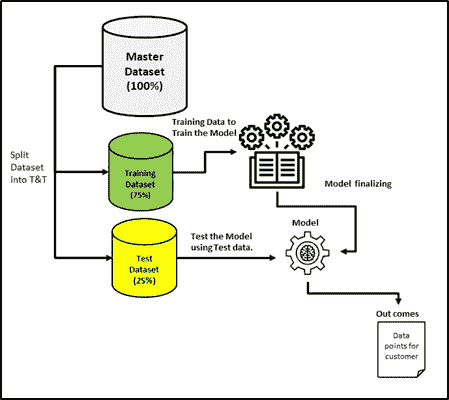
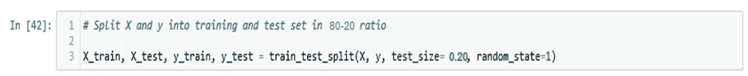
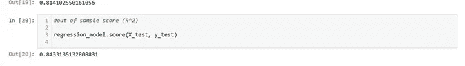
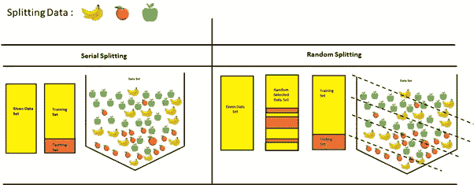
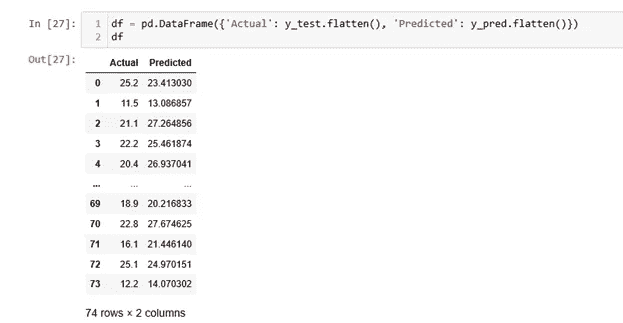
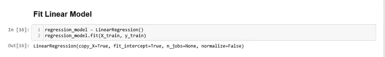
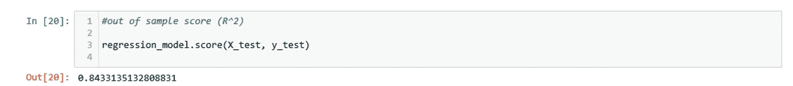

# 了解数据集中的训练和测试分割(ML 流程…续..)

> 原文：<https://medium.com/analytics-vidhya/understand-train-and-test-split-on-your-data-set-ml-process-cont-fbad7c497850?source=collection_archive---------7----------------------->

让我们讨论用给定的数据集训练和测试你的模型。当然，你可以假设学生是如何在委员会考试前接受学校/大学优秀教师的培训，通过不同形式的考试为期末考试做准备的。可能是单元测试/学期考试/复习/突击测试等等。在这里，我们使用问题和混合场景的各种组合进行训练。希望你们在学习中多次遇到这些情况。数据科学中的数据集也不例外:)因为我们需要在进入生产环境之前建立非常强大的模型，这是继 EDA、功能工程步骤之后的非常重要的过程。

同样，在数据科学领域，在部署到生产环境之前，在模型满足实时/流数据之前，模型已经由样本数据训练，并使用可用数据集预测值。

这个过程总是帮助我们理解数据的洞察力，以及我们可以使用什么/哪种模型来处理我们的数据集/源/以解决业务问题。这里，我们必须注意数据集，它应该与实时/流数据馈送相匹配(与所有组合保持一致)，而模型在生产环境中执行。所以，数据集的选择(数据准备)在 T&T 过程之前是非常关键的。否则模型的情况变得可悲…如下图所示😊。可能会有巨大的努力损失，对项目成本的影响，并以不满意的客户服务而告终。

> 在这里你应该问我以下问题。
> 
> 为什么要将数据分成训练集和测试集？
> 
> 什么是好的列车试拆分？
> 
> 如何将数据分为训练和测试？
> 
> 什么是培训和测试准确性？
> 
> 如何在 Python 中将数据拆分成训练和测试？
> 
> 什么是 X_train 和 Y_train X_test 和 Y_test？
> 
> 列车测试拆分是随机的吗？
> 
> 训练集和测试集有什么区别？

问题！

**你如何将数据分为训练和测试？**

**80/20** 无疑是一个很好的起点。稍后，您可以根据模型性能和数据量进行调整。75/25 也是最好的分割！。

*训练数据是用来训练模型的数据集。*

*模型从中学习经验的训练数据。*

*训练集用于拟合和调整您的模型。*

*测试数据是用于检查模型是否从训练数据集中获得足够好的经验的数据。*

*测试集是用来评估你的模型的“看不见的”数据。*

训练和测试分割

T&T 过程

**什么是培训和测试准确性？**

> *答:训练精度通常是我们将模型应用于训练数据时得到的精度*
> 
> *b .测试准确度是指测试数据的准确度。*

对这些进行比较有助于识别在 ML 过程中训练和测试集做得如何。

*精度*

**什么是 X_train 和 Y_train X_test 和 Y_test？**

1).X_train —这包括您的所有自变量，*(将共享自变量和因变量的详细注释)*这些将用于训练模型。

2).X_test —这是数据中独立变量的剩余部分，不会在训练集中使用。主要用于进行预测，以检验模型的准确性。

3).y_train —这是需要由模型预测的因变量，包括自变量 x 的类别标签。

4).y_test —这是因变量的剩余部分。这些标签将用于测试实际类别和预测类别之间的准确性。

> 注意:在训练/拟合模型之前，我们需要指定我们的因变量和自变量。识别这些变量是一个巨大的挑战，它应该来自我们将要解决的业务问题陈述。

**列车测试拆分是随机的吗？**

下图简单明了地解释了随机拆分的重要性！你可以从绘画作品中理解！

在简单的文本中，模型可以理解给定数据集中存在的所有数据组合。

random_state 参数用于初始化内部随机数发生器，该发生器将决定将数据分成训练和测试。

让说！random_state=40，那么在第一次进行分割时，您将始终获得相同的输出。如果您想要可再现的结果来最终确定模型，这将非常有用。

随机分裂

实际与预测

之后！火车和测试分裂了！我们应该对数据集 X 和 Y 应用算法/建模

感谢您花时间阅读这篇文章！希望！你们都知道 ML 过程中培训和测试的划分。除此之外，我们在同一行中还有一些概念，如验证集、过拟合和欠拟合、超参数等等！将一一涵盖！再看！