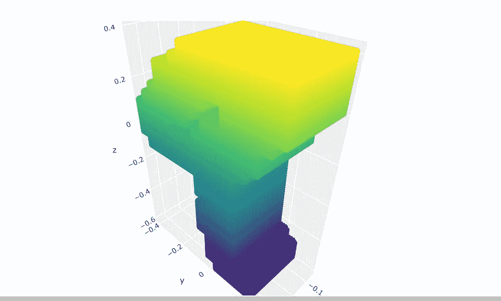
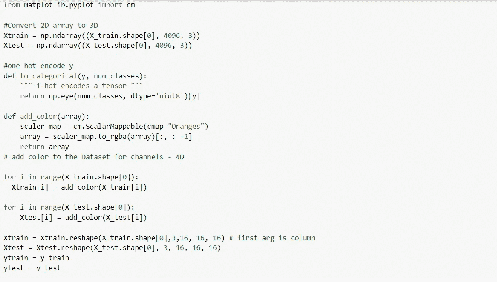
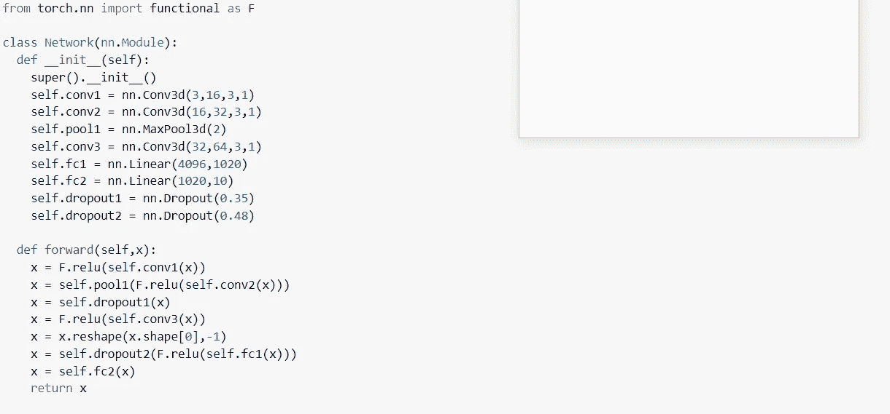
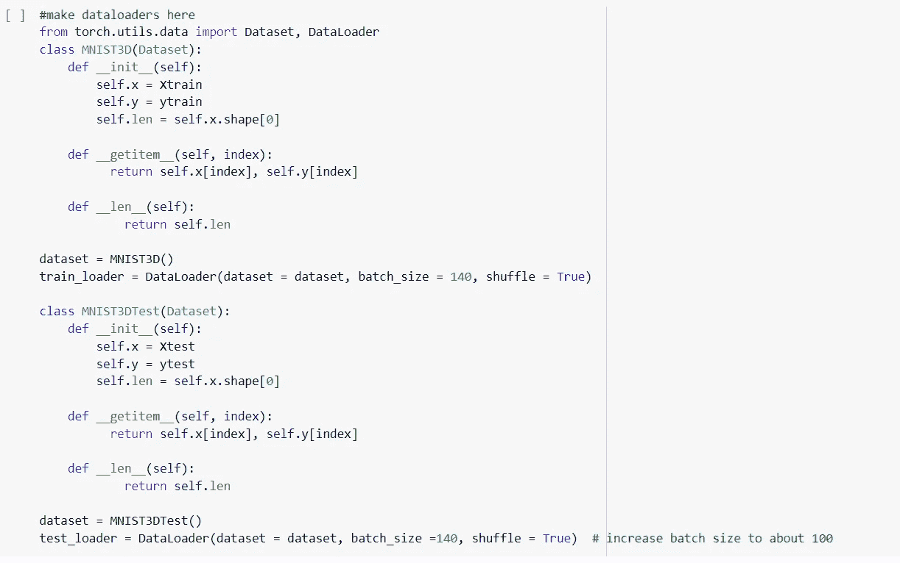
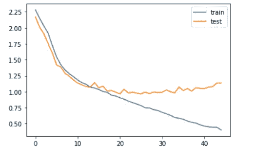

# 使用 3D MNIST 数据集理解 3D 卷积神经网络

> 原文：<https://medium.com/analytics-vidhya/understanding-3d-convolutional-neural-networks-using-3d-mnist-dataset-5d34e8d8a807?source=collection_archive---------13----------------------->

使用 3D 数据集的机器学习在计算机视觉中非常重要。*自动驾驶’*汽车需要大量的 3D 数据才能高效地工作和操作。在本文中，我使用 kaggle 上提供的 3D 版本的 MNIST 数据集，并展示如何预处理和可视化数据，以及创建一个 3D 卷积神经网络(CNN)模型来拟合此数据。

在进一步创建模型之前，现在是前往 [kaggle 下载数据集](https://www.kaggle.com/daavoo/3d-mnist/data)的好时机。如果你读了 kaggle 上关于体素化的描述，但不明白发生了什么，不用担心，我会在下面解释，否则你可以跳到数据可视化部分。

**体素:**体素可以被认为是 3D 图像的一部分。如果你取一个 2D 矩阵，它被分成由两行(宽)和两列(高)相交而成的*单元*。在 3D 空间中，这被称为体素，体素具有宽度和高度以及长度。换句话说，细胞可以表示为(x，y ),而体素表示为(x，y，z)。像细胞如何重复以形成矩阵一样，体素也重复以形成 3D 图像。分割 3D 图像的过程被称为*体素化。*

**数据可视化**

对于数据可视化，我们将使用 [plotly.j](https://plot.ly/javascript/) s。我发现它在交互式 3D 绘图时非常有用。下面是 colab 中数字 9 的渲染图(我的整个 Google colab 代码可以在[这里](https://colab.research.google.com/drive/1ifqo3apVi-I6L6TGE-i6TvUE6QJEviJ0)找到)。

**给我看看代码**

数据操作

Kaggle 已经为我们做了所有的清洁工作，所以我们不需要再做了。首先，打开文件，将变量分配给 Kaggle 提供的测试和训练数据集。现在，由于我们将处理 3D 数据，并且训练和测试数据是 2D，我们必须将 2D 重塑为 3D。我们从 *n*4096*3* 转换而来，其中 *n* 是列号。由于我们是用深度学习做多分类，辅助函数*to _ categorial(y，num_classes)* one-hot 对代表我们类的 y 进行编码。

**添加颜色**

不幸的是，仅将数据转换为 3D 无助于我们的分类，因为我们将在三个不同的维度上大步前进，我们需要向数据集添加一个参数，使数据集的维度成为 4D。这里的第四维是颜色，辅助函数 *add_color(array)* 就是这样做的。最终数据集被整形为 *n*3*16*16*16* 张量，为我们的 3D 卷积做准备。

**模型建筑**

随着模型的建立，我建议你尝试一些卷积，把你自己集中起来，看看你的模型表现如何，如果不行，你可以测试我的模型，看看它是如何工作的，甚至可以尝试迁移学习。无论您做什么，不要在没有试图理解正在发生什么的情况下复制粘贴(这是本文的全部目的)。

**训练和测试**

在我们开始训练或测试模型之前，我们需要做这些批处理，因为 colab ram 不能一次处理所有的数据。因为我们不能在不创建某种数据加载器的情况下直接批量使用它，这正是我们要做的。

Pytorch 自定义数据加载器需要 getitem、init 和 len 方法，所以只需像我在 googe colab [代码](https://colab.research.google.com/drive/1ifqo3apVi-I6L6TGE-i6TvUE6QJEviJ0)中那样添加这些方法，并为训练集和测试集获取相应的数据加载器。我发现的一件重要的事情是，小批量(< 30)对模型性能没有帮助，所以选择≥ 100。您可以随意使用这个参数。如果您的训练损失在一两个时期后趋于平稳，则您的模型可能没有从数据集学习，您可能需要增加数据加载器的批处理大小。

我们都准备好训练模型了。为此，我会建议你玩玩时代和损失函数或优化器的类型。

**结果**

我首先在数据集上运行随机森林，因为我发现它在分类任务方面非常“强大”，它达到了 67.85%的准确率。经过 35 个时期后，3D CNN 达到了 68.10%的准确率，虽然这与随机森林的差异并不大，但我相信用不同的模型进行实验会对相同的数据集产生更高的准确率(> 75%)。对于纪元，我认为 20 到 30 个纪元对于一个简单的模型应该足够了，但是对于更复杂的模型，也可以自由地进行实验。下面是模型第一次运行的训练与测试损失。

培训 vs 测试损失 3D CNN

就是这样，如果你发现文章的任何部分令人困惑或难以理解，请在评论中留下。

链接到我的 colab 代码[**这里**](https://colab.research.google.com/drive/1ifqo3apVi-I6L6TGE-i6TvUE6QJEviJ0)