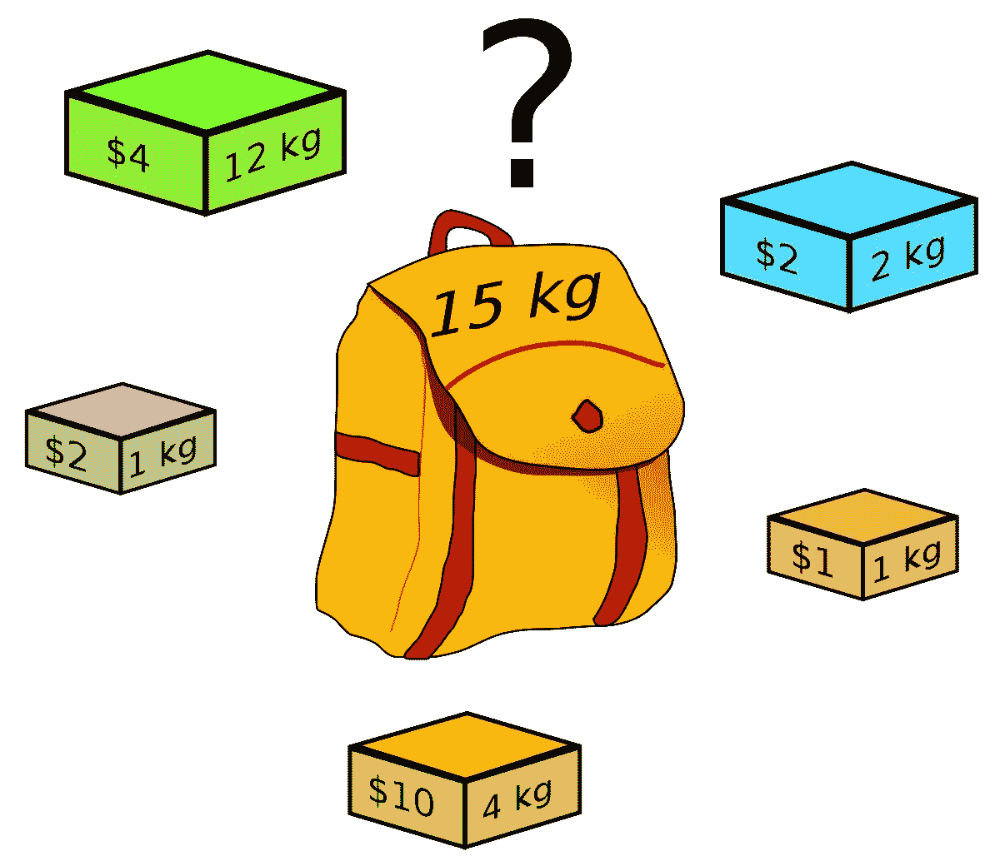
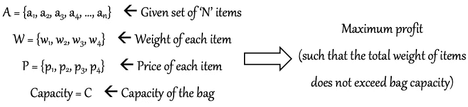
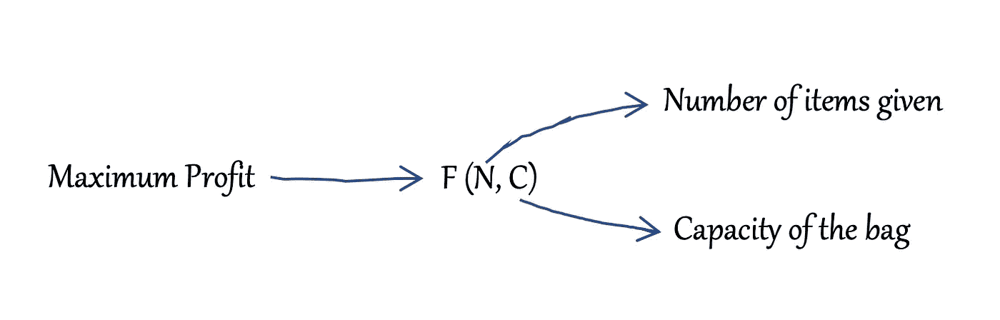
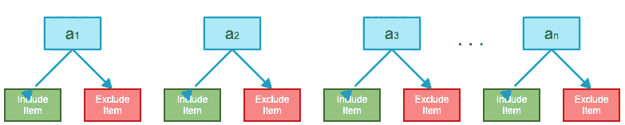
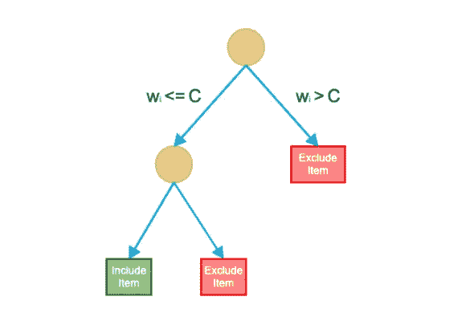
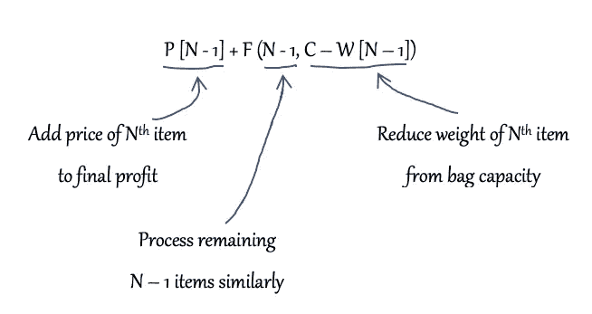
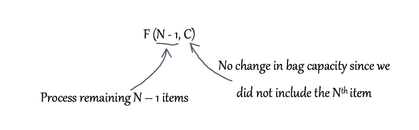

# 动态规划第 1 部分:识别和处理问题

> 原文：<https://medium.com/analytics-vidhya/understanding-a-dynamic-programming-problem-3b6bf4b5019d?source=collection_archive---------17----------------------->

本文试图说明如何确定一个问题可以用动态规划技术来解决，并以 0/1 背包问题为例说明如何求解。

# 问题陈述

给你一套“n”件物品和一个最大容量为 w 的袋子，每件物品都有重量和价格。你的任务是选择并添加物品到袋子中，以获得尽可能多的利润。您可以向包中添加物品，直到物品的总重量不超过包的容量。

# 分析

让我们尝试分析这个问题陈述，并验证是否可以应用动态规划方法来解决这个问题。你怎么决定的？嗯，你可以在问题中寻找一些东西来确定它是否可以通过动态编程技术来解决

提示 1:问题是否给了你选择的机会？在这个问题中，你被要求从一个给定的集合中挑选物品来实现一个目标。这意味着你有两种选择。您可以选择向包中添加物品，也可以选择不添加。

**提示 2:目标是优化某种结果吗？**在这个问题中，你被要求将物品放入袋子中，以获得尽可能多的利润。因此，目标是获得最大利润。不同的问题可能有不同的目标。

**不要犯这个错误:**一旦你明白这是一个可以应用动态编程技术的问题，第一个错误就是试图画一张表来寻找解决方案。不要跳到那张桌子上。画表是解决问题的最后一步。

现在我们继续分析。为此，让我们以更简单的形式写下我们所理解的问题输入和输出。

掌握动态编程最重要的技能是学习如何将问题分成子问题。要发展这个技能，首先要尽可能多的练习分而治之型题，学会写递归关系。一旦你知道如何将问题分解成子问题，动态编程就没有什么特别的了。

在我们尝试解决这个问题之前，让我们如下图所示表示我们想要的最大利润

# 接近解决方案

如前所述，我们对每件物品有两种选择——我们可以选择将物品放入包中，也可以选择不放入。

所以现在，基本上我们必须仔细检查每一件物品，确认物品的重量是否小于行李的容量。如果物品重量超过行李容量，我们只有一个选择，即排除该物品。如果物品重量小于或等于行李容量，则我们有两种选择，即要么将该物品放入行李，要么将其排除在外。我们要计算两种情况下的利润，取最大利润作为最终结果。这整个逻辑可以表示为如下所示的选择图。得到这个选择图是通过动态规划技术解决任何问题的最重要的一步。

因此，让我们从最后一个项目，即第 n 个项目开始扫描。我们要么包括第 n 项，要么排除它。

**包含物品:**如果我们包含第 n 件物品，那么它的价格将被添加到最终利润中，其重量将从袋子容量中减去。因此，可以表示如下

**排除项:**如果我们排除第 n 项，那么最终利润将是利润或剩余的 n — 1 项。这可以表示为如下所示

**最终关系:**因此，最终的递归关系将如下所示

在下一篇文章中，我将讨论如何将这种递归关系转换成自顶向下的动态编程代码