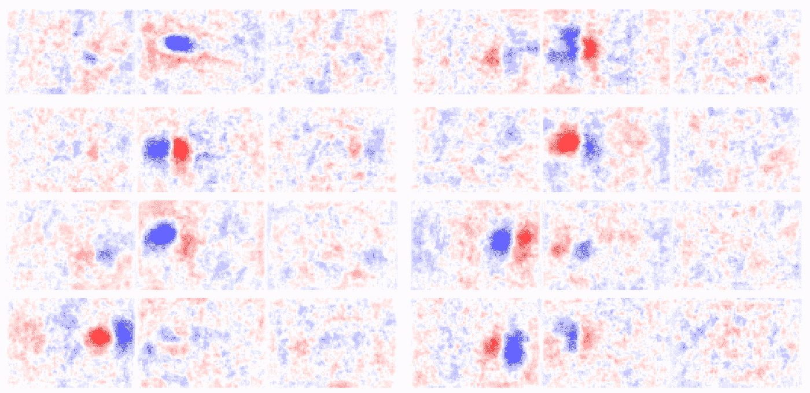

# 理解一只老鼠就像闻到颜色 9！

> 原文：<https://medium.com/analytics-vidhya/understanding-a-mouse-is-like-smelling-the-color-9-fe74534f4579?source=collection_archive---------18----------------------->

## 计算神经科学研究项目:如何利用好一个小鼠神经元对不同刺激的反应数据？

# 一.导言

**A .背景**

视觉皮层主要负责处理视觉信息。它接收来自丘脑的神经元信号，并通过管道传递这些信号，管道对信号进行提炼和整合，以产生高级概念。这条管道的第一阶段被称为 **V1** ，也被称为可视区域 1。该区域接收来自丘脑的非常低水平的原始神经元信号。由于 V1 是管道中的早期阶段，其神经元感受野对落在视网膜上的图像中的低抽象特征敏感。V1 包含数百万个神经元，它们以不同的模式一起放电，对从丘脑接收到的不同刺激信号的信息进行编码，这在神经科学中被称为群体代码。

**B. MouseLand 数据集
— 1。数据集收集背后的技术**

2019 年，**斯特林格等人。艾尔。[4]** 在一个最先进的数据集上，成功地收集了不同视觉刺激下小鼠 V1 区约 10000 个神经元的同步记录。作者使用共振扫描双光子钙显微术，使用间隔 35 𝜇m.的 11 个成像平面，他们以 2.5 Hz 的扫描速率捕获这些图像，结果表明高达 30 Hz 的高扫描速率在解释刺激相关的变化方面没有提供显著的改善。使用**suite 2p****toolbox【1】**处理捕获的图像，以产生神经元尖峰频率响应。

Suite2p 的流水线由四个独立的阶段组成:1)图像配准；2)感兴趣区域(ROI)检测；3) ROI 标记和质量控制；4)利用神经毡校正和尖峰去卷积的活动提取。

在[2]中，作者使用相同的技术监测小鼠神经元活动，并表明尽管相当嘈杂，但视觉皮层可靠地编码正交维度上的视觉刺激的表示。在他们的数据集发表后，作者还提出了一种潜在的更可靠的方法来检测神经活动尖峰，并在[3]中进行了讨论。因此，将来有可能获得类似但更可靠的数据。

使用主成分分析对已发布数据进行的初始实验表明，数据服从幂低，即第 n 个主成分方差的比例为 1/n。似乎没有其他研究对该数据进行分析并获得任何有意义的结果。

**— 2。收集的数据**

七只老鼠被仔细地展示了从 ImageNet 数据集中挑选出来的一些他们认为对老鼠更有意义的图片，如猫、狗、洞等。在彼此成 90 度角放置的 3 个屏幕上观看图像，其中前屏幕具有图像，而另外两个侧屏幕具有随机旋转和/或镜像的相同图像。下面是一个例子:

作者连续两次向每只小鼠提供大约 2800 张刺激图像，并记录小鼠的神经元反应。每 20 幅图像中有一幅是灰色或黑色图像，显示在屏幕上以记录小鼠大脑中代表神经元活动的静止状态反应的自发活动。

该过程在不同的日子重复两次，以允许分析最大数量的图像，同时允许基于交叉验证的分析。为了进行交叉验证，作者使用了在第一次重复实验中训练的简单最近邻来预测第二次重复实验中负责响应的图像。最近邻模型达到了 75.5%的准确率。尽管作者发现解码精度在~10K 神经元的群体编码时没有饱和，并且增加更多的神经元增加了精度。这个数据集在同时记录的神经元数量方面被认为是一个突破。

**C .数据集中的挑战**

使用机器学习技术处理这类数据集面临许多挑战。例如，Mouse-Land 数据集的**数据点(实例)与达到～10K 特征(神经元反应)的特征数量**之比很小，每只老鼠有～7K 数据点(图像)。

此外，这种数据的特点是“信噪比”低，这可能导致所谓的“T4”去混合问题。当我们有一系列神经元的记录，并且我们想要区分两个不同神经元的信号时，这个过程通常不是直截了当的。换句话说，科学家在查看同一刺激的多个神经元记录后，通常在选择基础事实方面有不同的意见。这意味着数据中的一些神经元反应实际上可能被混淆或贴错标签[6]。

另一方面，基于鼠标视觉的数据也有一些特定的限制[5]。一个简单的问题是**老鼠严重依赖它们的鼻子**(嗅觉)和胡须，这可以使老鼠对视觉的依赖性大大降低。例如，与猴子相比，小鼠具有简单的视觉系统，并且已经表明小鼠视觉皮层具有除视觉之外的许多其他功能。然而，许多研究人员仍然认为小鼠是研究的良好和简单的模型，因为小鼠和人类之间的相似性平衡或超过了差异。

由于这些挑战和数据的复杂性，实际目标可能是尽可能多地提取有用的信息。使用这样的数据训练完整的预测模型可能是非常不现实的目标。收集有用的信息并说明其局限性有助于启动进一步的研究，以充分利用这些数据。

**D .动机:**

在这篇博客中，我们将定义多个有趣的任务来使用这个数据集解决问题，并尝试不同的数据分析和机器学习技术来解决这些任务，以及提出一些关于小鼠的有趣观察，它们如何以及看到什么？

# 二。实验工作

在这个项目中，我们尝试了不同的工具、算法和方法，用于神经元编码或神经元解码。下面是不同实验方法的图表。

# 二。a .神经元感受野:

在这一部分，我们试图在图像中找到激活特定神经元的特定部分。有许多技术可以获得神经元的感受野。一种流行的方法是**降秩感受野估计**，它是多元线性回归的一种变体。另一个更简单的方法是**刺激的加权平均**。我们将首先讨论降秩正则化，然后接着讨论加权平均。

***—方法:***

## 二。答 1。降秩正则化；

在降秩感受野估计中，我们引入称为**秩**的瓶颈作为正则化参数。该等级代表输入空间中导致回归变量输出的最重要的特征组合。RRR 背后的思想相当简单，我们定义以下损失函数:

这个损失函数看起来很复杂，很难最小化，但实际上可以通过应用**单值分解** ( **SVD** )简单地解决。一些实现使用 **PCA** 产生相同的结果。然后，我们使用减少的等级权重作为每个像素在生成相应的神经元响应中的重要性。我们通过研究 SVD 阶段的变化来评估该感受野的性能，SVD 阶段的变化反映了在这种转化后保持了多少神经元反应变化。在下图中，瓶颈的等级设置为 25，随机选择的神经元的感受野如下所示:

***—结果:***从反应中可以看出，有些神经元有非常明确的促成其反应的部分。然而，解释的方差为 11.4±0.7%，这相当低，使得这些结果的用途有限。

## 二。答 2。加权平均法

我们尝试了另一种更简单的方法，即计算用神经元的激活值加权的所有图像的平均值。下图中显示的结果与图像中神经元不可见或非常活跃的部分有些相似。我们试图将这些感受野与脑组织中神经元的位置联系起来，但我们未能发现神经元的位置与其感受野之间的任何关系。这支持了在组织中神经元的位置和激活神经元的图像部分之间没有关系。

***—结论与未来工作:*** 结果显示，一些神经元确实对引入图像中的部分更敏感，而另一些神经元对不同部分同样活跃。我们也没有发现神经元的位置和它们的感受野之间有任何明显的整体关系。然而，在每个神经元周围，这种关系可能是局部存在的。对这种局部关系的进一步研究可能揭示神经元的相对位置和它们的感受野之间的某种关系。这种局部性也可以根据激活相关性来定义，因为一些神经元可能在空间上彼此远离，但在功能上相关，因此在组织的功能图上的这种分析可能值得研究。

## 二。b .固有维度估计:

*d* 维空间中的表示的固有维度(ID)是在 *d* 维表示中捕获全部信息所需的最小参数数或自由度。这也被称为嵌入在 d 维空间中的表示流形 *M* 的维度 *m* ，其中在更高维度中的表示被称为支持度 *m* ≤ *d* 。

可以看出，ID 是在高维空间(例如 3D 空间中的平面)中寻找表示的线性维度的非线性推广，其中我们只能使用空间的 3 个基中的 2 个。作为一维非线性推广的一个例子，请考虑下图中三维空间中的瑞士卷表示:

可以看出，三维中的瑞士卷支撑只是嵌入在三维空间中但不是线性的 2D 平面。固有维度试图找到最小数量的参数(在本例中为 3 个)来表示嵌入在高维空间(3D)中的数据(表示)。

这种 ID 估计非常重要，因为它向我们揭示了我们数据中的实际自由度，这反映了需要多少基本神经元组合来表示我们数据集中的所有图像。该 ID 估计可用于通过减少模型的输入特征总数来改善机器学习模型的性能，这解决了维数灾难问题。如果处理得当，这种减少会导致转换数据的方差损失非常小，从而保留我们数据中的大部分信息。然而，找到一个好的 ID 估计的任务是非常困难和复杂的，因为唯一可用的信息是支持它的数据的密度。

***—方法:*** 如前所述，大部分方法都是基于*d*-维空间中数据点的密度。他们假设在嵌入在 *d* 维空间中的 *m* 维流形上，使用距离 *r* 定义的给定点的邻居数量与距离 *r* 成比例，即独立于 *d* 的 *r^m* 。该密度可以被视为半径为 *r* 的球体中与给定点相邻的点的数量。

一种流行的度量被称为关联维数，它被定义为

*p(r)* 是数据集中所有点之间所有成对距离的概率分布。许多方法试图通过为 *m(r)* 拟合一条线来估计 *m* ，并将结果外推至 0，以便得到 *m* 。所有这些方法的问题是，它们都需要对非常小的 r 进行精确估计，这是当数据有限时估计最不可靠的地方。

在[7]中，作者认识到这个问题可以通过使用点之间的图最短路径而不是直接使用距离度量来解决。该图通过将数据集中的每个点连接到其最近的 *k* 个邻居来定义。他们还意识到，不同拓扑几何的 *p(r)* 的分布是相似的，只要它们都具有相同的内在维度，而不管它们在高维空间中的几何表示。换句话说，在 3D 中，一架 2D 飞机和一架瑞士劳斯莱斯将具有相同的 *p(r)* 。这些观察让他们通过比较从 *p(r)* 得到的数据和我们知道其理论分布的超球的数据来估计 *m* 。作者简单地用 RMSE 比较了这些分布。这导致以下优化函数的简化，该优化函数可以用任何最小二乘优化算法求解:

后一种观察还提供了一种方便的方法，通过绘制数据集的 *p(r)* 函数和嵌入在原始 *d-* 维度中的相同估计维度的合成超球和高斯分布，来评估估计的质量。然后我们比较这些图，它们应该是相似的。

***—结果:*** 我们比较了向神经元显示灰色图像时神经元反应的自发状态的固有维度，以及向其显示来自数据集的图像时神经元反应的固有维度。在构建图形时，我们尝试了 *K=* 4、9、13 个最近邻值，以及图形中的余弦、欧几里德距离。我们报告了验证指标良好的结果，验证指标是我们的数据集的 *p(r)* 与相同维度的合成数据集之间的相似性(完整的结果列表可以在 GitHub repo 中看到)。结果如下:

对于灰度图像响应:
结果对欧几里德距离有效，并且对于所有 K 值在*m=41* 处大致相同。我们展示了 *K=4* 的曲线图

第一个图显示了与理论玩具数据集的相似性，而第二个图显示了 *p(r)的分布。*

对于所有图像响应:
使用余弦距离和 *K=9* 获得最佳结果，其中 **m=118** 。情节如下:

***—结论与未来工作:*** 结果表明，神经元反应可以用数据集中神经元总数约 1%的唯一组合来紧凑地表示，这反映了神经元活动与嵌入这些反应中的信息冗余之间的高度依赖性。该结果也是有意义的，因为可以看出自然图像响应比灰度图像响应具有更大的流形维度。这反映了自然图像导致更活跃的大脑区域和更多的处理，因为要传达的信息量更多。

这些结果也支持柱状假设大脑编码理论，该理论认为皮质柱状中的所有神经元编码相似的信息，这允许在大脑中非常嘈杂和不可靠的环境中可靠地传输和计算信息。当然，我们不会说这是大脑编码理论中的正确理论，但我们认为大脑编码位于有效编码理论和柱状假设理论之间。然而，它更倾向于柱状假设的方向。

这些估计可与许多非线性降维技术(如 ISO 图或扩散图)一起使用，以将数据转换为更低的维度，而不会丢失大量原始数据集方差。一个可以尝试的新的有前途的框架是 DeepMDS，它使用深度学习来进行这种非线性转换，并且在[8]中被证明优于 ISO 映射和变分自动编码器。

# 二. 2 .分组:

解码神经反应可以简单地定义为检测或识别对特定刺激的特定神经反应。在老鼠数据的情况下，我们有 2800 个自然图像作为刺激，这些图像应该从 10000 个神经元反应的记录中解码。我们使用 K-均值聚类和双聚类技术进行了大量实验，以研究解码神经元响应的过程。

聚类是无监督学习的一种常用技术。它的任务是将未标记的数据点分成许多有限的组或簇。同一聚类中的数据点应该是相似的，并且应该不同于其他聚类中的数据点。小鼠数据具有对相同刺激的多个神经元反应(图像)。对同一图像的响应应该在同一聚类中。这是我们在与聚类相关的实验中使用的主要假设。

因为距离测量是聚类的基本部分。这些度量用于计算数据点对之间或聚类中心和数据点之间的距离或相似性。我们进行了大量实验来评估我们测量不同神经元反应之间距离的方法。首先，我们通过比较对相同图像的响应与对随机不同图像的响应的平均距离来评估没有任何变化的数据。使用神经元响应向量之间的欧几里德距离来计算距离。结果如下:

令人惊讶的是，两个案例的结果非常相似。这些结果表明，使用这样的距离度量不能很好地区分对同一幅图像的反应和其他反应。

我们使用数据的标准化版本尝试了一组不同的实验，结果如下:

结果稍好，特别是在随机图像的最大距离和标准偏差的差异方面。出于这个原因，我们在其余的实验中使用了数据的标准化版本。

***—方法:***

## 二. 2 . a:K-均值

K-means 聚类旨在找到一个中心对象来代表该类，并且与每个中心最近的数据点属于该中心点所代表的类。需要距离测量来决定每个数据点应该属于哪个聚类。在 *K* 中，将 *n* 个数据点分组到 *k* 个不同的簇中，其中同一簇中的每个点应该比不同簇中的点彼此更接近。因此，对同一图像的神经元响应应该属于同一簇。问题将是决定最佳数量的簇。我们使用标准化数据，使用不同的 *K* 值进行了大量实验。通过计算对同一图像的响应被分组到同一聚类中的次数来评估聚类。

## 二. 2.B:双集群[9]

在 K-means 的情况下，该算法旨在根据特征(行)值对数据进行聚类。双聚类是一种不同的技术，它使用行和列对数据进行聚类。现在，我们得到了数据的“双聚类”或子矩阵，而不是对整个数据进行聚类。双聚类可以帮助仅使用部分特征来识别相似的神经响应。我们对分层数据应用了双聚类，确定了只能在聚类中使用的数据特征子集。换句话说，当我们使用数据进行聚类时，我们限制了每个响应中的神经元数量。然后我们做了聚类，又评估了一遍。

***—结果:*** 我们比较了使用所有 10，000 个神经元响应的 K-均值聚类和仅使用通过双聚类识别的这些神经元的子集的 K-均值聚类。该评估基于对同一聚类中同一图像的响应数量，因为我们有 2，800 个不同的图像，所以最大值是相同的数字。

下图描述了结果:

在数量为 *k* 低至“ **8** 的两种情况下，聚类算法对相同图像的全部响应中只有大约 25%是正确的。使用双聚类显著改善了结果。总的来说，结果表明对这样的数据使用聚类方法不是一件容易的事情。标准化和双聚类等技术有助于获得更好的结果，但解决方案仍然不是很好。

***—结论与未来工作:*** 用鼠标数据进行聚类根本不是一件清晰简单的任务。为了改善结果，我们不得不考虑一些优化和技术。聚类依赖于数据集的特征，这样复杂的数据集使得使用这样的技术非常困难。K-means 是一种快速而有效的聚类技术，但是当数据过于复杂并且聚类不均匀时，它会导致问题。双聚类在检测数据集中的相似性方面显示出更大的潜力。它对行和列都起作用，这允许模型利用数据复杂性。结果表明，这一领域可以进一步探索，从而取得更好的结果。双聚类可以发现包含最重要信息的数据区域。

# 二。3.神经元反应解码(从神经元对刺激的反应):

在这个项目中，我们还尝试了建立一个机器学习模型，该模型可以根据神经元反应预测向小鼠显示的图像的类别。然而，由于不同的因素，这样一项任务将是一项具有挑战性的任务。

***数据集在神经元反应解码中构建 ML 模型的挑战:*** 首先，如前所述，存在 17 种不同类别的图像显示给小鼠。此外，这些类别非常不平衡，如下图所示，其中一些老鼠和蘑菇图像的比例远远高于其他类别，如人造和洞。

第二，一些类别似乎是模糊的，如未知类别和人为类别，这意味着标记过程似乎不是最适合完美的神经元解码过程。例如，洞类和野猫类的语义层次完全不同！

此外，有些类似乎与其他类相似，如猫、野猫或老鼠和仓鼠，但其他类则完全不同，如洞和蛇！

***—方法:***

## 二。3.答:基线模型:

为了克服不平衡数据集的挑战，我们使用 **SMOTE** 过采样来制作类的平衡比率的实例。我们将数据集分为 80–20%的训练和测试部分，其中 20%的测试部分具有来自每类图像的大约 75 个神经元响应。

不同类型的模型已经被拟合到数据集上。例如，使用了 ***随机森林*** (集合中有 500 棵树，max_tree_depth = 5) ***、XGBoosting***(max_tree_depth = 5)***和 Adaboost*** (集合中有 50 棵树，max _ tree _ depth = 5)等集合模型，获得了 **16.47%** 、15.37%的准确率

我们还尝试了**Auto-sk learn**8 个小时的时间预算，最终返回带有铰链损失的被动积极分类器，作为发现的最佳模型，具有 **16.78%** 的准确性。

此外，采用 4 个隐层(每层分别为 16384、4096、1024、128 个单元)、ReLU 激活函数、概率为 0.5 的漏层、使用批量归一化层的前馈神经网络，实现了最高基线精度 **22.12%** 精度。

## 二。3.b:降维:

已经进行了许多试验来降低具有来自 10K 神经元周围的特征的数据集的维度。

尽管在大多数试验中，降维没有获得任何收益，但在不损失太多准确性的情况下，已经实现了所用特征数量的极大减少。在下文中，我们描述了这些试验中使用的不同算法。

**特征选择:** 已经使用了多种单变量特征选择方法，如从决策树模型中获得最高信息增益的特征、单变量特征消除算法和递归特征消除算法。另一方面，由于这些方法的计算复杂性，多元特征选择算法还没有被使用。

仅从整个数据集中选择最高的 1000 个特征，并在缩减的数据集中再次拟合随机森林模型。单变量特征消除的准确率最高**为 15.22%** ，其次是递归特征消除，决策树特征的信息增益最高，分别为 15.11%和 13.8%。

**特征提取:**
此外，尝试不同的线性特征提取方法也没有任何改善。比如我们实验过截断奇异值分解，因子分析，**增量主成分分析**，主成分分析。尝试了不同数量的提取成分，最佳准确度测量值分别为 12.94%、13.72%、**、16.23%** 和 15.45%。

下图包含为每种使用的方法绘制的前两个提取的组件。结果表明，这些类别与这些提取的组件高度重叠，仍然很难将它们分开。

## 二。3.c:预处理试验:

1.  **每个图像的平均神经元响应:** 由于数据集最初具有 2800 个刺激图像，我们对每个图像的神经元响应进行平均，作为减少每个图像的神经元响应的噪声的尝试。然而，前馈神经网络性能已经降低到实现 19.96%，而不是之前使用完整数据集时获得的 22.12%。这可能是由于实例数量的大量减少，以及信息量的减少仅仅取决于神经元反应的平均值。
2.  **通过灰度图像平均响应来归一化神经元响应:** 我们还尝试了在观察类似于小鼠大脑中自发活动的简单灰度图像时，通过小鼠的平均响应来归一化神经元响应。在新的数据集上训练前馈神经网络时，略有改善，达到了 **23.84%** 。然而，我们应该考虑到灰色类别刺激图像已经从我们的数据集中移除，现在我们有 16 个类别而不是 17 个。

## 二。3.d:类合并:

作为摆脱模糊的类标签并合并语义相似的类的尝试，我们尝试将一些类合并在一起，如下所示:

使用前面的类合并，我们最终只有 6 类图像。我们的随机森林和前馈神经网络模型分别达到 39.14%和 39.84%的准确率。

当使用如下所示的另一种类别合并时，其中小鼠与仓鼠合并，我们的模型实现了稍低的 37.73%的准确性，对于相同的模型为 38.11%。

***这一结果是因为也许老鼠在看其他老鼠时会有明显的神经元反应:D* 。**

## 二。3.e:更好的类合并:

由于有数百种不同的类组合，我们试图找到一种更好的方法将类合并在一起。

我们将展示给小鼠的图像数据集输入 ImageNet 上预先训练好的网络。然后，这个网络被微调。从该网络中提取高级特征列表，并使用 KMeans 聚类进行聚类。最后，类别标签根据它们在最终聚类中的存在合并在一起(即:如果大多数猫图像和老鼠图像在同一个聚类中。然后，它们将被合并在一起)。

使用在 ImageNet 上预先训练并根据我们的数据集进行微调的 ResNet 50 时，可获得最佳性能。使用因子(0.1)的标签平滑来避免过度拟合。最终的网络在我们的数据集上的验证准确率为 77.74%。在展平卷积网络输出之后，在第一完全连接层之前提取高级语义特征。

根据肘规则，使用具有 Davies-Boldin 评分的 K-Means 聚类，发现 5 个聚类是最佳数目[10]。

最终的类合并可以在下面找到:

我们以前也使用过这个技巧，用灰度图像平均响应来归一化神经元响应。然后，训练一个前馈网络来预测这些新的类别列表。

最终的模型在这 5 个类别上实现了 **42.21%** 的准确度，这似乎与之前的类别合并试验相比也没有显著的改进。

***—结论与未来工作:***

建立一个机器学习模型来编码神经元对刺激类的反应似乎不是一件容易的事情。我们成功训练了一个 MLP，它在 13 种不同的刺激类别上达到了 22.12%的准确率。尝试了不同的预处理方法，如通过灰度图像平均响应归一化神经元响应，将模型性能提高到 23.84%。
特征选择和提取方法设法在很大程度上降低了数据的维度，而没有损失太多的准确性性能。例如，增量 PCA 从 10K 神经元响应中提取了 100 个分量，在随机森林模型上的准确度损失为 0.2%。

我们提出了不同的刺激类合并方法，可以增强收集的数据的标记，使其更有意义。当使用前馈神经网络以 42.21%的准确度将 13 个类别合并为 5 个不同类别时，实现了最佳性能。

作为未来的工作，我们建议尝试基于一些较低层次的特征(线/圆/简单形状)来标记图像，因为小鼠具有简单的视觉系统，并且严重依赖于它们的鼻子(气味)和胡须，这可以使小鼠对视觉的依赖性小得多。因此，基于简单的标签而不是高语义的标签(如动物/人造的/蘑菇等)来标记刺激图像更有意义。).

此外，对于所使用的前馈神经网络，我们可以通过使用 AutoML 工具进行神经结构搜索来增强其性能，这些工具可以找到更好的模型，从而在数据集上实现更好的准确性。

# 二。4.神经反应分类的空间数据方法；

由于数据还包含每个神经元在 3D 空间中的坐标，我们假设神经元之间可能存在某种空间关系，这可能有助于我们解码信号。处理空间数据的一个更好的方法是使用卷积神经网络(CNN)。

***—方法:*** 卷积神经网络是由卷积层、汇集层和全连接稠密层组成的神经网络。它们通常用于处理图像等空间数据。给定我们在大脑中观察到的神经元的空间关系，CNN 应该能够从神经元的空间关系中提取任何信息(如果有的话)。

为了使可用数据对卷积神经网络有用，我们需要将神经元列表转换成 3D 矩阵

**—结果:**

将数据转换成 3D 矩阵并不像理论上看起来那么简单。为了将所有数据放入一个 3D 矩阵中，我们需要为数据中的每个样本准备一个 1000x1000x400 的矩阵。这是一个由 x 个元素组成的数组，而我们在每个数组中只有大约 10，000 个元素。矩阵非常稀疏，大于 0.999，而且规模巨大。鉴于我们有大约 7000 个样本，我们无法以这种方式将整个数据集放入内存，更不用说训练神经网络了。我们必须以某种方式减少数据。查看数据显示，z 轴只有 11 个不同的坐标，也就是说，我们基本上有 11 个 2D 空间片相互堆叠。这使我们能够将矩阵大小减少到 1000x1000x11，但它仍然太大太稀疏。因此，我们决定对数据进行数据块缩减，对数据块求和，从而缩减数据大小。这意味着我们丢失了一些数据，但希望能够保留足够的数据，以获得一些有见地的结果。

我们尝试了多种块大小，并决定坚持使用 16x16 的块大小，这导致了大小为 63x63x11 的最终样本。得到的矩阵仍然非常稀疏，事实上，即使矩阵减少到 11x11x11，我们仍然有将近 40%的稀疏度。但是这么多的样本会导致太多数据的丢失，在这个规模上进行的实验也显示了稍差的结果。另一方面，尺寸大于 63x63x11 的矩阵会导致计算问题。因此，我们能够以选定的尺寸获得最佳结果。

我们用输入形状为 63x63 和 11 个通道的转换数据来训练 2D 卷积网络。在尝试模型的不同变化后，在测试数据上获得的最高精度为 **35%** 。这个结果是由具有 3 个卷积层和 Relu 激活函数的 2D CNN 实现的。从我们进行的实验来看，添加新层并没有在结果方面提供任何改进。

我们还尝试对输入形状为 63x63x11 和 1 个通道的数据使用 3D 卷积网络，但结果略差于 2D CNN，准确率在 **31%** 左右，训练时间更长。从理论上讲，3D CNN 应该能够像 2D 网络一样执行，如果不是更好的话，但是由于 3D 卷积网络的有限经验，更多的努力被放在 2D CNN 的实验上。

**—结论和未来工作:** 虽然结果并不糟糕，并且即使在对数据进行了所有转换之后，显然一些信息仍被保留，但是使用这种方法存档的最佳结果仍然比使用随机森林和前馈神经网络存档的结果差。也许用更多的计算资源和更大的矩阵尺寸，可以得到更好的结果。也可以重新训练一些众所周知的图像识别架构，看看它是否能改善结果。最后，如前所述，当应用 3D CNN-s 时，有很大的实验空间，理论上至少应该能够匹配 2D CNN-s 的结果

# 四。作者投稿:

我们的 **Github** 仓库有不同的方法和实现，可以在这里找到

这项工作是与 [**阿卜杜勒拉赫曼·埃尔达拉尔**](https://medium.com/u/7bd571e90d99?source=post_page-----fe74534f4579--------------------------------) 、 [**穆罕默德·马赫**](https://medium.com/u/803e38b961cf?source=post_page-----fe74534f4579--------------------------------) **、** **翔太·阿马舒克利**、 [**优素福·谢里夫**](https://medium.com/u/b668a81a3a65?source=post_page-----fe74534f4579--------------------------------) 合作完成的，作为塔尔图大学计算神经科学导论的课程项目，由 [**劳尔·文森特**](https://neuro.cs.ut.ee/people/) 教授指导

Abdelrahman El-Dallal 是研究聚类方法的人。Mohamed Maher 负责建立刺激类别预测模型。翔太进行了神经元反应分类的空间数据方法的相关实验，优素福负责神经元反应分类的内在维度研究和神经元感受野研究。所有成员都参与了准备项目中使用的演示幻灯片、博客内容和脚本。

# 动词 （verb 的缩写）参考

1.  Pachitariu，m .，Stringer，c .，Dipoppa，m .，Schrö der，s .，Rossi，L. F .，Dalgleish，& Harris，K. D. (2017)。Suite2p:使用标准双光子显微镜检查超过 10，000 个神经元。 *Biorxiv* ，061507。https://www.biorxiv.org/content/10.1101/061507v2.full.pdf[T2](https://www.biorxiv.org/content/10.1101/061507v2.full.pdf)Github 库:[https://github.com/cortex-lab/Suite2P](https://github.com/cortex-lab/Suite2P)
2.  斯金格，c .，帕奇塔留，m .，斯坦梅茨，n .，雷迪，C. B .，卡兰迪尼，m .，哈里斯，K. D. (2018)。自发行为驱动多维度、全脑范围的群体活动。 *BioRxiv* ，306019。
    [https://www.biorxiv.org/content/10.1101/306019v2.full.pdf](https://www.biorxiv.org/content/10.1101/306019v2.full.pdf)
3.  Pachitariu，m .，Stringer，c .，& Harris，K. D. (2018)。神经元钙成像的棘波去卷积的鲁棒性。*神经科学杂志*， *38* (37)，7976–7985。
    [https://www.jneurosci.org/content/38/37/7976.abstract](https://www.jneurosci.org/content/38/37/7976.abstract)
4.  斯金格，c .，帕奇塔留，m .，斯坦梅茨，n .，卡兰迪尼，m .，哈里斯，K. D. (2019)。视觉皮层群体反应的高维几何。*自然*，1。
    [https://www.biorxiv.org/content/10.1101/374090v1.full.pdf](https://www.biorxiv.org/content/10.1101/374090v1.full.pdf)
    Github 资源库:[https://Github . com/MouseLand/stringer-pachitariu-et-al-2018 b](https://github.com/MouseLand/stringer-pachitariu-et-al-2018b)
5.  贝克，蒙亚。"神经科学:通过老鼠的眼睛."自然新闻 502.7470 (2013): 156。
    [https://www.nature.com/articles/502156a](https://www.nature.com/articles/502156a)
6.  保卢斯，马丁 p，Rayus Kuplicki，和洪文叶。"机器学习和脑成像:机遇和挑战."神经科学趋势 42.10(2019):659–661。[https://www . cell . com/trends/neurosciences/full text/s 0166-2236(19)30130-4](https://www.cell.com/trends/neurosciences/fulltext/S0166-2236(19)30130-4)
7.  弗吉尼亚州格兰纳塔市和卡尔内瓦莱市(2016 年)。使用图形距离精确估计固有维度:揭示数据集的几何复杂性。*科学报道*， *6* ，31377。
8.  龚，s .，博德蒂，V. N .，，贾恩，A. K. (2019)。论图像表征的内在维度。IEEE 计算机视觉和模式识别会议论文集(第 3987–3996 页)。
9.  双向聚类:[https://www . cs . Princeton . edu/courses/archive/SPR 05/cos 598 e/bi Clustering . pdf](https://www.cs.princeton.edu/courses/archive/spr05/cos598E/Biclustering.pdf)
10.  戴维斯博士和波尔丁博士(1979 年)。一种聚类分离度量。 *IEEE 模式分析与机器智能汇刊*，(2)，224–227。