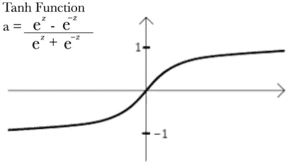
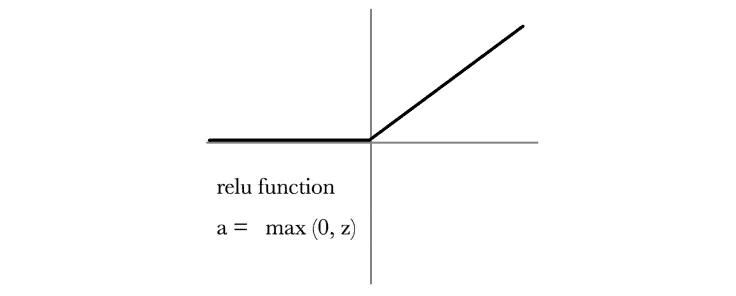
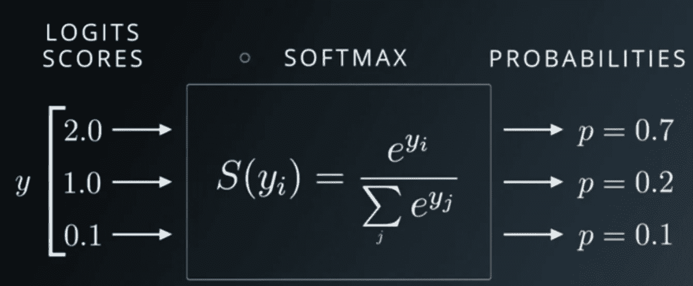
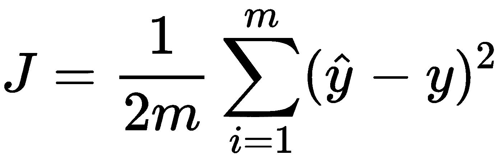
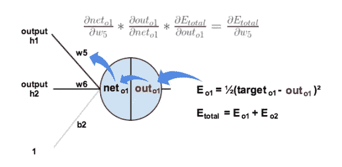

# 理解单个神经元在神经网络中的作用。

> 原文：<https://medium.com/analytics-vidhya/understanding-a-single-neurons-role-in-neural-network-77bb3251e9db?source=collection_archive---------13----------------------->

你们中的大多数人可能听说过神经网络这个术语(如果没有，也没关系),并试图将其应用于一些标准问题，但你们可能已经注意到，当涉及到实现它们时，你们需要获得许多库的支持，这一方面使其实现容易，但同时也带走了我们需要的神经元的实际直觉“感觉”,以便在应用于任何新问题时感到舒适。因此，在本文中，我们将通过一个简单的直觉来了解 python 中神经元是如何工作的(不需要使用很多库)。


Src: Sikich

所以，在我们继续之前，让我们看看神经网络的抽象定义，它是用于实际目的的-

神经网络是神经元(类似于人脑)的集合，这些神经元连接到下一层(输出)和上一层(输入)的所有其他神经元。这些连接有一个与之相关的值，称为'*权重*，每个神经元都有一个*偏差*，这有助于给出正确的方向。现在，在对它们进行处理之后，我们应用一个激活函数，该函数产生一个预测最想要的(根据输入)结果的输出。


资料来源:Otexts

现在，让我们从一个单个神经元开始，考虑它的输入场景，即单个神经元的输入处理代码可能是什么样子……我们知道单个神经元将从上一层的所有神经元中获取输入，将它们乘以它们的权重并添加一个偏差，所以让我们拿起一个'*蓝色神经元*'并写下来。

> 注意:这里我们不考虑整个网络或整个层。我们只是在观察单个神经元在做什么。

```
inputs=[1,2,3,4]          #from the green neurons
bias=2
weights=[0.2,0.5,0.9,0.1] #Corresponding to the four arrows(edges)output=inputs[0]*weights[0]+inputs[1]*weights[1]+ inputs[2]*weights[2]+ inputs[3]*weights[3]+ biasprint(output)
```

这与图中的点积相同(如果你不知道点积是什么，你可以在这里找到直观的解释):

[](https://www.mathsisfun.com/algebra/vectors-dot-product.html) [## 点积

### 一个向量有大小(它有多长)和方向:这里有两个向量:它们可以用“点…

www.mathsisfun.com](https://www.mathsisfun.com/algebra/vectors-dot-product.html) 

```
import numpy as npinputs=[1,2,3,4]  #from the green neurons
bias=2
weights=[0.2,0.5,0.9,0.1] #Corresponding to the four arrows(edges)output=np.dot(inputs,weights)+bias
print( output)
```

输出是:6.30000000000001

这是一个关于单个神经元如何处理其输入的非常简单的代码。现在，在它处理其输入值后，我们必须对获得的值应用“激活函数”，以获得神经元的最终输出。

# 什么是激活功能&我们为什么要使用它？？

在讨论各种激活函数之前，让我们看看为什么我们需要一个激活函数

因此，简单地说，激活函数的基本任务是提供一种方法，根据神经元的权重和偏差来决定激活(产生一个有意义的值作为输出)神经元。

此外，它有助于将非线性引入神经网络的输出，如果没有它，将只能在 x(输入)和 y(输出)之间执行线性映射。

如果没有激活函数，输出将只是输入向量和权重矩阵的点积，加上偏差，因为计算中的所有项都是线性的，所以输出也将是线性线。

通常，我们试图从中学习(进行预测)的数据越复杂，从要素到地面真实标签的映射就越非线性。

# 激活功能的类型

现在我们知道了为什么我们需要一个激活函数，这是寻找一些激活函数的正确步骤。有各种各样的激活功能，让我们看看流行的-

*-这是一个数学函数，映射 0 到 1 范围内的任何值，正如你可以在图像中注意到的，该值从来不会精确地达到 1 或 0，它只会趋向于 1 或 0。*

**

*来源:[https://www . researchgate . net/figure/An-illustration-of-the-sigmoid-function _ fig 2 _ 239269767](https://www.researchgate.net/figure/An-illustration-of-the-signal-processing-in-a-sigmoid-function_fig2_239269767)*

****TanH Activation*** -是一个数学函数，也叫双曲正切函数，映射-1 和+1 之间的值。与 sigmoid 相同，它也不会达到 1 或-1 的精确值。*

**

*来源:[https://www . exper fy . com/blog/activation-functions-within-neural-networks](https://www.experfy.com/blog/activation-functions-within-neural-networks)*

****ReLU Activation***-代表整流线性单元，是最常见、最流行的激活函数，将负值映射为 0，将正值映射为自身，图像会更清晰。*

**

*来源:[https://kraj 3 . com . NP/blog/2019/11/non-linear-activation-functions/](https://kraj3.com.np/blog/2019/11/non-linear-activation-functions/)*

****SoftMax 激活***——这个激活函数只在神经网络的输出层使用，只在分类问题时我们需要概率得分的时候使用。在该函数中，输出值不仅取决于其输入，还取决于同一层的其他神经元的输入，因为该函数给出了特定(特定于神经元)输出的概率。 ***所有神经元的输出之和总是 1，因为它给出了概率。****

**

*来源:[https://stack overflow . com/questions/58999818/constraint-activation-on-keras-neural-net-output-layer](https://stackoverflow.com/questions/58999818/constrain-activation-on-keras-neural-net-output-layer)*

*现在我们知道了各种激活函数，让我们使用 python 将激活函数应用于上面使用的样本数据。因为 sigmoid 函数是常见的函数，所以让我们在这里应用它。*

```
*import numpy as np 
import mathinputs=[1,2,3,4]  #from the green neurons
bias=2
weights=[0.2,0.5,0.9,0.1] #Corresponding to the four arrows(edges)output=np.dot(inputs,weights)+biasresult= 1/(1 + np.exp(-output))print( result)*
```

*输出结果是:0.9981677575765*

*同样，您也可以应用其他激活功能。*

# *错误*

*现在让我们谈谈输出中的误差，它告诉我们当前输出与真实输出的偏差有多大。*

*在我们的示例中，假设我们的真实输出为 1(在我们的示例中，我们只考虑 1 个神经元，它产生了上述输出。).为了计算误差，我们对获得的值和真实值的平方差求和。这也被称为损失函数。*

**

*误差用 j 表示。y 和 y^分别是获得值和真值。*

*使用这个公式，我们的误差计算如下*

```
*import numpy as np 
import mathinputs=[1,2,3,4]  #from the green neurons
bias=2
weights=[0.2,0.5,0.9,0.1] #Corresponding to the four arrows(edges)output=np.dot(inputs,weights)+bias
print(output)result= 1/(1 + np.exp(-output))print( result)error=1/2*((result-1)**2)print(error)*
```

*出现的错误是:1.65333343 e-06*

*众所周知，没有人能够预测获得无误差输出所需的正确权重。我们通常使用随机值初始化权重，然后查看输出层的误差值，该误差值最初通常较大，但我们需要一种方法来收敛到最佳权重值，以使模型为预测做好准备。*

*现在我们应该做些什么来减少这个误差，为了做到这一点，我们应用了一种叫做反向传播的算法。*

# *反向传播*

*这是一种算法，在权重空间中使用一种称为梯度下降的技术来寻找最小化误差。如果你不知道什么是梯度下降，这里有一个信息丰富的解释，你可以参考*

**

*反向传播-基于误差的变化率更新权重。*

*通过加上/减去导数(误差 w.r.t .权重)乘以(乘以)称为“ *ETA* 的学习率来更新权重。因此，利用这一点，我们总是朝着更优化的权重向量前进，当误差低于某个值(非常小)时，我们停止。*

*如果你想知道反向传播中涉及的微积分，那么从下面的网站查看它的解释。*

*[](https://www.edureka.co/blog/backpropagation/) [## 什么是反向传播？训练神经网络

### 反向传播是一种监督学习算法，用于训练多层感知器(人工神经网络)…

www.edureka](https://www.edureka.co/blog/backpropagation/) 

我希望这篇文章对你有所帮助，现在你对神经元的功能有了更清晰的认识。如果您有任何建议或问题，请随时留言联系我。*