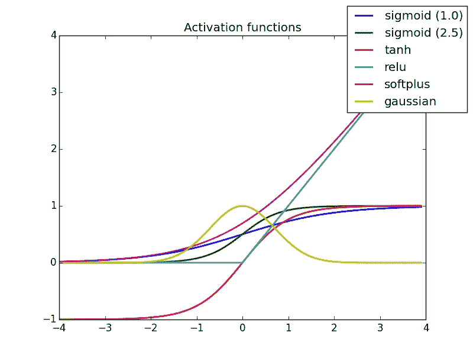
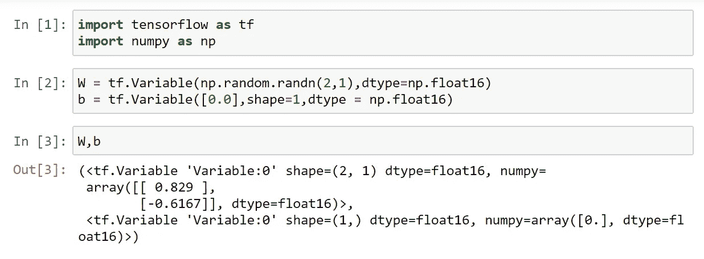
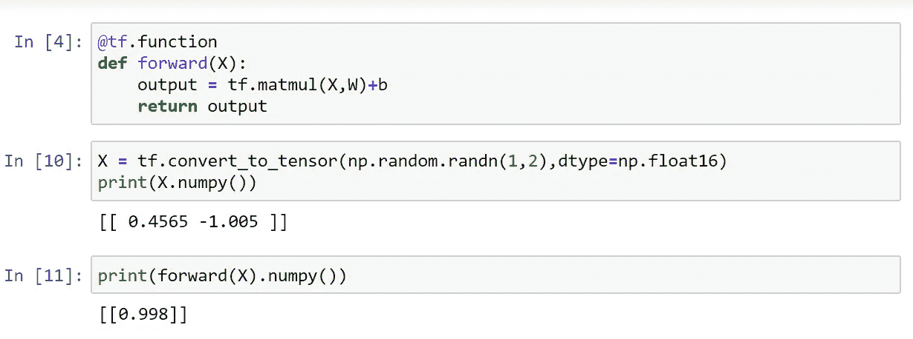
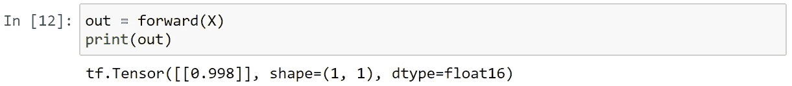
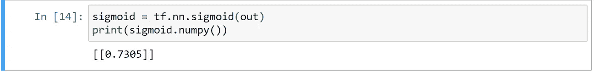
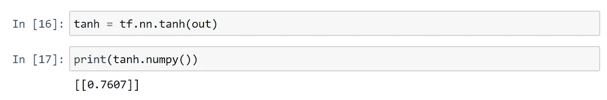
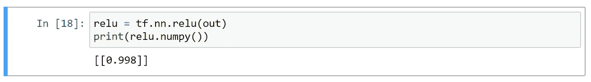
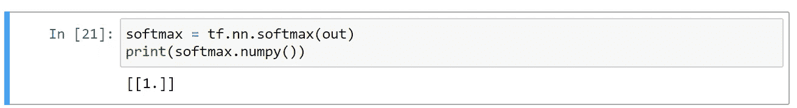

# 初学者了解激活功能…

> 原文：<https://medium.com/analytics-vidhya/understanding-activation-function-for-beginners-e3e413e5c57?source=collection_archive---------20----------------------->

这个博客是为初学者而写的，它描述了激活函数在人工神经网络中的应用。那么，让我们开始吧

## **首先什么是激活功能..？？**

激活函数是附在网络神经元上的数学方程。它决定了神经网络的输出。

激活功能有两种类型

1.  线性激活函数
2.  非线性激活函数

如果没有激活函数，网络将表现得像一个简单的线性回归模型。它也被称为**传递函数。**

下面你会看到 TensforFlow 中多个激活函数的代码片段。

在这里，我创建了两个变量，其中 W 是权重为 0.4172 和-1.74 的两个神经元的权重，b 是将被添加到 b 和一个输出的矩阵乘法中的偏差值。

## **创建没有激活功能的简单前馈网络**

我创建了变量 X，随机取值为 0.85 和-0.3074。然后，这些值与权重(0.4172 和-1.74)进行矩阵相乘。网络返回转换成 Numpy 数组的输出[0.8896]。

将输出值放入 out 变量中，以便可以进一步使用。

# 具有激活功能的前馈网络。

**乙状结肠激活功能:**

**范围(0，1)**

在输出为二进制形式的模型中使用，预测输出是猫还是狗。

**双曲正切函数**

**范围(-1，1)**

在输出中使用，其中输出是分类的形式，即猫或狗

**ReLu 或整流线性单元功能**

范围(0，无穷大(+))，这是最常用的激活函数之一。如果你不确定应该使用哪个激活函数，那么你可以选择 RELU，因为它是不饱和的，这意味着它不会收敛到一个阈值。

**Softmax 激活功能**

**范围(0，1)**

它根据您提供的类的数量返回一个概率向量。向量的总和是 1。存在多类分类时使用。

# 结论

由于本教程是为初学者编写的，所以我希望它可以澄清你的概念或大多数人在创建网络时面临的关于激活功能使用的一些困惑。

分享它，追随它，传播知识…..