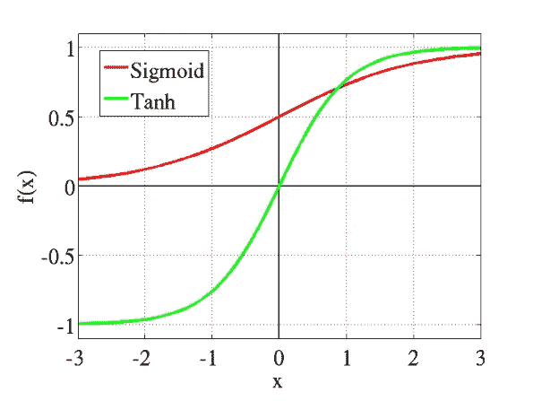

# 理解神经网络中的激活函数和隐藏层

> 原文：<https://medium.com/analytics-vidhya/understanding-activation-functions-and-hidden-layers-in-neural-networks-4fca2b980917?source=collection_archive---------4----------------------->

人工神经网络是我们大脑的虚拟表示，它由神经元的一个输入层组成，在那里输入一些信息，它们逐渐通过一些隐藏层和公式以获得最大的信息，最终进入输出层，在那里我们获得我们想要的输出。神经网络是深度学习中分类和回归问题的支柱。

假设，如果我们仔细观察上面的 gif，它是神经网络的 3D 表示，以及用于分类猫和狗图像的隐藏层。隐藏层的数量完全是假设的，它们是根据每个问题的需要来使用的。显然，隐藏层数越多，输出的精度就越高。

好的，那么什么是激活函数呢？它是如何与神经元联系在一起的？

> 激活函数是决定神经网络输出的数学方程。它决定条件*神经元是否应该被***【激发】。它们的值范围从-1 到 1 或从 0 到 1。**

*假设，在输入层 x1、x2 中有两个神经元被施加了它们各自的强度，称为权重和偏置 b。激活函数被应用于权重和神经元的输入值加上偏置的乘积的总和，从而产生输出。*

***Y =激活(wi*xi +b)，i=1，2，3…***

*可以有两种类型的激活功能:- **线性和非线性***

*但是神经网络中激活函数的主要目的是将非线性引入网络。*

***为什么是非线性？***

*要理解这一点，我们必须深入学习过程的反向传播方法。因此，在深度学习模型的训练期间，在前向传播之后，**我们得到一个损失函数，该损失函数应该通过任何手段最小化，并且通过梯度下降逐渐更新隐藏层的神经元的相应权重，以获得更好的输出。如果激活函数是线性的，那么就不可能回过头来理解将哪些权重分配给输入神经元以获得更好的预测。***

*非线性激活函数也允许反向传播，因为梯度下降项与输入相关。*

**

*大多数情况下，可以有 **4** 个激活功能:-*

## *1.乙状结肠或逻辑激活功能*

*Sigmoid 函数曲线看起来像 S 形。*

**

*我们使用 sigmoid 函数的主要原因是因为它存在于 **(0 到 1)之间。**因此，它特别用于我们必须**预测概率**作为输出的模型。由于任何事情的概率只存在于 **0 和 1 之间，** sigmoid 是正确的选择。*

*函数是**可微的**。这意味着，我们可以在任意两点找到 s 形曲线的斜率。*

*函数是**单调的**，但函数的导数不是。*

*逻辑 sigmoid 函数会导致神经网络在训练时停滞不前。*

## *2.双曲正切激活函数*

*Tanh 也像是乙状结肠的更好版本。tanh 函数的范围是从(-1 到 1)。tanh 也是 s 形的(s 形)。*

**

*优点是负输入将被映射为强负输入，而零输入将被映射到双曲正切图中的零附近。*

*函数是**可微的**。*

*函数**单调**，而其**导数不单调**。*

*双曲正切函数主要用于两类之间的分类。*

## *3.ReLU(整流线性单位)激活功能*

*ReLU 是目前世界上使用最多的激活函数。因为它用于几乎所有的卷积神经网络或深度学习。*

**

***Relu v/s 乙状结肠***

*正如你所看到的，ReLU 是半整流(从底部)。当 z 小于零时 f(z)为零，当 z 大于或等于零时 f(z)等于 z。*

***范围:**【0 到无穷大】*

*函数及其导数**都是** **单调**。*

*但问题是，所有的负值立即变为零，这降低了模型根据数据进行适当拟合或训练的能力。这意味着给予 ReLU 激活函数的任何负输入都会在图形中立即将值变成零，这反过来会通过不适当地映射负值来影响结果图形。*

*所以，让我们现在移动到**隐藏层:-***

*隐藏层允许将神经网络的功能分解成特定的数据转换。每个隐藏层的功能都是专门产生一个定义的输出。例如，用于识别人的眼睛和耳朵的隐藏层功能可以与后续层结合使用，以识别图像中的面部。虽然单独识别眼睛的功能不足以独立识别物体，但它们可以在神经网络中共同发挥作用。*

*深度学习中有一个非常著名的术语超参数，它可以促进学习过程。隐藏层的数量是在处理之前已经知道的超参数之一。*

*为了添加隐藏层，我们需要回答以下两个问题:*

1.  ***所需的隐藏层数是多少？***
2.  ***每一个隐藏层中隐藏神经元的数量是多少？***

*首先，当两个或多个线性函数的组合变成线性时，如果我们使用线性激活函数，隐藏层是没有用的。*

*根据损失函数的最小化，我们需要反向传播并更新输入层和隐含层神经元的权重。因此，隐藏层和隐藏神经元的数量取决于梯度下降。*

**

*也可以说，在某些时期之后，模型的训练和测试精度如何彼此越来越接近，也可以指示应该使用多少个隐藏层来获得更高的预测精度。*