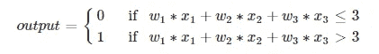
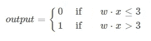
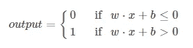
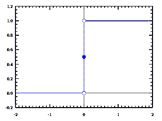
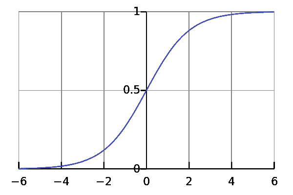
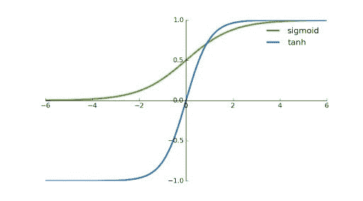
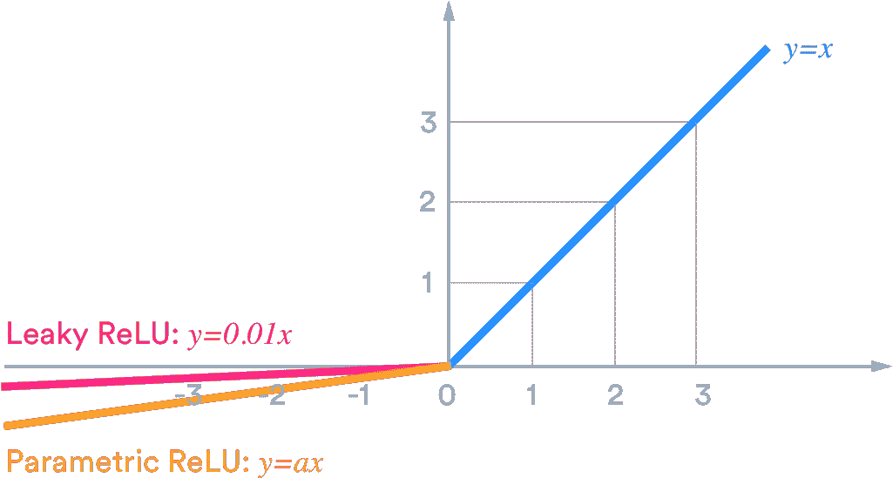
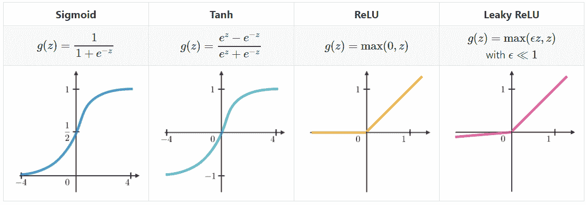

# 理解激活函数|数据科学

> 原文：<https://medium.com/analytics-vidhya/understanding-activation-functions-data-science-for-the-rest-of-us-b652048a064f?source=collection_archive---------21----------------------->

我能说句实话吗？神经网络(NNs)很吓人。好了——我说出来了。别误会，我从商学院大一开始就在研究 NNs。但是，仅仅因为我盯着一页又一页的数据科学术语，并不意味着我总是理解它。所以大家一起学习吧。

# 神经网络基础

在我们深入研究之前，我们可能应该知道激活函数在哪里适合老鼠的窝——*嗯……*神经网络。最基本的，神经网络只是巨大的数学方程。你可能以前见过基本网络图，但这里有另一个以防万一。

一个基本的前馈网络，来自 Andrew Tch 的“[神经网络的最完整的图表，解释](https://towardsdatascience.com/the-mostly-complete-chart-of-neural-networks-explained-3fb6f2367464)

那些黄色的圆圈被称为“输入层”这只是另一种谈论你输入网络的数据的方式，也就是“输入”绿色圆圈是“隐藏层”它们是魔法发生的地方(也是大多数激活功能出现的地方)。橙色圆圈是“输出层”，在这种情况下，只是一个节点。在这类网络中，输出节点通常负责给出一个概率(0 到 1 之间的小数)。

综上所述，你输入一个神经网络数据，网络对数据进行咀嚼和转换，然后为你提供一个漂亮、简单的输出。显然，这是相当的简化，但它应该为我们的目的工作。

# 激活函数的直觉

那么激活功能是从哪里来的呢？嗯，激活功能是每个圆圈的核心组成部分之一(喜欢精确术语的人会称之为*人工神经元*)。但并不是所有的神经元都是一样的。例如，输入神经元没有激活功能——它们唯一的工作是记住一个很小的数据点，并在需要时吐出来(就像幼儿园游戏中的孩子一样)。

绿色和橙色的圆圈(神经元)，虽然？那些人得到了更难的工作。当输入神经元无所事事，懒洋洋地吐出它们要记住的数字时，隐藏层和输出层正在努力处理数字。看，在一个基本的神经网络中，这些层得到一堆数据，他们的工作是找出如何处理这些数据，及时将数据传递给下一个人，就像一个可怜的会计实习生坐在某个小隔间里一样。

那么，这些悲伤的神经元如何决定如何处理所有这些数据呢？嗯，这就是激活函数的用武之地(*最后…* )。激活功能告诉每一个神经元如何在将数据传递给下一个神经元之前对其进行转换。这使得他们可以制作比直线更复杂的模型(你可以通过类似线性回归的方法得到)。激活功能是神经网络的特别之处——嗯，不是唯一的，但却是最重要的之一。

这些功能会对你的神经网络的表现以及它适合为你完成的任务产生很大的影响。为了我们的学习，就拿迈克尔·尼尔森(Michael Nielsen)的免费书《神经网络与深度学习 *》中的例题来说吧。他将神经网络的想法简化成一台机器，帮助你做出决定，在他的案例中，你是否应该去参加这个周末的奶酪节。我们会做一些不那么…奇怪的事情——假设你想要一个神经网络来帮助你决定是否应该去看一部即将上映的新电影。*

> ***作者注:*** *下一节的例子与迈克尔·尼尔森的非常相似。这背后的意图是使用他的恒星解释，但简化它，减少数学符号，同时保持直觉。我没有试图以任何方式窃取他的工作，所以如果你想要一个更彻底的数学方法，我鼓励你在这里查看他的解释***。**

# ***感知器和阶跃函数***

*为了帮助神经网络模拟您的决策，您可能会决定一些会影响您决策的因素(或变量)。比方说，当你决定是否去看一部电影时，你把这三个因素列为你脑海中的前三个因素:*

1.  *这部电影是漫威电影吗？*
2.  *这部电影正在你最喜欢的影院上映吗？*
3.  *还有人要和你一起去吗？*

*现在让我们假设你是漫威的超级粉丝，无论如何你都会去看最新发行的电影。对你来说，电影在哪里上映，或者你的朋友/S.O .是否会加入你都无关紧要——你必须去。但是，假设这不是一部漫威电影呢？也许只有当你的朋友去了并且电影正在你最喜欢的影院上映时，你才会去看。*

*我们如何使用神经网络来模拟这个决策过程呢？好吧，你的每一个决策因素都将作为决策的输入。现在，我们需要一个神经元，它可以获取这些信息，将你的思维方式应用于其中，并输出最佳决策。我们该怎么做？有重量的。*

*不是所有的信息都同等重要，在建模和生活中。那么，我们如何向你展示漫威电影的重要意义，以及其他两个因素相对较低的重要性呢？嗯，我们只希望当变量 1 为真时(不管(2)和(3)的状态如何)或者当(2) **和** (3)为真时，神经元触发。所以，让我们为我们的神经元设置一个截止值。如果输入的总数小于或等于那个截止值(或*阈值*，那么神经元不会触发，反之亦然*。**

**假设截止值为 3。如果我们让漫威电影的重量为 4 或更多，那么当电影来自漫威时，神经元将总是激活。如果我们让剧院和你的朋友的权重都是 2，那么只有一个为真时，神经元不会触发(因为 2 小于 3)，但如果两个都为真，它就会触发。**

**就在那里是感知机*背后的基本直觉*，一种更古老的人工神经元。但是感知器使用什么激活函数呢？我们称之为阶跃函数。为了了解原因，让我们将直觉转化为数学。放心吧！你只需要理解基本的加法和乘法就可以了。**

**首先，让我们调用我们所有的输入 *x* 。我们知道哪个输入是带下标的:**

**₁ =这部电影是漫威电影吗？(1 =是，0 =否)**

**₂ =这部电影正在你最喜欢的影院上映吗？(1 =是，0 =否)**

**₃ =还有人要和你一起去吗？(1 =是，0 =否)**

**现在，让我们定义我们的权重。权重应用于共享其下标的 *x* 变量。**

**₁ = 4**

**₂ = 2**

***w* ₃ = 2**

**现在让我们定义我们的激活函数，或者说决定我们的神经元是否激活的方程。我已经避免了 sigma 符号，因为我发现它对于直觉来说令人讨厌和困惑，除非你已经熟悉它了。**

****

**我们可以用点符号来简化乘法和加法:**

****

**圆点只是告诉你把所有的权重乘以它们相应的输入，然后把它们加起来。如果这让你困惑，不要担心。它说的和第一个大方程完全一样。**

**我们还没完成。如果我们不知道应该使用什么阈值呢？让我们重新定义我们的方程(技术上来说是不等式)，这样阈值就在左边。我们只需要从两边减去我们的阈值。**

**我们将定义一个新项，称为*偏差*项( *b* )，并将其设置为等于- *阈值。如果阈值是一个代表我们的神经元“激发”有多难的数字，那么偏差项正好相反，一个代表我们的神经元激发有多容易的数字。一点代数魔法，我们得到了这个新函数:***

****

**这个函数是神经网络中最早使用的激活函数之一。它只是一个特殊的阶跃函数，只输出 1 或 0。从图形上看，它是这样的:**

****

**一个阶跃函数，来自“[了解神经网络中的激活函数](/the-theory-of-everything/understanding-activation-functions-in-neural-networks-9491262884e0)**

**然而，感知器有一个问题——它们学得不太好。看，神经网络开始很笨，随着训练变得越来越好。我们不会深入讨论这是如何发生的，但重要的是要知道，我们对权重(或偏差)进行微小的改变，并寻找输出的微小变化，以查看我们的网络变得更好还是更差。我们一遍又一遍地这样做，直到我们的网络(希望)比最初好得多。**

**但是事情是这样的，当你唯一的输出是 1 或 0 时，你在一个权重上的小变化不会使输出产生小变化。它要么根本不会改变，要么完全将你的预测从 0 翻转到 1，或者*反之亦然*。这使得训练我们的网络非常困难，因为这些微小的变化将如何影响网络的结果并不明显。**

# **乙状结肠/逻辑函数**

**但是如果我们能让这些感知机不那么分散呢？如果我们能平滑他们的激活函数，让它看起来不像上面的图，而更像这样，会怎么样？**

****

**Logistic/Sigmoid 激活函数，来自“[了解神经网络中的激活函数](/the-theory-of-everything/understanding-activation-functions-in-neural-networks-9491262884e0)**

***右边那个*是*s 形*(或*逻辑*)激活功能背后的想法。sigmoid 函数不是让你的神经元从 1 跳到 0 再跳回 1，而是平滑一切，所以你的神经元可以吐出 0 到 1 之间的任何小数。**

**Sigmoid 激活函数使分类模型变得更加简单。现在，一个权重的小变化将使我们的预测发生小变化，使我们努力工作的网络更容易学习。不过，这个*确实让我们人类的生活变得更有趣了，因为现在网络将输出 0 到 1 之间的一系列数字。这意味着我们必须选择一个截止值，并将高于该值的所有内容归类为 1，低于该值的所有内容归类为 0(您可能认为您总是使用 0.5 作为截止值，但这并不总是最佳选择，但我们将在另一篇文章中讨论这一点)。***

# **双曲正切**

**Tanh 或*正切双曲线*函数是 sigmoid 激活函数的近亲。它们在数学上是相关的，但 tanh 不是像 sigmoid 那样压缩 1 到 0 之间的数据，而是压缩 1 到-1 之间的输入。这增加了一些很好的数学功能，如平均为零，这有助于数据居中，并使训练未来的层更容易一些。如果您的数据倾向于归入高度负值、接近零和高度正值的组中，这也很有帮助。否则就是和乙状结肠一样的直觉。**

****

**Sigmoid 和 Tanh 函数叠加。**

# **热卢**

****

**ReLU 及其定义函数。**

**ReLU，或*整流线性单元*，可能会让你想起我们之前看到的阶跃函数。两者都是逐步函数，但是在这种情况下，如果它们大于 0，我们就不变换输入。如果它们小于或等于 0，我们就输出 0。我们为什么要这么做？**

**ReLU 有一些非常好的数学特性来训练神经网络。多层 ReLU 神经元几乎可以逼近任何非线性函数(非常便于深度学习)。与 sigmoid 或 tanh 等函数相比，它们的计算效率非常高。而且，因为所有负值输出为零，当你随机初始化你的模型时，只有大约 50%的神经元被激活(如果你想查的话，这就是*稀疏激活*)。**

**总的来说，这使得 ReLU 对深度学习特别有吸引力。但是 ReLU 也有一些非常重要的问题。ReLU 的阿喀琉斯之踵叫做垂死的 ReLU 问题。这基本上意味着，随着你的模型训练，你的一些神经元可能会训练到几乎不可能激发它们(因为大多数输入都是一致的 0 或负)。这意味着，从所有的意图和目的来看，神经元已经死了——它对模型没有任何用处，只是在消耗处理能力。**

**现在想象一个有许多或这些死亡神经元的网络。最终，该模型将无法再进行训练，因为它的大多数神经元都已死亡。这就是垂死的 ReLU 问题。还有一些其他与微积分相关的不便，事实上它没有 0 的平均值，但是这些问题超出了我们现在的范围。**

**要点:ReLU 可能对深度网络非常有用，但可能会达到无法再训练的地步，因为太多的神经元已经“死亡”。**

# **泄漏 ReLU**

****

**具有小的 0.01 常数的泄漏 ReLU(粉红色)和它的更高级的表亲参数 ReLU(黄色)**

**Leaky ReLU 就是试图解决垂死的 ReLU 问题。我们不是将所有的负值都设为 0，而是将 x 乘以某个十进制数，使它比其他情况下要小得多。这在 ReLU 函数上创建了一种“漏”尾，允许我们保留 ReLU 的许多好处，同时保留更多信息，并有望减轻 ReLU 的死亡。除了解决垂死的 ReLU 问题，似乎还有一些证据表明，泄漏的 ReLU 甚至可以加快训练速度。**

# **从这里去哪里**

**以上总结了神经网络设计中一些最常见的激活函数。不过，你应该知道，还有很多其他的，有些与上面提到的(试图弥补他们的弱点，发挥他们的优势)有关，有些则完全不同。关于这些函数背后的数学性质以及如何用代码实现它们，还有很多技术教程。我希望这篇文章能给你更多一点信心，让你更有信心地接触这些文献。我将给你们留下这个简洁的总结图像…**

****