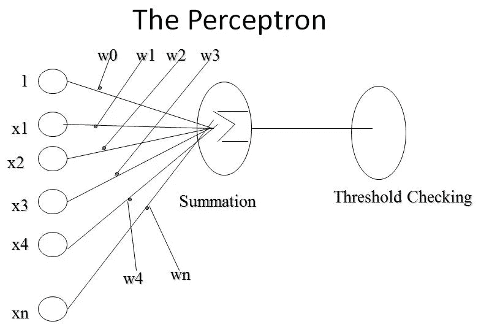

# 从头开始理解和构建神经网络

> 原文：<https://medium.com/analytics-vidhya/understanding-and-building-neural-networks-from-scratch-part-i-ff5a2f224347?source=collection_archive---------16----------------------->

## 第一部分:感知器和学习规则

是的，这就是我的感觉。是的，即使过了这么久。

**神经网络**令人望而生畏。它们是人脑的机器对应物，是极其高效和可扩展的架构。简而言之，他们能够提取信息并将其直接映射到所提供的输出。很神奇，对吧？问题是，我们(作为人类)无法完全解释我们如何理解和感知*知识*。我们无法解释我们是如何内在地理解概念的，但是如果内容对我们来说是可用的，我们就能够映射它。我们如何理解一种语言？我们如何学习一个？我们通过看/听大量的样本来做到这一点。一旦我们变得有效率，我们的大脑就会帮助我们解释和复制这些行为。从技术上来说，我们是伪装成智能的基于模式的机器。所以一些非常聪明的人采用了相同的概念，并想到让机器决定它想要如何感知“知识”。这些聪明的人建立了一个应用相同想法的架构——让机器有多个输入和*映射输出*，并通过例子学习。

如果我们不能向它解释我们想让它学习什么，我们将只是给它输入~输出模式，直到它映射出它需要做什么。他们对此进行了研究，并给了它一个术语——神经网络。神经网络是专家模式识别引擎。他们取输入和输出的例子，并调整他们的*参数来映射输入~输出。*

这就消除了他们的魅力，是吧？让我们深入了解一下。什么构成了神经网络？很简单，这是对感知机和学习规则的概括。

简单的感知器。(来源:谷歌图片)

一个**感知器**只是输入、权重和偏差的组合。**输入**是给感知器的样本。它有两层，一个输入层和一个输出层。**权重**是乘以输入样本的值。这些(输入*权重)被加在一起作为**总和。**权重为 w0、w1 和 w2 的 3 个输入 x0、x1 和 x2 的总和为= { [x0*w0] + [x1*w1] + [x2*w2] }。你得到的值被传递到一个**阈值**函数上，(又名 [**激活函数**](https://en.wikipedia.org/wiki/Activation_function) )。激活功能决定如何映射输出。到目前为止，很简单，对吧？

但是如果你的一个输入是 0 会怎么样呢？当您希望您的网络为某个特定输入提供一个输出映射时，会发生什么？因为权重是相乘的，所以对于 0 输入，这意味着它们对求和函数没有任何贡献。如果你想用模型对数据进行*推广*，会发生什么？在这种情况下，你要引入一个新的术语，叫做**偏见。** Bias 将一个值添加到您的输入节点，这样即使您的输入为零，求和以及随后的激活也不必计算“0”值。加上 bias，上述 3 个输入的求和变为:**{[**(x0 * w0)+b0****+**+[(x1 * w1)+b1**]****+****[**(x2 * w2)+b2**}**，其中 B0、B1、B2 为 bias。请注意，它们被添加到各自输入和权重的乘积中。**

**还要注意，所有这些权重都是单向的，即从输入到输出。请注意，样本神经网络既有输入，也有输出。感知器会给你一个输出，但它必须与你的实际输出相匹配。在这种情况下，您必须让感知器将这些特定的输入映射到它们各自的输出。因此，仅有阈值是不够的。您希望转换您的数据，以便获得与输出(给定的输出)相同的输出(来自激活的输出)。不应该干预输入值(你可以增加或转换它们，但不能随意改变它们)，因为它们被视为常量。因此，您唯一可以更改的值是**权重**和**偏差。****

**当你想让你的感知机*学习*时会发生什么？基本上，在给定一个输入的情况下，你需要一个特定的权重和偏差值来给出你想要的输出。显然，您必须将这一点推广到一批 n 个输入和输出上；而不仅仅是得到一个输入的正确答案。然后你必须引入一种方法来重新调整或*更新*这些参数——这就是**学习规则**发挥作用的地方。学习规则只是帮助神经网络更好地学习和概括的方法。如果应用于神经网络，当在特定数据环境中模拟网络时，它们会更新网络的权重和偏差。**

**应用规则是一个迭代的过程——毕竟，你希望它从现有的条件中学习并提高网络的性能。在神经网络中有多种学习规则，但是让我们来看看其中的两种基本规则:t 2 的赫布边学习规则和 T4 的感知器学习规则。**

****Hebbian 学习规则**只是识别如何修改神经网络的权重/偏差。**感知器学习规则**是网络通过给每个权重分配一个随机值来开始其*学习*的地方。结合这些学习规则和感知器，我们最终得到了我们所知的神经网络。不完全是。**

**顾名思义，神经网络是“神经元的网络”。一个**神经元**是一个**感知器**概念的推广。回想一下，感知器只有两层。构建多层感知器(或**隐藏层**)使其成为 [**多层感知器。**](https://en.wikipedia.org/wiki/Multilayer_perceptron) 将多个这样的神经元相互连接，层层叠加，形成一个神经网络。一个**人工神经网络** (ANN)使用一类学习算法对数据进行高效训练。这些算法被称为 [**反向传播**算法](https://en.wikipedia.org/wiki/Backpropagation)。**

**神经网络的学习到此结束。既然我们知道了神经网络及其工作原理，让我们开始编写一个吧！[本系列的第 2 部分](/@aamirsyed2801/understanding-and-building-neural-networks-from-scratch-part-ii-4a1bfbeca8ba)将从头开始处理编码人工神经网络——使用 TensorFlow (Python)。**